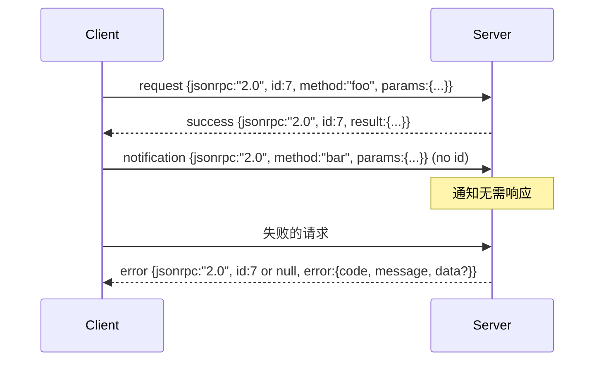

# 基于换行分隔 stdin/stdout 的 JSON-RPC 2.0

> 模型客户端与工具服务器之间的传输层是 JSON-RPC over stdio。亲手实现一次，你就能明白每一层封装的价值所在。

**类型：** 构建
**语言：** Python
**前置条件：** Phase 13 课程 01-07，Phase 14 课程 01
**预计时间：** 约 90 分钟

## 学习目标
- 掌握通过 stdin 和 stdout 以换行分隔 JSON 格式传输 JSON-RPC 2.0。
- 映射五个标准错误码（-32700、-32600、-32601、-32602、-32603）并以正确的语义暴露它们。
- 区分请求、响应、通知和批次，不发明新的信封字段。
- 每行只处理一个解析错误，避免污染后续数据流。
- 使用 `io.BytesIO` 构建自终止演示，使课程无需启动子进程即可运行。

```figure
cf-jsonrpc-frames
```

## 为什么 JSON-RPC 依然是通用语

2026 年的编码智能体在单次会话中可能与十余个工具服务器通信。每个服务器是一个独立进程或远程端点。自 2013 年以来，传输格式始终如一。JSON-RPC 2.0 只有两页规范。它之所以长盛不衰，是因为其他方案（gRPC、每次调用一个 HTTP、自定义二进制）都强加了 JSON-RPC 所不做选择的权衡：它们要么侧重流式，要么侧重批量，要么耦合特定传输。JSON-RPC 在 stdio、socket、websocket 和 HTTP 上完全对称，只要双方遵循规范，客户端就能驱动它从未见过的服务器。

本课程构建的是 stdio 变体。换行分隔的 JSON。每个请求占一行，每个响应占一行。传输边界是 `\n`。

## 传输形状

存在四种信封形状。两种由客户端使用，两种由服务器使用。



通知没有 `id`。服务器必须不对其响应。如果服务器向通知返回了响应，客户端无法将其附加到调用方。仅凭这一条规则，封装数学就简单了。

批次是请求或通知的 JSON 数组。服务器回复一个响应数组，顺序不限，每个非通知条目对应一条。如果批次中的所有条目都是通知，服务器不返回任何内容。

## 五个错误码

```text
-32700  Parse error      JSON 无法被解析
-32600  Invalid Request  信封形状错误
-32601  Method not found
-32602  Invalid params
-32603  Internal error
```

-32000 到 -32099 保留给服务器自定义错误。其余均为应用自定义。本课程仅使用这五个。如果你的处理器抛出异常，传输层会将其包装为 -32603，并在 `data.exception` 中包含异常类名。

解析错误有一条特殊规则。响应中的 `id` 为 `null`，因为请求尚未被解析到足以提取 id 的程度。

## 换行封装与 BytesIO 演示

传输层逐行读取数据。一行是包含 `\n` 在内的字节。如果某行无法被解析，传输层会写入一条 id 为 null 的 -32700 响应并继续处理。数据流不会被污染。下一行会被重新解析。

在本课程中，我们用一对 `io.BytesIO` 包裹 stdin 和 stdout。服务器读取请求直到 EOF，为每条请求写入响应，然后返回。客户端再读取响应。无需启动进程，无需超时处理。传输行为与真实子进程管道完全一致，因为 Python 的 `io` 接口提供了相同的 `.readline()` 和 `.write()` 契约。

## 方法分发

传输层不知道哪些方法存在。它将调用转交给夹具提供的可调用对象 `handler(method, params)`。该处理器返回结果或抛出异常。三种异常类对应特定的错误码。

```text
MethodNotFound -> -32601
InvalidParams  -> -32602
其他所有       -> -32603（exception 名称写入 data）
```

传输层从不接触工具注册表。注册表位于处理器之后。这正是我们想要的分层。传输层只说 JSON-RPC。注册表只说工具形状。分发器（第二十三课）将它们缝合在一起。

## 错误时的流行为

```text
客户端写入                   服务器读取               服务器写入
---------------              -----------              -------------
{...有效请求...}             解析成功                 {...响应，id 匹配...}
{...非法 JSON...}            解析失败                 {id:null, error: -32700}
{...有效请求...}             解析成功                 {...响应，id 匹配...}
{...缺少方法...}             无效信封                 {id:X, error: -32600}
```

JSON 损坏的行不会停止循环。缺少 `method` 字段的请求不会停止循环。处理器异常不会停止循环。传输层持续读取直到 EOF。

## 通知与非对称流程

通知是 fire-and-forget 语义。夹具使用通知发送进度事件、取消信号和日志行。通知是让长时工具在不为每条更新执行往返调用的情况下流式推送状态更新的机制。

本课程实现了一个出站通知辅助函数 `write_notification`。服务器在请求处理期间用它来发出进度。演示展示了这一模式：一个请求进来，处理器发出两条进度通知，然后写入最终响应。

## 如何阅读代码

`code/main.py` 定义了 `StdioTransport`、解析辅助函数（`parse_request`）、三个写入辅助函数（`write_response`、`write_error`、`write_notification`）以及分发循环 `serve`。错误码常量定义在模块作用域。

`code/tests/test_transport.py` 覆盖了五个错误码、通知（不写入响应）、批次（数组进，数组出，通知被跳过）、非法 JSON（解析错误后继续）以及非对称流程——处理器在调用中途写入一条通知。

## 进一步扩展

此传输层已足够支持后续课程。生产级传输层会新增三样东西：一个跨越转发链路后仍保持关联的 ID 字段（你的 `id` 已经承担了这一角色，但在服务网格中你还需要一个外层 trace id）。一个取消通道（一条类似 `$/cancelRequest` 的通知，携带正在飞行中调用的 id）。以及一套内容协商握手，让同一个 socket 既能说 JSON-RPC 也能说 Streamable HTTP。这些都不会改变传输形状。它们只是增加了元数据。
