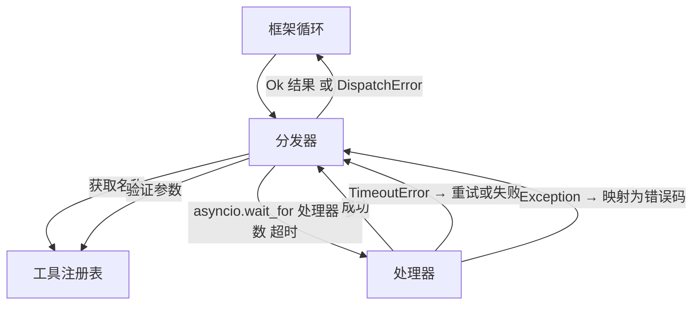
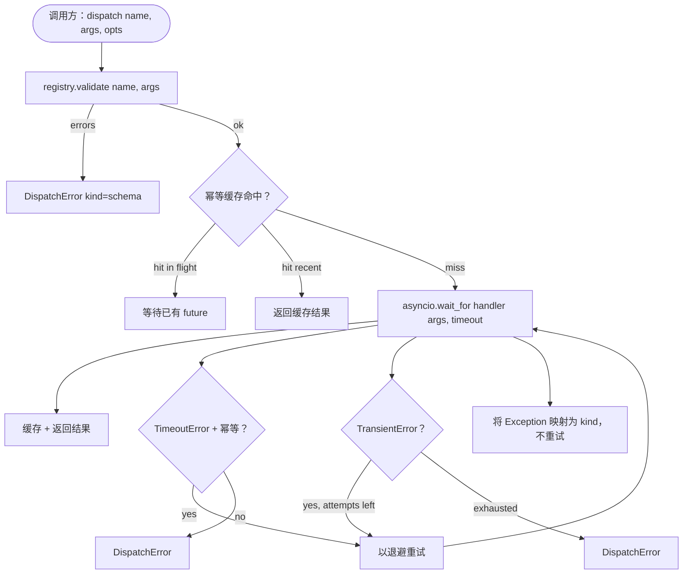

# 函数调用分发器

> 分发器是框架为 Schema 做出的每一个承诺买单的地方。超时、重试、去重、错误映射，全在这一处接口。

**类型：** 构建
**语言：** Python
**前置条件：** 第 13 课 01-07、第 14 课 01
**时间：** 约 90 分钟

## 学习目标
- 用每次调用的超时包装工具处理器，返回类型化错误而非让循环挂起。
- 应用带抖动（jitter）的指数退避重试及最大尝试次数。
- 基于幂等键对重试进行去重，使与慢速原始调用竞态的重试不会执行两次。
- 将处理器异常和传输故障映射到框架循环已理解的单一错误信封。
- 用并发上限约束并行分发，使四十个工具调用的扇出不会耗尽事件循环。

```figure
cf-dispatch-retry
```

## 分发器所在的位置

介于框架循环（第 20 课）与工具注册表（第 21 课）之间。传输层（第 22 课）喂给循环，循环把工具调用交给分发器，分发器调用注册表、运行处理器，返回结果或 JSON-RPC 形状的错误信封。



分发器是唯一知道定时器、重试和幂等性的层。循环不知道，注册表不知道，处理器也不知道。这种隔离性正是设计目标。

## 超时

每个工具都有默认超时时间。注册表记录携带 `timeout_ms`。当框架传入按次覆盖值时，分发器会对其进行覆盖。我们使用 `asyncio.wait_for`。超时发生时，处理器任务被取消，分发器返回 `DispatchError(kind="timeout")`。

对于非幂等工具而言，超时默认不可重试。一个超时的 `db.write` 可能已经提交，也可能没有。重试会导致写入重复。分发器会遵循注册表记录中的 `idempotent` 标志：幂等工具会重试，非幂等工具不会。

## 指数退避重试

重试策略最多三次尝试。退避呈指数增长并加入抖动。

```text
attempt 1  → delay 0
attempt 2  → delay 0.1s * (1 + random[0..0.5])
attempt 3  → delay 0.4s * (1 + random[0..0.5])
```

只有 `timeout` 和 `transient` 错误会重试。`schema` 错误、`not_found` 或 `internal` 错误不会重试。Schema 错误是确定性的，重试不会改变结果却会消耗预算。

重试循环遵循框架传入的预算。若调用者的预算剩余工具调用数为零，分发器在第一次尝试时快速失败，返回 `kind="budget_exceeded"`。

## 幂等键去重

原始调用仍在进行中时就触发重试是一个真实的生产 Bug。第一次调用在 4.9 秒时挂起（刚好低于超时阈值），重试在 5 秒时触发。于是两个请求竞态访问同一后端。如果工具是 `payments.charge`，你就被扣了两次款。

分发器接受可选的 `idempotency_key`。若到达的调用对应的键已在飞行中，分发器会等待该飞行中的 future 并返回其结果。缓存会在完成六十秒后清除键，以吸收迟到重试。

键由调用方负责生成。框架从规划器派生它：`f"{step_id}:{tool_name}:{hash(args)}"`。分发器不自己发明键，因为仅从参数推导键会让语义不同的两次调用看起来相同。

## 错误信封

一次失败的分发返回单一结构。

```text
DispatchError
  kind        : "timeout" | "transient" | "schema" | "not_found" | "internal" | "budget_exceeded"
  message     : str
  attempts    : int
  jsonrpc_code: int   （-32601、-32602、-32603 之一）
```

框架循环将 `kind` 映射到下一个状态：`schema` 和 `not_found` 转到 `on_error` 并触发重新规划；`timeout` 和 `transient` 转到 `on_error`，是否重新规划取决于尝试次数；`budget_exceeded` 触发 `on_budget_exceeded`。

## 扇出的并发上限

`gather(*calls)` 同时运行所有协程。面对四十个工具调用，就是四十个开放 socket 或四十条子进程管道。大多数后端并不喜欢从一个客户端来的四十个并行连接。

分发器用信号量包装 `gather`。默认并发上限为八。每次调用在分发前获取信号量，完成后释放。调用方看到 `gather` 风格的输出，但实际调度是有界的。

## 单次调用的流程



## 如何阅读代码

`code/main.py` 定义了 `Dispatcher`、`DispatchError` 和 `TransientError`。分发器在构造时接收一个注册表。异步方法 `dispatch(name, args, ...)` 是唯一的入口点。按次超时在 `_run_with_retries` 内部通过 `asyncio.wait_for` 内联应用。`gather_bounded(calls)` 以并发上限运行多次分发。

`code/tests/test_dispatcher.py` 覆盖了超时触发、瞬态错误重试、schema 错误不重试、幂等去重（具有相同键的两次并发调用合并为一次处理器调用）以及并发限制（信号量生效）。

测试使用 `asyncio.sleep(0)` 和基于 `Counter` 的确定性处理器，因此它们以毫秒级完成，不依赖真实墙钟计时。

## 进一步扩展

生产级分发器通常加入两种扩展。其一，在每个状态转换处进行结构化日志记录（循环的事件流已为你提供此信息，但分发器也应发出 `dispatch.attempt` 与 `dispatch.retry` 事件）。其二，熔断器：在时间窗口内失败 N 次后，该工具进入冷却期，期间分发直接返回 `kind="circuit_open"` 而不再尝试处理器。这两项都可叠加在本分发器之上而不改变契约。

第 24 课将分发器粘合到 plan-and-execute 智能体上，让你看到全部四个组件同时运转。
