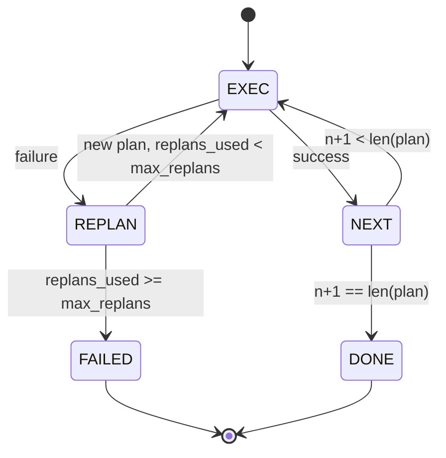

# Plan-Execute Control Flow

> 无法在失败中存活的计划只是脚本。能够重新规划的脚本才是 Agent。先构建 replanner。

**类型：** Build
**语言：** Python
**前置要求：** Phase 13 课程 01-07，Phase 14 课程 01
**预计时间：** ~90 分钟

## 学习目标
- 将计划表示为有序的类型化步骤列表，使执行器能够推理进度和结果。
- 顺序执行步骤，并在失败时将控制权交还给规划器。
- 从当前游标重新开始规划，并将之前的错误纳入上下文，使新规划有据可依。
- 在每次修订时输出一份 plan diff，供下游追踪器或 UI 展示计划为何发生变化。
- 强制执行两个预算限制：步骤上限和重规划上限。

```figure
cg-plan-replan
```

## 规划并执行，而非思维链

思维链（chain-of-thought）Agent 发射 token，让循环去猜测工具调用在哪里结束。规划并执行（plan-and-execute）Agent 则先输出一份结构化计划，再逐一确定性执行每个步骤。计划是可被 harness 内省的数据。执行则是 harness 通过分派器运行为数据的过程。

两件事：一个生产计划的规划器，一个运行计划的执行器。真正有意思的部分在于执行器遇到失败时会发生什么。有三种选择：

```text
1. Abort         （返回失败，暴露错误）
2. Skip          （标记步骤失败，继续执行其余步骤）
3. Replan        （将错误交给规划器，从游标处获取新计划）
```

Replan 是将脚本转变为 Agent 的那一步。

## Step 数据结构

```text
Step
  id              : int           （在同一计划修订内单调递增）
  tool_name       : str
  args            : dict
  expected_outcome: str           （规划器声明的成功条件）
  result          : Any | None
  error           : str | None
```

`expected_outcome` 是规划器随步骤一起发出的短句。执行器不会强制执行它。它有两个用途：重规划器在修订计划时会读取它；事件流也会发出它，以便追踪器可以展示"这个步骤本应做 X"。

## Planner 数据结构

```python
def planner(goal: str, history: list[Step], last_error: str | None) -> list[Step]:
    ...
```

纯函数。`goal` 是用户目标。`history` 是已执行的步骤列表（结果和错误字段已填充）。`last_error` 在首次调用时为 `None`，在后续每次调用时为最近一次失败信息。规划器返回从游标开始的下个计划。

规划器不知道执行器。它不知道重试。它不知道超时。它只生产计划。仅此而已。

## 执行器

执行器是一个小型状态机。每个步骤经过分派器运行。结果有三种：成功、可重规划的失败、致命失败。可重规划的失败会交还给规划器。致命失败（预算超限、重规划上限触及）则返回 `FAILED` 会话结果。



## 修订时的 Plan Diff

当规划器在失败后返回新计划时，执行器会发出一个 `plan.diff` 事件，包含三个字段。

```text
removed: 在旧计划中但不在新计划中的 step id 列表
added  : 在新计划中但不在旧计划中的 step id 列表
revised: tool_name 或 args 发生变化的 step id 列表
```

追踪器或 UI 可以对此进行渲染：被移除的步骤显示删除线，新增的步骤高亮显示。重点不在于 diff 的格式。重点在于修订是一个可见的事件，而非静默重写。

## 两个预算，均不可突破

`max_steps` 限制整个会话中步骤执行的总次数，包括重规划产生的步骤。默认值为十二。一个线性五步计划如果重规划两次、每次新增三个步骤，会达到十六次执行，从而超出预算。执行器会拒绝该次重规划并返回 FAILED。

`max_replans` 限制在首次计划之后规划器被调用的次数。默认值为五。这是更重要的限制。否则一个连续五次返回相同错误计划的规划器会一直循环直到步数预算将其拦住。限制重规划次数可以让失败更快显现，原因更清晰。

## 本课的确定性规划器

本课不调用模型。课程附带一个确定性规划器，根据 `last_error` 选择计划。

```text
last_error 为 None      -> 输出四步计划
last_error 匹配 X       -> 输出三步绕过 X 的计划
last_error 匹配 Y       -> 输出两步优雅放弃的计划
其他                   -> 返回 []（表示无需重规划）
```

这足以测试执行器在所有转换路径上的行为：成功、一次重规划、两次重规划、重规划耗尽、步数预算耗尽。

## Result 数据结构

```text
SessionResult
  status      : "completed" | "failed"
  reason      : str     （"goal_met" | "step_budget" | "replan_budget" | "no_plan"）
  history     : list[Step]
  revisions   : list[PlanDiff]
  events      : list[Event]
```

第 20 课的 harness 循环可以直接读取此结构。第 23 课的分派器负责执行每个步骤。第 21 课的注册表负责验证每个步骤的参数。第 22 课的传输层会将整个流程通过 JSON-RPC 暴露给模型客户端。

## 如何阅读代码

`code/main.py` 定义了 `PlanExecuteAgent`、`Step`、`PlanDiff`、`SessionResult` 以及确定性规划器。执行器是一个单独的 `run(goal)` 方法，返回 `SessionResult`。plan diff 通过比较 step id 和 `(tool_name, args)` 元组来计算。

`code/tests/test_agent.py` 覆盖以下场景：线性成功、计划在中间失败后重规划一次、重规划耗尽后返回 `failed:replan_budget`、步数预算耗尽、以及 plan-diff 事件格式。

## 进一步扩展

一旦将此接入真实模型，你会想要两个扩展。第一，部分计划缓存：当一个六步计划的前三步成功、第四步失败时，你不想重新执行前三步。执行器已经保留了历史记录；规划器只需读取它即可。第二，并行分支：当前执行器是严格串行的。一个发出独立分支（使用 `gather_step` 而非 `next_step`）的规划器可以通过分派器并发运行两个工具调用。

两者都会增加真实复杂度。但两者在执行器逻辑确定之后都更容易添加。这正是本课要做的事。
