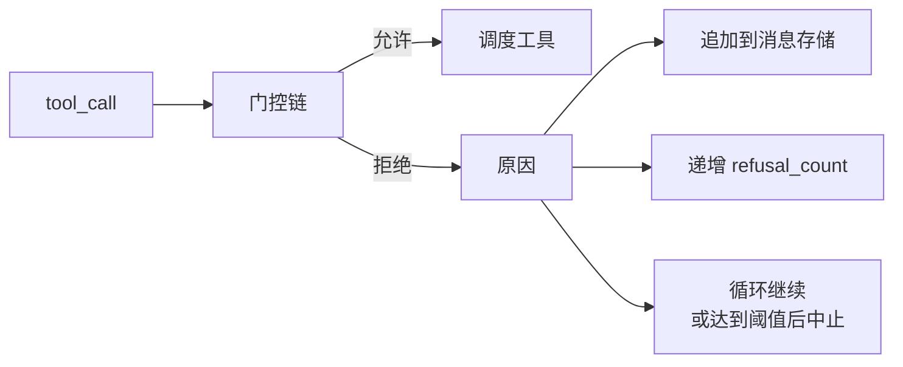
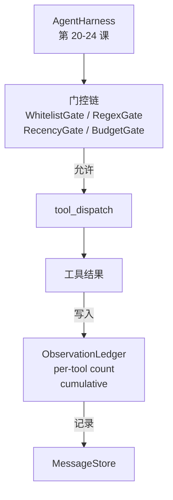

# Capstone 课程 25：验证门控与观测预算

> 没有验证层的代理框架不过是一番痴人说梦。本课构建一条确定性门控链，它决定工具调用是否允许触发、代理被允许看到多少输出内容，以及在代理读取内容过多时循环何时必须停止。该链由一组小型命名门控外加一个观测账本构成，账本追踪模型被展示过的每一个 token。

**类型：** 构建
**语言：** Python (stdlib)
**先决条件：** 第 19 · 20-24 阶段（Track A1：代理循环、工具注册表、消息存储、提示构建器、模型路由器）、第 14 · 33 阶段（指令作为约束）、第 14 · 36 阶段（范围契约）、第 14 · 38 阶段（验证门控）
**时间：** 约 90 分钟

## 学习目标

- 构建具有确定性 `evaluate(call)` 方法的 `VerificationGate` 协议。
- 将预算、时效性、白名单和正则门控组合成具有短路语义的门控链。
- 通过按工具和回合键值的 `ObservationLedger` 追踪每一次观测。
- 当累计观测预算将被超限时拒绝工具调用。
- 生成结构化 `GateDecision` 记录，供下游可观测性组件消费。

## 问题所在

当代理框架允许模型自由调用工具时，在真实使用的第一个小时内就会出现三类 bug。

第一类是无界观测。对 20 万行代码库执行 grep 操作，会将五十万 token 的输出倾倒进下一个回合。模型只能看到一个匹配项，其余上下文全部浪费。token 账单巨大，而代理完成任务的能力反而更差了。

第二类是时效性陈旧。长时间运行任务会累积五十次工具调用。模型会像对待活跃状态一样重新读取第三回合的 `read_file` 结果。第四十七回合所做的编辑从未出现，因为提示构建器是优先序列化最早的观测结果。

第三类是权限蔓延。一个研究任务以调用 `web_search` 开始，然后模型不知怎么地跑起了 `shell`——因为它捏造了一个工具名称，而框架默认采用了宽松策略。等任何人查看到痕迹时，一个垃圾文件已经躺在 `/tmp` 下，同时一条 curl 请求已经打到了私有 API。

验证门控是框架中负责说"不"的组件。它不是一个模型，也不是一个裁判。它是 `(call, history, ledger)` 的一个确定性函数，返回 `ALLOW` 或 `DENY` 以及拒绝原因。原因会被记录日志，模型会被告知，循环继续或中止。

## 概念



一个门控就是任何具备 `evaluate(call, ctx) -> GateDecision` 方法的对象。门控链是一个有序列表。评估在遇到第一个拒绝时短路。顺序至关重要：廉价的结构性门控先于昂贵的 token 计数门控执行。

本课提供四个门控：

- `WhitelistGate`。允许的工具名称是一个显式集合。超出集合的任何调用都会被拒绝。这是最廉价的门控，最先执行。
- `RegexGate`。工具参数与正则表达式匹配。可用于拒绝包含 `rm -rf` 的 shell 调用，或发往内网 IP 的 HTTP 调用。完全作用于调用载荷。
- `RecencyGate`。模型只能看到最近 N 个回合内的观测结果，较旧的观测会被掩码。若某工具调用的结果会延伸一个已经过期的观测窗口，该门控会拒绝此次调用。
- `BudgetGate`。模型在整个会话中累计看到的 token 数存在上限。当账本显示上限已触及时，所有后续工具调用均被拒绝。

观测账本是记账层。每次成功的工具调用都会写入一行：工具名、回合、发出的 token 数、累计值。账本回答两个问题：模型总共看到了多少，以及模型对工具 X 看到了多少。预算门控读取前者。每工具预算门控读取后者，这需要你作为练习来完成。

```figure
cg-gate-chain
```

## 架构



框架向链发出询问。链要么点头，要么拒绝。如果点头，工具运行、账本计数递增，结果被追加到消息存储。如果拒绝，模型会收到一条系统消息形式的拒绝声明，循环决定是否重试或中止。

## 你将构建的内容

实现包含一个 `main.py` 加测试。

1. `Observation` 和 `ToolCall` 数据类定义外部接口形状。
2. `ObservationLedger` 记录 `(turn, tool, tokens)` 行，并提供 `cumulative()` 和 `per_tool(name)` 查询。
3. `GateDecision` 携带 `(allow, reason, gate_name)`。
4. `VerificationGate` 是协议。每个门控实现 `evaluate(call, ctx)`。
5. `GateChain` 包装一个有序列表。依次调用每个门控，返回第一个拒绝，或所有门控通过时返回允许。
6. 演示程序运行一个小型合成代理循环。三个回合。第三个回合触发预算门控，循环报告一条干净的拒绝声明，且 refusal_count 非零。

Token 计数器故意使用简单的 `len(text) // 4` 启发式方法。本课的重点是门控机制，而非分词器。在生产环境中替换为真正的分词器即可。

## 为什么链顺序很重要

拒绝比允许更便宜。`WhitelistGate` 在 O(1) 哈希查找中执行。`RegexGate` 在 O(pattern * argv) 中执行。`RecencyGate` 读取消息存储的一个小切片。`BudgetGate` 读取整个账本。按成本升序排列它们，以便被拒绝的调用在昂贵工作之前短路退出。

还要按影响半径排序。白名单是最强的声明：这个工具不在契约中。正则门控次之：这个参数不在契约中。时效性紧随其后：框架仍然关心，但该调用在结构上是合法的。预算放在最后，因为根据定义，它只在其他一切通过之后才会触发。

## 与 Track A 其余部分的组合

前面的课程为你提供了循环、工具注册表、消息存储、提示构建器和模型路由器。本课添加的是位于模型与工具之间的那一层。第 26 课提供沙箱，门控链说"允许"后，调度器将工具调用交给沙箱。第 27 课提供评估框架，将拒绝计数作为质量信号记录下来。第 28 课将门控决策接入 OpenTelemetry span。第 29 课将所有部分缝合成一个可用的编码代理。

## 运行方式

```bash
cd phases/19-capstone-projects/25-verification-gates-observation-budget
python3 code/main.py
python3 -m pytest code/tests/ -v
```

演示程序逐回合打印轨迹，包含每次门控决策，并以零退出码退出。测试覆盖账本、每个门控的孤立测试、链短路测试以及合成循环的端到端测试。
