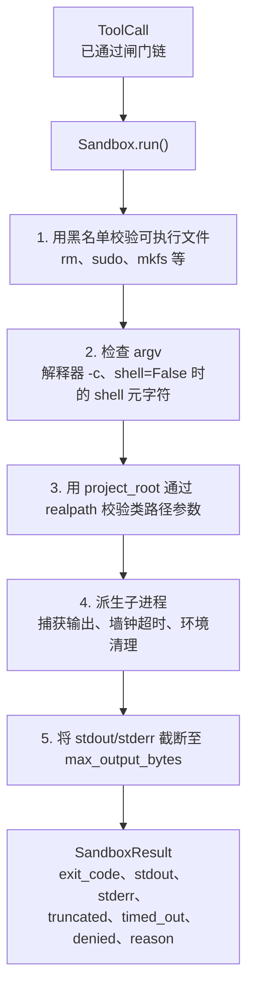
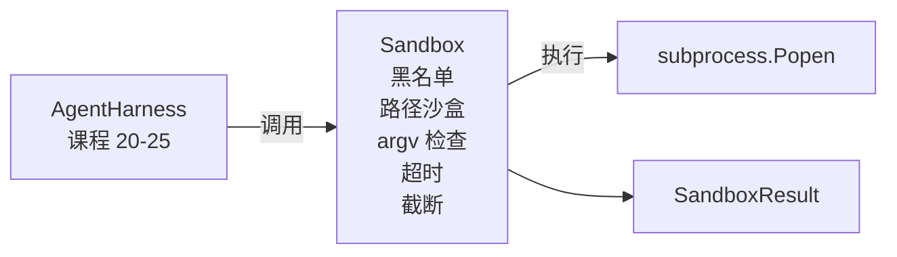

# Capstone 课程 26：使用黑名单和路径沙盒的子进程执行器

> 验证闸门决定工具调用是否应该运行。沙盒决定调用运行时发生什么。本课程实现一个子进程执行器，拒绝危险的执行文件、拒绝危险的 argv 形状、将所有文件路径关进项目根目录的笼子、截断过大的输出、并在墙钟超时内终止失控进程。它是模型与操作系统之间的第二层防护（第一层见课程 25）。

**类型：** 构建
**语言：** Python（标准库）
**先修知识：** 阶段 19 · 25（验证闸门与观测预算）、阶段 14 · 33（指令即约束）、阶段 14 · 38（验证闸门）
**用时：** 约 90 分钟

## 学习目标

- 构建一个封装 `subprocess.run` 的 `Sandbox` 类，支持超时、输出捕获与截断。
- 基于黑名单按名称拒绝命令，基于 argv 结构检查器拒绝模式。
- 拒绝所有解析后超出声明项目根目录的路径参数。
- 关闭 shell 模式时拒绝 shell 元字符。
- 返回结构化的 `SandboxResult`，供下游可观测性和评测系统消费。

## 问题背景

一个能够启动 shell 的代码代理可以在单个回合中安装后门、泄露密钥、让开发者的笔记本电脑报废，并累积巨额云账单。成本最低 defenses 是不给它 shell。次低成本是一个对精确模式列表说"不"的沙盒。

在代理的调用轨迹中，有三类反复出现的失败。

第一类是危险的可执行文件。在压力下试图修复路径问题的模型会尝试 `sudo`、`chmod -R 777`、`rm -rf`、`mkfs`、`dd`。这些都不该出现在代理的运行中。黑名单按名称和别名捕获它们。

第二类是 argv 技巧。当被告知不能使用 shell 后，模型会通过解释器管道传递攻击：`python3 -c "import os; os.system('rm -rf /')"`、`bash -c '...'`、`node -e '...'`、`perl -e '...'`。沙盒需要知道任何带 `-c` 类标志的解释器调用只是多了一步的 shell 调用。

第三类是路径逃逸。模型被要求读取 `./src/main.py`，却改为读取 `../../etc/passwd`。沙盒通过 `os.path.realpath` 解析每个路径参数并断言其前缀，从而将路径关进笼子。

这个沙盒不是操作系统意义上的安全边界。具有代码执行能力的坚定攻击者仍然可以逃脱。沙盒是一个开发时护栏：它让常见的失败模式发出声响，阻止代理因纯粹的不称职而造成损害。

## 概念



沙盒有四个拒绝维度：名称、argv、路径、结构。每个维度都是对调用的纯函数，此时尚未派生子进程。所有维度通过后才派生子进程。

`SandboxResult` 的退出码采用惯例值：0 成功，非零失败，外加三个哨兵值：denied（-100）、timed_out（-101），以及 truncated（退出码为真实值，附带一个标志位）。后续课程读取这个结构化结果，而非解析 stderr。

```figure
cg-path-jail
```

## 架构



黑名单是一个包含可执行文件基本名称的 `frozenset`。别名（`/bin/rm`、`/usr/bin/rm`）都解析为同一个基本名称。argv 检查器了解解释器模式：任何 argv[0] 是解释器且后续某个参数以 `-c` 或 `-e` 开头的调用都会被拒绝。当调用未显式请求 shell 时，shell 元字符（`;`、`|`、`&`、`>`、`<`、反引号、`$()`）会导致拒绝。

路径沙盒是最微妙的部分。沙盒在构造时接受一个 `project_root`。任何看起来像路径的参数（包含 `/` 或匹配现有文件）会通过 `os.path.realpath` 标准化，然后与项目根的 realpath 比较。如果解析后的目标不在根目录下，则拒绝。针对符号链接的逃逸尝试（项目根目录下的符号链接指向外部）通过检查 realpath 而非字面路径来阻止。

## 你要构建的内容

实现包含 `main.py` 和一个测试目录。

1. `SandboxResult` 数据类：exit_code、stdout、stderr、truncated、timed_out、denied、reason、duration_ms。
2. `SandboxConfig` 数据类：project_root、max_output_bytes、timeout_seconds、denylist、interpreter_block。
3. `Sandbox` 类：`run(argv, *, shell=False, cwd=None)` 返回 `SandboxResult`。
4. 内部拒绝辅助函数：`_check_executable_denylist`、`_check_argv_interpreter`、`_check_shell_metachars`、`_check_path_jail`。
5. 带明确 `truncated` 标志和捕获流中标记行的输出截断。
6. 文件底部的演示：一系列合法与对抗性调用，每个都附带其结果。

沙盒默认使用 `subprocess.run` 并设置 `shell=False` 和 `capture_output=True`。墙钟超时使用 `timeout` 参数；遇到 `TimeoutExpired` 时，沙盒终止进程组并合成一个 SandboxResult。

## 为什么这不是真正的沙盒

本课的沙盒没有使用命名空间、cgroups、seccomp、gVisor、Firecracker 或任何内核级隔离机制。子进程能做的任何事，沙盒都能做。保护是结构性的：代理被拒绝了最常见的危险调用，而响亮的拒绝进入可观测系统，而非静默运行。

对于生产级代理，你可以在上述基础上叠加：在未提权的 Docker 容器内运行、在 microVM 内运行、丢弃能力、以只读方式挂载项目根目录并以读写方式挂载临时目录、设置内存和 CPU 的 ulimit、将环境清理为已知安全白名单。课程 29 会做其中一部分。操作系统级隔离不在本课范围内。

## 运行方式

```bash
cd phases/19-capstone-projects/26-sandbox-runner-denylist
python3 code/main.py
python3 -m pytest code/tests/ -v
```

演示会创建一个临时目录，在其中放置一个干净文件，然后运行一系列调用。合法的调用成功。被拒绝的调用返回 `denied=True` 且附带 reason 的 SandboxResult。超时返回 `timed_out=True`。截断设置 `truncated=True`。演示打印结果 JSON 表并以零退出。

## 与 Track A 其余课程的组合

课程 25 生成了闸门链。课程 26 是闸门 ALLOW 之后运行的执行器。课程 27 的评测系统根据每个任务预期的退出码对比沙盒结果。课程 28 在每个 `Sandbox.run` 调用周围生成 `gen_ai.tool.execution` span。课程 29 的端到端演示将一个真实的代码代理接入这两层。
