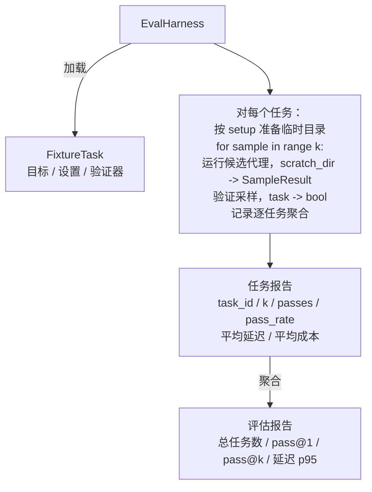

# 实战项目课程 27：使用夹具任务的评估工具

> 代码代理的能力上限，取决于你用来衡量它的那套任务套件。本课将构建一个评估工具：读取一个包含夹具任务的文件夹，对每个任务运行候选代理，通过确定性验证器给出通过/失败评分，并将结果汇总为 pass@1、pass@k、平均延迟与平均成本。该评估工具是"事实来源"，让你能区分回归与新重构。

**类型：** 构建  
**语言：** Python（标准库）  
**前置知识：** 阶段 19·25（验证门禁）、阶段 19·26（沙箱运行器）、阶段 14·30（评估驱动代理开发）、阶段 14·19（SWE-bench 与 GAIA 基准）  
**预计时间：** 约 90 分钟

## 学习目标

- 将夹具任务定义为“目标、设置、验证器”的三元组。
- 对每个任务多次采样运行并评分，计算 pass@1 与 pass@k。
- 将延迟与成本聚合为均值与 95 分位数指标。
- 将确定性验证器（文件比对、退出码、正则匹配）封装为可复用函数。
- 输出结构化的 JSON 报告，供回归追踪脚本消费。

## 问题所在

没有评估工具的代理基准测试，会遭遇三类失效模式。

第一类是“未经核实的通过”。代理声称已修复 bug，人工快速查看差异后判定绿色通过，三周后回归测试再次暴露同一 bug。代理推理看似合理，实则什么都没修。

第二类是“未发现的回归”。对提示模板的修改让代理在热门任务上提升 4%，在冷门任务上下降 14%。缺少金标准集合与逐任务评分，回归会悄无声息地合入主干，直到客户投诉才暴露。

第三类是“逐任务漂移”。周一跑了 100 个任务的评测，周五却跑了 95 个——因为有人重命名了五个夹具。通过率看起来提升了 5%，其实没有。

评估工具是把上述失效转化为事实的程序。它每次都以可复现的顺序运行每个夹具，并通过返回 true/false 的确定性检查进行验证。

## 概念

```mermaid
flowchart LR
  F1[fixtures/task_001/<br/>task.json + expected/] --> Harness
  F2[fixtures/task_002/<br/>...] --> Harness
  Harness[评估工具<br/>对每个任务：<br/>准备环境 / 运行代理 k 次采样 /<br/>验证每次采样 /<br/>记录延迟、成本]
  Harness --> Report[评估报告<br/>pass@1 / pass@k<br/>平均 ms / p95 ms<br/>平均成本]
```

`FixtureTask` 是一个小型 JSON 文件，外加可选的 `expected/` 目录。JSON 声明 `id`、`goal`（发给代理的提示）、`setup` 块（要放入临时工作目录的文件）以及 `verifier` 块。验证器块引用评估工具注册表中的函数，并传入其参数。

三种验证器形态覆盖了大多数实用任务。

第一种是 `file_equals`。代理运行后，将指定文件与期望内容进行比对。适用于“以这种精确方式修复该 bug"的任务。

第二种是 `regex_match`。将指定文件内容与正则表达式匹配。适用于“函数必须存在并返回 X"的多解型任务。

第三种是 `shell_exit_zero`。评估工具通过沙箱（见课程 26）运行一条 shell 命令，仅当命令退出码为零时任务才算通过。适用于“测试必须全部通过”的任务。

评估工具对每个任务运行 `k` 次。pass@k 的计算为 `1 - (1 - p)^k`，其中 p 为经验通过率；工具同时报告原始计数，便于发现波动。延迟为每次采样的墙钟时间。成本由代理自报（token 数、美元或两者兼有）；工具对多次采样求和，并给出逐任务与总体数字。

```figure
pass-at-k
```

## 架构



候选代理是一个可调用对象：`Callable[[FixtureTask, str], SampleResult]`。评估工具通过 `tempfile.mkdtemp()` 创建临时目录，并将其路径作为普通字符串传入。评估工具不关心候选代理的内部机制。候选可以是确定性补丁应用器（适合自测）、真实 LLM 代理、模糊测试器等。契约由 `SampleResult` 定义。

## 你将构建的内容

`main.py` 交付以下组件：

1. `FixtureTask` 数据类。
2. `SampleResult` 数据类：success_self_reported、latency_ms、cost_units、edits。
3. `TaskReport`、`EvalReport` 数据类，含 `to_dict()`。
4. `VerifierRegistry`：将验证器名称映射到函数。内置验证器：file_equals、regex_match、shell_exit_zero。
5. `EvalHarness` 类：对任务目录运行候选代理，返回 EvalReport。
6. 随附的 5 个夹具任务（位于 `tasks/`）：
   - `fizzbuzz` 中的 off-by-one 错误
   - `factorial` 中缺失 return
   - 错误消息拼写错误
   - 空函数体
   - 链表遍历中的 off-by-one 错误
7. 一个确定性参考候选代理（`apply_known_fixes`），用于演示 pass@1 = 1.0 的干净通过。
8. 示例程序打印 EvalReport JSON 并以退出码 0 退出。

夹具任务以 JSON 文件形式打包在 `tasks/` 下，并附带配对源码文件 `tasks/<id>/buggy/` 与 `tasks/<id>/expected/`。评估工具将 buggy 拷贝到临时目录，交给候选代理处理，再与 expected 进行验证比对。

## 为什么用 pass@k 而非仅 pass@1

真实 LLM 代理具有随机性。pass@1 为 0.6 看起来像是失败，而 pass@5 为 0.95 则说明代理多数时候能得出正确答案，只是早期采样选错了。改进方向往往是采样与排序，而非一味增加训练。pass@k 能把这一点清晰呈现。

pass@k 会与 pass@1 一起报告，因为 pass@k 可能掩盖真正的失败：若模型在二十次尝试中只有一次答对，你拥有的并不是一个可用的代理。评估工具同时展示两者。

## 与 Track A 其他课程的组合关系

课程 25 产出了门禁链。课程 26 产出了沙箱。本评估工具对任何 `shell_exit_zero` 验证器都会使用沙箱。课程 28 会把每次评估运行包装为 OTel 追踪。课程 29 会对某个随附夹具运行端到端演示，并断言参考代理的 pass@1 = 1.0。

## 运行方式

```bash
cd phases/19-capstone-projects/27-eval-harness-fixture-tasks
python3 code/main.py
python3 -m pytest code/tests/ -v
```

示例程序会以 JSON 格式打印 EvalReport，包含 pass@1、pass@5、平均延迟与逐任务明细。退出码为 0。测试覆盖验证器函数、pass@k 计算、夹具加载，以及针对随附参考代理的端到端评估工具流程。
