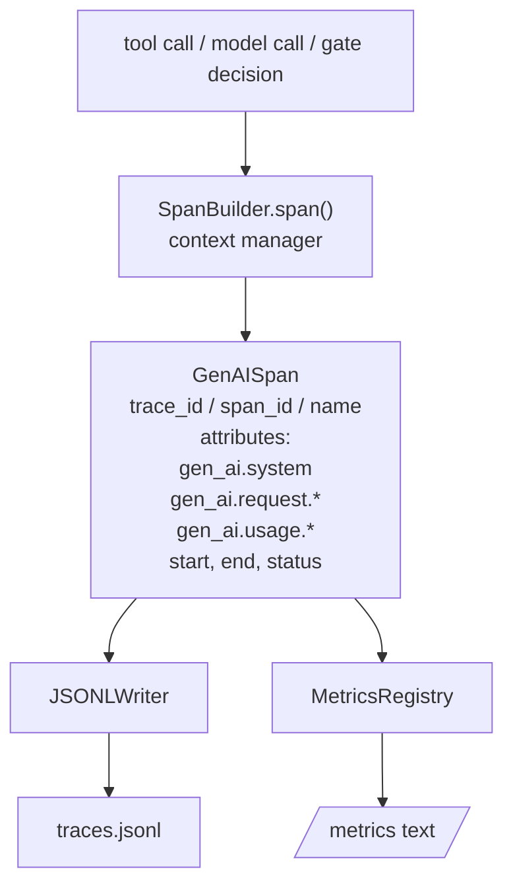
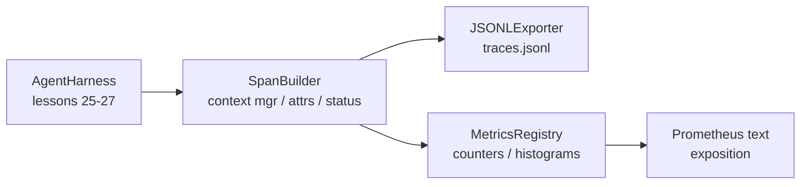

# Capstone Lesson 28：使用 OTel GenAI Spans 和 Prometheus 指标的可观测性

> 一个没有可观测性的 agent harness 就是一个烧钱的黑盒。本课手工实现了一个 span 构建器，它生成符合 OpenTelemetry GenAI 语义规范的记录，每行写一个 span 到 JSON-Lines 文件，并以 Prometheus 文本格式暴露计数器和直方图。整个实现只使用 Python 标准库，可离线运行。

**类型：** 构建
**语言：** Python（标准库）
**前置要求：** Phase 19 · 25（验证门）、Phase 19 · 26（沙箱）、Phase 19 · 27（评估 harness）、Phase 13 · 20（OpenTelemetry GenAI）、Phase 14 · 23（OTel GenAI 规范）
**预计时间：** 约 90 分钟

## 学习目标

- 构建符合 OpenTelemetry GenAI 语义规范的 span 数据类。
- 实现一个 JSONL 导出器，每行写入一个完整的 span。
- 使用标签构建计数器和直方图，并以 Prometheus 文本格式导出。
- 将任意可调用对象包装在 span 上下文管理器中，记录持续时间、状态和异常。
- 验证发出的 span 经过 `json.loads` 后能正确往返，并匹配规范形状。

## 问题所在

生产环境中的编码 agent 每轮产生三类产物：模型调用、工具执行和验证门决策。如果没有结构化的遥测数据，这些都没有用处。

第一个故障模式是**缺少追踪**。周二出了问题，但唯一的记录是一段 500 行的聊天记录。没有任何记录表明哪个工具被执行、耗时多久、提示词进了多少 token、或者门控是否拒绝了什么。agent 作者只能靠猜。

第二个故障模式是**无法解析的追踪**。harness 写了 spans，但使用了自定义的字段名。Grafana、Honeycomb、Jaeger 或本地 CLI 中没有任何工具能读取它们。团队技术栈中现有的任何工具都浪费了，因为这些 span 不是标准格式。

第三个故障模式是**未聚合的指标**。你可以在追踪中看到一次慢速工具调用，但无法回答"过去一小时内 read_file 调用的 p95 延迟是多少？"——因为只有追踪，没有指标。

OpenTelemetry GenAI 语义规范正是为了解决这些问题而存在的。它们定义了一组标准的属性集，被各 LLM 框架的 span 发射器共享。如果你的 harness 写入这些属性，每个 OTel 兼容的后端都能读取它们。

## 概念



harness 中的每个操作都会产生一个 span。span 拥有 trace id（整个 agent 调用）、span id（当前这个操作）、名称（例如 `gen_ai.chat`、`gen_ai.tool.execution`）、遵循 GenAI 规范属性的属性集、开始和结束时间、以及状态。

GenAI 规范将这些属性键标准化：`gen_ai.system`（哪个提供者，如 `anthropic`、`openai`）、`gen_ai.request.model`（模型 id）、`gen_ai.request.max_tokens`、`gen_ai.usage.input_tokens`、`gen_ai.usage.output_tokens`、`gen_ai.response.model`、`gen_ai.response.id`、`gen_ai.operation.name`，以及工具特定的键 `gen_ai.tool.name` 和 `gen_ai.tool.call.id`。

导出器使用 JSONL 格式。每行一个 JSON 对象。这是下游工具链可以流式处理、grep 和导入的最简格式。真实的 OTel 导出器会走 OTLP gRPC；本课的 JSONL 导出器是离线等价物，在每个工作站上以零退出码退出。

指标与追踪并存。计数器在每次工具调用时递增：`tools_called_total{tool="read_file"}`。直方图记录观察到的延迟：`tool_latency_ms{tool="read_file"}`。两者均序列化为 Prometheus 文本暴露格式，这是拉取式指标的事实标准。

```figure
trace-spans
```

## 架构



span 构建器是一个小类，带有 `span(name, attrs)` 方法，返回一个上下文管理器。该上下文管理器在进入时记录开始时间，退出时记录结束时间，如果有异常抛出则附加异常信息，并将最终化的 span 推送给导出器。

指标注册表由两个字典组成。计数器是 `{(name, frozen_labels): int}`。直方图将原始样本保存在列表中，并在暴露时序列化为 Prometheus 直方图桶。

## 你将构建的内容

`main.py` 提供：

1. `GenAISpan` 数据类：trace_id、span_id、parent_span_id、name、attributes、start_unix_nano、end_unix_nano、status、status_message、events。
2. `SpanBuilder` 类，带有 `span(name, attrs, parent=None)` 上下文管理器。
3. `JSONLExporter` 类，带有 `export(span)` 方法，每次追加一行。
4. `Counter` 和 `Histogram` 类以及 `MetricsRegistry`。
5. `prometheus_exposition(registry)` 函数，生成文本格式输出。
6. `wrap_tool_call(name)` 装饰器，发出 span 并更新指标。
7. 演示：合成一个完整的 agent 调用（在工具 span 外围包裹 gen_ai.chat span），写入 traces.jsonl，打印 Prometheus 暴露内容，以零退出码退出。

span id 和 trace id 是 16 字节十六进制字符串，由 `os.urandom` 生成。这与 OTel 的 W3C 追踪上下文匹配。导出器永不抛出；IO 错误会被暴露，但 harness 继续运行。

直方图采用固定的桶集合（OTel 延迟默认值，单位为毫秒：5、10、25、50、100、250、500、1000、2500、5000、10000、+Inf）。样本以列表形式存储；暴露时按需计算每个桶的计数。

## 为何手工实现而非使用 opentelemetry-sdk

OTel Python SDK 是一个真实的依赖项。但它也有数千行代码、OTLP 导出器的多个进程，以及一个会淹没课程预算的运行时代价。手工实现的版本教授了线路格式。在生产环境中，你可以将这些相同的属性接入真正的 SDK，免费获得 OTLP 导出器、批量处理和资源检测能力。

规范是稳定的。本课导出的线路格式在 2030 年仍可被解析，因为 OTel 从不破坏 GenAI 属性名——它们只会新增。

## 与 Track A 其余部分的组合

第 25 课生成了门链。第 26 课生成了沙箱。第 27 课生成了评估 harness。第 28 课使这三者都可观测。第 29 课将整个端到端演示的每一步都包裹在 span 中，并在末尾打印 Prometheus 文本。

## 运行方式

```bash
cd phases/19-capstone-projects/28-observability-otel-traces
python3 code/main.py
python3 -m pytest code/tests/ -v
```

演示会在课程的当前工作目录中生成一个 `traces.jsonl`（结束后清理），然后打印三个 span 的样例，再打印计数器与直方图的 Prometheus 暴露内容。测试验证 span 能否正确往返序列化、是否存在规范的 GenAI 属性、计数器是否正确递增、以及直方图暴露是否包含预期的桶计数。
