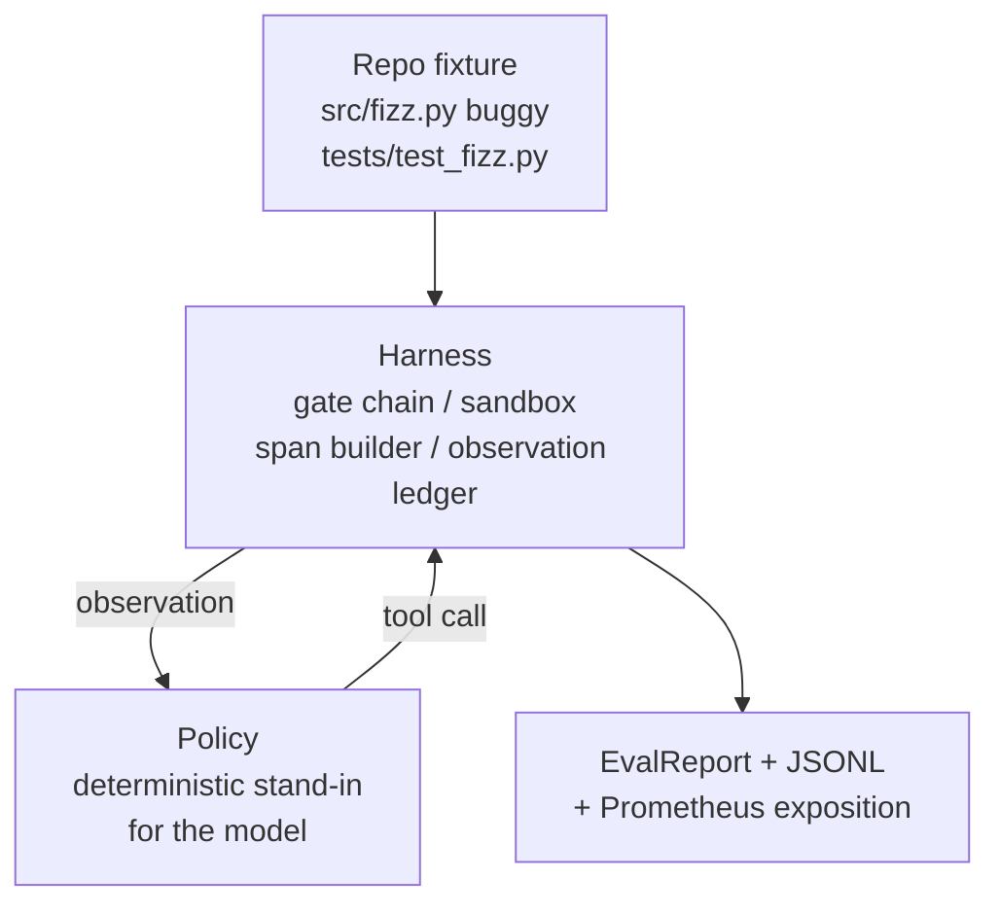
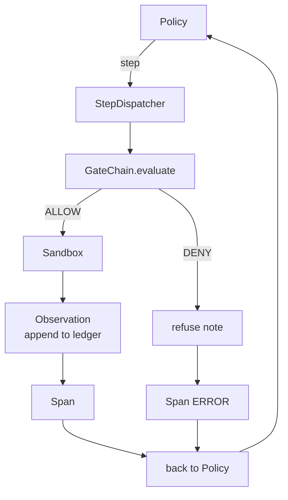

# Capstone Lesson 29: Harness 上的端到端编码代理

> Track A's payoff. This lesson stitches the gate chain, the sandbox, the eval harness, and the OTel spans into one working coding agent that fixes a real (small, fixture-scale) bug in a multi-file Python project. The agent is a deterministic policy, not an LLM; the substitution makes the lesson reproducible and shows that the harness was the interesting part all along. The contract is identical: a real model plugs in at the policy seam.

**类型：** 构建
**语言：** Python (stdlib)
**前置条件：** Phase 19 · 25（验证闸门）、Phase 19 · 26（沙箱）、Phase 19 · 27（评估工具链）、Phase 19 · 28（可观测性）、Phase 14 · 38（验证闸门）、Phase 14 · 41（真实仓库的工作台）、Phase 14 · 42（代理工作台结项）
**时间：** 约 90 分钟

## 学习目标

- 将闸门链、沙箱、评估工具链和 span 构建器组合为单个代理循环。
- 实现一个确定性策略，使用 read_file、run_tests 和 write_file 来修复 fixture 级别的 bug。
- 在整个端到端运行过程中强制执行全局步骤预算和观测令牌预算。
- 为整个运行过程生成完整的 OTel GenAI 追踪和 Prometheus 指标。
- 验证代理在少于 12 步内解决 fixture 问题，且在合法工具调用上零次闸门拒绝。

## 问题所在

大多数代理演示都在孤立环境中运行：单独的沙箱、单独的评估工具链、单独的 span 发射器。看起来都没问题。把它们组合起来，接缝就暴露了。

闸门链说 ALLOW（允许），但沙箱出于闸门链未能预料的原因拒绝。评估工具链记录了一次通过，但 OTel spans 显示闸门拒绝了代理声称它使用的工具。Prometheus 计数器在被应该只增一次时被增了两次。观测预算被超了，但代理仍在继续，因为预算在链中跟踪而沙箱并不知道。

本节课是整个 Track A 的集成测试。代理必须按顺序完成四件事：读取项目、运行测试、从测试失败中识别 bug、写入修复、重新运行测试、停止。每个操作都经过闸门链。每个工具执行都经过沙箱。每个步骤都被 span 包裹。评估工具链在最后对整个运行进行评分。

## 概念



代理的策略是一个状态机。五个状态。

`SURVEY`：代理读取项目列表。下一个状态是 RUN_TESTS。

`RUN_TESTS`：代理运行测试命令。如果测试通过，状态机以成功终止。否则下一个状态是 INSPECT。

`INSPECT`：代理读取失败源的源文件。下一个状态是 FIX。

`FIX`：代理写入更正后的文件。下一个状态是 VERIFY。

`VERIFY`：代理再次运行测试命令。如果测试通过，成功终止。否则失败终止。

每个状态对应一个工具调用。每个工具调用都经过闸门链。如果工具调用被拒绝，代理在追踪中报告拒绝并终止。

fixture 中的 bug 是 `fizz.py` 中的一个 off-by-one 错误。确定性策略通过正则表达式从测试失败消息中检测到此 bug 并发出更正后的文件。用 LLM 替换策略不会改变工具链的合同。

## 架构



课程是自包含的。每个先前课程的原始模块都以最小规模在 `main.py` 中重新实现（闸门、沙箱、账本、span），以便课程无需导入同级模块即可运行。名称与课程 25-28 完全匹配，使得概念映射清晰无歧义。

## 你将构建什么

`main.py` 提供：

1. 最小的工具链原始模块，名称与课程 25-28 相同：`GateChain`、`Sandbox`、`ObservationLedger`、`SpanBuilder`、`MetricsRegistry`。
2. `CodingAgentPolicy` 类：具有五个状态的状态机。
3. `Repo` 助手：准备带有捆绑的 buggy fixture 的临时目录。
4. `AgentRun` 类：驱动策略，通过工具链分发，返回 `AgentRunReport`。
5. 捆绑的 fixture（`fixture_repo/`）包含 src/fizz.py、tests/test_fizz.py 和用于评估工具链的 expected/ 树。
6. 演示：端到端运行策略，打印逐步追踪，断言通过，打印指标。

捆绑的 fixture 与课程 27 的任务结构形状相同：一个 buggy 文件和一个测试文件。测试失败消息包含足够的信息供确定性策略识别修复方案。真实的 LLM 会做同样的工作，但更慢且召回范围更广，但它不会改变工具链的预期。

## 为什么策略不是 LLM

真实的 LLM 需要 API 密钥、网络调用和不可验证的随机性。工具链才是课程关心的部分。用确定性策略替代可以让课程在任何开发者笔记本电脑上运行，无需任何外部依赖，并让测试套件断言精确的步骤计数。

课程的策略是 LLM 代理行为的严格子集。策略读取仓库，看到失败的测试，识别行号，并发出修复方案。LLM 会经历相同的循环，使用相同的工具链合同；簿记完全相同。

## 演示断言什么

端到端演示在退出时断言五件事，测试套件以编程方式重新断言它们。

策略在少于 12 步内解决了 fixture 问题。

观测预算从未被超过。

零次闸门拒绝在合法工具上触发。（代理从未发明一个被拒绝的工具名称。）

每个步骤在 traces.jsonl 中都有对应的 span。

Prometheus 暴露内容包含一个 `tools_called_total{tool="read_file"}` 条目和一个 `tool_latency_ms` 直方图。

## 与本 Track A 其余部分的组合

本课程是集成测试。课程 25 编写了闸门链。课程 26 编写了沙箱。课程 27 编写了评估工具链。课程 28 编写了可观测性。课程 29 证明它们作为系统一起工作。一个真实的代理工具链从此扩展：将确定性策略替换为模型，将捆绑的 fixture 替换为真实仓库任务，将 JSONL 导出器替换为 OTLP。

## 运行它

```bash
cd phases/19-capstone-projects/29-end-to-end-coding-task-demo
python3 code/main.py
python3 -m pytest code/tests/ -v
```

演示打印每步追踪、最终评估报告和 Prometheus 暴露内容。退出代码为零。测试覆盖策略状态转换、合成工具调用上的闸门拒绝、在捆绑 fixture 上的端到端运行以及步骤预算不变量。
