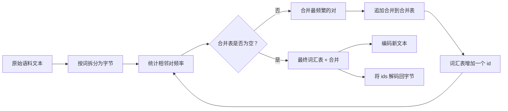
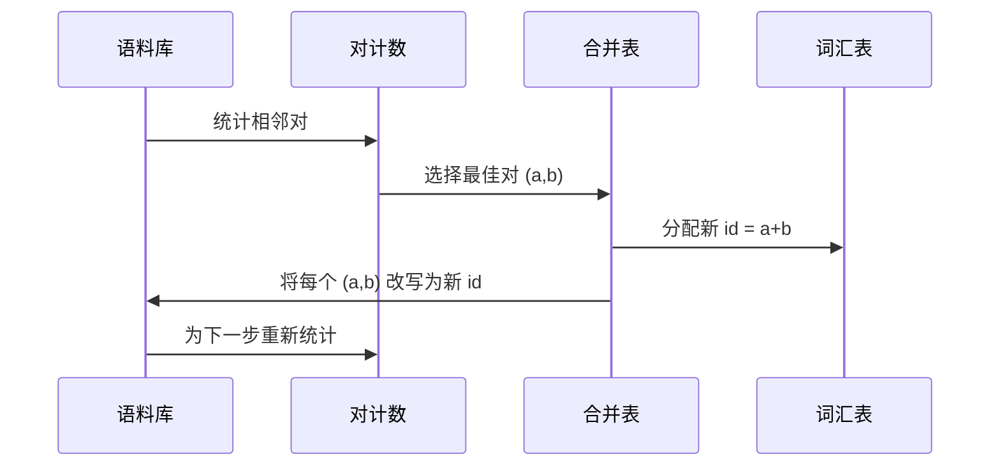

# 从零构建 BPE Tokenizer

> 字节输入，ids 输出，ids 还原回相同的字节。构建每个现代文本模型都从之起步的 tokenizer。

**类型：** 实践构建
**语言：** Python
**前置条件：** Phase 04 课程、Phase 07 transformer 课程
**时长：** ~90 分钟

## 学习目标
- 通过对最频繁的相邻符号对反复合并，从原始文本语料库训练出一个字节对编码词汇表。
- 实现一个确定性的合并表，并将其应用于新文本以产生子词 id 流。
- 将任意 UTF-8 输入往返转换（编码为 ids 再解码还原）且无信息损失。
- 保留并保护特殊 token（``、`<|pad|>`），使其在训练和解码中保持不变。
- 思考为什么字节级字母表是通用 tokenizer 的正确基础。

```figure
cap-bpe-merge
```

## 概述

语言模型从不"看到"文本，它看到的是整数。从字符串到整数列表的映射以及反向映射就是 tokenizer。如果这层出错，整个训练过程中的每条 loss 曲线测量的都是错误的内容。

通用文本模型的主流子词 tokenizer 族是字节对编码（Byte-Pair Encoding）。核心思想很简单：从一个已知字母表出发，找出训练语料库中出现频率最高的相邻符号对，将其合并为新符号，重复此过程直到词汇表达到目标大小。编码新文本时重用相同的合并顺序。

我们将构建字节级变体。字母表是 256 个原始字节，而非 Unicode 码位。这一选择使得 tokenizer 能够处理任意 UTF-8 输入而无需回退到未知 token。

## 流程



训练侧和推理侧共享同一个合并表。这种共享就是契约。如果你在推理时改变了合并顺序，解码出的 id 流就会不同。

## 字节字母表

前 256 个 id 预留用于原始字节 0x00 到 0xFF。这保证在任何合并发生之前，每个输入字符串都能在词汇表中找到表达。在字节块之后，我们为特殊 token 预留一小段范围。训练循环永远不会将这些 id 提议为合并目标，因为我们完全将它们排除在预分词流之外。

预分词器在训练开始前将语料库按空白和标点边界进行分割。如果没有这一步分割，BPE 合并步骤会乐于学习跨越词边界的合并，导致词汇表中充满整个常用短语。有了分割，合并保持在词内，结果更具泛化性。

## 训练循环

每个训练步骤中，循环做三件事。它遍历语料库中的每个词，统计每对相邻当前符号出现的频率，权重为该词本身的出现频次。它选出计数最高的那对。它将每对该对的出现改写为一个单一的新符号，其 id 为词汇表中的下一个空闲槽位。然后记录该合并。



每一步的代价与语料库规模（表示为符号序列列表）呈线性关系。对于一百万个词和目标词汇表为一万个 id 的情况，循环在数秒内完成，因为随着合并的落地，符号序列不断缩短。

## 编码新文本

推理时不调用合并计数器。它按照学习时的相同顺序应用合并表。对于新词，编码器从字节拆分开始。它扫描当前序列寻找排名最低的合并（即最早生效的那一个）。它执行该合并。再次扫描。当表中没有任何合并适用于当前序列时，循环结束。

按排名排序是使编码确定性并匹配相同输入下训练行为的关键属性。首先学习的合并位于表的顶部，会最先被应用。如果两个合并在同一位置都能适用，排名较低的那个胜出。

## 特殊 token

特殊 token 是字节流永远无法生成的 id。我们手动预留它们。本教程中两个就够了。

- `` 在预训练期间分隔文档。它告诉模型"新文档从此处开始，不要让前一篇文档的上下文泄露进来。"
- `<|pad|>` 填充短序列，使一个 batch 能成为矩形张量。loss 掩码在训练期间将其隐藏。

编码器接受一个标志位，允许输入中包含特殊 token。该标志位关闭时，字符串 `` 和 `<|pad|>` 会被按拼写出它们的字节进行 tokenization。该标志位打开时，字面字符串会被映射到其预留的 id，且不受任何合并影响。

## 往返保证

先编码再解码必须精确返回输入字节。解码器按顺序拼接每个 id 的字节展开。由于每个 id 要么是原始字节，要么是先前已知两个 id 的拼接，递归展开必然终止于原始字节。解码随即返回这些字节拼写的 UTF-8 字符串。

本教程的测试套件在未见过的句子、包含 Unicode emoji 的句子以及包含字面 `` token 的句子上检验这一属性。

## 本教程不做的事

本教程不会构建类似最大规模生产 tokenizer 那样基于正则的预分词器。此处的预分词器是一个小型的空白和标点分割器。对于小型训练语料库而言，它足以产生合理的合并，且与本教程其余部分的契约保持一致。下一课将把 tokenizer 视为黑盒，并在此基础上构建滑动窗口数据集。

本教程未并行化对计数器。Python 中对几千个词的语料库进行循环，耗时远低于一秒。对于更大的语料库，显而易见的做法是按词并行统计对数然后归约。

## 如何阅读代码

`main.py` 定义了四个对象。`BPETokenizer` 持有词汇表、合并表和特殊 token 表。`train` 是训练循环。`encode` 是推理路径。`decode` 是字节拼接。底部的演示程序在一个内置语料库上训练小型 tokenizer，编码一个保留句子，将 ids 解码回原文，并打印两者。`code/tests/test_bpe.py` 中的测试验证了往返属性、特殊 token 预留和合并顺序。

运行演示。然后将演示中的目标词汇表大小从 300 改为 600，观察保留句子的编码长度如何下降。这条曲线就是 BPE 压缩曲线。
