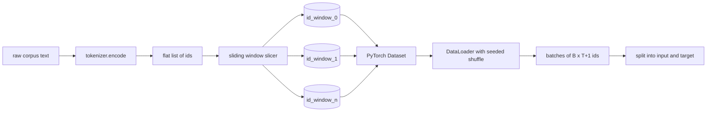
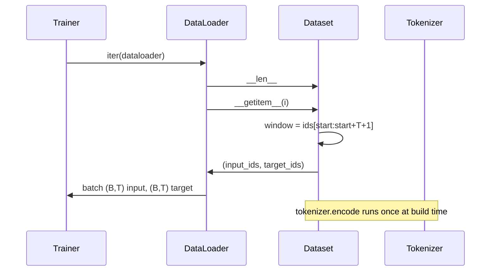

# 滑动窗口的分词数据集

> 预训练过程是一个从 token id 到梯度的函数。本课构建向其中输入 id 的传送带。

**类型：** 构建
**语言：** Python
**前置知识：** Phase 04 课程、Phase 07 transformer 课程、本阶段第 30 课
**时长：** 约 90 分钟

## 学习目标
- 通过调用一次分词器，将原始语料转换为 token id 流。
- 使用可配置的重叠步长将 id 流切片为固定长度的窗口。
- 构建一个 PyTorch Dataset，用于返回 next-token prediction 的输入和目标张量。
- 将数据集包装在 DataLoader 中，并使用每个 epoch 的种子实现确定性打乱。
- 理解步长、冗余与有效数据集大小之间的权衡关系。

```figure
cap-sliding-window
```

## 框架

一次预训练过程每次读取一批 token id 并更新模型。每个批次的形状由训练契约固定。对于因果语言模型，批次持有 `(B, T)` 的输入 id 和 `(B, T)` 的目标 id，其中目标是向左偏移一个位置的输入。数据管道的任务是从可能包含数十亿字节原始文本的语料中，以确定性且可复现的方式按需生成该契约。

本课构建该管道。上一课的分词器将文本转换为一个长扁平 id 列表。滑动窗口将该列表切片为训练样本。自定义 Dataset 以张量形式暴露这些样本。DataLoader 将它们批次化并打乱，使用已知的种子。

## 形状契约

因果 LM 消费的 id 形状为 `(B, T)`，其中 `B` 是批次大小，`T` 是上下文长度。位置 `t` 处的目标即位置 `t+1` 处的输入。这意味着每个训练样本覆盖 `T+1` 个原始 id。窗口步长控制连续样本之间的重叠程度。



切片器永远不会与语料的边界重叠。如果最后一个窗口没有足够的 id 来填满 `T+1` 个位置，则丢弃它。用 `<|pad|>` 填充尾部也是一种有效选择，但会增加损失掩码的复杂性。本课选择丢弃。

## 为何使用滑动窗口

预训练语料是一条很长的 id 流。如果模型只能看到非重叠窗口，那么每个训练样本都只会教会它相同的 `T` 个边界。调整步长会移动这些边界，使模型看到更多样化的预测下一个 token 任务。

步长为 `T` 产生非重叠窗口。步长为 `T // 2` 产生 50% 重叠，使有效数据集翻倍。步长为 `1` 产生最大重叠，并将数据集扩大 `T` 倍。代价是每个 epoch 的计算量增加。收益是更多的边界多样性。大多数预训练过程使用等于上下文长度的步长，因为语料本身已经远大于模型一个 epoch 能完成的量，因此边界多样性论据较弱。

## Dataset 类

PyTorch Dataset 有两个必需方法。`__len__` 返回样本数量。`__getitem__` 返回一个样本作为张量对。我们的 Dataset 存储编码后的 id 流和步长。对它进行索引时会动态计算窗口的起始位置，因此内存开销仅为一份 id 流副本，无论步长产生多少样本。



向左偏移一位的操作发生在 `__getitem__` 内部。Dataset 返回 `(input, target)`，其中 `input = window[:-1]`，`target = window[1:]`。两者均为 PyTorch long 张量。训练循环将其视为真实标签。

## 确定性打乱

`shuffle=True` 的 DataLoader 读取自 PyTorch 随机数生成器。通过传入显式的 `torch.Generator` 并为每个 epoch 设置种子，我们可以在每次重启运行时获得相同的打乱顺序。当你希望比较两个仅在一个超参数上不同的运行结果时，这一特性尤为重要。若无种子，两次运行会以不同的顺序看到数据，导致损失曲线因与变更无关的原因而发散。

本课的种子契约很简单。`epoch_seed = base_seed + epoch_index`。基础种子在构建时传入。epoch 索引由训练器在每个 epoch 顶部递增。使用相同基础种子的重跑在每个 epoch 始终看到相同的顺序。

## 批次采样器

PyTorch 的默认采样器以均匀随机方式选取索引，且不放回。这正是预训练所需的行为。对于在小数据集上的微调，契约相同。DataLoader 通过调用 `__getitem__` `B` 次并堆叠结果来组装一个批次。由于每个样本在构造时长度都相同，因此无需填充逻辑。

为简化起见，本课使用 `num_workers=0`。在生产环境中，worker 会并行化 `__getitem__` 调用。使用我们的管道时，这大多是无操作，因为工作只是对内存中张量的切片，但相同的 Dataset API 干净地支持 worker。

## 计算样本数量

对于长度为 `N` 的 id 流、上下文长度 `T` 和步长 `S`，样本数量为 `max(0, 1 + (N - (T + 1)) // S)`。本课将该计算作为 Dataset 上的静态方法暴露，以便训练器无需迭代即可计算每个 epoch 的总步数。

## 本课未涉及的内容

不会从磁盘流式读取。语料会被完全编码到内存中并持为单个张量。对于数百万 id 的语料来说，这远低于一百兆字节，且符合本课的形状要求。磁盘流式读取是一个独立的问题，可通过替换存储部分来接入，同时保持 Dataset 契约不变。

不处理多个文档。语料被视为一条连续的 id 流。当语料由多个文档构建时，通过在 `raw` id 中插入文档边界 token，模型学会预测跨越边界的上下文。

## 如何阅读代码

`main.py` 定义了两个类和一个辅助函数。`SlidingWindowDataset` 是 PyTorch Dataset。`make_dataloader` 返回一个配置好的 DataLoader，带有种子生成器。`_encode_corpus_to_ids` 是一次性分词器调用。底部的演示会构建一个小型分词器、编码内置语料、构建数据集和数据加载器、打印一个批次，并断言形状契约。`code/tests/test_dataset.py` 中的测试验证了窗口数量公式、向左偏移一位的属性、确定性打乱以及步长权衡。

运行演示。然后将上下文长度从 16 改为 32，观察每个 epoch 的样本数量如何下降。该数字就是你每个 epoch 的步数预算。
