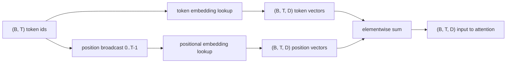
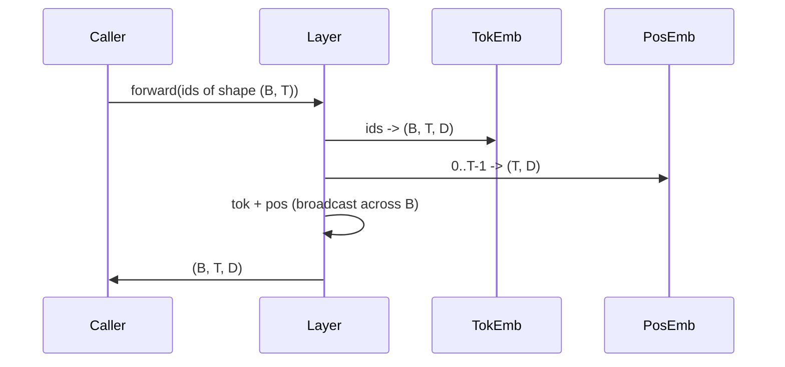

```markdown
# Token 和 Positional Embeddings

> Ids 是整数。模型需要向量。两者之间设有两个查找表，而位置表的选择决定了模型能学到什么。

**类型：** 构建
**语言：** Python
**先修知识：** Phase 04 课程、Phase 07 transformer 课程、本阶段的第 30 和 31 课
**时间：** ~90 分钟

## 学习目标
- 构建一个将词汇 id 映射到密集向量的 token embedding 查找表。
- 构建一个按位置索引的 learned positional embedding 查找表。
- 构建一个按位置索引且无参数的固定 sinusoidal positional embedding。
- 将 token 和 positional embeddings 组合为 transformer 块的单一输入。
- 在长度泛化和参数数量上对比 learned 和 sinusoidal embeddings。

```figure
cc-embedding-lookup
```

## 框架

模型首次接触一个 token id 时，是在 token embedding 矩阵中进行行查找。该矩阵每词汇 id 一行，每模型维度一列。查找返回的向量被模型的其余部分视为该 id 的含义。反向传播更新前向传递中用到的行。经过训练后，这些行的几何结构学会在方向上编码相似性。

Token ids 本身没有顺序。模型需要第二个信号来告诉它位置一是不同于位置十七的。该信号的两种主流选择是 learned positional embedding（第二个查找表，每个位置一行）和 fixed sinusoidal positional embedding（无参数的数学公式）。这一选择会产生后果。Learned 表是一个参数，受模型训练时的最大上下文长度限制。Sinusoidal 表理论上无参数，公式可扩展到任意位置，但本节课的 `SinusoidalPositionalEmbedding` 在 `max_context_length` 处预计算固定表，且其 `forward` 在超出该边界时会报错；因此这两个模块在此处都强制施加了最大上下文长度。即使表足够大可以索引，模型在超过训练长度后仍可能遇到困难。

本课将构建两者，并与 token embedding 组合，作为下节课 attention 块的输入。

## 形状约定

嵌入阶段的输入是形状为 `(B, T)` 的 token ids 批次。输出是形状为 `(B, T, D)` 的张量，其中 `D` 是模型维度。每个批次元素具有相同的上下文长度 `T`。每个位置具有相同的向量维度 `D`。



组合方式是求和，而非拼接。求和使 `D` 在整个网络中保持不变，并让模型在每个层、每个特征的基础上决定是 token 含义还是位置占主导。

## Token embedding 矩阵

Token embedding 是形状为 `(V, D)` 的参数张量，其中 `V` 是词汇量大小。PyTorch 将其暴露为 `nn.Embedding(V, D)`。初始化时，各条目从小的 Gaussian 分布中抽取，传统上使用均值零、标准差约 `0.02`（针对 transformer 规模模型）。具体的初始化方式不如跨运行保持一致更重要。

前向传递是一次索引操作。PyTorch 通过 gather rows 将 `(B, T)` int64 ids 映射到 `(B, T, D)` floats。反向传递仅将梯度累积到前向传递中触及的行。在两行从未出现在批次中的情况下，该行在此步骤上接收到零梯度。

一个微妙的细节。Token embedding 和模型末尾的输出投影经常共享权重（weight tying）。当这种情况发生时，每次反向传播都会通过输出侧触及 embedding 的每一行。本课将它们暴露为独立的模块，但在完整模型中，同一个矩阵可以同时承担这两个角色。

## Learned positional embedding

Learned positional embedding 是第二个形状为 `(max_context_length, D)` 的 `nn.Embedding`。查找以位置 id `0, 1, 2, ..., T-1` 为键。前向传递将该位置向量沿批次维度广播。

Learned 表的缺点是：如果模型仅在位置 `T-1` 之前训练过，则无法查询位置 `T` 的行。该行不存在。使用此方案的生产级 decoder-only 模型将最大上下文长度烘焙到架构中，并拒绝处理更长的输入。

## Sinusoidal positional embedding

Sinusoidal positional embedding 是从位置到向量的函数。位置 `p` 和特征 `i` 产生：

```python
angle = p / (10000 ** (2 * (i // 2) / D))
emb[p, 2k]     = sin(angle)
emb[p, 2k + 1] = cos(angle)
```

该函数没有参数。每个位置都有唯一的向量。波长 Across feature dimensions 几何变化，因此低维特征编码粗粒度位置，高维特征编码细粒度位置。

选择 `sin` 和 `cos` 共同产生的性质是：位置 `p + k` 的向量是位置 `p` 处向量的线性函数。这为 attention 层提供了学习相对位置偏移的便捷路径。模型不需要单独的参数来表达"回看五个 token"。

本课在构造时一次性计算完整的 sinusoidal 表，并在 forward 时索引该表。

## 组合

输入管线按顺序完成三件事。读取 token ids。查找 token 向量。加上 positional 向量。返回求和结果。



求和步骤中的 broadcasting 将 `(T, D)` 位置张量沿批次维度复制。PyTorch 自动处理这一点，因为在 unsqueeze 之后位置张量的形状为 `(1, T, D)`。

## 对比分析

本课在同一输入上运行两种变体并打印两项诊断。

第一项是参数数量。Learned 变体在 token embedding 之上额外增加 `max_context_length * D` 个参数。Sinusoidal 变体增加零个。

第二项是相邻位置之间 embeddings 的 cosine similarity。Sinusoidal 变体具有平滑且可预测的衰减，因为其函数是连续的。Learned 变体在初始化时具有近乎随机的相似性，因为各行是独立抽取的。训练之后，learned 变体通常会发展出类似的平滑结构，但它必须从数据中自行发现这种结构。

## 本课未涵盖的内容

本课不构建 rotary positional encoding (RoPE) 或 AliBi。它们是生产型 transformer 的现代选择。它们遵循与本 embeddings 相同的形状约定（对形状为 `(B, T, D)` 的向量施加位置相关的变换），但在 attention 投影步骤应用，而非在输入处应用。下节课将构建 attention 块，其中一个可选扩展是将 rotary 折叠到 query-key 投影中。

本课也不训练 embedding。训练需要 loss，loss 需要模型输出，模型输出需要 attention 和 LM head。那是下节课和下下节课的内容。

## 如何阅读代码

`main.py` 定义了三个模块。`TokenEmbedding` 封装 `nn.Embedding(V, D)`。`LearnedPositionalEmbedding` 封装 `nn.Embedding(L, D)`。`SinusoidalPositionalEmbedding` 预计算该表并将其暴露为 buffer。`EmbeddingComposer` 将 token embedding 和 positional embedding 绑定在一起。底部的 demo 打印形状、参数数量和相邻位置相似度诊断。`code/tests/test_embeddings.py` 中的测试固定了形状、broadcast 行为、参数数量和 sinusoidal 公式。

运行 demo。然后将模型维度 `D` 从 64 改为 32，观察 sinusoidal 波长带的变化。
```
