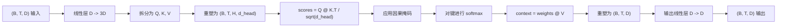
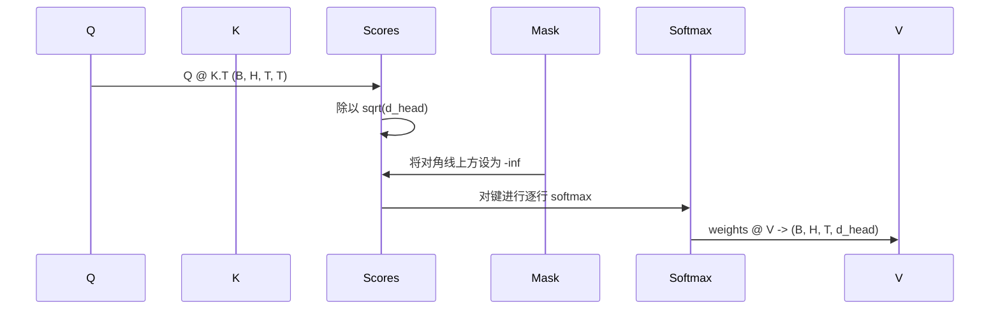

# 多头自注意力

> 一次线性投影，三个视角，H 个并行头，一个掩码。模型实际使用的注意力模块。

**类型：** 构建
**语言：** Python
**前置知识：** 第 04 阶段课程、第 07 阶段 Transformer 课程、本阶段第 30 至 32 课
**时间：** 约 90 分钟

## 学习目标
- 实现批处理的 Query/Key/Value 投影，作为拆分为 H 个头部的单个线性层。
- 使用正确的归一化和数据类型处理计算缩放点积注意力。
- 应用因果掩码，防止某个位置关注未来位置。
- 检查固定输入下每个头部的注意力权重，并推理每个头部关注的内容。
- 在一个玩具任务上训练小型注意力模块，观察随着头部专业化，损失下降的过程。

```figure
cap-multihead-attention
```

## 整体框架

注意力是使 token 的表示能够从同序列的其他 token 中提取信息的函数。自注意力意味着查询（query）、键（key）和值（value）都派生自同一输入。多头意味着将投影拆分为 H 个并行的注意力问题，其输出拼接后再投影回去。

高效的实现模式是使用一个从 `D` 投影到 `3 * D` 的线性层，将其切片为三个视角，然后重塑为 H 个大小为 `D // H` 的头部。矩阵乘法（matmul）、softmax 和加权求和均以批处理张量操作的形式进行，以便头部在加速器上并行运行。

本课将构建该模块。同时加入因果掩码，使同一段代码能用作仅解码器语言模型的注意力层。下节课将该模块堆叠为完整的 Transformer，再下节课进行训练。

## 形状契约

输入为 `(B, T, D)`，输出为 `(B, T, D)`。掩码为 `(T, T)` 或可广播至该形状。模块内部的中间张量形状为 `(B, H, T, d_head)`，其中 `d_head = D // H`。约束条件为 `D % H == 0`。



两个线性层（QKV 投影和输出投影）是模块中唯一的参数。掩码、softmax、矩阵乘法和重塑均无参数。

## QKV 拆分

朴素实现使用三个独立的线性层，分别对应 Q、K 和 V。高效实现使用单个输出 `3 * D` 特征的层，然后拆分结果。两者在数学上等价，因为三次分别使用 `(D, D)` 权重的矩阵乘法，恰好等于一次使用由它们堆叠而成的 `(3D, D)` 权重的矩阵乘法。

高效版本更快，因为加速器只启动一次矩阵乘法而非三次。初始化也更简单，因为三个子矩阵存在于同一个参数张量中，可以一起初始化。

## 头部重塑

拆分后，Q、K、V 各为 `(B, T, D)`。为将其转换为 H 个并行注意力问题，我们重塑为 `(B, T, H, d_head)` 并转置为 `(B, H, T, d_head)`。头部维度现在紧邻批次维度，因此 PyTorch 将每个头部的注意力视为跨越 `B * H` 个独立实例的批处理操作。

`d_head` 维度保持在最后，以便分数矩阵乘法 `Q @ K.transpose(-2, -1)` 对其收缩。结果为每个头部的 `(B, H, T, T)` 注意力分数。

## 缩放

softmax 之前，分数会除以 `sqrt(d_head)`。若无该缩放，点积会随 `d_head` 增大而增长，使 softmax 进入极端 regime：一个条目占据几乎所有概率质量，其余条目趋近于零。该 regime 下的梯度极小，导致学习停滞。除以 `sqrt(d_head)` 可使不同头部尺寸下分数的方差大致保持恒定。

## 因果掩码

仅解码器语言模型在预测下一个 token 时，只能以历史信息为条件。掩码强制执行该约束。具体而言，在 softmax 之前，`(T, T)` 分数矩阵中主对角线上方的每个条目都被替换为负无穷。softmax 之后，这些位置的权重为零。



我们在构造时将掩码注册为 buffer，使其与模型位于同一设备，且不属于梯度图的一部分。掩码覆盖该模块可能遇到的最大上下文长度。前向传播时，我们截取左上角的 `(T, T)` 区域。

## 输出投影

在每个头部的上下文向量 `(B, H, T, d_head)` 之后，我们将其转置回 `(B, T, H, d_head)`，重塑为 `(B, T, D)`，并应用最终的 `(D, D)` 线性投影。输出投影允许模型混合各个头部的信息。若无此投影，H 个头部只能通过后续层重新组合，导致模块受到人为限制。

## 注意力权重检查

本课在前向传播中暴露了一个 `return_weights=True` 标志。设置时，模块会连同输出一起返回形状为 `(B, H, T, T)` 的每个头部注意力权重。演示程序会在短输入上打印一个头部的权重热力图，以便观察因果三角结构及各位置的关注焦点。

在训练好的模型中，不同头部会学到不同的模式。有些头部关注紧接的前一个 token。有些头部关注序列起始位置。有些头部几乎均匀地分散注意力。该检查钩子是进行可解释性研究的入口。

## 训练演示

`main.py` 底部的演示程序将注意力模块连接到一个极小的 LM head，并在重复任务上训练整个模型。输入的每一行都是一个随机 id，在整个上下文内复制。目标是将输入右移一位，因此模型必须学会“下一个 token 与上一个 token 相同”。损失函数为交叉熵。当 H=4、D=32、T=12 且词表大小为 64 时，损失会从随机水平（约 `log(64) ~ 4.16`）在 CPU 上三个 epoch 内降至 `1.0` 以下。

演示的目的并非训练一个有用的模型，而是为了确认梯度能够流经模块的每个部分，且头部能在一个答案显而易见的问题上学到东西。

## 本课不涉及的内容

本课不会添加前馈模块（feed-forward block）。真实模型中的 Transformer 层是注意力机制后接一个两层 MLP，并配有残差连接和层归一化（layer norm）。下节课会添加这些组件。

本课不会实现 rotary 或 AliBi 位置编码。两者均在同一模块的 QKV 投影步骤中应用，但它们属于独立的教学单元。此处构建的模块通过在对矩阵乘法之前变换 Q 和 K，即可兼容这两种方案。

本课不会实现用于推理的 KV cache。在多次前向传播间缓存键和值，是使自回归解码加速的关键优化。它会改变 K 和 V 张量的形状契约，但不改变 Q 的。这属于推理课程的内容。

## 如何阅读代码

`main.py` 定义了 `MultiHeadSelfAttention`。该类包含两个线性层和一个已注册的掩码 buffer。前向传播依次执行投影、重塑、计算分数、应用掩码、softmax、加权、重塑和再次投影。底部的演示程序构建了一个小型模型，将注意力机制与 token 嵌入、位置嵌入及 LM head 包装在一起，在复制任务上训练三个 epoch，并打印损失曲线和每个头部的注意力热力图。`code/tests/test_attention.py` 中的测试验证了形状契约、因果性属性、softmax 属性、头部拆分属性以及梯度流。

运行演示程序。然后将 `n_heads` 从 4 增加到 8（保持 `d_model=32`，因此 `d_head=4`），观察热力图的变化。
