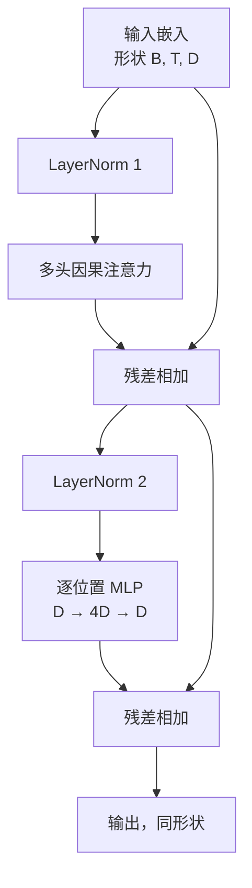
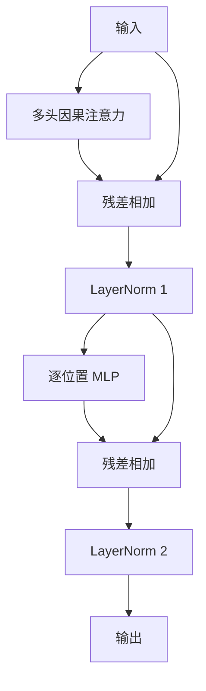

# 从零开始构建 Transformer Block

> 一个 Block 是每一个现代解码器大语言模型的基本单元。LayerNorm、多头注意力、残差连接、MLP、残差连接。pre-LN 变体无需预热即可稳定训练。post-LN 变体是原始论文所采用的方案。本课程将并排构建这两种变体，并展示在常见学习率下，哪一种能够撑过 12 层堆叠。

**类型：** 动手构建
**语言：** Python
**前置知识：** 第 19 阶段课程 30 至 33（分词器、嵌入、注意力数学、批处理数据加载器）
**时间：** 约 90 分钟

## 学习目标

- 用 PyTorch 从零构建 Transformer Block，包含四个核心组件：LayerNorm、多头因果注意力、残差连接、逐位置 MLP。
- 将 LayerNorm 以两种配置（pre-LN 和 post-LN）放置，并解释为何其中一种无需预热即可稳定训练。
- 在多头注意力中实现因果掩码，使 token `i` 无法看到 token `j > i`。
- 追踪 12 层堆叠上两种变体的梯度流，并通过直观观察得出结论。
- 将 Block 作为即插即用单元复用于下一课程中组装 1.24 亿参数的 GPT 模型。

## 问题所在

Transformer 就是一个 Block 的重复堆叠。如果 Block 写错一次，再重复十二遍，你交付的模型将在第一个 epoch 就发散，或者需要依赖预热这类 hack 才能继续训练。本课你将看到的两种故障模式并不罕见。它们出现在学习者第一次 naive 堆叠 Block 的时候。一种是注意力层能看到未来 token；另一种是 LayerNorm 放置的位置无法在深层压制残差信号。

一旦看穿问题，修复就很机械。Block 恰好有两条残差路径和两个归一化位置。选对位置后，剩下的堆叠只是账本工作。

## 核心概念

每一个仅解码器的 Transformer Block 都是一个函数：输入形状为 `(batch, sequence, embedding)` 的张量，输出相同形状的张量。内部由两个子层完成计算。



这是 pre-LN 变体。LayerNorm 位于残差分支内部，在子层之前。残差连接携带未归一化的信号向前传递。

post-LN 变体将 LayerNorm 移至残差相加之后。



形状完全一致。训练行为却不同。使用 post-LN 时，沿残差路径回传的梯度必须经过 LayerNorm。在深度为 12、学习率为 `3e-4` 的情况下，该梯度衰减到需要预热调度。pre-LN 使残差路径保持未归一化，因此梯度能够干净地传播到嵌入层。正因如此，pre-LN 是 GPT-2 及后续模型的默认配置。

### 因果多头注意力

注意力子层将输入投影三次，得到 query、key、value 张量。每个张量从 `(B, T, D)` 重排为 `(B, H, T, D/H)`，其中 `H` 是头数。缩放点积注意力按头计算 `softmax(Q K^T / sqrt(d_k))`，对右上角三角区域施加负无穷掩码，经 softmax 应用掩码后再与 `V` 相乘。最后将各头拼接回单个 `(B, T, D)` 张量，再进行一次投影。掩码是唯一让模型具备因果性的部分。忘记加掩码，你就是在训练一个作弊的模型。

### MLP

逐位置 MLP 对每个 token 独立应用同一个两层网络。隐藏层宽度是嵌入宽度的四倍，激活函数为 GELU，第二次线性层之后接一个 dropout。MLP 内部 token 之间互不交流。所有 token 间的混合都在注意力中完成。

### 残差连接做两件事

它们使梯度路径在深度方向呈可加性，从而在整个十二层中保持梯度范数在合理尺度。同时，它们让每个 Block 学习对当前表示的增量更新，而非全量替换。这两点正是 Block 能扩展的原因。

```figure
cc-transformer-block
```

## 动手实现

`code/main.py` 实现了：

- `class LayerNorm`：含可学习的缩放与偏置，支持 biased eps，逐 token 向量施加。
- `class MultiHeadAttention`：含 `num_heads`、`head_dim = d_model // num_heads`、融合式 QKV 投影、注册的因果掩码、注意力 dropout 与残差 dropout。
- `class FeedForward`：含两个线性层、GELU 激活、dropout。
- `class TransformerBlock`：含 `pre_ln` 标志位，用于切换两种变体。
- 一个演示：构建 6 层 pre-LN 堆栈与 6 层 post-LN 堆栈，使用相同输入，打印（a）输出形状、（b）反向传播一次后嵌入层的梯度范数。

运行：

```bash
python3 code/main.py
```

输出：两套堆栈的形状检查、梯度范数并排显示。在相同学习率下，pre-LN 堆栈的嵌入层梯度比 post-LN 堆栈高出一个数量级，这就是 pre-LN 无需预热即可训练的实证信号。

## 依赖

- `torch`：用于张量运算、自动微分和 `nn.Module` 基础设施。
- 不依赖 `transformers`，不加载预训练权重。Block 完全由基本原语实现。

## 工业界常见模式

有三种模式能把教材中的 Block 变成可 shipped 的代码。

**融合式 QKV 投影。** 三个独立线性层意味着三次 kernel launch 和三次矩阵乘法。用一个宽度为 `3 * d_model` 的线性层即可完成相同工作，只需一次 launch，然后在最后一个轴上分割输出。融合路径在每种加速器上都更快，并且与 GPT-2、LLaMA、Mistral 的参考实现一致。

**注册的因果掩码 buffer。** 掩码仅依赖于最大上下文长度。在构造时用 `register_buffer` 分配一次，每次前向传播时切片当前窗口，跳过逐次分配。忽略这一点会让掩码成为长上下文场景下的分配热点。

**Dropout 放在两处，不是三处。** Dropout 应位于注意力 softmax 之后（注意力 dropout）以及 MLP 第二次线性层之后（残差 dropout）。如果在残差本身上加 dropout，会破坏让梯度在深层流通的可加恒等结构。一些早期实现在这里犯错，并为此付出了训练不稳定的代价。

## 如何使用

- 本课的 Block 可直接无缝接入第 35 课的 GPT 组装流程，无需修改。
- pre-LN 变体是当前所有现代开源权重 LLM 所用的方案。post-LN 变体是 2017 年注意力原始论文所使用的方案。了解两者足以读懂你会遇到的任何解码器架构。
- 将 GELU 替换为 SiLU，你就得到了 LLaMA 家族的激活函数。将 LayerNorm 替换为 RMSNorm，你就得到了 LLaMA 家族的归一化方案。骨架相同。

## 练习

1. 为 Block 中的每个线性层添加 `bias=False` 标志。现代开源权重 LLM 在线性层上不携带偏置。测量在一个 12 层、768 维的模型中节省了多少参数。
2. 用手工实现的 RMSNorm 替换 `nn.LayerNorm`，并验证输出形状不变。
3. 添加一个标志位，返回第一个头的注意力权重为 `(B, T, T)` 张量。绘制右上角三角区域以确认 softmax 之后它为零。
4. 构建一个自检用例：向两个变体分别传入形状为 `(2, 16, 384)` 的张量、`H=6`，并在权重初始化相同且 dropout 设为零的条件下，断言前向输出不同（例如 `not torch.allclose`）。

## 关键术语

| 术语 | 人们怎么说 | 实际含义 |
|------|-----------|---------|
| Pre-LN | "Pre norm" | LayerNorm 位于残差分支内部、每个子层之前；残差携带未归一化的信号 |
| Post-LN | "Post norm" | LayerNorm 位于残差相加之后；2017 年论文所使用的方案，需要预热 |
| Causal mask | "Triangle mask" | 注意力 logit 的右上角三角区域被设为负无穷，使 token i 在 j > i 时无法读取 token j |
| Fused QKV | "Combined projection" | 一个宽度为 3D 的线性层，而非三个宽度为 D 的线性层；一次 kernel launch，一次矩阵乘法 |
| Residual stream | "Skip connection" | 沿每个 Block 自顶向下流动的未归一化张量；每个 Block 向其添加更新 |

## 延伸阅读

- 第 7 阶段课程 02（从零实现自注意力）：理解本 Block 底层的注意力数学。
- 第 7 阶段课程 05（完整 Transformer）：同一骨架的编码器-解码器版本。
- 第 10 阶段课程 04（预训练迷你 GPT）：本 Block 所接入的训练流程。
- 第 19 阶段课程 35（本课程主线）：将十二个此类 Block 堆叠为 GPT 模型。
