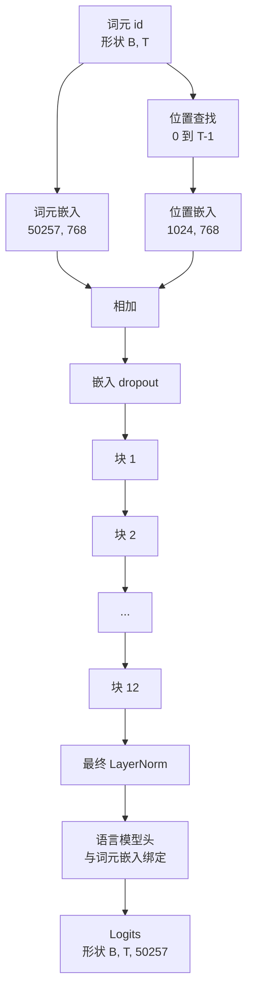

# GPT 模型组装

> 十二个块堆叠，一个词元嵌入，一个可学习的位置嵌入，一个最终 LayerNorm，以及一个绑定的语言模型头。这就是整个 1.24 亿参数 GPT 模型的全部构成。本课将这些组件组装成一个可工作的类，统计参数数量以确认模型匹配参考的 124M 形态，并使用多项式采样、温度和 top-k 生成文本。

**类型：** 构建
**语言：** Python
**前置要求：** Phase 19 课程 30 至 34
**时间：** 约 90 分钟

## 学习目标

- 将课程 34 中的 transformer 块组装成完整的 GPT 模型：词元嵌入、位置嵌入、N 个块、最终 LayerNorm、语言模型头。
- 复现 1.24 亿参数配置：词表 50257、上下文 1024、嵌入维度 768、十二个头、十二层。
- 将语言模型头的权重与词元嵌入绑定，并解释这在此规模下为何能节省约 3800 万参数。
- 从提示中生成文本，使用多项式采样、温度缩放和 top-k 截断，并用滑动窗口保持上下文长度。
- 针对 124M 目标测量参数数量和前向传播开销。

## 问题

一个 transformer 块单独什么都做不了。你需要将词元 id 转为向量，混入位置信息，通过堆栈运行，再投影回词表 logits。忘掉其中任何一步，模型要么无法前向传播，要么在位置信息上漂移，要么无法说话。

模型的形态同样重要。参考的 GPT-2 small 在恰好上述配置下为 1.24 亿参数。这些数字并非魔法。词表 50257 乘以嵌入 768 是词元表。位置 1024 乘以 768 是位置表。十二个块每个约 700 万参数共 8400 万。最终的头通过权重绑定复用词元表。将所有部分相加即得 1.24 亿。构建出的模型其参数数量与参考不匹配，说明某处接线有误。

## 概念



词元 id 变为词元向量。位置 id 变为位置向量。两者相加后送入堆栈。最终 LayerNorm 是块之外在所有现代变体中都保留的那一个组件。语言模型头复用词元嵌入矩阵，这就是权重绑定的含义。

### 权重绑定

词元嵌入的形状为 `(vocab, d_model)`。语言模型头需要将 `d_model` 投影回 `vocab`。二者互为转置。绑定二者意味着完全相同的参数张量被使用两次。在词表 50257、d_model 768 下，该矩阵为 3800 万参数。若未绑定，则需为此支付两份代价。绑定后只需支付一次，且由于嵌入和头同时更新，还能获得略为更清晰的梯度信号。

### 位置嵌入是可学习的，而非正弦的

GPT-2 采用可学习的位置嵌入。位置表是一个形状为 `(1024, 768)` 的参数张量。模型在每个前向传播中查找位置 0 到 T-1，并将查找结果加到词元嵌入上。这是所有位置方案中最简单的一种（RoPE、ALiBi、T5 相对偏置是其他方案），也是 124M 参考所用的方案。

### 生成：温度、top-k、多项式采样

生成是自回归的。每一步，模型在每个位置上返回整个词表上的 logits。你只取最后一个位置，除以温度，可选地将除 top k 个 logits 之外的所有值屏蔽为负无穷，做 softmax 得到概率，然后从结果分布中采样一个词元。


三个旋钮，三种不同行为。温度接近零时坍缩为贪心。温度为 1 时匹配模型的自然分布。top-k 为 1 时等同于贪心。top-k 为 40 时过滤长尾。组合很重要；下一节关于训练的课会使用生成作为定性评估信号。

```figure
cc-gpt-assembly
```

## 构建

`code/main.py` 实现了：

- `class GPTConfig` 数据类，含 124M 默认值：`vocab_size=50257`、`context_length=1024`、`d_model=768`、`num_heads=12`、`num_layers=12`、`mlp_expansion=4`、`dropout=0.1`、`use_bias=True`、`weight_tying=True`。
- `class GPTModel`，含词元嵌入、位置嵌入、嵌入 dropout、十二个 `TransformerBlock`、最终 LayerNorm，以及当标志位开启时与词元嵌入绑定的 `lm_head`。
- 一个 `count_parameters` 辅助函数，返回唯一参数数量（因此权重绑定时计数中也得到尊重）。
- 一个 `generate` 函数，执行温度、top-k、多项式采样和滑动窗口上下文。
- 一个演示脚本，构建模型，在参考 124M 旁边打印参数数量，并从固定提示中生成短序列以展示流水线端到端闭合。

运行它：

```bash
python3 code/main.py
```

输出：参数数量与参考 124M 并列显示，来自随机提示的生成词元 id，以及在绑定开启时确认 LM 头与词元嵌入共享存储。

为使演示快速，脚本还以极小配置（`d_model=64`、`num_layers=2`）端到端运行一次并内联打印生成的词元序列。124M 配置会构建，但仅运行参数计数和一次前向传播。

## 技术栈

- `torch` 用于张量数学、自动微分和模块基础设施。
- `code/main.py` 在本地重新实现了课程 34 中相同的块模式。

## 生产中的实践模式

三种模式决定了模型是能跑还是能上线。

**将残差投影初始化得小一些。** 注意力的输出投影和 MLP 的第二个线性层都直接馈入残差相加。将这些投影以与其他线性层相同的标准差初始化，会导致残差流随深度增长并将最终 LayerNorm 推向过热的区间。将这些两个投影的 std 按 `1 / sqrt(2 * num_layers)` 缩放；残差流在十二层中保持在合理范围内。

**缓存位置 id 张量，不要重复计算。** `torch.arange(T)` 每次前向传播都分配新内存。在 `__init__` 中为最大上下文分配一次，每次调用时切片前 T 个条目，跳过分配器往返。

**在参数层面绑定权重，而非仅仅拷贝。** 设置 `lm_head.weight = token_embedding.weight` 会共享张量；拷贝则不会。优化器需要更新一个参数，autograd 图需要一次累加。如果你拷贝，头会逐渐偏离嵌入，权重绑定对你毫无益处。

## 使用方式

- 本课中的模型类与下一课训练使用的形状相同。
- 将可学习的位置嵌入替换为 RoPE，在不触碰块和头的情况下即可获得 LLaMA 家族。
- 将 GELU 替换为 SiLU 并将 LayerNorm 替换为 RMSNorm，即可获得 LLaMA 家族其余的变更。
- 生成函数适用于任何 logits 来源，不仅限于此模型。你可以在课程 37 中从预训练的 GPT-2 文件获取 logits 并复用相同的生成循环。

## 练习

1. 将 LM 头与词元嵌入解绑并重新统计参数数量。验证差值为 50257 × 768 = 3800 万。
2. 将可学习的位置嵌入替换为在构造时计算的正弦表。确认模型仍可前向传播且参数数量减少 786,432。
3. 为生成函数添加一个 `greedy=True` 标志，跳过采样并选取 argmax。确认序列在多次运行间是确定性的。
4. 添加一个 `repetition_penalty` 旋钮，在 softmax 之前将提示或生成历史中任何词元的 logit 除以一个常数。在固定提示上展示大于 1 的值可降低输出中的重复次数。
5. 在 `top_k` 旁添加 `top_p`（核）采样。两行检查逻辑：保留词元的概率之和超过 `top_p`。

## 关键术语

| 术语 | 人们常说 | 实际含义 |
|------|-----------------|------------------------|
| 权重绑定 | "绑定的嵌入" | LM 头和词元嵌入共享同一个参数张量；节省 vocab × d_model 个参数并与 GPT-2 参考匹配 |
| 位置嵌入 | "可学习位置" | 一个形状为 (上下文长度, d_model) 的独立表，加到词元向量上；端到端学习 |
| 滑动窗口上下文 | "上下文上限" | 当提示加生成词元超出上下文长度时，丢弃最旧的词元使活动窗口适配 |
| top-k 采样 | "K 截断" | 保留值最高的 K 个 logits，将其余屏蔽为负无穷，对剩余部分做 softmax |
| 温度 | "采样温度" | softmax 前将 logits 除以 T；T 小于 1 使分布尖锐，T 等于 1 保持自然分布，T 大于 1 使分布平坦 |

## 延伸阅读

- Phase 19 课程 34，本节所用到的块。
- Phase 19 课程 36，用交叉熵损失驱动此模型的训练循环。
- Phase 19 课程 37，将预训练 GPT-2 权重加载进本架构。
- Phase 7 课程 07（GPT 因果语言建模），下一个词元预测的数学推导。
- Phase 10 课程 04（预训练迷你 GPT），在同一架构上的原始训练流程。
