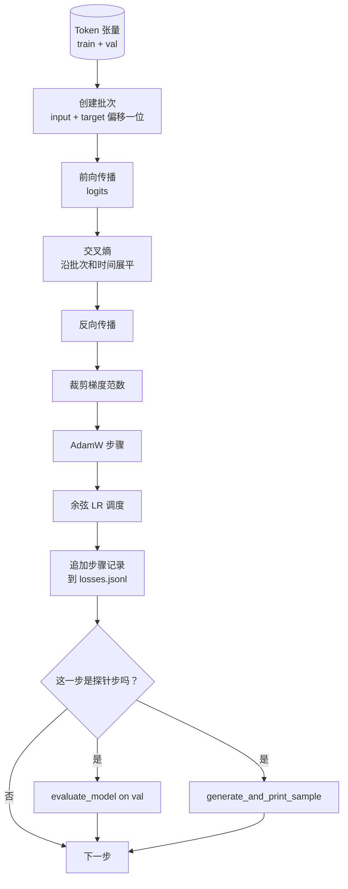

# 训练循环与评估

> 不测量的循环就是谎言。本教程将构建驱动 GPT 模型的训练循环：带权重衰减分离的 AdamW、预热加余弦学习率调度、`calc_loss_batch` 辅助函数、在保留数据上的 `evaluate_model` 评估、每 K 步的 `generate_and_print_sample` 定性探针，以及可后续绘图的 JSONL 损失日志。这个骨架模板将训练你未来构建的每一个解码器式 LLM。

**类型：** 构建
**语言：** Python
**前置知识：** 第 19 阶段课程 30 至 35
**时间：** 约 90 分钟

## 学习目标

- 构建一个训练循环，为下一个 token 预测计算具有正确输入和目标对齐的交叉熵损失。
- 配置 AdamW，使权重衰减仅应用于权重张量，而非 LayerNorm 或偏置张量。
- 实现具有线性预热和余弦衰减的学习率调度，并读取随时间变化的 LR。
- 在保留集上通过 `evaluate_model` 进行评估，使评估损失在不同运行间可比。
- 每 K 步通过 `generate_and_print_sample` 生成定性样本，在损失曲线发出警告前捕获发散。
- 将每步损失持久化到 JSONL，以便重新加载、绘图并将训练日志作为交付物提交。

## 问题

一个仅打印损失但无其他行为的训练脚本以三种方式失败。它无法告诉你损失是否在正确的方向下降（模型可能过拟合训练集而从未真正学习）。它无法告诉你发散是否正在开始（损失可能因一步骤而尖峰后恢复，也可能一步骤后崩溃）。它无法告诉你模型学到了什么（损失是一个标量；生成的样本是一段段落）。除非循环进行测量，否则这三种失败都会隐藏。

本教程的循环以三种方式测量。每一步计算训练批的损失。每 K 步计算保留批的损失。每 K 步从固定提示生成一个延续。训练日志保存在 JSONL 中，因此工件是循环的证明。

## 概念



两个不明显的部分是损失对齐和 AdamW 衰减分离。

### 损失对齐

模型在每个位置预测下一个 token。如果输入批次是 tokens `[t0, t1, t2, t3]`，目标批次必须是 `[t1, t2, t3, t4]`。交叉熵在展平的形状 `(batch * seq, vocab)` 和展平的目标 `(batch * seq,)` 上计算。忘记偏移，你将训练模型预测自身，这会收敛到零损失但什么都学不到。

### AdamW 衰减分离

权重衰减正则化权重张量，但不包括归一化尺度或偏置。将衰减放在 LayerNorm 尺度上会缓慢将尺度驱动到零并破坏归一化。将衰减放在偏置上在数学上是无害的，但浪费计算资源。标准分离是：矩阵形状的张量（线性权重、嵌入表）接受衰减，任何看起来像尺度或偏移的不接受。

### 预热加余弦调度

预热将学习率从零逐渐增加到目标值，经过几百步，使优化器状态有时间填充。余弦衰减将学习率逐渐降低回接近零，经过剩余步数，使最终阶段以小步长微调权重。这个组合是最常见的开源权重 LLM 训练中使用的调度，因为它移除了前一千步和后一千步中最脆弱的部分。

### 保留评估

`evaluate_model` 运行固定数量的验证批次，累积损失，除以批次数后返回。无梯度。无 dropout。给定相同种子和相同分区，数字在不同运行间可复现。将保留损失与训练损失并列报告，是检测过拟合的方法。

### 定性采样作为早期信号

一个训练损失良好下降但生成样本全是相同 token 的模型是损坏的。一个损失曲线看起来平坦但生成样本逐渐形成连贯词语的模型正在学习。定性探针比阅读完整曲线更快，并捕获标量遗漏的模式。

```figure
cap-training-loop
```

## 构建

`code/main.py` 实现：

- `make_batches(token_ids, batch_size, context_length)` 将长 token 张量切片为输入和目标对。
- `calc_loss_batch(model, inputs, targets)` 执行前向传播、展平并返回标量交叉熵。
- `evaluate_model(model, val_loader, max_batches)` 在无梯度模式下迭代固定数量的验证批次，返回平均损失。
- `generate_and_print_sample(model, prompt, max_new_tokens)` 在固定提示上运行课程 35 的生成函数并打印结果。
- `build_param_groups(model, weight_decay)` 生成双组 AdamW 参数列表。
- `cosine_with_warmup(step, warmup_steps, total_steps, max_lr, min_lr)` 返回给定步骤的 LR。
- `train(...)` 运行循环，持久化 `outputs/losses.jsonl`，并每 `eval_every` 步打印评估损失和样本。
- 一个在合成数据上训练小模型的演示，经过少量步骤，写入 JSONL 日志，并在探针点打印评估损失和样本。演示在 CPU 上运行远少于一分钟。

运行：

```bash
python3 code/main.py
```

输出：每步损失行，每个探针步的评估损失，每个探针步的生成样本，以及最终的 `outputs/losses.jsonl`，可用 `json.loads` 逐行加载。

## 技术栈

- `torch` 用于自动微分、优化器和模块。
- `main.py` 本地重新实现了课程 35 的 `GPTModel` 和支持模块。

## 生产环境中的模式

三种模式将教科书循环变为可以整夜运行的东西。

**梯度范数裁剪是不容协商的。** 一个糟糕的批次（异常数据、LR 尖峰、数值边界情况）产生巨大梯度，会抹去数小时的训练。`torch.nn.utils.clip_grad_norm_(params, max_norm=1.0)` 在 `backward` 之后和 `step` 之前调用，将优化器保持在安全范围内。裁剪值是自由参数；1.0 是大多数配置下存活下来的默认值。

**可恢复的 JSONL 日志，而非 pickle 状态。** 每步损失记录为 `{"step": int, "train_loss": float, "lr": float}` 的 JSONL 行是耐用的：任何崩溃都留下可读工件，你可以 grep，可以用三十行 Python 绘图，可以通过读取最后一步来恢复训练。pickle 状态将你绑定到产生文件的确切模块布局，这在重构时脆弱。

**从固定切片抽取的评估批次。** 验证 token 在脚本启动时切片为批次，而非动态抽取。可复现性取决于评估批次在每次运行间相同；否则，比较两次运行的评估损失测量的是批次打乱，与模型相当。

## 使用

- 本教程中的循环与在真实数据上训练 124M 模型的骨架相同。将合成 token 张量替换为 `datasets` 风格的加载器，循环无需更改即可运行。
- JSONL 日志是将训练运行转化为证据的交付物。下一课使用其中一个来比较新训练的 Checkpoint 与预训练的 Checkpoint。
- 定性样本探针是标量损失无法替代的捕获器。

## 练习

1. 添加 `weight_decay_groups()` 单元测试，确认尺度和偏置参数落入无衰减组，线性和嵌入权重落入衰减组。
2. 用来自小文本文件的字节替换合成随机 token，使演示训练在可辨识的内容上。验证生成样本使用文件中存在的字符。
3. 为余弦调度添加 `max_lr` 10% 的 `min_lr` 下限并重新绘图。
4. 除 JSONL 日志外，每 `eval_every` 步保存一个 Checkpoint。添加 `resume_from` 标志以重新加载模型状态和优化器状态。
5. 在损失旁边记录每步吞吐量（每秒 token 数），并确认其保持在稳定范围内。

## 关键术语

| 术语 | 人们怎么说 | 实际含义 |
|------|-----------|---------|
| 损失对齐 | "偏移一位" | 输入 token 在位置 0..T-1，目标 token 在位置 1..T；交叉熵在展平形状上计算 |
| 衰减分离 | "两组" | AdamW 接收带权重衰减的矩阵形状张量，以及无衰减的尺度或偏置张量 |
| 预热 | "爬坡" | 学习率从零点逐步上升到目标，经过固定步数，使优化器状态能够填充 |
| 评估批次 | "保留批次" | 验证 token 张量的固定切片，在脚本启动时切片一次，每个探针点使用相同 |
| 定性探针 | "样本打印" | 从固定提示生成的短文本，每 K 步打印，以捕获损失单独隐藏的模式 |

## 延伸阅读

- 第 19 阶段课程 35 了解循环驱动的模型。
- 第 19 阶段课程 37 了解将预训练权重加载到相同模型中。
- 第 10 阶段课程 04（预训练 mini GPT）了解在真实数据上的过程。
- 第 10 阶段课程 10（评估）了解交叉熵损失之外的更广泛评估面。
