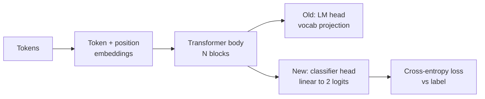
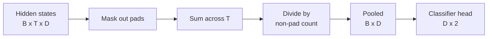
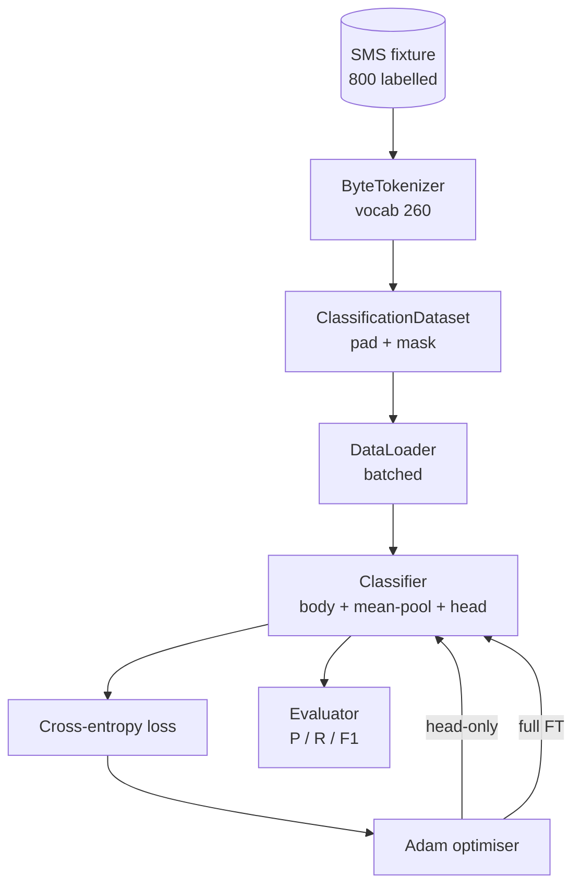

# Capstone 第38课：通过替换输出头进行分类器微调

> Track B 的第一个毕业设计项目。预训练语言模型是由自注意力块堆叠而成的结构，末端连接一个词元预测头。当你需要垃圾邮件与正常邮件的分类时，原来的预测头不合适，但模型主体基本正确。本课会将原来的头拆下，在池化表示上接一个二分类线性层，并以两种方式训练分类器：仅训练最后一层，以及全量微调。评估指标为保持测试集上的精确率、召回率和F1值。你将学到每种策略的优劣与代价。

**类型：** 构建项目
**语言：** Python（torch, numpy）
**先修知识：** Phase 19 课程30-37（NLP LLM 方向：分词器、词嵌入表、注意力块、Transformer 主体、预训练循环、检查点保存、文本生成、困惑度）
**耗时：** 约90分钟

## 学习目标

- 在不重新初始化模型主体的情况下，用分类头替换语言模型头。
- 实现两种训练模式：冻结主体（仅训练头部）和全量微调，共享同一个训练循环。
- 构建分词器感知型数据管道，支持填充、掩码填充并池化注意力输出。
- 从原始 logits 计算精确率、召回率、F1 值和混淆矩阵。
- 权衡参数量、训练时间与提升空间之间的关系。

## 问题背景

你已经在通用语料库上预训练了一个小型 Transformer。其输出头将最后一个隐藏状态映射到包含1000个词元的词表。现在你拥有800条标注为垃圾邮件或正常邮件的 SMS 消息，想要构建一个二分类器。存在三种方案。

错误的方案是直接从800个样本训练一个全新的分类器。预训练模型的主干已经编码了有用的结构信息：词的身份、位置、简单的共现关系。丢弃这些知识会浪费已经投入的算力。

正确的两种方案是：冻结主体进行头替换，以及让主体可训练进行头替换。仅训练头部的速度快，显存开销极小，在数据量较少时也不容易过拟合。全量微调速度较慢，在少量数据上可能过拟合，但当下游领域与预训练语料存在偏差时能达到更高的准确率。

本课将实现这两种方案，以便你在相同的实验条件下进行比较。

## 核心概念



模型是一个函数 `f_theta(tokens) -> hidden_states`。头是一个函数 `g_phi(hidden) -> logits`。替换头意味着保持 `theta` 不变而替换 `g_phi`。主体部分的参数是昂贵的部分，而头只是一个线性层。

需要关注的可训练参数集合有两个：

- `theta`（主体）：每个注意力块包含数万权重。
- `phi`（头）：`hidden_dim * num_classes` 个权重加上一个偏置项。

在仅训练头部的模式下，你只对 `phi` 计算梯度并对 `theta` 置零。PyTorch 允许你通过在主体参数上设置 `requires_grad=False` 来实现这一点。优化器将只看到头部参数，而主体保持冻结。

在全量微调模式下，你允许梯度反向传播整个堆栈。主体权重会漂移以适应分类目标。风险在于小数据上的灾难性遗忘：主体的预训练知识可能因过拟合噪声而被淹没。

## 池化问题

分类器需要一个序列对应一个向量，而非每个词元一个向量。三种常见的选择：

- **平均池化**：按序列维度对隐藏状态求平均，由注意力掩码加权。
- **CLS 池化**：在序列开头添加特殊 token，仅使用其输出。这是 BERT 的做法。
- **末位 token 池化**：使用最后一个非 padding token。这是 GPT 分类器的做法。

本课使用带显式注意力掩码权重的平均池化。它最简单，在不同序列长度下都能提供稳定的信号，且不需要预训练一个 CLS token。



## 数据集

八百条 SMS 消息，400条垃圾邮件和400条正常邮件，在 `code/main.py` 中通过确定性方式生成。生成器使用固定随机种子，选择模板并填入槽位，生成5到25个词元长度的消息。真实数据集存在噪声，而本示例没有。示例的意义在于可复现性。

数据按80/20划分：640条训练集，160条测试集。划分是分层采样，确保测试集保持50/50的平衡。具有已知平衡比例的保持集使得精确率和召回率能够被真实地解读。

## 评估指标

以类别1（垃圾邮件）为正类的二分类。计数包括：

- `TP`：预测为垃圾邮件，实际是垃圾邮件。
- `FP`：预测为垃圾邮件，实际是正常邮件。
- `FN`：预测为正常邮件，实际是垃圾邮件。
- `TN`：预测为正常邮件，实际是正常邮件。

三个核心指标：

- `precision = TP / (TP + FP)`。被标记为垃圾邮件的消息中，实际是垃圾邮件的比例是多少？
- `recall = TP / (TP + FN)`。实际垃圾邮件中，被模型标记出来的比例是多少？
- `F1 = 2 * P * R / (P + R)`。两者的调和平均。

混淆矩阵将四个计数以 2x2 网格形式输出。演示代码会同时将两种训练模式的混淆矩阵打印到标准输出。

```figure
cap-classifier-head-swap
```

## 架构设计



主体是一个刻意设计的小型 Transformer：词表260，隐藏维度64，4个头，2个块，最大序列长度32。它足够小，可以在 CPU 上于90秒内将两种模式都训练至收敛。本课并未进行预训练；相反，`pretrain_quick` 辅助函数在相同示例文本上执行5个 epoch 的语言模型训练，为主干提供一个非平凡的就地起点。这保证了课程自包含。

## 你需要实现的内容

实现部分包括一个 `main.py` 和一个测试模块（`code/tests/test_main.py`）。

1. `ByteTokenizer`：将字节映射为 ID，保留一个 pad ID。
2. `Block`：具有多头注意力和前馈层的 Transformer 块，采用预归一化。
3. `LMBody`：词元与位置嵌入加上块堆叠，返回隐藏状态。
4. `MeanPool`：沿序列维度的掩码加权平均。
5. `Classifier`：主体、池化层、线性头。主体实例在两种模式下共享。
6. `freeze_body` 和 `unfreeze_body`：切换主体参数的 `requires_grad`。
7. `train_classifier`：共享训练循环。接受已配置优化器的模型，适配当前可训练的参数组。
8. `evaluate`：运行测试集并返回 `Metrics(precision, recall, f1, confusion)`。
9. `run_demo`：短暂预训练主体，然后分别训练并评估头部训练和全量微调，打印两份报告后以零退出。

## 比较的意义

仅训练头部的模式通常训练更快，欠拟合更温和。在此示例上，仅训练头部20个 epoch 后，你通常会看到精确率接近0.9，召回率接近0.85。全量微调耗时约为前三倍，且depending on随机种子，各项指标波动在几个百分点以内。

本课不会给出胜负结论。它教你阅读数字和成本。在800个样本和极小主体上，仅训练头部是正确的选择。在80,000个样本和更大的主体上，全量微调开始显现优势。本课交付的契约是 API：同一个 `train_classifier` 函数处理两种模式，切换只需一次调用。

## 拓展目标

- 添加第三种模式：仅解冻最后一个块。这通常被称为部分微调。它的成本低于全量微调，但学到的内容多于仅训练头部。
- 添加学习率调度器。头部使用余弦调度，主体使用较小的恒定学习率，这是常见的生产配置。
- 将平均池化替换为可学习的注意力池化：一个带单个可学习查询的小注意力层。这在较长序列上通常优于平均池化。

实现部分提供了接口。测试用例锁定了契约。数值表现交由你来提升。
