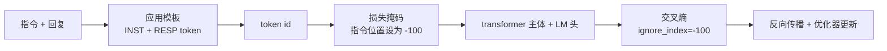
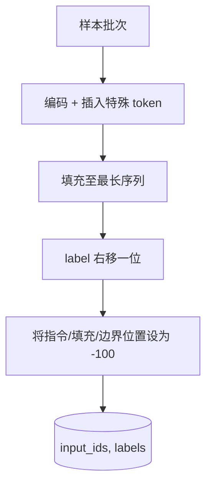
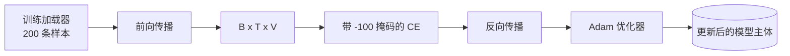

# Capstone 课程 39：通过监督微调进行指令调优

> 预训练的基座模型可以扩展序列，但无法遵循指令。监督微调是最小的改动，可以修复这一问题：为模型提供成对的指令与期望回复示例，并训练模型主体预测回复 token。关键在于，你只想让损失只计算回复部分，而不包括指令。本课程使用自定义的 collate 函数构建一个 Alpaca 风格的 SFT 训练循环，该函数通过 `ignore_index=-100` 屏蔽指令 token，在 200 条指令-回复对上训练，并在保留测试集上以精确匹配进行评估。

**类型：** 构建
**语言：** Python（torch、numpy）
**前置知识：** 阶段 19 课程 30-37（NLP LLM 路线：分词器、嵌入表、注意力块、transformer 主体、预训练循环、检查点保存、生成、困惑度）
**预计时长：** 约 90 分钟

## 学习目标

- 将成对的指令-回复数据格式化为带有显式边界 token 的单因果序列。
- 构建一个 collate 函数，屏蔽指令 token，使得交叉熵损失仅计算回复 token。
- 在 SFT 目标下训练一个小型 transformer 主体，并观察评估指标的变化。
- 实现尊重响应起始边界的贪心解码和温度采样生成。
- 对生成的补全文本计算保留测试集的精确匹配。

## 问题所在

一个仅基于下一个 token 预测训练的基座模型，并不知道什么是"指令"。向它输入字符串 `"What is the capital of France?"`，它会继续这个问题或另起一句。模型具备语言能力，但不具备格式契约。

SFT 的契约是一个字符串模板。每条训练样本都变为包含三个区域的单一序列：

```text
<INST> What is the capital of France? <RESP> The capital of France is Paris.
```

边界 token 是在训练时预留的特殊 token。模型学会：`<RESP>` 之后的所有内容都是回复，而回复正是被评分的部分。基座模型的下一个 token 预测目标依然适用；只不过它现在是在一个每条样本都具备这种格式的语料上训练。

但有一个关键点。如果你将整个序列输入标准的交叉熵损失，你实际上是在训练模型同时预测指令 token。指令是已知的，你希望对这些位置实现零梯度。修复方案就是掩码。

## 核心概念



`ignore_index` 是 `torch.nn.functional.cross_entropy` 的一个特性。任何目标位置等于 `ignore_index` 的项对损失和梯度均无贡献。PyTorch 中的惯例是 `-100`。collate 函数为每条样本构建两个张量：`input_ids`（完整序列）和 `labels`（`input_ids` 的副本，其中指令位置被覆盖为 `-100`）。

模型在前向传播中可以看到完整序列；注意力机制可以关注指令部分。但损失只计算回复 token。这正是我们需要的：以指令为条件，预测回复。

## 数据

两百条指令-回复对由 `main.py` 中确定性生成。涵盖六类任务：

- 事实性单轮问答（某地的首都是什么）
- 算术运算
- 列表抽取
- 一句话摘要
- 代码（打印、排序）
- 定义解释

每个任务都有模板化的指令和确定性的回复。这故意做得很简单。精确匹配比较脆弱，本课程使用了一个正确答案是唯一固定字符串的测试集。真实 SFT 数据集需要模糊匹配指标，但原理相同。

训练集 160 条，测试集 40 条。测试集覆盖全部六类任务，以便报告每类别的精确匹配。

## 分词与填充

分词器为字节级，含三个预留特殊 token：

- `INST_ID = 256`：标记指令区域的开始。
- `RESP_ID = 257`：标记指令与回复之间的边界。
- `PAD_ID = 258`：用于变长批次的填充。

序列格式为 `[INST] inst_bytes [RESP] resp_bytes [PAD]*`。collate 函数：

1. 对每条样本进行分词。
2. 将批次内所有样本填充至批次中最长序列的长度。
3. 构建 `labels` = `input_ids` 右移一位（因果 LM 目标），并：
   - 将指令区域替换为 `-100`。
   - 将填充区域替换为 `-100`。
   - 将 `RESP_ID` 边界位置本身替换为 `-100`（不训练模型预测边界 token；模型预测的是边界之后的内容）。



右移是标准的因果技巧：`input_ids` 的第 `i` 个位置预测第 `i+1` 个位置，因此 `labels[i] = input_ids[i+1]`（丢弃最后一个位置的输入和第一个位置的标签）。掩码在右移之后应用，以确保落在正确的位置上。

## 训练



训练循环是标准的 PyTorch SFT 循环。Adam 优化器，学习率约 3e-4 至 1e-3，在该测试集上训练十到二十个 epoch，不使用学习率调度器。模型足够小（隐藏维度 96，2 层，最大长度 64），可以在 CPU 上两分钟内训练至收敛。

每隔五个 epoch，循环在保留测试集上运行一次评估，并打印精确匹配。观察精确匹配从第一个 epoch 的 0.0 提升到第十五 epoch 左右的 0.85，是本课程的核心收益：你可以看到模型同时学会了格式和答案。

## 生成

在评估时，模型接收指令前缀 `[INST] inst_bytes [RESP]`，并持续生成 token，直到满足以下条件之一：

- 序列达到 `max_len`，或者
- 模型触发停止启发规则：连续两个句号字节（`.`、`!`、`?`）。

本课提供了贪心解码以及可选的温度采样。精确匹配使用贪心解码，因为温度采样会使指标变得随机。真实系统通常先采样再模糊评判；该流程是第 41 课的内容。

## 精确匹配评估

精确匹配是最严格的文本评估指标。预测的回复字符串经过归一化（小写、去除首尾空白、合并多余空格）后，与同样归一化的参考回复进行比较。每条样本的指标为 1 或 0，聚合结果为平均值。

真实 SFT 流水线会补充 token 级 F1（第 41 课）和一个评判模型。精确匹配仍然很有用，因为它明确无歧义；如果精确匹配为 0.7，则意味着测试集中恰好 70% 的指令产生了逐字符完全匹配的参考答案。

```figure
cc-sft-loss-mask
```

## 你将构建的内容

实现包含一个 `main.py` 及对应的测试文件。

1. `InstructionTokenizer`：带有预留特殊 token 的字节级编码器，支持编码指令前缀或完整配对。
2. `make_dataset`：使用固定随机种子生成跨越六类任务的 200 条配对样本。
3. `SFTDataset`：每条样本返回 `(input_ids, labels)`，已预先完成掩码处理。
4. `sft_collate`：动态填充，构建批次张量，在指令和填充位置设为 `-100`。
5. `TinyGPT`：transformer 主体加上共享或非共享的 LM 头。
6. `train_sft`：SFT 训练循环，含每个 epoch 的评估钩子。
7. `generate`：从给定前缀开始的因果解码，支持贪心或采样，含停止启发规则。
8. `exact_match`：归一化字符串比较，返回值在 `[0, 1]` 范围内。
9. `run_demo`：构建数据，训练二十个 epoch，进行评估，打印每类别细分结果，成功时以零退出。

## 为什么掩码很重要

如果没有掩码，损失会将指令 token 视为预测目标。模型学会的是预测指令。这会从两个方面产生更差的模型。首先，模型容量被浪费在重建用户始终提供的输入上。其次，由于大多数批次中指令 token 的数量多于回复 token，回复损失在梯度求和中占比更小；优化器对你真正关心的部分的实际学习率低于你的预期。掩码不是锦上添花，而是目标本身。

## 扩展目标

- 添加学习率预热后接余弦衰减。SFT 对学习率比预训练更敏感。
- 添加逐 token 损失日志记录，并绘制训练过程中的损失曲线。注意早期 epoch 主要由模板 token（`<RESP>`、常见前缀）主导，后期 epoch 由实际答案 token 主导。
- 将评估扩展至 BLEU-1 或 chrF。对于产生同义但措辞不同的回复的模型，精确匹配会低估其性能。
- 添加支持多轮对话格式的聊天模板，并在包含追问的测试集上进行训练。

该实现为你提供格式契约、掩码机制和训练循环。从基座模型到指令跟随者的目标改变，只差一个 collate 函数。
