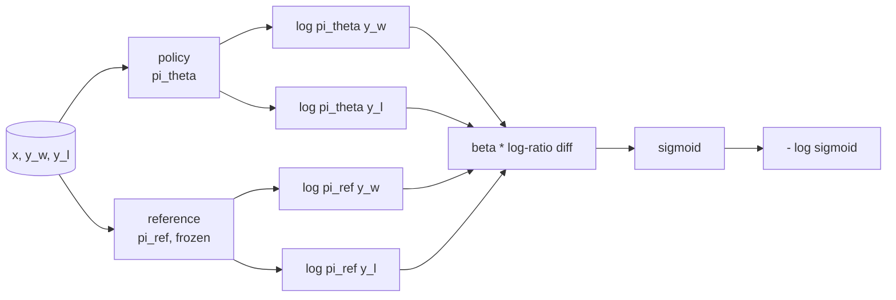
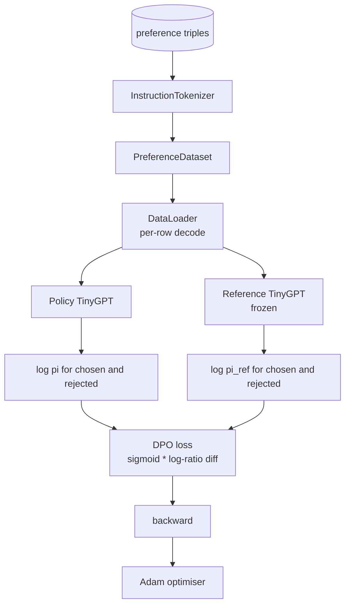

# 顶点项目课程 40：从零实现直接偏好优化（DPO）

> 奖励模型和 PPO 是经典的 RLHF 架构。DPO 将该架构压缩为单个监督损失，直接基于偏好对拟合策略。本课程从奖励差恒等式推导 DPO 损失，构建可用的参考模型与策略模型，计算逐 token 的对数概率，并在包含所选和拒绝补全的偏好数据集上训练一个微型 transformer。测试用例校验损失数学和梯度方向，确保实现与论文一致。

**类型：** 构建
**语言：** Python (torch, numpy)
**前置条件：** 第 19 阶段课程 30-37（NLP LLM 系列：分词器、嵌入表、注意力块、transformer 主体、预训练循环、检查点、生成、困惑度）
**时间：** 约 90 分钟

## 学习目标

- 将 DPO 损失推导为缩放对数比差异上的 sigmoid 函数，并建立其与隐式奖励的联系。
- 构建参考模型 + 策略模型对，其中参考模型冻结，策略模型可训练。
- 计算两个模型下的序列级对数概率，并屏蔽 prompt tokens。
- 在 `(prompt, chosen, rejected)` 三元组上训练策略，观察到所选补全的对数概率相对拒绝补全上升。
- 通过测试用例校验损失数学、梯度符号和参考不变性。

## 问题描述

你有一个 SFT 模型。它遵循指令，但输出不稳定；有些补全很清晰，有些则冗长或错误。你还有一小批偏好对数据集：对于相同的 prompt，人工标记了一个补全为"所选（chosen）"，另一个为"拒绝（rejected）"。

经典 RLHF 方案是一个两阶段流水线：在偏好数据上训练奖励模型，然后用 PPO 针对奖励优化策略。这种方法有效但成本高昂：PPO 期间需要在内存中保存两个模型，需要 KL 控制让策略贴近参考模型，当奖励模型脆弱时会出现奖励黑客行为。

DPO 用单个监督损失替代了两个阶段。奖励模型从未显式存在。策略直接在偏好对上训练，并带有显式向 SFT 参考模型的 KL 惩罚。在 Bradley-Terry 偏好模型下，它达到相同的最优解，但代码量大幅减少。

## 概念推导

从 Bradley-Terry 模型出发。给定 prompt `x` 和两个补全 `y_w`（所选）和 `y_l`（拒绝），人类偏好 `y_w` 的概率为

```text
P(y_w > y_l | x) = sigmoid( r(x, y_w) - r(x, y_l) )
```

其中 `r` 是某个隐式奖励函数。RLHF 先从偏好数据拟合 `r`，再用 KL 锚点训练策略 `pi` 以最大化 `r`：

```text
max_pi   E_{x, y~pi} [ r(x, y) ] - beta * KL(pi || pi_ref)
```

DPO 推导指出，在该目标下的最优策略 `pi*` 可以写成 `r` 的闭式形式：

```text
pi*(y | x) = (1/Z(x)) * pi_ref(y | x) * exp( r(x, y) / beta )
```

反解 `r`：

```text
r(x, y) = beta * ( log pi*(y | x) - log pi_ref(y | x) ) + beta * log Z(x)
```

`log Z(x)` 项对 `y_w` 和 `y_l` 是相同的（它只依赖于 `x`，不依赖于 `y`），因此在计算偏好差时会被消去：

```text
r(x, y_w) - r(x, y_l) = beta * ( log pi_theta(y_w|x) - log pi_ref(y_w|x)
                                - log pi_theta(y_l|x) + log pi_ref(y_l|x) )
```

代入 Bradley-Terry sigmoid，并对偏好对取负对数似然：

```text
L_DPO(theta) = - E_{(x, y_w, y_l)} [
  log sigmoid( beta * ( log pi_theta(y_w|x) - log pi_ref(y_w|x)
                       - log pi_theta(y_l|x) + log pi_ref(y_l|x) ) )
]
```

这就是损失函数。它是一个 sigmoid，作用于每个样本的一个标量，由四个对数概率计算得出。没有单独的奖励模型，没有 PPO，损失中也没有显式 KL 项——KL 约束已嵌入闭式推导中。



## 梯度符号

在任何训练运行之前，一个有用的校验方法。对 `log pi_theta(y_w | x)` 求梯度：

```text
d L_DPO / d log pi_theta(y_w | x) = - beta * (1 - sigmoid(z))
```

其中 `z` 是 sigmoid 的入参。这对所有 `z` 都是负值，意味着：增大策略对所选补全的对数概率会降低损失。对称地，对 `log pi_theta(y_l | x)` 的梯度是正值：增大对拒绝补全的对数概率会增加损失。训练推动所选上升、拒绝下降。参考模型保持冻结，不会移动。

## 数据

本课程附带十二个偏好三元组。每个为 `(prompt, chosen, rejected)`。所选补全长而精确，拒绝补全则冗长、偏离主题或错误。这些对与课程 39 的同一任务族（首都、算术、列表）保持一致，以便从 SFT 基础出发的策略有一个合理的起点。

数据集故意设计得很小。DPO 在生产环境中使用数千至上万对数据；这里的关键是验证损失数学和训练循环能在小规模数据集上端到端运行，并且所选与拒绝的对数概率差距会明显扩大。

## 参考不变性

DPO 实现必须谨慎处理参考模型。参考模型是固定位置的 SFT 模型。必须满足三个性质：

- 参考参数从不接收梯度。
- 参考对数概率在多个 epoch 间保持不变。
- 策略从与参考相同的权重开始。（最优 `theta` 是参考加上学习到的更新；将策略初始化为参考的副本是定义良好的起点。）

实现通过以下方式强制这些性质：

- 在前向传播时将参考包裹在 `torch.no_grad()` 中。
- 对所有参考参数设置 `requires_grad=False`。
- 在参考模型构建后，通过 `policy.load_state_dict(reference.state_dict())` 构建策略。

```figure
cap-dpo-preference
```

## 架构



模型与课程 39 中使用的 TinyGPT 相同（decoder-only，因果，byte tokeniser）。参考和策略共享相同的架构；在训练过程中，策略权重会偏离参考，而参考保持不变。

## 你需要构建的内容

实现包括一个 `main.py` 和测试文件。

1. `InstructionTokenizer`：带有 `INST` 和 `RESP` 特殊 token 的 byte tokeniser。与课程 39 形状一致。
2. `TinyGPT`：decoder-only transformer。与课程 39 形状一致，使本课即使跳过 39 也能自包含。
3. `make_preferences`：返回十二个 `(prompt, chosen, rejected)` 三元组。
4. `sequence_log_prob`：给定模型、prompt 前缀和补全，返回补全部分的所有 next-token 对数概率之和（不含 prompt 位置贡献）。
5. `dpo_loss`：接收四个对数概率和 `beta`，返回每个样本的损失张量和用于日志记录的隐式奖励差。
6. `train_dpo`：每个 epoch 的训练循环，计算策略和参考下的所选与拒绝对数概率，应用损失，并执行 Adam 步。
7. `evaluate_margins`：返回策略在任意时刻的平均所选-拒绝对数概率差距。
8. `run_demo`：从小型 warm-up 预训练构建参考和策略，复制权重，训练三十步，打印每步损失和差距，并在成功时零退出。

## 为什么 DPO 有效

在 Bradley-Terry 偏好模型下，DPO 与 RLHF 在数学上等价（就奖励的参数化而言）。隐式奖励 `r(x, y) = beta * (log pi(y|x) - log pi_ref(y|x))` 可以从偏好中识别，最多相差一个仅依赖 `x` 的函数，而该函数在差值中会被消去。闭式策略让你跳过显式的奖励模型。KL 约束通过结构强制：`pi` 偏离 `pi_ref` 会使对数比增大，sigmoid 趋于饱和，当策略移动过大时梯度会被抑制。参考模型就是你的安全网。

## 拓展目标

- 为对数概率和添加长度归一化：除以补全长度。长度偏差是已知的 DPO 失败模式，模型倾向于选择较短补全，因为它们的对数概率绝对值更大。
- 添加 IPO 损失变体：将 sigmoid + log 替换为 `(z - 1)^2`。比较其在 fixture 上的收敛情况。
- 添加标签平滑参数，在硬选的所选-拒绝标签与均匀 0.5 之间插值。
- 用更小、更便宜的模型替换参考（知识蒸馏风格）。

实现为你提供损失函数、参考不变性和训练循环。数学是课程的核心，代码让数学具体化。
