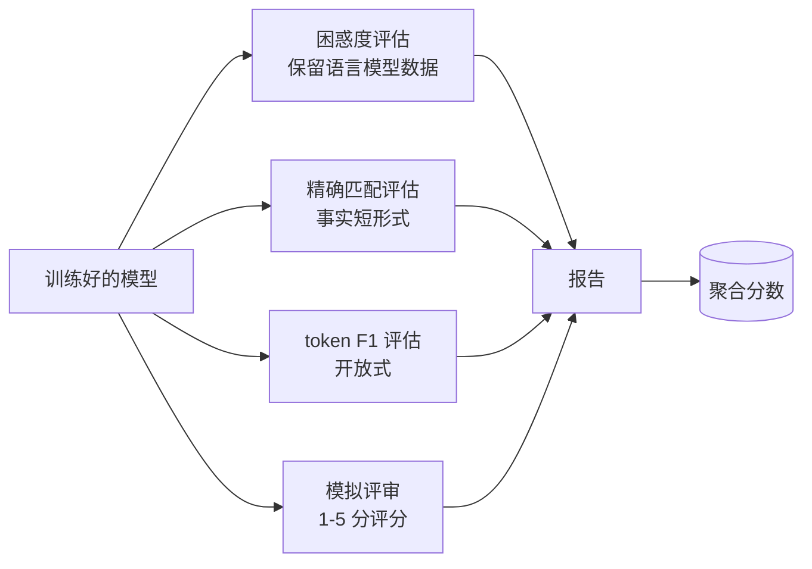
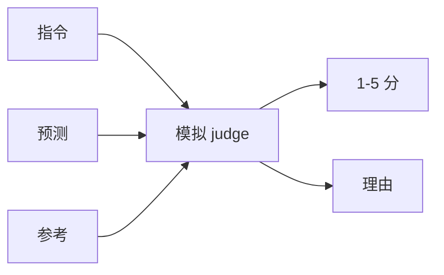
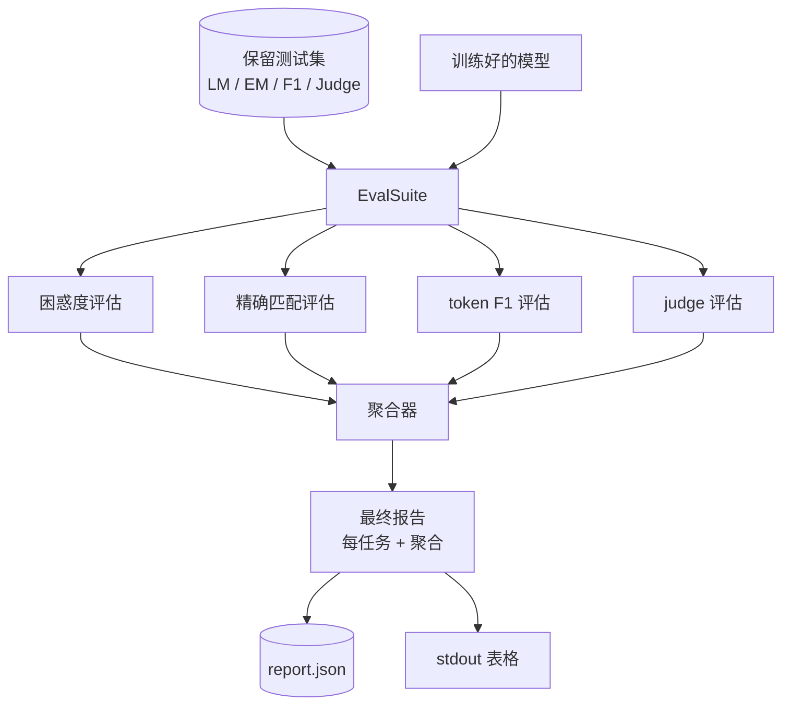

# Capstone 课程 41：完整评估流水线

> 训练是你可以通过损失曲线监控的部分。评估是你必须设计的部分。本课程构建一个统一的评估流水线，对任意训练好的语言模型运行四种异构评估，将结果聚合为每任务的报告，并部署本地模拟 LLM-as-Judge，使整个流程无需网络即可运行。这四种评估覆盖了每个上线模型所需的维度：语言建模（困惑度）、短形式正确性（精确匹配）、开放形式相似度（token F1）以及定性评分（judge）。

**类型：** 构建
**语言：** Python (torch, numpy)
**前置知识：** Phase 19 课程 30-37（NLP LLM 方向：分词器、嵌入表、注意力块、Transformer 主体、预训练循环、检查点保存、生成、困惑度）
**时间：** 约 90 分钟

## 学习目标

- 在小型 Transformer 上通过掩码 token 计算保留集困惑度。
- 在短形式事实提示上运行精确匹配评估。
- 使用归一化计算预测字符串与参考字符串之间的 token 级 F1。
- 构建本地模拟 LLM-as-Judge，对模型输出进行 1-5 分评分。
- 将四种评估聚合为单一加权报告，包含每任务细分。

## 问题

单个指标无法描述一个语言模型。困惑度说明模型拟合语言分布的能力，但完全不涉及是否回答问题。精确匹配说明模型是否生成黄金字符串，但会惩罚正确的改述。Token F1 宽容改述，但会被错误内容的词汇重叠所欺骗。LLM-as-Judge 捕捉定性维度，但代价高昂且具有随机性。

你实际需要的流水线应包含全部四种评估。每种评估覆盖其他评估所遗漏的维度。每种评估在不同的保留数据集子集上运行，数据形状针对该指标优化。最终报告并排显示每任务的数值和聚合值，让审阅者一目了然地看出模型正在做出哪些权衡。

本课程在一个文件中从头到尾构建该流水线。

## 概念



每种评估都是从 `(model, dataset) -> EvalResult` 的函数。结果携带指标值、用于检查的每示例详情以及聚合名称。流水线通过配置组合它们，该配置指定运行哪些评估以及如何加权。

## 正确计算困惑度

困惑度是 `exp(每个 token 的平均负对数似然)`。实现中有两个陷阱：

- 平均值必须基于实际 token 位置，而不是 batch * sequence。填充 token 必须从分母中排除，否则困惑度会显得比实际情况更好。
- 模型预测下一个 token，所以位置 `i` 的 logit 预测位置 `i+1` 的 token。这里的 off-by-one 错误是静默的：损失仍然训练，但指标变得无意义。

评估计算每个 batch 在非填充位置上的 `-log p(token)` 总和以及每个 batch 的 token 计数，然后在最后进行除法。这比按 batch 平均困惑度（会降低短序列的权重）在数值上更安全，并且符合教科书定义。

## 带归一化的精确匹配

harness 在比较前对预测和参考都进行归一化：

- 小写。
- 去除首尾空白。
- 将内部连续空白压缩为单个空格。
- 如果两侧仅在标点符号上有差异，则删除尾部标点符号（`.`、`!`、`?`）。

归一化使精确匹配在实际中可用。说 `"Paris"` 的模型是对的；说 `"Paris."` 的也是对的；说 `"  paris  "` 的也是对的。该指标仍要求归一化后答案为相同字符串。

## 正确的 Token F1

Token F1 是基于 token 集合计算的精确率和召回率的调和平均数。步骤：

1. 归一化预测和参考（与精确匹配相同的规则）。
2. 将每个拆分为 token 列表（空格分词）。
3. 计算多重集交集计数。
4. 精确率 = `intersection_count / len(pred_tokens)`。召回率 = `intersection_count / len(ref_tokens)`。F1 = 调和平均数。

如果预测和参考都为空，F1 为 1（空匹配）。如果只有一个为空，F1 为 0。此模式与 SQuAD 评估参考一致，并在改述 across 产生稳定的数值。

## 本地模拟 LLM-as-Judge

真实的 judge 是 API 背后的前沿模型。对于本课程，judge 必须离线运行。模拟 judge 是一个确定性评分器，接收指令、模型的预测和参考，返回 `{1, 2, 3, 4, 5}` 中的分数以及一行理由。评分规则是明确的：

- 如果归一化预测等于归一化参考，得 5 分。
- 如果预测与参考之间的 token F1 至少为 0.8，得 4 分。
- 如果 token F1 在 `[0.5, 0.8)` 范围内，得 3 分。
- 如果 token F1 在 `[0.2, 0.5)` 范围内，得 2 分。
- 其他情况得 1 分。

这不是真实的 judge，但具有正确的接口。通过更改一个函数稍后替换为真实模型。流水线并不关心。



## 聚合

聚合是归一化评估分数的加权平均。每个评估报告自己在 `[0, 1]` 范围内的数值：

- 困惑度：归一化为 `1 / (1 + log(困惑度))`。困惑度 1 映射到 1，无穷大映射到 0。
- 精确匹配：已在 `[0, 1]` 范围内。
- Token F1：已在 `[0, 1]` 范围内。
- Judge：除以 5。

权重是可配置的。默认混合为 0.2 困惑度、0.3 精确匹配、0.3 token F1、0.2 judge。权重选择是产品决策；课程暴露了此旋钮以便你进行实验。

```figure
cg-eval-quadrant
```

## 架构



`EvalSuite` 是一个轻量编排器。每个单独的评估是一个自由函数，接收 `(model, tokenizer, dataset, config)` 并返回 `EvalResult`。`Aggregator` 收集结果并生成最终报告。演示打印表格并写入供下游 CI 消费的 JSON 副本。

## 你将构建的内容

实现由一个 `main.py` 加上测试组成。

1. `TinyGPT`：与课程 38-40 中使用的相同的仅解码器架构，使本课程独立成立。
2. `InstructionTokenizer`：带有 INST / RESP / PAD 特殊标记的字节分词器。
3. 四个 fixtures：一个 LM 语料库、一个 EM 集、一个 F1 集和一个 judge 集。各二十个示例，确定性的。
4. `perplexity_eval`：返回带有困惑度值和每 token 损失直方图的 `EvalResult`。
5. `exact_match_eval`：返回平均 EM 和每示例记录。
6. `token_f1_eval`：返回平均 token F1 和每示例记录。
7. `mock_judge` 和 `judge_eval`：每示例分数和理由，整集的均分。
8. `Aggregator.normalise`：每评估归一化规则。
9. `Aggregator.aggregate`：加权平均和组装的报告。
10. `run_demo`：短暂训练小型模型，运行全部四种评估，打印报告表格并写入 JSON，成功时以零退出。

## 阅读报告

报告有三层。顶层是聚合分数。其下是四种每评估数值。再下面是用于诊断的每示例细分。失败的 CI 运行通常需要聚合值，但追查回归的审阅者需要每示例细分来查看模型在哪些输入上出错。

JSON 转储使用稳定键，以便 CI 仪表板可以绘制跨版本的趋势线。格式化表格供人类在训练运行后凝视终端使用。

## 扩展目标

- 添加校准评估：模型的 softmax 概率是否与准确率匹配？按置信度桶化预测并报告每个桶的经验准确率。
- 添加鲁棒性评估：用扰动标记每个示例（拼写错误、改述、干扰项）并报告每扰动的指标下降。
- 用 HTTP 调用背后的真实模型替换模拟 judge。函数签名不变。
- 添加每任务权重学习：而不是固定权重，拟合权重以匹配模型间的目标偏好顺序。

实现为你提供四种评估、聚合器和报告。真实评估流水线在其上叠加许多更多维度；模式保持不变：每种评估一个函数，一个聚合器，一个报告。
