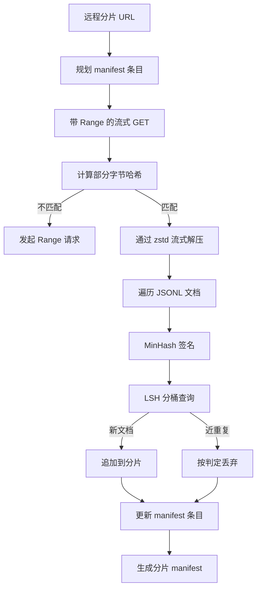

# 大规模语料下载器

> 训练语言模型的工作远早于第一次前向传播就已经开始。语料必须落地到磁盘上，完成解压、去重，并能被寻址；在网速跌至 4% 之前，断点续传的方案就必须已经就绪。本课将构建一个流式下载器，用于拉取压缩分片，通过 Zstandard 实时解压，利用 MinHash 加局部敏感哈希（LSH）对近重复文档进行指纹识别，并写入下游管线可信的分片清单（manifest）。

**类型：** 实战构建
**语言：** Python
**前置课程：** Phase 19 第 30-37 课
**时长：** 约 90 分钟

## 学习目标

- 使用 `urllib` 流式拉取远程分片，并通过 `zstandard` 实时解压，全程避免将整个文件缓冲到内存中。
- 针对已验证的字节偏移量发起 HTTP `Range` 请求，实现部分下载的断点续传。
- 为每篇文档构建 MinHash 签名，并使用 LSH 进行分桶，使近重复文档发生碰撞。
- 生成包含内容哈希、字节大小、文档数量及去重判定的分片清单（manifest）。

## 问题所在

当你第一次在 200 GB 语料上训练时，网络在第 41% 处中断，脚本抛出 `urllib` 异常后退出。第二次在第 78% 处中断。等到第 99% 时，你已经在循环里修改了三次代码。从一开始就必须针对的两种失败场景是：部分下载的断点续传，以及重复文档的剔除。这两种问题都有成熟的解决方案；但通常会被忽略，因为管线最初只是由一行 `requests.get` 调用搭建起来，随后逐渐变得棘手。

断点续传是一个 HTTP 问题。服务器必须响应 `Range` 请求，客户端必须对照磁盘记录跟踪已验证的偏移量，且该偏移量必须在进程意外终止后得以保留。如果偏移量与文件实际状态哪怕只相差一个字节，续传写入的就是垃圾数据，语料会以仅在分词阶段才会暴露的方式遭到损坏。

去重是一个签名问题。精确哈希去重会漏掉近重复文档：同一篇维基百科文章可能带有三种不同的模板页脚，同一个代码文件可能有不同的许可证头，同一篇博客文章每个链接都可能附带追踪参数。MinHash 加上 LSH 可以以亚线性的代价捕获这些近重复项。代价是每篇文档一个签名，每次查询一次分桶。

## 核心概念



### 使用 `urllib` 进行流式传输

标准库的 `urllib.request.urlopen` 返回一个类文件对象。将其包装在 `zstandard.ZstdDecompressor().stream_reader` 中，字节就能从网络流经解压模块进入文档迭代器，全程不会在内存中完整缓存压缩分片或未压缩分片。唯一的内存开销是行缓冲区、当前文档的 MinHash 签名以及 LSH 索引。

### 使用 `Range` 实现断点续传

下载器为每个分片写入两个文件：分片本体和 `.partial.json` 检查点文件。检查点记录 `verified_bytes`、`expected_size`、`sha256_prefix`（对前 `verified_bytes` 字节计算得出）以及源 URL。启动时，下载器读取检查点，对磁盘上的字节重新计算 `sha256_prefix`，仅当重新计算的哈希匹配时才继续续传。如果哈希不匹配，则丢弃部分文件并从第 0 字节重新开始下载。由于检查的是已验证字节而非假设其正确，因此无法发生静默损坏。

### MinHash 结合 LSH

MinHash 能够在固定空间内估计两个集合的 Jaccard 相似度。对于文档而言，集合即为其文本的 shingles（重叠 n-gram）。签名由 `k` 个最小哈希值组成，每个独立哈希函数对应一个。Jaccard 相似度为 `s` 的两篇文档，在签名的任意单个组件上概率为 `s` 保持一致。

LSH 随后将 `k` 个组件划分为 `b` 个带（band），每个带包含 `r` 行，其中 `k = b * r`。两篇文档在至少一个带中发生碰撞的概率为 `1 - (1 - s^r)^b`，这是一个围绕你通过调整 `(b, r)` 所设定的 `s` 值的陡峭阈值。典型语料去重的阈值为 `s = 0.8`，LSH 研究文献中通过 `k = 128`、`b = 32`、`r = 4` 即可达到该效果。

### 将分片清单作为契约

下载器唯一的持久化输出就是 manifest。该清单按分片记录 URL、解压后字节数、文档数量、去重后的唯一文档数，以及最终分片文件的 sha256。下游的分词阶段读取的是 manifest，而非目录列表。如果某个分片缺失或其 sha256 错误，manifest 会指示下一阶段拒绝启动。manifest 正是“数据已下载”与“数据已下载且可验证”之间的决定性边界。

```figure
cap-corpus-downloader
```

## 构建实现

`code/main.py` 实现了以下内容：

- `ShardPlanner` - 读取分片 URL 列表并生成计划中的 manifest 条目。
- `StreamingDownloader` - 打开带可选 `Range` 的 `urllib` 流，写入临时文件，在每个数据块上更新 `.partial.json` 检查点，并在续传时验证 sha256 前缀。
- `ZstdDocIterator` - 将类文件流包装进 `zstandard.ZstdDecompressor`，每行 yield 一个文档。
- `MinHasher` - 使用固定的哈希种子族为字符串生成 `k` 分量签名。
- `LSHIndex` - 按带对签名进行分桶并报告碰撞。
- `Dedup` - 结合哈希器与索引，将每篇文档标记为 `keep` 或 `near_duplicate`，并附带匹配的分片 ID。
- `ManifestWriter` - 收集各分片统计信息并写入 `manifest.json`。

文件底部包含一个演示程序，它在磁盘上构建小型合成语料，使用 `zstandard` 进行压缩，通过 `file://` URL 下载，执行去重，并打印 manifest。

运行方式：

```bash
python3 code/main.py
```

脚本正常退出（返回码 0）并打印 manifest 摘要。

## 生产环境模式

以下四种模式可将本课内容扩展至真实语料规模。

**写前检查点。** `.partial.json` 必须在将字节追加到分片之前执行 `fsync`。否则一旦断电，顺序会颠倒：磁盘上已有分片字节，但检查点文件中缺少它们，下次续传会认为已验证的字节少于实际情况，重复的尾字节会损坏文件。先写检查点，再写数据。这与预写日志（write-ahead log）的纪律相同。

**分片化 LSH 索引。** 在 200 GB 规模下，单个覆盖全量语料的 LSH 索引无法装入 RAM。按第一个带的哈希对 LSH 索引进行分区，将各分区存储于磁盘，查询时仅访问新签名应落入的分区。代价是每篇文档多一次磁盘读取；收益是 LSH 索引不再成为硬性内存上限。

**墓志铭式标记，而非删除。** 被丢弃的重复文档会在 manifest 中以判定 `near_duplicate` 及其碰撞到的文档所在分片 ID 进行记录。直接删除会切断重复文档与保留文档之间的关联。采用墓志铭标记可保留审计轨迹，并允许下游阶段更改阈值判断。

**manifest 中包含各分片的 sha256，外加 manifest 自身的 sha256。** manifest 本身也携带内容哈希。下游阶段只有在验证了 manifest 哈希之后才会信任其中的分片条目。若无此机制，manifest 将成为无声的攻击面：能够编辑单个文件的攻击者即可破坏整个管线。

## 使用方法

生产环境模式：

- **每次 CI 运行时均支持续传。** CI 运行器是临时的。下载器必须假定每次运行都是全新磁盘，并从缓存或远程端恢复。`--cache-dir` 是显式支持的一级参数。
- **分词前先去重。** 分词成本高昂。对同一篇文档运行两次意味着相同的损失曲线下消耗两倍成本。去重位于分词的上游，而非下游。
- **将 manifest 作为合并门禁。** 训练任务会从固定 commit 中读取 manifest sha256。数据集的新版本需要提交新的 manifest。代码与数据之间的关联依靠 git，而非约定俗成。

## 交付产物

`outputs/skill-corpus-downloader.md` 将，在真实项目中，描述哪些 URL 作为下载器的输入、检查点目录的组织方式、去重所使用的 shingle 宽度与 `(k, b, r)` 三元组，以及 manifest 在版本控制中的存放位置。本课负责提供核心引擎。

## 练习

1. 添加 `--shingle-width` 参数，并测量在宽度为 3、5、9 时去重判定结果的变化。为所选默认值提供理由。
2. 在 zstd 旁增加 gzip 支持，通过探测 magic bytes 自动识别。下载器不应要求调用方显式指定编解码器。
3. 添加 `--resume-only` 模式，若未找到检查点则拒绝启动全新下载。这在 CI 中非常有用，可防止某次运行意外重新拉取 200 GB 数据。
4. 将 LSH 索引移至 shelf 或 sqlite 文件，并与内存版本对比测量吞吐量。
5. 在启动时增加 manifest sha256 校验。若磁盘上的 manifest 与 `manifest.lock` 中的 manifest 哈希不一致，下载器应严格拒绝（fail closed）。

## 关键术语

| 术语 | 人们常说的说法 | 实际含义 |
|------|-----------------|------------------------|
| 分片（Shard） | “一个文件” | 语料的一个自包含切片，拥有独立的 sha256，用作续传与去重的基本单元 |
| MinHash 签名 | “指纹” | 集合的 `k` 分量精简表示，每个分量均为集合上某一独立哈希的最小值 |
| LSH 带（Band） | “桶（Bucket）” | 由 `r` 个签名组件组成的组，用作碰撞检测的单一分桶键 |
| 已验证字节 | “续传偏移量” | 磁盘上 sha256 前缀与检查点匹配的字节；唯一可安全续传的起始位置 |
| 清单（Manifest） | “索引” | 记录下载器产出的单一持久化文件，包含内容哈希 |

## 延伸阅读

- [RFC 7233](https://datatracker.ietf.org/doc/html/rfc7233) - HTTP Range 请求与续传协议
- [Zstandard 格式规范](https://datatracker.ietf.org/doc/html/rfc8478) - 保障流式解压安全的帧格式
- [MinHash](https://en.wikipedia.org/wiki/MinHash) - 本课所用的签名族
- [局部敏感哈希](https://en.wikipedia.org/wiki/Locality-sensitive_hashing) - 去重阈值背后的分带方案
- Phase 19 · 43 - 下载器所供给的 HDF5 分词语料
- Phase 19 · 44 - 基于该语料训练的余弦调度策略
- Phase 19 · 45 - 消费该调度策略的 AMP 训练循环
