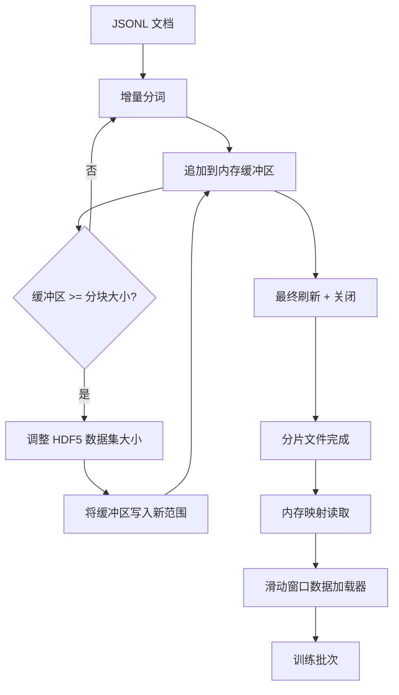

# HDF5 Token化语料库

> 下载的语料库必须采用训练器能以线速流式读取的布局。磁盘上的 JSONL 无法支撑 16 个数据加载器工作者。带有可调整大小、分块整数数据集的 HDF5 可以。本课程将流式分词集成到可调整大小的 HDF5 数据集中，实现多文件分片写入、训练时内存映射读取，以及一个采用正确打包规则生成固定长度序列的滑动窗口数据加载器。

**类型：** 构建
**语言：** Python
**前置知识：** 第19阶段课程 30-37
**时间：** 约90分钟

## 学习目标

- 通过确定性分块将文档流式写入可调整大小的 HDF5 整数数据集。
- 跨多个 HDF5 文件分片写入，使故障影响可控并支持并行处理。
- 通过 HDF5 的页面缓存支持的分块布局读取 token，使数据加载器仅在批量处理时将 token 复制到批处理缓冲区。
- 实现滑动窗口数据加载器，输出带有显式打包规则的固定长度训练序列。

## 问题所在

现代语言模型训练运行以每秒数十万样本的速度跨数十个工作者读取 token。磁盘上的 JSONL 在首次冷缓存页面错误时就崩溃：JSON 解析器慢，文档边界不可寻址，定位"样本 4,217,884"需要扫描整个文件。即使 Parquet 压缩效果良好，也不适合，因为训练器不需要列；它需要的是具有 O(1) 随机访问的扁平 token 流。

HDF5 适合这种需求，因为它提供分块、可调整大小、仅整数的数据集，其分块在读取时与页面缓存友好。训练器请求切片 `tokens[3,200,000 : 3,200,8192]`，HDF5 将从页面缓存中复制请求的超平板到全新分配的 NumPy 数组。代价是每个工作者一个打开的文件句柄和一个分块大小的页面缓存占用，与解码 JSONL 的开销相比微不足道。

构建难点在于让写入端诚实可靠。可调整大小的数据集很容易被误用：逐文档写入会导致 HDF5 文件碎片化到无法使用的程度；一次性调整所有文档大小则进程崩溃会丢失整个分片。正确的做法是缓冲后扩展，缓冲区大小与分块大小匹配，分片写入将工作负载分配到多个文件，这样崩溃最多只丢失一个分片。

## 概念



### 正确的可调整大小 HDF5

token 数据集使用 `maxshape=(None,)` 创建，并设置固定 `chunks=(chunk_size,)`。写入时通过在长度为 `chunk_size` 的 NumPy 数组中缓冲 token 来实现。当缓冲区填满时，数据集恰好调整 `chunk_size` 大小，并将缓冲区写入新范围。在分片结束时，剩余缓冲区被写入最后一个部分范围。每次写入都是连续且与分块对齐的，除了最后一次，读取器被告知在分片的 HDF5 属性中记录的 `token_count` 处截断。

### 分片写入

单个 HDF5 文件是单点故障。流水线并行写入分片：第19阶段课程42的每个输入分片产生一个 HDF5 输出分片。`shards.json` 索引记录每个分片的信息：文件路径、token 数量、文档数量和 token 的 sha256 值。训练器读取 `shards.json` 来计算全局偏移量并验证语料库。

### 内存映射读取

训练时，每个工作者以 `swmr=True` 模式打开其共享的 HDF5 文件，请求 `tokens[start:stop]`。HDF5 的分块布局使这成为一次页面缓存支持的读取（一旦分块变暖）。工作者从不物化整个文件：切片被复制到数据加载器的批处理缓冲区，数据加载器随后在批量处理时将数据复制到 pinned-memory 训练张量。热路径每个分块转换只有一个系统调用；其余都是 RAM 访问。

### 滑动窗口数据加载器

数据加载器是唯一了解训练序列长度的阶段。它在整个 token 流中选择一个随机起始索引，读取 `window_size + 1` 个 token，然后返回 `(input, target) = (tokens[:-1], tokens[1:])`。不强制文档边界：窗口可以跨越两个文档，中间有显式的 `boundary_token_id`，让模型学习使用分隔符。这是标准的打包规则；这也是初学者容易忘记的规则，导致语料库中 8% 的训练边界 token 和 92% 的自然文本。

```figure
cc-hdf5-corpus
```

## 构建

`code/main.py` 实现了：

- `Tokenizer` — 足够用于演示的字节级确定性分词器。接口为 `encode(text) -> list[int]` 和 `vocab_size`。
- `HDF5ShardWriter` — 打开可调整大小的整数数据集，将 token 缓冲到分块大小，以固定步幅调整大小并写入，在关闭时记录 `token_count` 和 `sha256` 作为 HDF5 属性。
- `ShardedTokenizationPipeline` — 迭代输入文档，路由到写入器，并生成 `shards.json` 索引。
- `MmapTokenStore` — 打开分片文件以进行内存映射读取，计算全局偏移量，暴露单个 `get_slice(start, stop)` API。
- `SlidingWindowDataloader` — 从整个流中随机选取窗口，输出 `(input_ids, target_ids)` NumPy 数组。

文件底部的演示构建了一个小型内存语料库，分词为两个分片，通过内存映射打开，运行10个批次的数据加载器，并打印每个批次的形状和校验和。

运行：

```bash
python3 code/main.py
```

脚本正常退出并打印批次校验和。

## 生产模式

四个模式可将本课程扩展到真实训练运行。

**分块大小等于典型读取大小。** 训练器每个样本读取 `window_size + 1` 个 token。将 HDF5 分块设置为 `window_size` 的倍数，读取就与页面缓存对齐。分块不匹配会将吞吐量减半，因为每个样本都会触及两个分块。

**token 数量存储在属性中，而非数据集中。** 数据集的尾部切片可能是部分填充的，因为分块大小不能整除文档边界。将实际的 `token_count` 存储为数据集的 HDF5 属性，让读取器在该值处截断。否则读取器会越过末尾进入零填充的 token，模型会学会预测零。

**分片 sha256 并行验证。** 每个分片都有自己 token 字节的 sha256。训练器可以在训练开始前并行验证所有分片。错误的 sha256 会在训练早期失败，而不是在十六小时后的第三个 epoch。

**两侧都使用 `swmr=True`，写入端使用 `libver="latest"`。** 单写入者多读者模式要求写入器以 `libver="latest"` 打开，预先创建所有数据集，然后设置 `file.swmr_mode = True`。之后写入器必须在每次调整大小后调用 `dataset.flush()`，这样读取器工作者（以 `swmr=True` 打开）才能看到一致的数据。跳过 `libver="latest"` 或在结构更改后启用 SWMR 是"文件被锁定"失败的常见原因。

## 使用

生产模式：

- **每个源分片一个 HDF5。** 下载器（课程42）每个 URL 输出一个分片；分词（本课程）每个源分片输出一个 HDF5。1:1 映射使恢复和部分故障恢复变得简单。
- **边界 token id。** 边界 token 是分词器词表的一部分，也是数据加载器注入的唯一 token。如果模型应该忽略边界 token，训练损失会掩码它；否则它会学习将其用作序列分隔符。
- **`shards.json` 作为权威来源。** 添加新分片意味着编写 HDF5、计算其 sha256 并追加条目。训练器在启动时读取一次该文件，之后不再触碰目录列表。

## 交付

`outputs/skill-hdf5-tokenized-corpus.md` 在真实项目中会描述哪个分词器驱动流水线、什么分块大小匹配训练器的窗口、`shards.json` 在版本控制中的位置，以及数据加载器工作者如何跨文件分片。本课程交付的是引擎。

## 练习

1. 为 HDF5 写入器添加 `--compression gzip` 标志，并在演示语料库上测量吞吐成本。论证所选默认值。
2. 为滑动窗口数据加载器添加确定性种子，并验证相同种子的两次运行产生相同的批次。
3. 添加 `--validate` 模式，读取每个分片，重新计算其 token 的 sha256，并与 `shards.json` 比较。CI 应在训练开始前运行此模式。
4. 比较分块大小分别为等于、一半和两倍窗口大小时的数据加载器吞吐量。报告页面缓存效应。
5. 添加 `--max-document-tokens` 标志，在写入时截断很长的文档。论证与在读取时决定的权衡。

## 关键术语

| 术语 | 人们所说的 | 实际含义 |
|------|-----------------|------------------------|
| 可调整大小数据集 | "只追加" | 具有 `maxshape=(None,)` 的 HDF5 数据集，通过分块步幅的 `resize` 调用增长 |
| 分块布局 | "HDF5 如何存储它" | 内核可以内存映射、数据加载器可以连续读取的固定大小磁盘页 |
| `swmr` 模式 | "边读边写" | 单写入者多读者模式，让数据加载器工作者安全共享文件 |
| 分片索引 | "shards.json" | 包含所有 token 分片的持久索引，带有偏移量和内容哈希 |
| 滑动窗口 | "训练样本" | 全局 token 流的固定长度切片，训练器将其与移位一的目标配对 |

## 延伸阅读

- [HDF5 分块文档](https://support.hdfgroup.org/documentation/hdf5/latest/hdf5_chunking.html) - 本课程使用的分块、可调整大小数据集布局
- [h5py 用户指南](https://docs.h5py.org/en/stable/) - HDF5 的 Python 绑定
- [NumPy 内存映射](https://numpy.org/doc/stable/reference/generated/numpy.memmap.html) - HDF5 通过 h5py 暴露的读取侧原语
- 第19阶段 · 42 - 本课程分词的下载器输出
- 第19阶段 · 44 - 消耗此数据加载器的余弦调度
- 第19阶段 · 45 - 包装训练步骤的 AMP 循环
