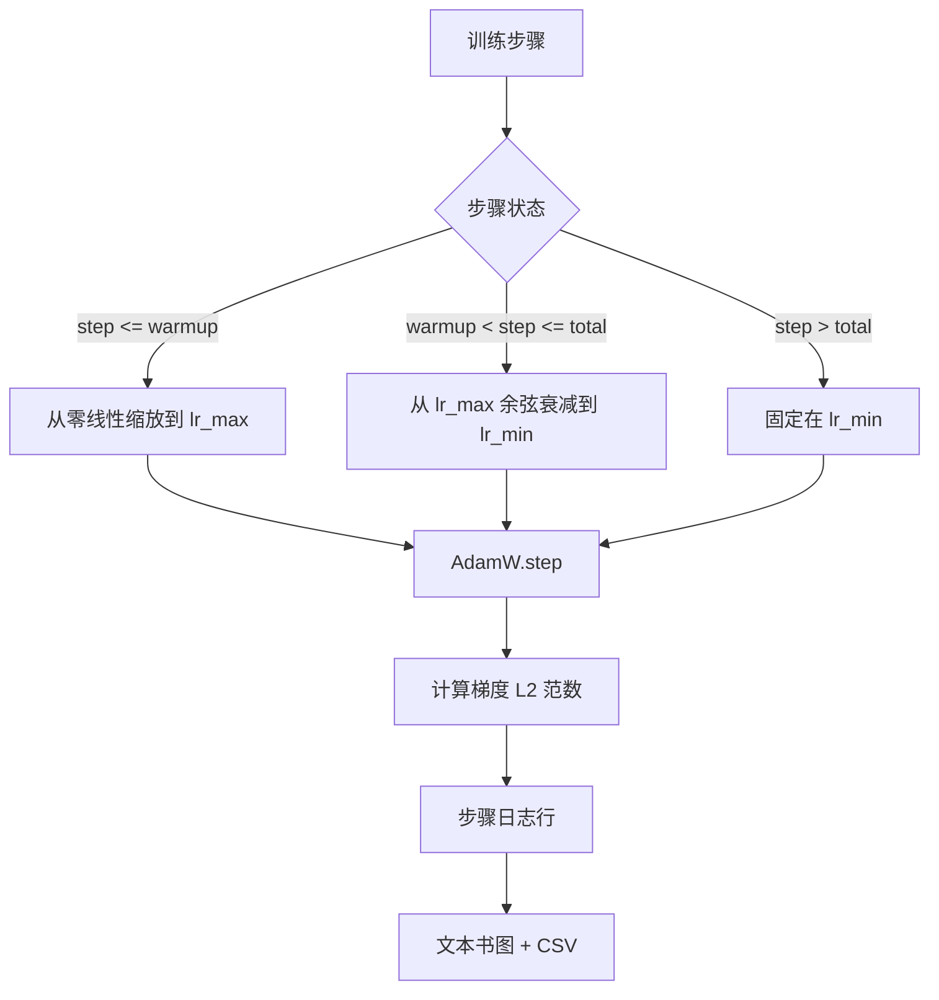

# 带线性预热的余弦学习率调度器

> 学习率调度器是仅次于损失函数的第二重要决策。AdamW 配合余弦衰减和线性预热是语言模型训练的现代默认配置，因为它能让模型在前一千次更新的脆弱阶段看到较小的有效步长，然后逐步 ramp 到配置的峰值，最后平滑地衰减回零。本课将构建该调度器，在训练步骤上绘制曲线，与调度器并排记录梯度范数，并证明调度器严格遵守预热、峰值和衰减边界。

**类型：** 构建
**语言：** Python
**前置条件：** Phase 19 第 30-37 课
**时间：** 约 90 分钟

## 学习目标

- 实现绑定到带线性预热的余弦学习率调度器的 AdamW 优化器。
- 在不引入浮点误差漂移的情况下，计算任意步骤调度器的精确值。
- 并排记录梯度 L2 范数和学习率，使训练健康状况可观测。
- 渲染可用于目视检查的文本书图以及任意工具可消费的 CSV。

## 问题所在

前一千次训练更新最为关键。模型的权重仍接近初始化状态。优化器的运行二阶矩估计尚未稳定。梯度范数较大且嘈杂。如果学习率在這些更新期间处于峰值，模型要么直接发散，要么陷入它永远无法逃脱的损失平台。两个众所周知的解决方案是梯度裁剪（Phase 19 第 45 课的主题）和一个从小开始逐步 ramp 的学习率调度器。

带预热的余弦调度器有三个区域。从步骤 0 到步骤 `warmup_steps`，学习率从零线性缩放到配置的峰值 `lr_max`。从步骤 `warmup_steps` 到步骤 `total_steps`，学习率遵循余弦曲线的上半部分，从 `lr_max` 衰减到 `lr_min`。在 `total_steps` 之后，学习率被固定在 `lr_min`，这样配置错误的训练器在超调时不会静默退出调度器。

构建的问题是调度器很容易出现 off-by-one 错误。这种 off-by-one 会在训练运行六小时后显现出来——在模型开始过拟合的那一刻，学习率偏高或偏低 1 百分比，除非对边界进行穷举测试，否则这种情况是看不见的。

## 概念



### 预热公式

对于 `[0, warmup_steps]` 范围内的 `step`，且 `warmup_steps > 0`，学习率为 `lr_max * step / warmup_steps`。退化情况 `warmup_steps = 0` 被视为"无预热"：调度器从步骤零直接以 `lr_max` 开始，并立即进入余弦衰减。一些测试框架传入 `warmup_steps = 0` 以检查调度器仍会产生可用的曲线。

### 余弦公式

对于 `(warmup_steps, total_steps]` 范围内的 `step`，学习率为 `lr_min + 0.5 * (lr_max - lr_min) * (1 + cos(pi * progress))`，其中 `progress = (step - warmup_steps) / max(1, total_steps - warmup_steps)`。在 `step = warmup_steps` 时，余弦计算为 `cos(0) = 1`，给出 `lr_max`，与预热端点完全匹配。在 `step = total_steps` 时，余弦计算为 `cos(pi) = -1`，给出 `lr_min`，与衰减端点完全匹配。

两个端点的连续性不是偶然。这正是调度器被实现为一个覆盖 `step` 的单一函数，而不是三个不同函数拼接在一起的原因。拼接的调度器在第一次更改 `lr_max` 时会丢失一个边界。

### total_steps 之后的下界

对于 `step > total_steps`，学习率保持在 `lr_min`。契约是明确的：调度器不会报错，也不会外推；它在下界处固定，让训练器记录警告。需要延长训练的训练器会更改调度器的 `total_steps`，而不是循环。

### 与学习率并排的梯度范数记录

调度器是训练健康的一半。梯度范数是另一半。训练循环逐步骤记录两者。发散的训练运行会在损失之前显示梯度范数尖峰；经过良好调优的预热会使范数随学习率线性上升；过于激进的峰值表现为预热后范数持续处于高位。磁盘上的数据集为 `step, lr, grad_l2_norm, loss`。CSV 是唯一的持久记录。

```figure
cap-cosine-warmup
```

## 构建

`code/main.py` 实现：

- `CosineWithWarmup` - 一个状态less函数 `lr(step) -> float`，覆盖配置的调度器。
- `TrainState` - 将模型、`AdamW` 优化器和调度器包装为单个步骤函数。
- `TrainState.step` - 运行一次前向传播、一次反向传播、记录梯度 L2 范数，并将 `lr(step)` 应用于优化器。
- `plot_schedule_ascii` - 将调度器渲染为可读的文本书图。
- `write_schedule_csv` - 每步骤输出一行学习率。

文件底部的演示构建了一个小型 `nn.Linear` 模型，在固定输入批次上训练 20 步，并打印每步的学习率、梯度范数和损失。调度器也会渲染为文本书图以进行视觉合理性检查。

运行它：

```bash
python3 code/main.py
```

脚本以零退出码退出，并打印每步训练日志加调度器图。

## 生产模式

四种模式将调度器提升为生产级工件。

**调度器存在于配置中，而非代码中。** 训练器从提交到 git 的 YAML 或 JSON 配置中读取 `warmup_steps`、`total_steps`、`lr_max`、`lr_min`。调度器是可复现的，因为配置是内容寻址的；调度器是可审计的，因为配置是 PR diff 的一部分。

**步骤计数器是单调的，与 epoch 解耦。** 当数据集被分片或数据加载器重启时，某些框架会混淆步骤和 epoch。调度器从训练器检查点读取 `global_step`，而不是从本地计数器读取。恢复的运行会在正确的调度位置继续，因为步骤计数器是持久轴。

**运行目录中的调度器图。** 每个训练运行将其 `outputs/lr_schedule.png`（在本课中为文本书图）写入运行目录。浏览目录的审查者无需重新运行即可对调度器进行合理性检查。这在 PR 阶段捕获配置错误的调度器类 bug。

**日志行模式是固定的。** `step, lr, grad_l2_norm, loss` 按此顺序。下游笔记本或仪表板读取模式；在不升级版本的情况下重命名列会使所有现有仪表板失效。

## 使用方式

生产模式：

- **先扫描峰值再扫描其他任何东西。** `lr_max` 是最敏感的旋钮。先在小型模型上扫描；最优 `lr_max` 随模型规模弱缩放，因此小型模型扫描是一个强先验。
- **预热是总步骤的分数，而非绝对数量。** 拥有 2,000 个预热步骤的 2 亿步运行几乎立即达到峰值；拥有相同预热步骤数的 2 万步运行预热 10 _percent。将预热配置为分数（典型：1-3 百分比），使调度器随训练时长缩放。
- **`lr_min` 有意非零。** 为 `lr_max` 10 百分比的下界使优化器在长尾期间保持学习。`lr_min = 0` 的调度器在图表上产生看起来不错的训练曲线，但模型实际上并未完成训练。

## 交付

`outputs/skill-cosine-warmup.md` 在实际项目中会描述哪个配置承载调度器、全局计数器从哪个训练器步骤读取，以及哪个 `lr_max` 扫描产生了部署值。本课交付的是引擎。

## 练习

1. 添加调度器的逆平方根变体，并在 200 步玩具训练运行中进行比较。哪个曲线产生更低的最终损失？
2. 添加 `--restart` 标志，在 `total_steps / 2` 处添加第二次预热。论证热重启是否改善或损害玩具运行。
3. 添加单元测试以验证调度器的连续性：对于 `[0, total_steps]` 范围内的每个步骤，差值 `|lr(step+1) - lr(step)|` 由 `lr_max / warmup_steps` 有界。
4. 将调度器接入 `torch.optim.lr_scheduler.LambdaLR`，使其与框架代码组合。本课使用普通步骤函数；包装器改变什么？
5. 添加 `--plot-png` 标志，通过 `matplotlib` 写入真实图。论证本课的文本书图还是 PNG 是 CI 运行的更好默认值。

## 关键术语

| 术语 | 人们怎么说 | 实际含义 |
|------|------------|----------|
| Warmup | "慢启动" | 在前 `warmup_steps` 更新中从零线性缩放到 `lr_max` |
| Cosine decay | "平滑下降" | 在剩余步骤中从 `lr_max` 到 `lr_min` 的上半余弦曲线 |
| Floor | "训练结束后" | 调度器在 `total_steps` 之后固定的固定 `lr_min` 值 |
| Gradient norm | "梯度的 L2 范数" | 连接梯度向量的欧几里得范数，每步记录 |
| Global step | "调度器轴" | 一种幸存于重启的单调步骤计数器，驱动调度器 |

## 延伸阅读

- [Loshchilov 和 Hutter, SGDR: Stochastic Gradient Descent with Warm Restarts (arXiv 1608.03983)](https://arxiv.org/abs/1608.03983) - 余弦调度器的参考论文
- [Loshchilov 和 Hutter, Decoupled Weight Decay Regularization (arXiv 1711.05101)](https://arxiv.org/abs/1711.05101) - AdamW 的参考论文
- [PyTorch torch.optim.lr_scheduler](https://docs.pytorch.org/docs/stable/optim.html#how-to-adjust-learning-rate) - 步骤函数如何与框架调度器组合
- Phase 19 · 42 - 本调度器消耗的语料库的下载器
- Phase 19 · 43 - 调度器协同进化的数据加载器
- Phase 19 · 45 - 梯度裁剪和 AMP，循环中的下一层
