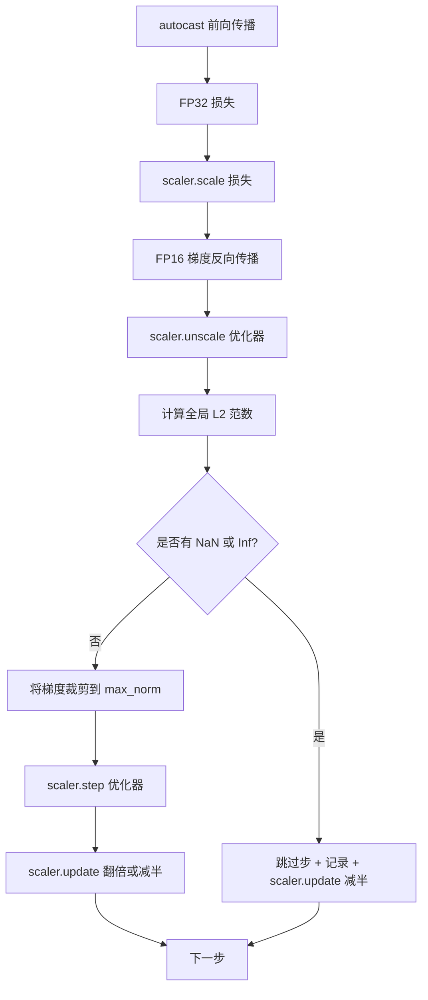

# 梯度裁剪与混合精度

> 上一课的优化器和调度器假设梯度是正常的。它们通常不正常。单个质量差的批次可能使梯度范数激增三个数量级。混合精度训练会通过引入 FP16 损失端的溢出放大这一问题。本课构建生产训练不可或缺的两种安全网：将全局 L2 范数裁剪到配置的阈值，以及一个结合 autocast 和 GradScaler 的混合精度循环，用于检测 NaN 和 Inf、干净地跳过该步，并记录缩放因子以供事后分析。

**类型：** 构建
**语言：** Python
**前置知识：** Phase 19 第 30-37 课
**预计时间：** 约 90 分钟

## 学习目标

- 计算所有参数梯度的全局 L2 范数，并在超过配置阈值时原地裁剪。
- 用 autocast 和 GradScaler 包裹训练步，使 FP16 的前向和反向传播能够承受溢出。
- 检测损失或梯度中的 NaN 和 Inf，跳过优化器步，并记录跳过事件。
- 每一步报告 GradScaler 的缩放因子，以便立即发现连续的跳过序列。

## 问题所在

一个昨天运行良好的训练在步骤 8,217 时损失曲线垂直飙升。罪魁祸首是一个梯度范数达到 4,200 的批次——是之前峰值的二十倍。如果不裁剪，优化器应用的一步会重置模型过去一个小时学到的所有内容。若使用全局 L2 裁剪（阈值为 1.0），同一批次仅产生单位范数的更新；损失保持原有趋势线；训练得以继续。

混合精度训练通过将前向传播和大部分反向传播以 FP16 计算，将吞吐量提升 2-3 倍。代价是 FP16 的指数范围较窄。典型的 FP16 溢出梯度会被评估为 Inf，并通过后续层传播为 NaN，然后在下一次优化器步将所有权重设为 NaN。PyTorch 的 GradScaler 通过在反向传播前将损失乘以一个大缩放因子，并在优化器步前将梯度除以相同的因子来解决此问题。如果任何梯度在反缩放时是 Inf 或 NaN，scaler 会跳过该步并将缩放因子减半；如果前 N 步都是干净的，scaler 会将因子翻倍。在整个训练过程中，因子会找到 FP16 范围允许的最大值。

构建难点在于正确连接这两者。在反缩放前裁剪，阈值作用于缩放后的梯度；在反缩放后裁剪，GradScaler 的操作顺序就很重要。正确的顺序是：`scaler.scale(loss).backward()`，然后 `scaler.unscale_(optimizer)`，然后 `clip_grad_norm_`，然后 `scaler.step(optimizer)`，然后 `scaler.update()`。任何其他顺序都会产生一个静默失效的循环。

## 概念解析



### 全局 L2 范数

全局 L2 范数是拼接后的梯度向量的欧几里得范数，而非每个参数的独立范数。PyTorch 通过 `torch.nn.utils.clip_grad_norm_(parameters, max_norm)` 实现此功能。该函数返回裁剪前的范数，以便本课同时记录自然范数和裁剪后范数，这对于"每一步都在裁剪"的诊断是必要的。

### autocast 与 GradScaler

`torch.amp.autocast(device_type)` 是上下文管理器，可以选择性地在 FP16 下运行符合条件的操作（大多数 matmul 类操作）。`torch.amp.GradScaler(device_type)` 是在反向传播前缩放损失、在优化器步前对梯度进行反向缩放的辅助工具。两者是配套设计的；单独使用其中一个属于配置错误，测试应该能捕获此类问题。

本课使用 CPU autocast，因为这是 CI 环境中的运行方式；相同的模式可以原封不动地迁移到 CUDA，只需将 `device_type="cpu"` 改为 `device_type="cuda"`。CPU 上的 GradScaler 是桩实现（CPU autocast 默认已使用 BF16，不需要损失缩放），但本课包含了调用站点，使得接线与 GPU 循环完全一致。

### NaN 和 Inf 检测

检测发生在两个地方。首先，使用 `torch.isfinite` 在反向传播前检查损失本身；Inf 或 NaN 损失不会产生有用的梯度，会在不进入优化器的情况下被跳过。其次，在 `scaler.unscale_(optimizer)` 之后，本课使用 `has_non_finite_grad(...)` 扫描反缩放后的梯度，并将任何 Inf 或 NaN 视为跳过信号。两项检查共同覆盖了前向传播和反向传播的失败模式。

### 缩放因子诊断

缩放因子是 GradScaler 的内部状态。每一步，本课都会读取 `scaler.get_scale()` 并与学习率和梯度范数一起记录。健康的训练中，缩放因子会以 2 的幂次递增，直到饱和在 `2^17` 或 `2^18` 附近。行为异常的训练中，因子会在高值和低值之间振荡，这是模型梯度有时在范围内、有时不在范围内的信号。没有日志记录时，此诊断信息是不可见的。

```figure
grad-clip-monitor
```

## 构建实现

`code/main.py` 实现了以下内容：

- `clip_global_l2_norm` — 对 `torch.nn.utils.clip_grad_norm_` 的封装，返回裁剪前和裁剪后的范数。
- `has_non_finite_grad` — 一个扫描梯度中 NaN 和 Inf 的辅助函数。
- `AmpTrainState` — 封装模型、`AdamW` 优化器、GradScaler 和 autocast 设备。暴露一个 `step(inputs, targets)` 方法，运行完整的裁剪、缩放和 NaN 跳过管道。
- `StepLog` 和 `SkipLog` — 结构化的每步记录。
- 一个演示，训练一个小的 `nn.Linear` 模型 20 步，在第 5 步注入 Inf 以触发跳过路径，并打印结果日志。

运行：

```bash
python3 code/main.py
```

脚本正常退出并打印每步日志，每行标记为 `STEP` 或 `SKIP`；其中至少有一行是 `SKIP`。

## 生产模式

四种模式将该循环提升到生产训练步的水平。

**跳过计数器作为告警而非日志行。** 每次训练运行中少量跳过是正常的。每个 epoch 数百次跳过则是硬告警：模型处于 FP16 无法承载的区间，循环正在静默失败。本课跟踪 1,000 步的滑动窗口跳过率，在生产环境中会在跳过率超过 5% 时触发告警。

**裁剪阈值由配置管理。** `max_norm = 1.0` 是语言模型训练的现代默认值。先在小型模型上进行调优；更大的阈值让模型能够从真正困难的批次中恢复；更小的阈值以损失曲线噪声增大为代价，限制最坏情况。阈值应与第 44 课的调度器一起放在同一个 YAML 或 JSON 配置文件中。

**范数日志与调度器一同写入 CSV。** CSV 列为 `step, lr, grad_l2_pre_clip, grad_l2_post_clip, loss, skipped, skip_reason, scaler_scale`。审阅者打开文件时，可以在一行中看到调度器、梯度故事、缩放因子和跳过结果（含原因）。将列拆分到多个文件中容易导致分析错位。

**`scaler.update()` 即使在跳过时也需运行。** 在干净步中，scaler 读取其无 Inf 计数，递增计数，并可能翻倍因子。在跳过步中，scaler 将因子减半并重置计数。在跳过路径上忘记 `update()` 是导致"缩放因子从未变化"的 bug。

## 使用方法

生产模式：

- **autocast 设备与优化器设备匹配。** GPU 训练使用 `torch.amp.autocast(device_type="cuda")`；CPU 使用 `torch.amp.autocast(device_type="cpu")`。混合设备会产生静默的类型错误，表现为损失曲线看起来正常但模型未在学习。
- **反向传播前检查损失。** `torch.isfinite(loss).all()` 是一次张量归约；成本可忽略不计，而避免 NaN 损失的收益是一个完整的训练步。务必运行此检查。
- **`zero_grad` 中使用 `set_to_none=True`。** 将梯度设为 `None` 而非零，使优化器能够跳过对未受影响参数组的计算。这是免费的吞吐量提升，并略微减少 bug 暴露面。

## 交付物

`outputs/skill-clip-amp.md` 在实际项目中会描述训练步使用的裁剪阈值和 autocast 设备、CSV 在版本控制中的位置，以及生产跳过率告警阈值。本课交付的是引擎本身。

## 练习

1. 将合成的 Inf 注入替换为真实的损失尖峰（将一个批次的目标乘以 1e8），并验证跳过路径被触发。
2. 添加 `--bf16` 模式，将 autocast 切换为 BF16 而非 FP16。BF16 的指数范围比 FP16 更宽，通常不需要损失缩放；验证在同一演示中跳过率降至零。
3. 添加单元测试，验证在无裁剪情况下梯度裁剪封装正确返回裁剪前和裁剪后的范数。
4. 添加滑动窗口跳过率计算，以及一个 CLI 标志，当跳过率在连续 100 步内超过配置阈值时终止运行。
5. 将循环连接至写入标准 CSV（`step, lr, grad_l2_pre_clip, grad_l2_post_clip, loss, skipped, skip_reason, scaler_scale`），并确认文件在 Ctrl-C 中断后仍然存在（每行写入后刷新）。

## 关键术语

| 术语 | 人们所说的 | 实际含义 |
|------|------------|----------|
| 全局 L2 范数 | "裁剪目标" | 跨所有可训练参数的拼接梯度向量的欧几里得范数 |
| autocast | "混合精度" | 在 `with` 块中对符合条件的操作选择性执行 FP16（或 BF16） |
| GradScaler | "损失缩放器" | 在反向传播前乘以损失、在优化器步前对梯度进行反向缩放的辅助工具 |
| 跳过 | "坏步" | 因梯度或损失非有限而被拒绝的优化器步；scaler 将因子减半 |
| 缩放因子 | "缩放器状态" | GradScaler 的当前乘数；在干净阶段翻倍，在每次跳过时减半 |

## 进一步阅读

- [Micikevicius 等，《混合精度训练》(arXiv 1710.03740)](https://arxiv.org/abs/1710.03740) — 原始损失缩放提案
- [Pascanu, Mikolov, Bengio，《训练循环神经网络困难性研究》(arXiv 1211.5063)](https://arxiv.org/abs/1211.5063) — 梯度裁剪参考文献
- [PyTorch torch.amp.GradScaler](https://docs.pytorch.org/docs/stable/amp.html) — 本课封装的缩放器 API
- [PyTorch torch.nn.utils.clip_grad_norm_](https://docs.pytorch.org/docs/stable/generated/torch.nn.utils.clip_grad_norm_.html) — 本课使用的裁剪原语
- Phase 19 · 42 — 为循环提供语料库的下载器
- Phase 19 · 43 — 循环消费的数据加载器
- Phase 19 · 44 — 本循环与之组合的调度器
