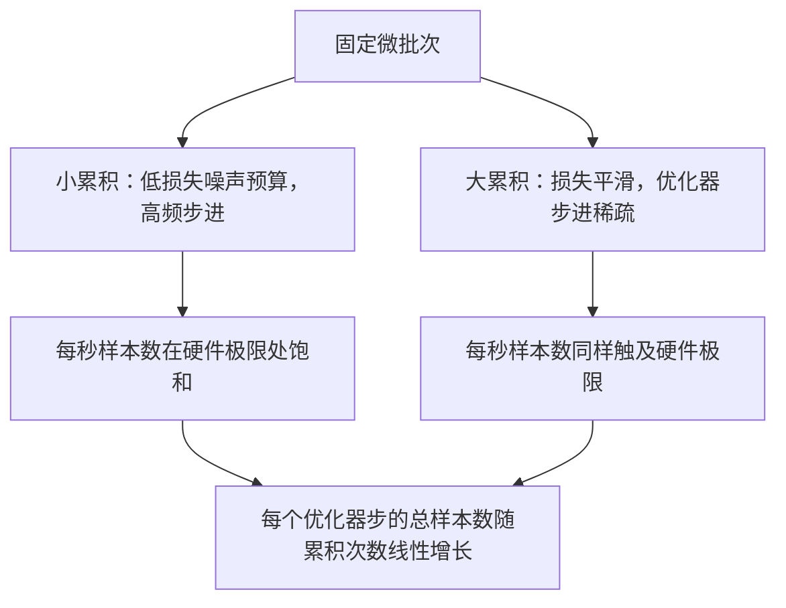

# 梯度累积（Gradient Accumulation）

> 以你负担不起的有效批次大小进行训练，一次处理一个微批次。缩放损失，推迟优化器步进，让梯度逐步累积。

**类型：** 构建实践
**语言：** Python
**前置知识：** 第 19 阶段课程 42 至 45
**时间：** 约 90 分钟

## 学习目标

- 推导有效批次公式：`effective_batch = micro_batch * accum_steps`
- 实现每微批次的损失缩放，使累积梯度与单次全批次反向传播结果一致
- 在最后一个微批次之前跳过优化器同步（sync-on-last-step）
- 读取有效批次的吞吐量曲线并解释边际收益递减现象

## 问题背景

你希望以 512 的有效批次大小进行训练，因为这样损失曲线更平滑，优化器步长在该规模下也更合理。然而桌面上的加速器在耗尽显存前只能容纳 32 个样本。增大批次不可行，缩小模型也不可行。2017 年该领域提出并沿用至今的解决方案是：执行 16 次反向传播，让梯度在参数缓冲区中累积，直到计数达到目标时才执行优化器步进。

风险在于损失值不再与大批次时相同。16 个小批量朴素求和的交叉熵是单个完整批次损失的 16 倍。如果不进行缩放，梯度方向虽然正确，但幅度错误，优化器步长会偏大 16 倍。修复方法很简单：除以 16。但这个细节很容易被遗忘。

## 核心概念


核心约定很短：

- 每个微批次的损失在调用 `backward()` 之前除以 `accum_steps`。PyTorch 默认将梯度求和到 `param.grad` 中；除法将累计和推回到正确的量级。
- 优化器步进在每个有效批次后触发一次，即在最后一个微批次的反向传播之后。如果在累积过程中提前步进，会偏斜后续所有参数依赖。
- 优化器的状态（动量缓冲区、Adam 矩）每个有效步推进一次，而不是每个微批次。否则指数移动平均会看到错误的频率，导致调度策略失效。
- 在单设备上这仅是账本记录。在多秩集群上，相同的模式在非最终的微批次周围包裹 `no_sync` 上下文，跳过梯度 all-reduce；最后一个微批次一次性缩减完整的累积梯度，而非重复 N 次支付网络开销。

### 代码等价性证明

```python
loss = criterion(model(x_full), y_full)
loss.backward()
opt.step()
```

等价于

```python
for x, y in chunks(x_full, y_full, n):
    scaled = criterion(model(x), y) / n
    scaled.backward()
opt.step()
```

二者仅在浮点求和顺序上略有差异。循环结束时的累积梯度缓冲区与单次全批次反向传播产生的张量相同。课程代码在 `equivalence_check` 中以 max-abs 差值小于 1e-4 断言这一点。

### 代价去向

每个微批次消耗一次前向传播和一次反向传播。通过累积，你用内存换时间。`outputs/accum-curve.json` 中的吞吐量曲线展示了在固定微批次大小下有效批次增大时会发生什么：



没有免费的午餐。将 `accum_steps` 翻倍会使每个优化器步的墙钟时间翻倍。变化的是梯度估计的方差：在相同的墙钟预算下，你做了更少次数的优化器步进，但每次步进都 averaged 了更多样本。文献将大批次和小批次视为不同的优化问题；这里的教训是机械性的，而非统计性的。

```figure
cc-grad-accumulation
```

## 构建实践

`code/main.py` 是可运行的工件。它做三件事。

### 步骤 1：等价性验证

`equivalence_check()` 构建两个具有相同种子的相同网络副本。一个看到一次前向传播的 16 样本批次。另一个看到四个 4 样本的切片，损失除以四。函数比较优化器步进前的梯度缓冲区和步进后的参数。断言条件是 `max_abs_diff < 1e-4`。

### 步骤 2：最后一步同步模式

`train_one_optimizer_step` 遍历微批次。对于除最后一个之外的每个微批次，它进入 `no_sync_context(model)`。在单进程下该上下文是空操作；在 DDP 中，这就是跳过梯度 all-reduce 的地方。无论哪种情况，记账方式相同。`sync_counter` 记录我们退出 no_sync 作用域的次数；对于 N 个微批次，计数是每个有效步一次，而非 N 次。

### 步骤 3：吞吐量曲线

`sweep_effective_batches` 使用固定微批次大小和一系列累积步数运行同一模型。对于每个设置，它记录：

- `samples_per_sec`：总样本数除以墙钟时间
- `median_step_ms`：每个有效步的第 50 百分位数耗时
- `sync_calls`：触发的集合通信点数
- `avg_loss`： sweeps 优化器步的平均损失

输出写入 `outputs/accum-curve.json`，可从 notebook 复用。

运行：

```bash
python3 code/main.py
```

脚本打印等价性差值，然后打印 sweeps 表格，最后打印 JSON 路径。退出码为零。

## 使用指南

在生产训练中，梯度累积藏在单个旋钮后面。PyTorch 的模式是 `accumulation_steps = effective_batch // (micro_batch * world_size)`。你不被允许使用的框架会包装相同的循环，但步骤相同：缩放损失、在非最终微批次上跳过同步、累积、步进一次。

野外的三种常见模式：

- 微批次大小选择为使设备内存饱和。更小会浪费加速器周期。更大则崩溃。
- 有效批次大小来自学习率调度。大批次需要缩放学习率和预热；这是自 2017 年以来讨论的线性缩放规则。
- 累积计数是两者之间的桥梁，也是你唯一可以在不重写数据加载器的情况下自由调节的旋钮。

## 交付物

`outputs/skill-gradient-accumulation.md` 捕获了配方，以便同行可以将其插入新仓库：按 `accum_steps` 缩放损失、在非最终微批次上跳过优化器同步、每个有效批次步进一次优化器、以 JSON 形式记录有效批次的吞吐量以便权衡可见。

## 练习

1. 使用 `--num-steps 100` 重新运行 sweeps 并绘制每秒样本数对有效批次的图表。曲线在哪里趋于平坦？
2. 添加一个错误的缩放变体（不除以 N）并展示与参考值在第一步时的参数差异。
3. 将 SGD 替换为 AdamW 并确认优化器状态每个有效步推进一次，而非每个微批次。
4. 引入真正的 `DistributedDataParallel` 包装器并将 `no_sync_context` 路由到其方法。确认每个有效批次的同步调用减少 N-1 次。
5. 修改等价性验证以比较两种不同的微批次分割（2×8 vs 4×4）并解释你需要放宽的容忍度。

## 关键术语

| 术语 | 人们怎么说 | 实际含义 |
|------|------------|----------|
| 微批次（Micro batch） | 你前向传播的批次 | 单次前向传播中能放入内存的切片 |
| 累积步数（Accum steps） | 每步的反向传播次数 | 一次优化器步进前求和的反向传播数量 |
| 有效批次（Effective batch） | 那个批次 | 微批次 × 累积步数 × 数据并行世界大小 |
| 损失缩放（Loss scaling） | 除以 N | 每个微批次除法，使求和梯度匹配全批次 |
| 最后一步同步（Sync on last） | 跳过其余 | 仅在窗口内的最后一次反向传播时运行梯度集合通信 |

## 延伸阅读

- PyTorch 关于 `DistributedDataParallel.no_sync` 的文档，这是最后一步同步技巧的生产版本。
- Goyal 等人，2017 年，关于大批次训练的线性缩放规则，这是关心有效批次的经典原因。
- PyTorch issue tracker 上关于梯度累积与混合精度反缩放交互的讨论。
- 第 19 阶段课程 42 至 45 覆盖了本课程假设的模型、数据加载器、优化器和训练器脚手架。
- 第 19 阶段课程 47 覆盖检查点和恢复，以便长时间累积运行能够承受墙钟限制。
