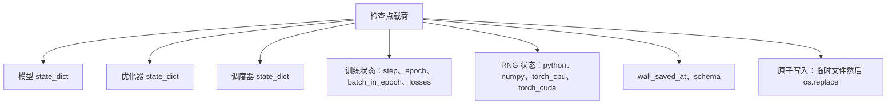
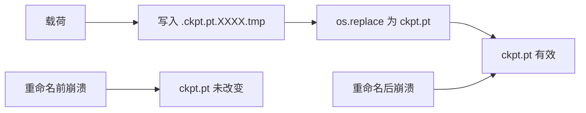
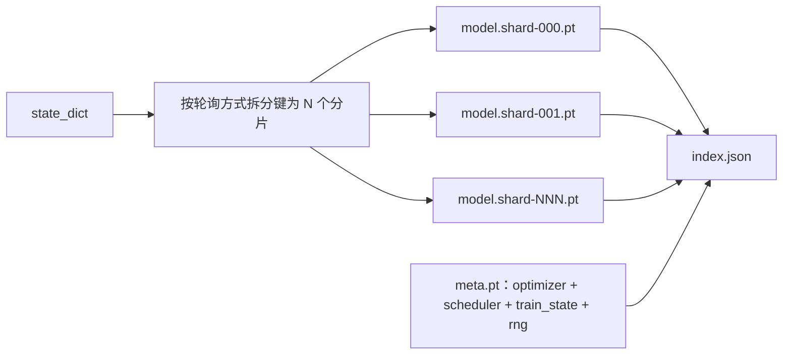

# 检查点保存与恢复

> 训练中断会导致运行中断；检查点可以让训练继续。原子化地保存模型、优化器、调度器、损失历史、步数计数器和 RNG 状态，确保任何时刻的强制终止都会在磁盘上留下一个有效的文件。

**类型：** Build
**语言：** Python
**前置要求：** 第 19 阶段课程 42 至 45
**时间：** 约 90 分钟

## 学习目标

- 将完整的训练状态捕获到单个载荷中，以便在新进程中重新加载。
- 实现写临时文件再重命名的原子保存，确保崩溃时不会留下损坏的文件。
- 恢复 Python、NumPy 和 PyTorch 的 RNG 状态，使恢复后的损失曲线与未中断的基线一致。
- 为无法放入单个文件的大模型构建分片检查点布局，包含经哈希验证的分片和 JSON 索引。

## 问题

你安排了一个 18 小时的训练任务。墙钟上限为 4 小时。在第 11 小时，集群因为上级批准了内核升级而重启。没有检查点，一切必须从头开始。没有恢复，你还会失去前 11 小时辛苦学到的优化器状态，所以即使模型权重幸存，AdamW 的动量也消失了，下一步会朝训练轨迹早已前进过的方向猛冲。

正确的产物是一个包含所有续训所需内容的单一文件：模型参数、优化器状态、调度器状态、用于绘图的损失历史、当前的 step、epoch 和 batch-in-epoch 计数器，以及所有随机源头的 RNG 状态。没有 RNG 状态，恢复后的损失曲线就是另一条曲线。同样的模型，同样的数据，不同的 shuffle，不同的 dropout mask，仪表盘上显示的数字也不同。

原子保存是契约的另一半。直接写入最终文件名意味着中途崩溃会留下损坏的文件；恢复时读到的是乱码。写入同目录下的临时文件再重命名，意味着中途崩溃时之前的正常文件完好无损。在 POSIX 文件系统上，重命名是原子的。

## 概念



### 五个状态桶

| 状态桶 | 为什么重要 |
|--------|----------------|
| Model（模型） | 权重和缓冲区；模型本身是什么。 |
| Optimizer（优化器） | 动量和自适应矩；没有它们，下一步就是一个不同的优化问题。 |
| Scheduler（调度器） | 学习率在曲线上所处的位置；余弦调度器尤其依赖此项。 |
| Train counters（训练计数器） | Step、epoch、batch-in-epoch，以及绘制仪表盘所需的损失历史。 |
| RNG state（RNG 状态） | 保证 dropout、数据 shuffle 和模型内任何采样的确定性。 |

### 原子保存



两条规则。首先，临时文件必须与目标文件位于同一目录，这样重命名才能保持在同一文件系统内；跨设备重命名不是原子的。其次，每次尝试的临时文件名必须唯一，以防多个写入者相互覆盖。

### 分片检查点

当模型变大时，单文件载荷会变得太大而无法快速加载，太大而无法直观检查，并且在网络共享读取中途出错时过于痛苦。解决方案是将参数状态拆分为分片，并编写一个将分片关联起来的小型索引。



索引记录了分片数量、每个分片的 sha256 以及 meta 文件的 sha256。当任何哈希不匹配时，加载器会立即报错。分片可以存放在不同的物理磁盘上；meta 文件很小且优先读取。

### 跨 epoch 恢复

如果恢复时直接跳到下一个 epoch 的起点，会浪费几分钟到一天的时间。解决方案是使用 `(epoch, batch_in_epoch)` 加上 RNG 状态。加载后，训练循环会将随机数生成器快进，跳过当前 epoch 已消耗的批次，然后从 `batch_in_epoch` 继续。课程的代码正是这样做的；断言为：恢复后的损失轨迹与未中断的基线之间的差异在 1e-4 以内。

```figure
cc-atomic-checkpoint
```

## 动手实现

`code/main.py` 提供了四个原语和一个演示驱动。

### 步骤 1：捕获并恢复 RNG 状态

`capture_rng_state` 返回一个字典，包含 Python 的 `random.getstate`、NumPy 的 `np.random.get_state` 以及 PyTorch CPU 和 CUDA 的 RNG 字节。`restore_rng_state` 则反向操作。CPU 张量是一个 uint8 字节缓冲区，PyTorch 的 RNG 知道如何消费它。

### 步骤 2：原子保存

`atomic_save` 将载荷写入目标目录下的临时文件，然后 `os.replace` 将其替换为最终文件名。`atomic_write_json` 对分片索引执行相同的操作。

### 步骤 3：完整检查点往返

`save_checkpoint` 将模型、优化器、调度器、训练状态和 RNG 打包进一个字典。`load_checkpoint` 反向操作并返回一个 `TrainState`。`schema` 字段是升级钩子：未来的格式变更会提升版本号字符串，加载器据此分发处理。

### 步骤 4：分片变体

`save_sharded_checkpoint` 将参数键按轮询方式分布到 N 个分片中，使用各自的原子保存写入每个分片，写入包含优化器、调度器和训练状态的 meta 文件，并写入包含分片 sha256 的 JSON 索引。`load_sharded_checkpoint` 在合并前会验证每个分片。

### 步骤 5：恢复演示

`run_resume_demo` 对一个小模型训练 `total_steps` 步，在 `interrupt_at` 处保存检查点，然后继续。第二个进程恢复该检查点并运行剩余步骤。函数返回中断点后两条损失轨迹之间的最大绝对差值。恢复 RNG 后，差值为零或浮点噪声。

运行它：

```bash
python3 code/main.py
```

单文件和分片演示均断言 max-diff 低于 1e-4。摘要保存在 `outputs/resume-demo.json` 中。

## 使用它

生产级训练栈将检查点作为训练器的一部分发布。结构相同：模型 + 优化器 + 调度器 + 计数器 + RNG，原子化写入，按 step 命名以便轻松找到最新版本。分片布局通过并行读取支持大模型加载；`index.json` 正是其核心支撑。

需遵循三种模式：

- **载荷中的 schema 是字符串。** 迁移逻辑基于它分支。没有它，你就无法在不破坏旧运行的情况下演进格式。
- **对每个分片计算 Sha256。** 无声截断的下载是最糟糕的 bug；加载器要么快速失败，要么晚期失败。
- **保持检查点保存频率的务实性。** 每 N 步保存一次，且每分钟保存一次，以较短者为准。否则，中途崩溃的长步骤会浪费整整一个窗口的工期。

## 交付它

`outputs/skill-checkpoint-save-resume.md` 是任何新训练脚本的配方：载荷结构、原子写入、RNG 捕获、分片索引。将该技能模块并入仓库，在周期性保存处接入 `save_checkpoint`，在启动时接入 `load_checkpoint`，运行就能抵御强制终止。

## 练习

1. 将轮询分片替换为按参数组分片（以 `.weight` 结尾的层与以 `.bias` 结尾的层）。每种布局分别在何时更优？
2. 扩展保存循环，保留最近 K 个检查点并删除较旧的。磁盘较小时 K 取何值合适？
3. 添加 `--ckpt-every-seconds` 标志，使其按墙钟间隔触发保存，而不仅限于步数计数。
4. 添加启动时的校验和验证路径，扫描目录中的每个检查点，并报告哪些已损坏。
5. 实现 `migrate_v1_to_v2` 函数，向载荷添加新字段并提升 schema 字符串。使加载逻辑同时兼容两个版本。

## 关键术语

| 术语 | 人们常说的说法 | 实际含义 |
|------|----------------|------------------------|
| Atomic save（原子保存） | “写完祈祷” | 写入同目录下的临时文件，然后 os.replace 到目标文件名 |
| State dict | “权重” | 按参数名键控的模型参数和缓冲区 |
| Sharded checkpoint（分片检查点） | “大模型文件” | 多个文件（每个分片一个），外加 meta 文件和带有 sha256 的 JSON 索引 |
| RNG state（RNG 状态） | “随机种子” | 捕获的 python random、numpy、torch CPU、torch CUDA 的状态；不仅是种子 |
| Mid-epoch resume（跨 epoch 恢复） | “重启” | 快进 RNG 并从当前 epoch 的下一个批次继续 |

## 延伸阅读

- 关于 `os.replace` 所依赖的原子性声明的 POSIX `rename` 语义。
- PyTorch 关于 `torch.save` 和 `torch.load` 的文档，包括用于跨设备恢复的 `map_location`。
- 第 19 阶段第 46 课涵盖了梯度累积，本课的检查点载荷能够跨越它保存状态。
- 第 19 阶段第 48 课涵盖了分布式包装器，本方案的 state dict 格式能够适配它们。
- Linux 内核 `fsync` 文档，了解原子重命名背后的持久性保证。
