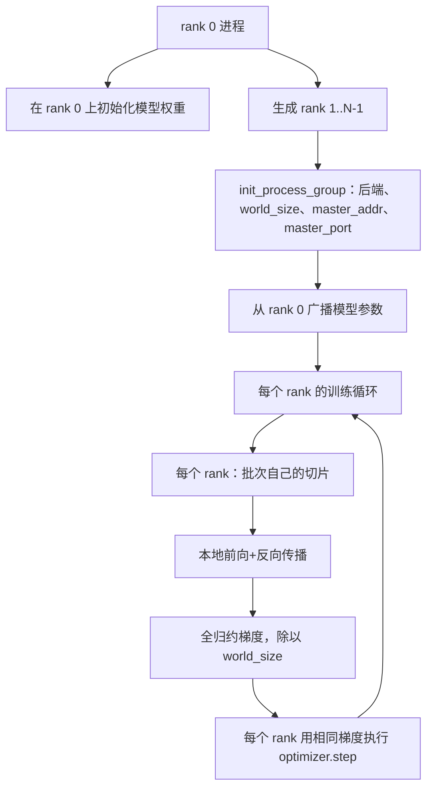
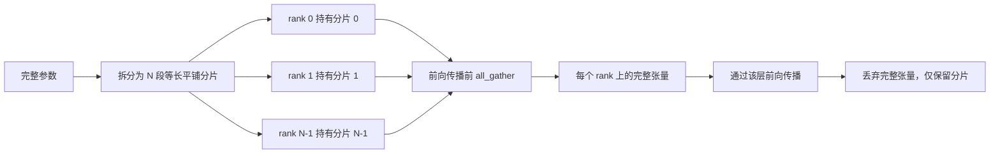

# 从零实现分布式数据并行与 FSDP

> 多 rank 训练的核心是两集合操作加一条规则。启动时广播参数，反向传播后平均梯度，永远不要让各个 rank 对当前步数产生分歧。

**类型：** 构建
**语言：** Python
**前置条件：** Phase 19 第 42 至 45 课
**时间：** ~90 分钟

## 学习目标

- 用 `gloo` 后端在 N 个 rank 上拉起进程组，无需特殊硬件。
- 实现一个最小化 DDP 包装器：构造时广播参数，反向传播后全归约梯度。
- 证明各 rank 梯度的全归约结果与拼接输入上的单进程梯度一致。
- 勾勒 FSDP 参数分片：每个 rank 持有一段切片，前向传播时收集完整张量，之后丢弃。

## 问题所在

模型放得下一个设备，数据集不行。优化预算要求你看到每秒 N 倍的样本吞吐。第一根杠杆是数据并行：每个 rank 在不同切片上跑相同模型，然后在优化器步骤之前平均梯度。第二根杠杆是 FSDP：模型本身就放不下一个设备，所以每个 rank 只持有每个参数的一部分，前向传播时逐层重建完整张量。

痛点在于账本。如果参数在各 rank 间漂移，运行会静默出错。如果你平均了梯度却未平均损失，仪表盘会撒谎。如果集合后端无法就拓扑达成一致，运行会永远挂起。修复方案是一次亲手写好集合操作，绝不信任你无法复现的包装器。

本课在 CPU 上运行。不假设 CUDA。`gloo` 后端随每个 PyTorch 构建附带，接受 `torch.multiprocessing` worker；同样的代码在多 GPU 节点上切换到 `nccl` 时结构不变。

## 概念



### 两个关键的集合操作

| 集合操作 | 作用 | 时机 |
|----------|------|------|
| `broadcast` | 将一个张量从一个 rank 复制到所有其他 rank | 参数初始化、调度器状态、任意 one-to-all 同步 |
| `all_reduce` | 对所有 rank 的张量求和（或均值、最大值），每个 rank 得到结果 | 反向传播后的梯度平均 |
| `all_gather` | 每个 rank 贡献一个张量，每个 rank 得到拼接结果 | 日志收集、FSDP 参数解片 |

DDP 的契约是构造时 `broadcast`，反向传播后 `all_reduce`。FSDP 的勾勒在前向传播前增加 `all_gather`。

### 梯度平均与单进程梯度等价

跨 N 个 rank 在 B 个样本上训练的模型，必须与单个进程在 N*B 个样本上训练的梯度相同。关键在于：对 per-rank 梯度求和后除以 N，得到平均损失梯度，这正是全批次上均值归约的交叉熵所产出的。课程代码在手动 all_reduce 梯度与参考单进程梯度之间断言 `max-abs-diff < 1e-3`。

### FSDP 勾勒



内存收益是精确的：per-rank 参数内存降至 1/N。代价是收集操作，每次前向传播都需支付。生产级 FSDP 将收集与前一层计算重叠，使得实际墙钟开销远小于朴素估算。课程对所有参数做往返，并断言重建与原参数逐位相等。

### CPU 与 gloo 后端

CUDA 是生产目标，但相同的代码路径在 CPU 上存在。`gloo` 是 CPU 集合后端。比 `nccl` 在 GPU 上慢几个数量级，但 API 表面完全相同。课程的进程组用 `backend="gloo"` 初始化，rank 用 `torch.multiprocessing` 而非 `torchrun` 生成；最终都落到相同的 `torch.distributed` 调用。在多 GPU 节点上，唯一的改动是 `backend="nccl"`、设备张量和 `torchrun` 启动。

```figure
cg-allreduce-ring
```

## 构建

`code/main.py` 是可运行工件。

### 步骤 1：拉起进程组

```python
os.environ["MASTER_ADDR"] = "127.0.0.1"
os.environ["MASTER_PORT"] = str(port)
dist.init_process_group(backend="gloo", rank=rank, world_size=world_size)
```

`MASTER_ADDR` 和 `MASTER_PORT` 是 rendezvous：每个 rank 拨号同一主机上的同一端口。课程通过 bind-and-close 技巧选取空闲端口，避免多个运行共享机器时的端口冲突。

### 步骤 2：构造时广播

`MinimalDDP.__init__` 遍历每个参数和缓冲区，调用 `dist.broadcast(tensor, src=0)`。rank 0 的值成为规范初始化。没有这一步，每个 rank 用自己的种子初始化，从第一步开始就分叉。

### 步骤 3：反向传播后全归约梯度

```python
def all_reduce_grads_(module, world_size):
    for p in module.parameters():
        if p.grad is None:
            p.grad = torch.zeros_like(p.data)
        dist.all_reduce(p.grad.data, op=dist.ReduceOp.SUM)
        p.grad.data.div_(world_size)
```

每个 rank 最终获得相同的平均梯度。优化器步骤现在是每个 rank 上相同输入的函数，这也是参数在整个运行中保持同步的原因。

### 步骤 4：证明等价性

`manual_all_reduce_matches_single_process` 在 rank 0 上构建相同模型，并将 all_reduce 后的梯度与单进程在拼接输入上计算的梯度比较。max-abs-diff 约为 1e-8。

### 步骤 5：FSDP 往返

`fsdp_round_trip_sketch` 展平每个参数，填充到 `world_size` 的倍数，切片，all_gather，去填充。每个 rank 的重建等于原参数。这是解片步骤；逆操作（前向传播后重新分片）是从收集张量上切下一段。

运行：

```bash
python3 code/main.py
```

默认 world_size 为 2。两个 CPU 进程生成，通过 `gloo` 通信，退出码为零。输出 `outputs/ddp-demo.json` 捕获每个 rank 的参数和、all_reduce 后的梯度范数、FSDP 往返结果以及手动 vs 参考梯度差。

## 使用

生产训练栈调用相同的原语。PyTorch 的 `DistributedDataParallel` 增加了：post-backward 梯度钩子，使 all_reduce 与反向传播重叠；bucketed all_reduce，将多个小梯度合并为一个集合操作；以及第 46 课使用的 `no_sync` 上下文。

PyTorch 的 FSDP 增加了：每层一个平铺参数视图，使每个 rank 持有一个连续缓冲区；下一层的解片与当前层计算重叠；以及可选的分片 CPU offload。

形状保持不变：启动时广播，反向后归约，参数放不下时分片。

## 交付

`outputs/skill-distributed-fsdp-ddp.md` 携带了新训练脚本的配方：用 `gloo` 启动 CPU 进程组，用 `nccl` 启动 GPU 进程组，用 DDP 壳包装模型（构造时广播、反向后归约），可选地用 FSDP 勾勒中的 all_gather 模式分片参数。

## 练习

1. 用 `--world-size 4` 运行，确认参数漂移在整个运行中保持在 1e-3 以下。
2. 用 `dist.all_reduce(op=dist.ReduceOp.AVG)` 替换手动平均，测量差异。
3. 给 DDP 包装器增加 post-backward 钩子，使 all_reduce 与反向传播其余部分重叠；测量墙钟改进。
4. 实现 FSDP 重新分片步骤：前向传播后，将完整张量替换回本地分片。确认 per-rank 内存下降。
5. 在 CUDA 机器上将后端切换到 `nccl`。注意哪些环境变量发生变化，哪些保持不变。

## 关键术语

| 术语 | 人们怎么说 | 实际含义 |
|------|-----------|----------|
| Backend | "gloo 还是 nccl" | 实现集合操作的库；gloo 用于 CPU，nccl 用于 GPU |
| World size | "总 rank 数" | 进程组中的进程数；进程组是集合操作的基本单位 |
| Rank | "Worker id" | 组内进程标识符，从零索引 |
| All-reduce | "求和梯度" | 对所有 rank 的张量求和，每个 rank 最终得到相同结果 |
| Unshard | "收集参数" | 通过 all_gather 从 per-rank 切片重建完整张量 |

## 延伸阅读

- PyTorch `torch.distributed` 文档，本课依赖的集合语义。
- `gloo` 库的集合列表，与 CUDA 支持的 `nccl` 原语形状相同。
- Phase 19 第 46 课，梯度累加模式，将 DDP all-reduce 包裹在 `no_sync` 中。
- Phase 19 第 47 课，检查点布局，在 DDP 和 FSDP 运行后存活。
- PyTorch FSDP 文档，本课勾勒的参数分片的生产实现。
