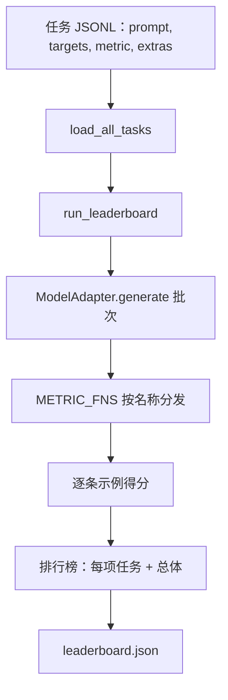
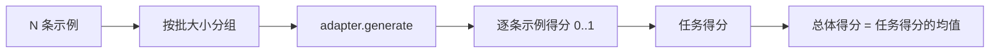

# 语言模型评估框架

> 一个在无法定义的任务上表现良好的模型，只是偶然如此。该框架即是任务定义、评测指标、运行器和排行榜，被封装在一个简短且可互换的结构中。

**类型：** 构建
**语言：** Python
**前置条件：** Phase 19 第 42 至 45 课
**时间：** ~90 分钟

## 学习目标

- 将任务定义为 JSONL 文件，每条示例包含 `prompt`、`targets`、`metric` 和可选的 `extras`。
- 实现五种指标：精确匹配、Rouge-L F1、可执行检查、多项选择题和子串包含。
- 构建运行器，按任务对示例进行批处理并分发到可替换的模型适配器。
- 输出排行榜 JSON，包含每项任务的分数、延迟以及可复现的总体平均值。

## 问题所在

每周都有新的语言模型上线。营销宣传声称它"表现良好"。诚实的问题是：好在什么上？诚实的答案是你自己写的排行榜，因为厂商的排行榜是他们精心调优过的。

没有框架时，你通过"感觉"比较两个模型。有了框架，你通过固定任务集上的固定指标得分比较，输出 JSON 可以 diff。框架是"昨天的运行"与"今天的运行"之间的契约。没有它，回归问题会被带进生产。

陷阱在于让框架过度适配单个模型。解法正好相反：框架要足够小（十五分钟可读完），任务要足够小（可以提交到仓库），指标要从零写起（让同事可以审计），而适配器是唯一存放模型特定代码的地方。换适配器，排行榜跟着变；换任务，排行榜也跟着变。除此之外，不应有任何其他变化。

## 概念



### 任务规范

每条示例是一行 JSONL：

```json
{"id": "arith-00", "prompt": "compute: 2 + 2", "targets": ["4"], "metric": "exact_match"}
```

对于需要评分辅助的指标，`extras` 携带附加负载：

```json
{
  "id": "code-00",
  "prompt": "python: write a function f that doubles its input",
  "targets": ["ok"],
  "metric": "code_exec",
  "extras": {"io_pairs": [[1, 2], [3, 6]]}
}
```

任务是一个位于 `outputs/tasks/` 下的 `.jsonl` 文件。文件名即任务名。同一个文件中的所有示例共享同一个指标。

### 五个示例任务

| 任务 | 指标 | 测试内容 |
|------|--------|---------------|
| arithmetic | exact_match | 确定性答案的词元级正确性 |
| summary | rouge_l | 与一行参考摘要的最长公共子序列 F1 |
| code-exec | code_exec | 可执行测试：预测函数必须满足一组输入-输出对 |
| multiple-choice | multiple_choice | 预测的首字母必须匹配允许字母之一 |
| generation | substring_contains | 自由文本必须至少包含一个目标子串 |

### 指标契约

每个指标都是从 `(prediction, targets, extras) -> [0.0, 1.0] 区间浮点数` 的函数。框架对逐条示例得分取平均得到任务分，再对所有任务分取平均得到总体分。这些指标函数都很短小：

- `exact_match`：转小写，折叠空白，判断相等。
- `substring_contains`：相同归一化，子串测试。
- `multiple_choice`：首字符大写处理。
- `rouge_l`：LCS 长度除以预测和参考的长度，计算精确率和召回率的 F1。
- `code_exec`：在受限命名空间中执行预测，对每个输入-输出对调用 `f(x)`，统计匹配数。

`code_exec` 指标在一个剔除内置函数的命名空间中运行预测代码。课程的测试断言 `import os` 会抛出异常，因为 `os` 不在命名空间中；你无法从代码预测中访问文件系统。

### 模型适配器

```python
class ModelAdapter(Protocol):
    def generate(self, prompts: Sequence[str]) -> List[str]: ...
    @property
    def name(self) -> str: ...
```

适配器是连接点。课程附带 `ToyAdapter`，一个确定性模式匹配器，对五个示例任务中的每条提示都能返回正确答案。真实适配器会调用模型并返回其输出。框架不关心你用的是哪一种。

### 运行器

`run_task` 按 `batch_size` 批量处理提示并分发到指标函数。`run_leaderboard` 遍历所有任务并计算平均值。`write_leaderboard` 输出带有 schema 字符串的 JSON，这样未来的格式变更不会静默破坏看板。



```figure
eval-harness-matrix
```

## 构建

`code/main.py` 是可运行的产物。

### 步骤 1：生成示例任务

`seed_fixture_tasks(target_dir)` 写入五个 `.jsonl` 文件。`main.py` 首次运行时，如果目录为空则自动播种。

### 步骤 2：加载任务

`load_all_tasks(task_dir)` 读取所有 `.jsonl` 文件，返回从任务名到 `Example` 记录列表的字典。以 `#` 开头的注释行和空行会被跳过，以便贡献者注释文件。

### 步骤 3：实现指标

每个指标是一个小函数，配有单元测试。课程的测试套件包含 13 个用例，覆盖归一化、部分重叠、代码执行和不安全代码拒绝。

### 步骤 4：编写运行器

`run_task` 迭代批次并生成包含分数、正确数、总数和延迟的 `TaskResult`。`run_leaderboard` 遍历所有任务并生成包含总体平均值的 `Leaderboard`。

### 步骤 5：输出 JSON

`write_leaderboard` 序列化排行榜。`--include-per-example` 标志会导出逐条示例记录，以便分数变化时对比预测结果与上次运行。

运行：

```bash
python3 code/main.py
```

脚本在首次运行时播种示例任务，使用玩具适配器评分（对每个示例均返回正确答案），然后写入 `outputs/leaderboard.json`。使用玩具适配器时总体得分为 1.0；`test_main.py` 中的存根适配器测试展示了同一框架在适配器无法作答时产生 0.0 分。

## 使用方式

要接入真实模型，编写一个适配器即可。形状如下：

```python
class HttpAdapter:
    name = "vendor.v1"

    def __init__(self, endpoint, api_key):
        self.endpoint = endpoint
        self.api_key = api_key

    def generate(self, prompts):
        out = []
        for prompt in prompts:
            response = http_post(self.endpoint, prompt, self.api_key)
            out.append(response["text"])
        return out
```

在 `main()` 顶部将 `ToyAdapter` 替换为 `HttpAdapter`。框架、任务、指标和排行榜保持不变。

在真实项目中交付框架时，强制执行三种模式：

- **锁定任务文件。** `leaderboard.json` 应附带哈希锁定的任务内容，或者连同 JSONL 文件一起提交；否则当任务文件变更时分数也会变动，你将无法区分原因。
- **Diff 预测，而非仅看分数。** `--include-per-example` 标志让你能在分数下降的那一天看到模型说了什么。
- **限制批大小。** 真实适配器有速率限制。小批大小使框架在不同厂商之间保持兼容。

## 交付

`outputs/skill-lm-eval-harness.md` 承载了配方：JSONL 任务规范、五种指标、可替换适配器、批量运行器、带 schema 字符串的排行榜 JSON。`outputs/tasks/` 中的任务文件是示例；将其复制到真实项目中作为起点。

## 练习

1. 添加第六个任务，并从零编写自定义指标（类 BLEU 重叠、类 BLEURT 参考评分，任何具有明确契约的均可）。
2. 扩展 `code_exec` 以捕获 stdout 并将预期的 stdout 列表作为 targets。
3. 添加排行榜 diff 命令：给定两个 `leaderboard.json` 文件，打印哪些任务发生变化及变化幅度。
4. 限制每条示例的延迟上限。用超时包装适配器调用；在排行榜中暴露单独的 `timeouts` 列。
5. 在排行榜中使用 sha256 锁定任务内容，使未来的读者可以验证他们评分的是相同的任务。

## 关键术语

| 术语 | 人们怎么说 | 实际含义 |
|------|-----------------|------------------------|
| Task spec | "评估格式" | 包含 prompt、targets、metric、可选 extras 的 JSONL 文件 |
| Metric | "如何评分" | 从 (prediction, targets, extras) 到 [0, 1] 区间的浮点函数 |
| Adapter | "模型客户端" | 具有 `generate(prompts) -> list[str]` 方法的对象；唯一存放模型特定代码的地方 |
| Leaderboard | "记分板" | 包含每项任务分数、总数、延迟和总体平均值的 JSON |
| Code exec metric | "跑一下看看" | 在受限命名空间中执行预测，与输入-输出对进行比较 |

## 延伸阅读

- 原始的 lm-evaluation-harness：生产参考实现，规模更大但结构相同。
- HuggingFace 的 lighteval：同一契约的另一种实现。
- Phase 19 第 46 课：涵盖框架所评分的训练栈中使用的梯度累积模式。
- Phase 19 第 47 课：涵盖你要对标评分的检查点格式；在排行榜中锁定检查点哈希。
- Phase 19 第 48 课：涵盖生成被测模型的分布式训练栈。
