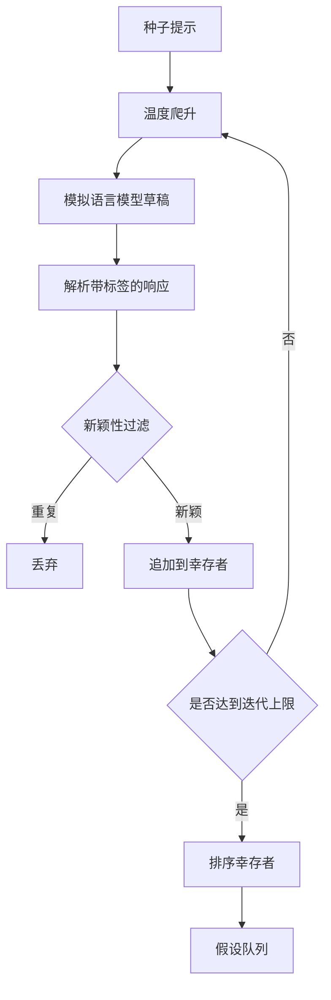

# 假设生成器

> 一个研究代理如果两次问同一个问题，就是在浪费token。关键是要强制每份草稿落在一个新的位置上。

**类型：** 构建
**语言：** Python
**前置条件：** 第19阶段A轨课程20-29
**时间：** 约90分钟

## 学习目标
- 根据种子提示驱动采样器，并将其输出转换为类型化的假设记录。
- 在每次迭代中逐步提高采样器温度，使下一份草稿比上一份偏离得更远。
- 使用小型嵌入模型和余弦距离阈值来过滤近似重复项。
- 用融合新颖性、具体性和可测试性的评分函数对筛选后的假设进行排序。
- 确保每个步骤都是确定性的，使相同的种子始终产生相同的队列。

## 为什么要先生成，再过滤

一个只向模型询问一次的规划器只会得到一个假设。对于工作示例来说这没问题。但对于研究循环来说，这是错误的形状。循环需要一个有深度的排序队列，这样当第一个假设失败时，执行器已经准备好了下一个，而无需再支付一次完整采样过程的代价。

两个想法结合来产生这个队列。第一种是温度爬升：每次通过采样器都会把温度提高一档，从而鼓励后续草稿偏离方向。第二种是新颖性过滤：每生成一份草稿后，生成器测量其与所有先前幸存者的嵌入距离，并拒绝任何落在聚类内的内容。

课程自带一个模拟语言模型，对于固定提示返回预设的 token 序列。这个模拟模型足以用于测试完整路径：种子提示输入 → 应用温度爬升 → 解析候选项 → 运行新颖性过滤 → 输出排序队列。

## Hypothesis 形状

```text
Hypothesis
  id             : int           (一次运行中单调递增)
  text           : str           (声明内容)
  variables      : list[str]     (不同条件之间的变化变量)
  metric         : str           (执行器将测量的指标)
  baseline_ref   : str | None    (比较引用的论文或运行)
  draft_pass     : int           (哪次采样迭代生成了这份草稿)
  temperature    : float         (生成草稿时的采样器设置)
  novelty_score  : float         (与先前幸存者的距离，范围0..1)
  rank_score     : float         (用于排序的加权求和)
```

`variables` 和 `metric` 不是自由文本。解析器从带标签的响应中提取它们。第52课的执行器在构建实验配置时会直接读取这些字段。

`baseline_ref` 是可选的但建议使用。第53课的评估器需要一个基线来进行比较。如果假设中省略了该项，评估器会回退到同一指标的上一次运行结果。

```figure
cg-novelty-ramp
```

## 架构



循环非常直接。有趣的地方在于每个框都有严格的契约。

## 温度爬升

从 `t_min` 开始，到 `t_max` 结束，步长为 `(t_max - t_min) / (n_passes - 1)`。每次迭代在当前温度下调用采样器，从 `GeneratorConfig.schedule()` 产生一组均匀分布的值。模拟模型通过根据 `(prompt, temp_bucket)` 键切换预设响应来尊重温度设置。这些桶是开区间，所以温度的微小变化就会切换到不同的桶并产生不同的草稿。在生产环境中，采样器会是一个真实的模型，将 `temperature=t` 透传进去。

默认调度是六次迭代，从 `0.2` 到 `1.2`。六次足以填满队列，而无需为会被新颖性过滤器过滤掉的样本付费。低于 `0.2` 时模型会复述种子内容；高于 `1.2` 时回复倾向于偏离主题并导致解析失败。

## 新颖性过滤

每份草稿解析后，生成器对文本进行嵌入，并与每个已接受的假设进行比较。嵌入是一个小型哈希词袋，归一化为单位长度。两个单位向量之间的余弦距离为 `1 - dot(a, b)`。草稿只有当它与任意先前幸存者的最小距离超过 `novelty_threshold` 时才通过。默认值为 `0.25`。

这个哈希嵌入并不复杂。它是确定性的、零依赖的，足以捕捉最明显的情况：两个草稿共享大部分名词。在生产部署中会换成小型句子模型。接口保持不变。

## 排名分数

```text
rank_score = w_novelty * novelty_score
           + w_specificity * specificity_score
           + w_testability * testability_score
```

三个子分数。`novelty_score` 是到先前幸存者的最小嵌入距离。`specificity_score` 是假设中具体变量的数量除以目标数量。`testability_score` 是：如果假设同时指定了指标和基线则为1，仅有指标则为0.5，否则为0。

默认权重为 `0.4`、`0.3`、`0.3`。权重存储在生成器配置中，以便后续课程可以在不修改代码的情况下调整它们。

## 模拟语言模型

```python
class MockLLM:
    def sample(self, prompt: str, temperature: float, seed: int) -> str:
        ...
```

给定 `(prompt, temperature, seed)` 三元组，采样器是确定性的。模拟模型维护一张基于 `(prompt_signature, temperature_bucket)` 键的预设响应表。如果表中没有对应条目，采样器返回一个无法通过解析器的 fallback 响应。fallback 路径会被其中一个测试用例覆盖。

seed 被混入响应中，使得相同的 `(prompt, temperature)` 对不同 seed 产生不同的草稿。在测试中我们固定 seed 以保证结果可复现。在实际部署中，seed 会来自系统时钟或计数器。

## 输出队列

输出是一个按 `rank_score` 降序排列的 `Hypothesis` 记录列表。第52课的执行器弹出队首，运行实验，第53课的评估器将判决写回。如果判决表明假设为假，执行器会弹出下一个假设。

队列是有限的。当队列为空时，编排器可以扩展种子提示词并重新运行生成器，或者停止并报告预算已耗尽。

## 如何阅读代码

`code/main.py` 定义了 `Hypothesis`、`MockLLM`、`HypothesisGenerator`，以及一个确定性演示程序。生成器暴露了一个单一的 `run(seed_prompt)` 方法，返回排序后的队列；迭代次数从 `GeneratorConfig.n_passes` 读取而非作为参数传入。嵌入是 token 的哈希词袋。新颖性过滤是一个单独的函数。排名分数也是一个单独的函数。代码不依赖 `numpy`；嵌入数学完全使用标准库实现，确保课程保持可移植性。

`code/tests/test_generator.py` 覆盖了线性路径、重复项拒绝路径、解析器失败路径、温度爬升边界以及排名顺序。

## 本课程的位置

第50课生成队列。第51课取出队列头部并进行文献搜索以确认或反驳它。第52课取出同一个队首并运行实际实验。第53课读取两份输出并撰写判决。这四课组合成一个没有人工参与的研究循环；人工可以在任何边界处介入。
