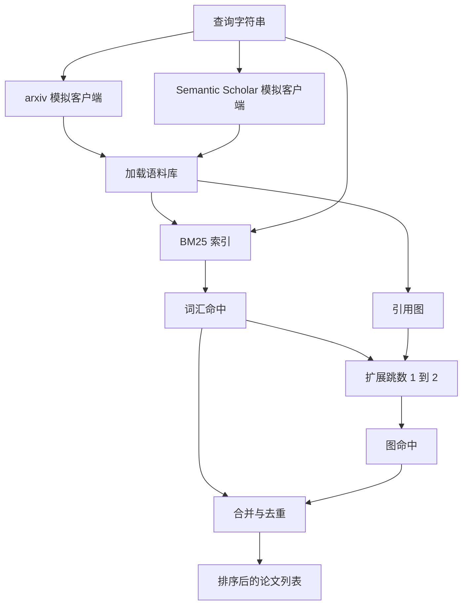

# 文献检索

> 假设成本很低。知道是否有人已经证明过它才是关键。在 runner 启动沙箱之前，构建能回答这一问题的检索层。

**类型：** Build
**语言：** Python
**前置条件：** Phase 19 Track A 第 20-29 课
**时间：** 约 90 分钟

## 学习目标
- 建模一个包含下游循环所需字段的简单论文记录。
- 仅使用标准库数据结构，基于摘要构建 BM25 索引。
- 遍历引用图，挖掘词汇搜索遗漏的论文。
- 通过稳定的论文 ID 对词汇和图两个阶段的命中结果进行去重。
- 将两个模拟外部 API 封装在单一客户端之后，以便真实端点上线时上游调用点保持不变。

## 为什么需要两轮检索

对摘要进行关键词搜索会返回与查询共享词汇的论文。这能覆盖大部分情况，但会遗漏两种情形。第一种是奠基论文使用了不同的词汇；例如，查询“sparse attention”会漏掉一篇题为“block selection in transformer routing”的论文。第二种是相关论文是引用了某个已知锚点论文的后续研究；与其暴力遍历整个摘要池，不如找到锚点并向前追溯更为高效。

本课同时构建两轮检索。BM25 用于摘要以捕获词汇命中。引用图遍历以一或两跳的幅度向前和向后扩展种子集合。并对合集按论文 ID 去重，通过一个简单的综合评分进行排序。

## Paper 结构

```text
Paper
  id          : str           (stable identifier, "p001" for the mock corpus)
  title       : str
  abstract    : str
  year        : int
  authors     : list[str]
  references  : list[str]     (paper ids this paper cites)
  citations   : list[str]     (paper ids that cite this paper)
  source      : str           (which mock api supplied it, "arxiv" or "s2")
```

references 和 citations 字段构成有向引用图。两个模拟 API 返回重叠但不完全相同的字段，因此语料库加载器按 `id` 进行合并。

```figure
cg-citation-hops
```

## 架构



检索客户端负责两轮检索与合并。调用者传入查询，返回一个排序列表，其中每条记录携带解释排序的逐论文评分字段（`bm25_score`、`graph_distance`、`recency_score`、`final_score`）。

## 从零实现 BM25

该实现为标准 Okapi BM25，默认参数为 `k1=1.5`、`b=0.75`。索引包含两个字典：`term -> doc_frequency` 和 `term -> list of (doc_id, term_count)`。文档长度为摘要的 token 数量。平均文档长度在建立索引时计算一次。对查询评分是对查询词求和的 `idf * tf_norm`，其中 `tf_norm` 为标准 BM25 长度归一化词频。

分词器先执行 `lower`，再按非字母数字字符分割。不做词干提取。生产环境会替换为轻量词干提取器。接口保持不变。

```text
idf(t)      = log((N - df + 0.5) / (df + 0.5) + 1.0)
tf_norm(t)  = (f * (k1 + 1)) / (f + k1 * (1 - b + b * dl / avgdl))
score(d, q) = sum over t in q of idf(t) * tf_norm(t)
```

## 引用图遍历

图从语料库构建一次。正向边从论文指向其引用的论文。反向边从论文指向引用它的论文。遍历过程是以 BM25 排名靠前的命中结果为种子进行广度优先搜索（BFS），最多两跳。

两跳是刻意设置的上限。一跳太浅；智能体通常需要直接祖先或后代。三跳会在连通图上导致结果数量爆炸，且容易偏离主题。本课将跳数限制暴露为配置项，以便下游循环可以收紧它。

## 去重与排序

两轮检索返回重叠的集合。合并以论文 ID 为键。每篇论文的最终得分是加权组合。

```text
final_score = w_bm25 * bm25_score_norm
            + w_graph * graph_score
            + w_recency * recency_score
```

`bm25_score_norm` 是将 BM25 得分除以合并集合中的最大 BM25 得分（使该字段值域在 0 到 1 之间）。`graph_score` 对于直接词汇命中为 1，一跳为 `0.6`，两跳为 `0.3`，否则为 0。`recency_score` 是从语料库最小年份的 0 到最大年份的 1 的线性递增。

默认权重为 `0.5`、`0.3`、`0.2`。权重是配置项；过时的主题可能会调低时效性权重，而快速演进的主题则会提高它。

## 模拟语料库

语料库由 `build_corpus()` 生成，包含一百篇论文。每篇论文的手工撰写标题和摘要均属于五个主题之一：attention sparsity、retrieval augmentation、low rank adapters、dataset distillation 和 evaluation harnesses。references 和 citations 已预先连接，使每个主题形成连通的子图，并带有少量跨主题边。

两个模拟 API 客户端（`ArxivMockClient`、`SemanticScholarMockClient`）读取同一个语料库，但暴露不同的字段。Arxiv 返回 title、abstract、year、authors。Semantic Scholar 额外增加 references 和 citations。检索客户端按 id 合并；跨客户端字段不一致的处理推迟到后续课程。

## 第 52 和 53 课读取哪些字段

第 52 课的 runner 读取 `paper.id`、`paper.title` 以及摘要的前三句作为实验上下文。第 53 课的 evaluator 读取 `paper.year` 和 `paper.references` 以便将基线归因于特定论文。

检索客户端返回包含排序列表和逐查询指标的 `RetrievalResult`：命中数量、平均得分、最高得分、总运行时间。runner 会记录这些指标，以便下游的可观测模块绘制质量随时间的变化曲线。

## 如何阅读代码

`code/main.py` 定义了 `Paper`、`ArxivMockClient`、`SemanticScholarMockClient`、`BM25Index`、`CitationGraph`、`RetrievalClient` 以及一个确定性演示程序。模拟客户端和语料库放在同一文件中，以便本课保持可移植性。BM25 实现为一个类，共六十行。图遍历为一个方法。

`code/tests/test_retrieval.py` 覆盖了词汇路径、图路径、合并、去重以及空查询的测试。

## 本课在整体中的位置

第 50 课生成假设。第 51 课搜索文献，查看该假设是否已被解决。第 52 课在未解决时运行实验。第 53 课读取检索结果与实验指标以撰写结论。检索客户端是这四个阶段中最轻量级的，并在编排器中率先运行。
