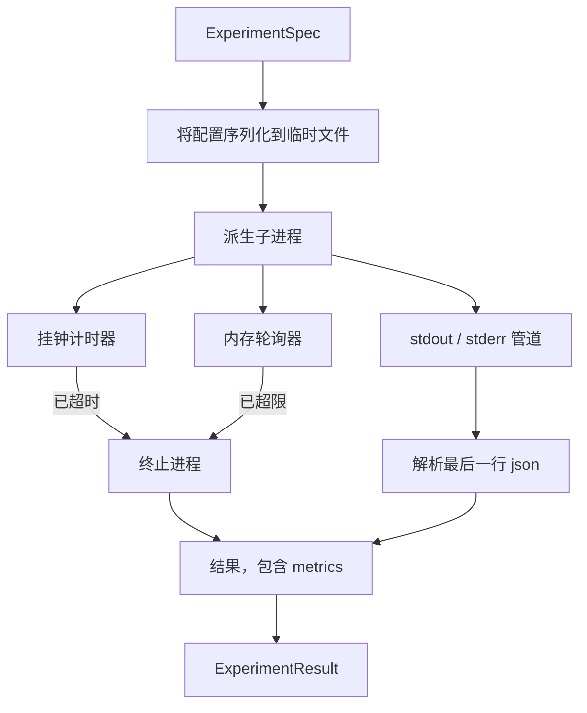

# 实验运行器

> 循环的诚实程度取决于它的测量。构建一个运行器，接收规范，在沙箱子进程中执行，并输出评估器可以信任的 json 指标数据。

**类型：** 构建
**语言：** Python
**前置知识：** Phase 19 Track A 课程 20-29
**时间：** 约 90 分钟

## 学习目标
- 将实验编码为类型化的规范，运行器可将其序列化到子进程中。
- 启动子进程，设置严格的挂钟超时和软性内存上限，并将两者作为终止条件呈现。
- 捕获 stdout、stderr 和结构化指标数据，合并为单个结果记录。
- 构建消融表，在固定基础规范上逐个扫描一个配置参数。
- 给定种子后保持每次结果确定，使评估器在不同运行中看到相同的数值。

## 为什么使用子进程

研究循环运行不受信任的代码。假设来自采样器，实验脚本来自同一路径；将它们视为安全的进程内执行是在寻求一场可能拖倒协调器的崩溃。子进程是该语言提供的最简单隔离：独立的进程、独立的地址空间、父进程侧的信号句柄。

这里的运行器未实现完整的沙箱隔离。没有 cgroup、没有 seccomp 过滤器、没有命名空间重映射。它具备的是挂钟超时、用于内存增长的轮询循环，以及在任一限制被触发时终止进程的kill路径。这是更复杂沙箱扩展的运行时契约。本课程将契约控制在一次能读完的范围内。

## 实验规范的结构

```text
ExperimentSpec
  spec_id        : str            （稳定标识，"exp_001"）
  hypothesis_id  : int            （链接回第50课的队列）
  script_path    : str            （要运行的 Python 脚本路径）
  config         : dict           （作为单个 json 参数传递给脚本）
  seed           : int            （实验的确定性种子）
  wall_timeout_s : float          （硬超时，超出则被终止）
  memory_cap_mb  : int            （软上限，轮询检测；超出则被终止）
  metric_keys    : list[str]      （评估器将要读取的字段）
```

脚本存储在磁盘上；运行器将配置写入临时文件路径，由脚本读取。预期脚本在 stdout 上打印单行 json，其键是 `metric_keys` 的超集。stdout 上的任何其他内容会被捕获但被指标解析器忽略。

```figure
cg-runner-limits
```

## 架构



运行器是一个类，含一个主方法。轮询器是一个小型线程，每隔轮询间隔唤醒一次，并在平台可用时从 proc 文件系统读取子进程的 `psutil` 等价信息；当平台未暴露该信息时回退为 no-op。

## 为什么使用软性内存上限

硬性内存上限需要 `resource.setrlimit`，且仅在 POSIX 上有效。本课程提供一个跨平台的方案：从平台轮询驻留集大小，若超过上限则终止子进程。上限是软性的，因为轮询器有非零间隔；进程可能在两次轮询之间超过上限，然后再回落。运行器会记录观测到的最大 RSS，以便评估器查看运行距离限制有多近。

在没有进程检测支持的系统上，轮询器记录一次警告并禁用自身。挂钟超时仍然生效。课程测试覆盖两种路径。

## 捕获 stdout 和 stderr

运行器读取两个管道，在进程完成后排空。逐行扫描 stdout；最后能解析为 json 且包含所有必需 `metric_keys` 的行被视为指标数据。之前的 json 行保留在结果中作为 `intermediate_metrics`；评估器可用它们绘制学习曲线。

stderr 原样捕获到结果中。运行器在非零退出码时不抛出异常；而是将退出码记录在结果中。任何非零退出都被标记为 `"crash"`，即使脚本打印了指标，因此评估器默认将部分运行视为失败。

## 消融表

```python
def ablate(base: ExperimentSpec, knob: str, values: list[Any]) -> list[ExperimentSpec]:
    ...
```

给定一个基础规范和参数名，辅助函数返回每个值对应一个规范，其中 `config[knob]` 被覆盖。每个规范获得一个派生的 `spec_id`（格式为 `f"{base.spec_id}_{knob}_{value}"`）。运行器提供 `AblationRunner`，按顺序运行它们并返回以参数值为键的 `AblationTable`。

为什么每次只扫一个参数。全因子扫描呈指数级爆炸，产生的结果评估器无法解读。一次一个参数产生清晰的轴，评估器可以绘图。课程仅支持将多参数扫描作为由调用方组合的重复单参数消融。

## 确定性

每个规范携带一个种子。运行器通过 config 字典将种子转发给脚本（`config["__seed"] = spec.seed`）。`code/experiments/` 中的模拟实验脚本尊重种子，跨运行产生相同的指标。第53课的评估器依赖于此；若无确定性，"退化"可能只是不同的随机初始化。

## 模拟实验脚本

课程提供一个实验脚本：`code/experiments/sparsity_experiment.py`。它是一个真实的脚本，读取其配置文件，使用 numpy 随机过程模拟小型训练运行，并在完成时打印单行 json 指标数据。该脚本支持 `sleep_s` 参数用于测试超时，以及 `allocate_mb` 参数用于测试内存轮询器。

该模拟并未真正训练任何模型。它是一个数值计算，模仿训练循环的形状：损失曲线、最终困惑度、挂钟时间。本课程的要点是运行器，而非模拟。真实实验脚本会导入一个模型。

## 结果结构

```text
ExperimentResult
  spec_id              : str
  hypothesis_id        : int
  exit_code            : int
  terminal             : "ok" | "timeout" | "oom" | "crash"
  wall_time_s          : float
  peak_rss_mb          : float | None
  metrics              : dict
  intermediate_metrics : list[dict]
  stdout_tail          : str
  stderr_tail          : str
```

评估器首先读取 `metrics` 和 `terminal`。如果 terminal 不是 `"ok"`，实验计为失败运行，评估器的判定自动得出。否则指标通过显著性测试。

## 如何阅读代码

`code/main.py` 定义 `ExperimentSpec`、`ExperimentResult`、`ExperimentRunner`、`AblationRunner` 以及一个确定性演示。子进程管理是一个类。内存轮询器是一个小型线程。消融辅助函数是一个单函数。

`code/experiments/sparsity_experiment.py` 是测试中使用的模拟实验。它从 argv 读取配置文件路径，在完成时写入单行 json 指标。

`code/tests/test_runner.py` 覆盖成功路径、超时路径、崩溃路径、消融表，以及跨两次运行的确定性检查。

## 本课的归属

第50课生成假设。第51课过滤掉文献已定论的内容。第52课对剩余内容运行实验。第53课读取结果，运行显著性测试，并将裁决写入协调器存储在假设 id 下的位置。
