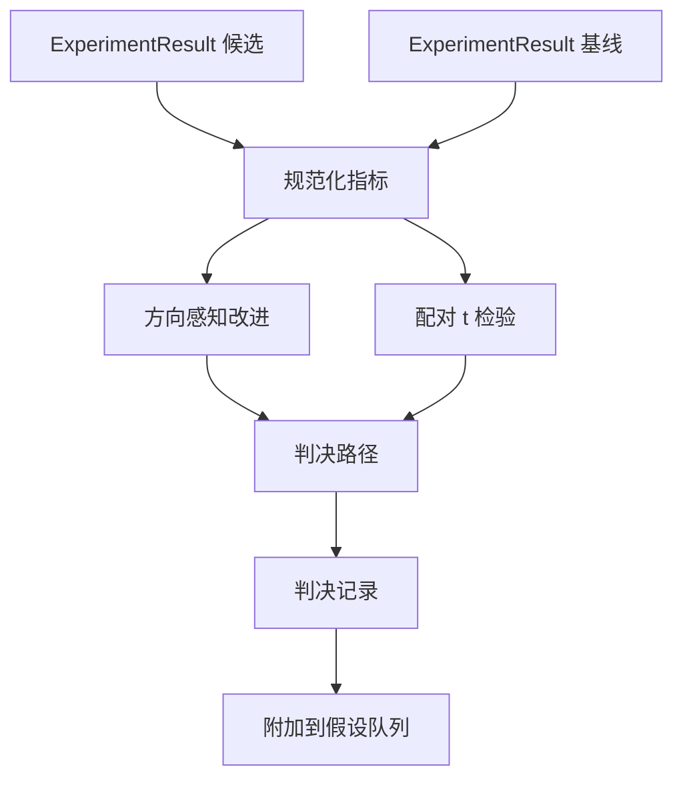

# 结果评估器

> 运行器产生数字。评估器决定这些数字是改进、退化还是噪声。构建判决路径，将指标转化为单行结论。

**类型：** 构建
**语言：** Python
**前置条件：** Phase 19 Track A 课程 20-29
**时间：** ~90 分钟

## 学习目标
- 使用方向感知的改进和固定阈值，将候选运行与基线进行比较。
- 从 scratch 运行配对的 t 检验，处理按 seed 分组的指标，并解读产生的 p 值。
- 规范化对数刻度的指标，以便下游报告能将其与线性指标融合。
- 输出每个假设的判决，供编排器在课程五十时附加到队列中。
- 保持所有步骤的纯粹性，使得相同的输入总是产生相同的判决。

## 为什么使用配对检验

运行器给出的单个数字并不能说明变化是否真实。相同配置下，不同的 seed 会得到不同的困惑度。这种变化可能是噪声。正确的比较方式是配对：相同的 seed、相同的数据，分别用候选配置和基线配置各跑一次。每个 seed 贡献一个差值。这些差值的均值就是效应量。这些差值的标准误就是噪声底。

本课程从 scratch 实现该检验。没有 `scipy.stats`。数学量很小，一屏即可读完。

```text
diffs    = [a_i - b_i for i in seeds]
mean     = sum(diffs) / n
variance = sum((d - mean) ** 2 for d in diffs) / (n - 1)
t_stat   = mean / sqrt(variance / n)
df       = n - 1
p_value  = two_sided_p(t_stat, df)
```

双边 p 值使用正则化的不完全 beta 函数。课程附带了一个小的实现，采用 Lentz 连分数方法。整个过程只有六十行标准库数学代码。

## 方向感知的改进

有些指标是越高越好（准确率、吞吐量）。有些指标是越低越好（损失、困惑度、墙钟时间）。评估器在每个指标上携带一个 `direction` 字段。

```text
if direction == "higher_is_better":
    improvement = (candidate - baseline) / abs(baseline)
elif direction == "lower_is_better":
    improvement = (baseline - candidate) / abs(baseline)
```

改进值是带符号的。对于"越高越好"的指标，负改进意味着候选更差。判决路径同时读取符号和幅度。

一个固定阈值（`improvement_threshold=0.02`，即 2%）决定变化是否足够大以判定为有意义。低于该阈值的判决为"噪声"，无论 p 值如何；循环不关心用户无法测量的变化。

```figure
cg-paired-verdict
```

## 架构



评估器运行三个独立计算，并在判决路径中汇聚它们。每个计算都是一个无共享状态的纯函数。

## 对数规范化

困惑度是损失值的指数。损失下降 0.1 对应困惑度更大的下降。直接比较两个配置下的困惑度是可以的，但要将困惑度与线性指标融合到同一个报告中，就需要规范化。

对于 `scale` 字段为 `"log"` 的任何指标，评估器在计算改进之前先取自然对数。然后在对数空间中应用阈值。困惑度从 32 降到 28 在"越低越好"指标上为 `log(28) - log(32) = -0.133`，远高于 2% 阈值。

```text
if scale == "log":
    a = log(candidate)
    b = log(baseline)
else:
    a = candidate
    b = baseline
```

`scale="linear"`（默认）的指标跳过变换。同一段代码路径处理两种情况。

## 按 seed 的配对检验

第五十二课的运行器每次运行只输出一个最终的指标 blob。对于配对检验，评估器需要每个 seed 各有一个 blob——候选和基线各一份。编排器在 seed 列表上以两种配置分别运行同一实验，并将两个 `ExperimentResult` 记录列表交给评估器。

评估器按 seed 配对（seed 存储在 `result.metrics["seed"]` 中），然后遍历请求的指标。如果两个列表中的 seed 不匹配，评估器抛出 `PairingError`。编排器应重新运行。

## 判决结构

```text
Verdict
  hypothesis_id          : int
  metric                 : str
  direction              : "higher_is_better" | "lower_is_better"
  scale                  : "linear" | "log"
  candidate_mean         : float
  baseline_mean          : float
  improvement            : float       (带符号，分数形式；参见方向规则)
  p_value                : float | None  (n < 2 时为 None)
  significance_threshold : float
  improvement_threshold  : float
  verdict                : "improved" | "regressed" | "noise" | "failed"
  rationale              : str
```

判决路径是一个小型决策表：

```text
1. 若任意候选结果 terminal != "ok"：verdict = "failed"
2. 否则若 |improvement| < improvement_threshold：verdict = "noise"
3. 否则若 p_value 为 None 或 p_value > significance：verdict = "noise"
4. 否则若 improvement > 0：                          verdict = "improved"
5. 否则：                                             verdict = "regressed"
```

rationale 是一句人工可读的一句话，编排器可针对假设 id 记录日志。

## 如何阅读代码

`code/main.py` 定义了 `MetricSpec`、`Verdict`、`Evaluator`、t 统计量和不完全 beta 辅助函数，以及一个确定性示例。t 检验完全用标准库数学实现；numpy 仅用于读取指标列表和计算均值与方差。

`code/tests/test_evaluator.py` 覆盖了以下场景：改进路径、退化路径、噪声路径（微小改进）、噪声路径（样本量不足）、terminal 失败路径、对数规范化路径、与已知参考值的 t 检验，以及配对错误。

## 本课在整体中的位置

第五十课生成了假设队列。第五十一课过滤掉了文献已定论的假设。第五十二课在候选和基线配置下按 seed 运行了实验。第五十三课读取这些运行结果并写出判决。编排器将四者串联起来：

```text
for hypothesis in queue:
    literature = retrieval.search(hypothesis.text)
    if literature_settles(hypothesis, literature):
        attach(hypothesis, verdict="settled")
        continue
    candidates = runner.run_all(specs_for(hypothesis))
    baselines  = runner.run_all(baseline_specs_for(hypothesis))
    metric_spec = MetricSpec("perplexity", direction=LOWER, scale=LOG)
    verdict = evaluator.evaluate(hypothesis.id, metric_spec, candidates, baselines)
    attach(hypothesis, verdict)
```

该编排器不在本课中；这四课通过各自定义的 dataclass 无缝组合，无需额外胶水代码。
