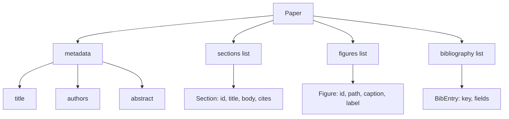
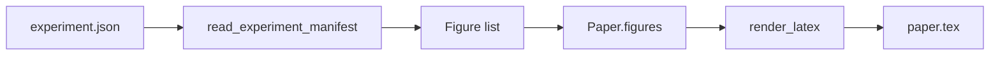
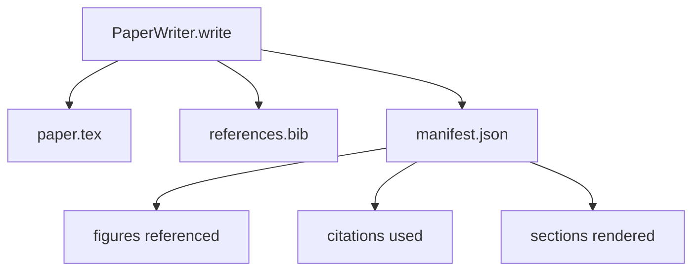

# Paper Writer

> LaTeX 骨架是研究者与排版者之间的契约。若契约被破坏，文档便无法编译，且错误会清晰暴露。先构建骨架，再填充内容。

**类型：** 构建
**语言：** Python
**前置条件：** Phase 19 课程 50-53
**时间：** 约 90 分钟

## 学习目标

- 将研究论文视为具有已知章节结构的结构化产物，而非自由形式的文档。
- 在撰写任何正文之前，生成一个声明了摘要、章节、图表槽位和参考文献键的 LaTeX 骨架。
- 通过确定性的槽机制，将实验输出的图表（路径与说明）注入骨架。
- 接入一个模拟的散文生成器，使其依据结构化大纲逐段填充各章节，从而在没有模型的情况下使测试套件可运行。
- 输出单个 `paper.tex` 文件、`references.bib` 文件，以及一份列出所有引用图表和所有参考文献条目的清单（manifest）。

```figure
ch-paper-skeleton
```

## 为何先构建骨架

以散文开头的草稿会不断累积结构性债务。引言可能膨胀出三个本应属于相关工作的段落。图表可能在定义之前就已被引用。参考文献末尾会出现指向同一篇论文的多个键。等到作者发现问题时，重写成本早已高于写作成本。

骨架则逆转了这一过程。结构以前置数据的形式声明。章节是按名称和顺序排列的槽位。图表是按 id 和说明排列的槽位。参考文献键在顶层声明，并指向对应的条目。散文按槽位逐一生成。测试套件可以在生成任何散文之前进行验证：每个图表都有对应的槽位、每个引用都有对应的条目、每个章节都出现在目录中。

这与之前课程应用于计划、工具调用和追踪记录的纪律相同：结构就是契约。

## Paper 的结构



所有字段均为纯 Python 数据结构。渲染器是一个从 `Paper` 到 LaTeX 字符串的纯函数。测试套件可以在渲染之前对论文进行内省：统计章节数量、列出缺失的图表文件、检查每个 `\cite{key}` 是否都有对应的 `BibEntry`。

## 渲染契约

渲染器保证三个属性。第一，骨架中的每个图表槽都会生成一个 `\begin{figure}` 块，并使用形如 `fig:<id>` 的稳定标签。第二，每个章节都会生成一个 `\section{}`，并使用形如 `sec:<id>` 的稳定标签，使交叉引用正常工作。第三，参考文献部分会生成一个 `\bibliography` 块，其 `references.bib` 中恰好包含论文上声明的所有条目，不多不少。

违反其中任何一条都是渲染错误，而非警告。骨架即是契约；一个静默丢弃图表的渲染就是对契约的破坏。

## 从实验输出注入图表

本阶段的前几课将实验输出生成为 JSON 清单。每个清单携带一个制品列表，包含路径和简短说明。论文撰写器读取该清单并生成 `Figure` 记录。



注入过程是确定性的。图表 id 由实验名称加单调计数器派生。说明来自清单。路径相对于论文的**输出目录**进行归一化，以便即使实验输出存放在磁盘的其他位置，LaTeX 仍能编译。

## 模拟散文生成器

本课不调用模型。`MockProseGenerator` 读取大纲形状并确定性生成散文。大纲形状为每个章节一个短字符串。生成器将该字符串扩展为两个短段落，并将章节标题编织其中。生成的散文仅在大纲声明之处提及图表和引用。

这已足以测试撰写器的所有行为。真实实现只需将生成器替换为模型调用即可。围绕它的测试套件不会改变。这正是将散文生成器声明为可调用的价值所在：测试时替换为确定性的实现，生产时替换为模型调用，管道的其余部分完全相同。

## 清单输出

撰写器将三个文件输出到输出目录。



清单是下游评估器或批评循环读取的内容。它不解析 LaTeX；它读取清单。下一课中的批评循环将以此清单作为输入并生成反馈列表。这就是清单属于契约一部分、而 LaTeX 本身不属于契约的原因。

## 验证门

撰写器在写入任何文件之前运行四个验证门。

1. 每个图表 id 在论文中唯一。
2. 每个章节的 `cites` 字段引用的参考文献键必须在论文上已声明。
3. 摘要非空。
4. 标题非空。

门验证失败时抛出带有精确原因的 `PaperValidationError`。测试套件将该原因作为失败模式呈现。不存在部分写入：三个文件要么全部发出，要么全部不发出。

## 如何阅读代码

`code/main.py` 定义了 `Paper`、`Section`、`Figure`、`BibEntry`、`PaperValidationError`、`MockProseGenerator`、`PaperWriter` 以及 `render_latex` 函数。`write` 方法接收输出目录，并输出 `paper.tex`、`references.bib` 和 `manifest.json`。`read_experiment_manifest` 辅助函数将实验清单列表转换为 `Figure` 记录。

`code/tests/test_paper_writer.py` 覆盖的场景包括：无章节时的骨架渲染、含两个章节和两个图表的完整渲染、缺失引用验证门、重复图表 id 验证门、清单内容，以及 LaTeX 字符串契约（每个章节生成 `\section{}`，每个图表生成 `\begin{figure}`）。

## 进一步扩展

真实实现需要两个扩展。第一，多格式渲染：相同的 `Paper` 结构可编译为 Markdown（用于博客）和 HTML（用于预览）。渲染器成为 `Paper` 上的策略。第二，引用增强：撰写器根据本地 DOI 缓存从引用键获取 BibTeX 条目。两者都能带来价值，且均可在不触碰骨架契约的情况下添加。

骨架即为投注。章节、图表和引用均以数据形式声明，散文生成填入槽位，清单与 LaTeX 一并发出。所有其他改进均可在其之上组合。
