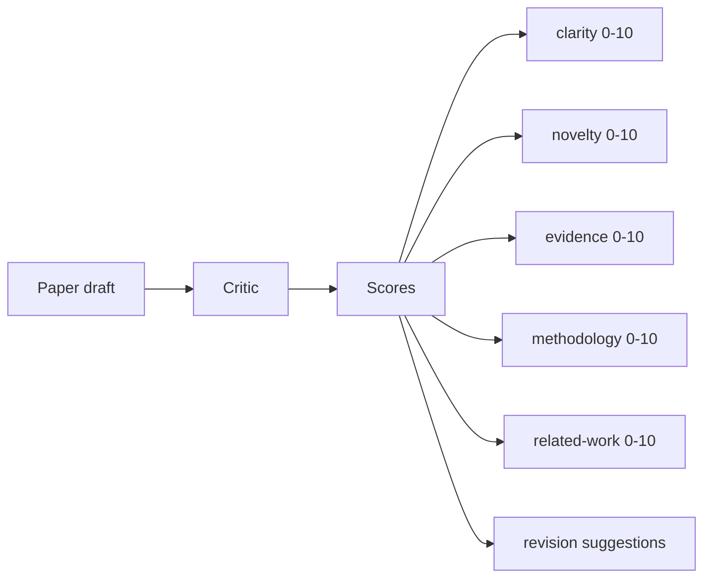
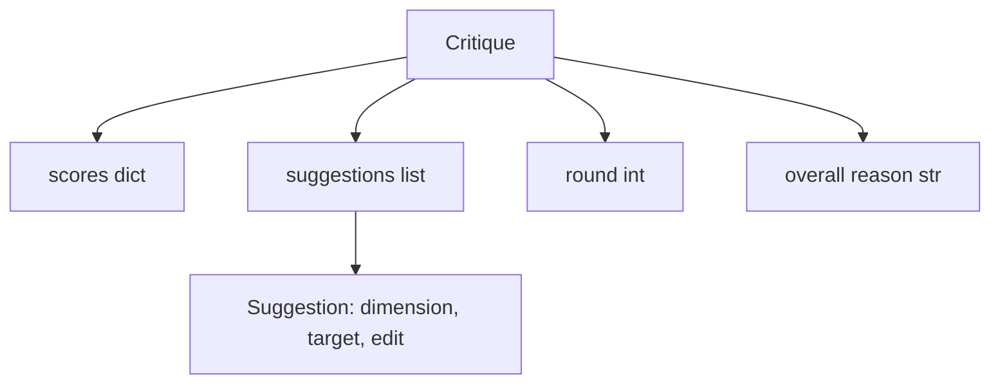
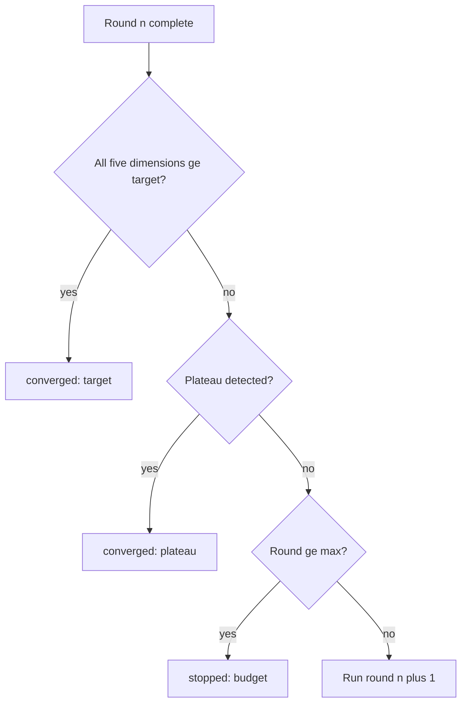
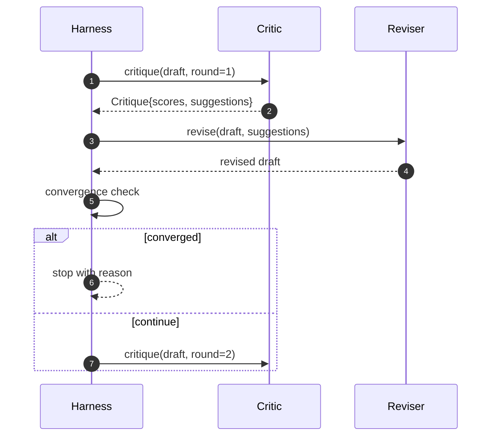

# Critic Loop

> A critic that returns "looks good" the first time is broken. A critic that always returns "needs work" is broken. The interesting critic is the one that converges, and you have to engineer convergence.

**类型：** Build
**语言：** Python
**前置要求：** Phase 19 lessons 50-53
**预计时间：** 约 90 分钟

## 学习目标

- 在五个固定维度上评估论文草稿：clarity（清晰度）、novelty（新颖性）、evidence（证据）、methodology（方法论）、related-work（相关工作）。
- 将每轮的 critique 作为结构化 revision diff 应用，而非自由格式重写。
- 通过跨轮比较分数检测 convergence（收敛）；在 plateau（平台期）出现、达到目标或预算耗尽时停止。
- 用最大迭代预算限制轮次，防止非收敛的 critic 无限运行。
- 输出每轮 trace，供 dashboard 或下一阶段渲染分数轨迹。

```figure
ch-critic-converge
```

## 为何使用五个固定维度

freeform critic 是一个返回段落式建议的模型。下一轮的 revision 将这段文字视为上下文背景。由于批评从未结构化，无法验证重写是否真正回应了批评。

五个维度为 harness 提供了契约。



分数是一个向量。Harness 会跨轮监控每个维度。一次提高 clarity 但损害 evidence 的 revision 在 evidence 维度上是退化，convergence 检查可以捕捉到这一点。纯模型驱动的 critic 无法提供这种保证。

## Critique 的结构



每条 suggestion 都携带它要改善的维度、目标 section，以及 reviser 可以应用的 `edit` 指令。Reviser 也是一个可调用的组件。本课提供一个确定性的 reviser，将 edit 指令解释为"追加到 section"操作。模型驱动的 reviser 会将相同字段解释为 prompt。契约保持不变。

## Convergence 规则（按优先级）

Critic loop 在以下三个条件之一触发时终止。



Target 是最严格的情况：五个维度（clarity、novelty、evidence、methodology、related_work）全部必须达到 `>= target_score`（默认值 `8.0`），循环才返回成功。高平均分但某一个维度薄弱是不够的。Plateau 检测比较当前轮与上一轮的平均分。如果连续两轮的提升低于 `plateau_epsilon`（默认值 `0.1`），循环以 `plateau` 退出。Budget 是对轮次的硬性上限（默认值 `5`），以 `budget` 退出。

顺序很重要。Target 优先于 plateau，plateau 优先于 budget。如果第 3 轮在同样会触发 plateau 的迭代中同时达到了 target，结果是 `target`，而非 `plateau`。

## 为何 plateau 检测跨两轮运行

单轮 plateau 是噪声。即便在固定草稿上，确定性评分也会因建议被应用的方式和顺序不同而返回略有差异的分数。要求连续两轮 plateau 才能过滤掉这种噪声。如果 harness 报告 plateau，说明草稿确实已停止改进。

## 本课中的确定性 critic

本课不调用模型。提供的 critic 是一个可调用对象，基于三个信号对草稿评分：平均 section 正文长度（clarity）、figure 数量和 citation 数量（evidence）、以及论文元数据中的 `originality_tag` 字段（novelty）。Reviser 知道如何提升每个维度的分数。

```text
clarity      grows when the average section body length increases
novelty      grows when originality_tag is set to "high"
evidence     grows when a section's figure_refs is non-empty
methodology  grows when a section titled "Method" exists with body
related-work grows when a section titled "Related Work" exists with body
```

Reviser 将每条 suggestion 解释为定向追加。经过第 1 轮后，harness 可以观察到分数上升。测试利用这一属性来断言 loop 缩小了差距。

## 完整的 Loop 契约



Harness 拥有轮次计数器、trace 和 convergence 检查。Critic 拥有评分。Reviser 拥有 diff。三者互不触碰对方的状态。

## Trace 输出

每轮输出一个 trace 事件，包含轮次编号、分数向量、suggestion 数量和 convergence 判定。完整 trace 随最终草稿一并返回。下游 dashboard 可以渲染每轮分数图表。下一课（iteration scheduler）会读取 trace 以判断该分支是否值得保留。

## 用以保护免受劣质 Critic 影响的 Budget

一个产生永远无法提升分数的建议的 critic 会将 loop 锁定在最大迭代上限。Trace 使这一情况可见：五轮之后，分数持平，判定为 `budget`。用户将其读为 critic bug，而非 draft bug。另一种做法——仅展示最终草稿——则隐藏了诊断信息。Trace-first 设计使问题浮出水面。

## 如何阅读代码

`code/main.py` 定义了 `Critique`、`Suggestion`、`Critic` 协议、`Reviser` 协议、`CriticLoop`，以及返回确定性 critic 和匹配 reviser 的 `make_deterministic_critic_pair` 工厂函数。还包含一个最小化的 `Paper` 结构，使本课可以独立运行。

`code/tests/test_critic_loop.py` 覆盖了以下场景：第 1 轮后的单调提升、在调优后的草稿上的 target convergence、两轮平稳后的 plateau 检测、无任何建议能提升分数时的 budget 耗尽、reviser 应用 suggestion，以及 trace 结构。

## 进一步延伸

实际实现中需要两个扩展。第一，维度权重：会议论文的草稿会赋予 novelty 更高权重，而期刊则相反。Convergence 检查变为加权均值。第二，paired critics：一个 critic 评分，另一个 critic 在 reviser 看到建议之前进行裁决。两者都有价值，且都能在同一片 `Critique` 结构上组合。

核心赌注是分数向量。一旦 critique 被结构化，其余所有改进——convergence 规则、dashboard、paired critic——都可以无需修改 loop 而直接接入。
