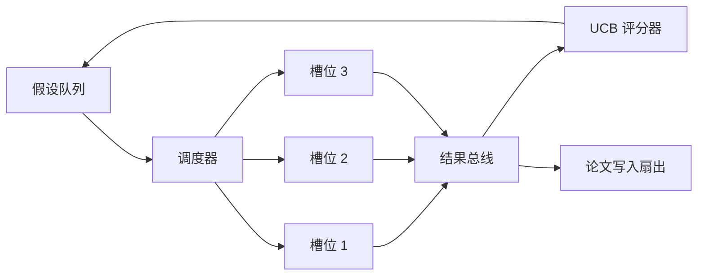
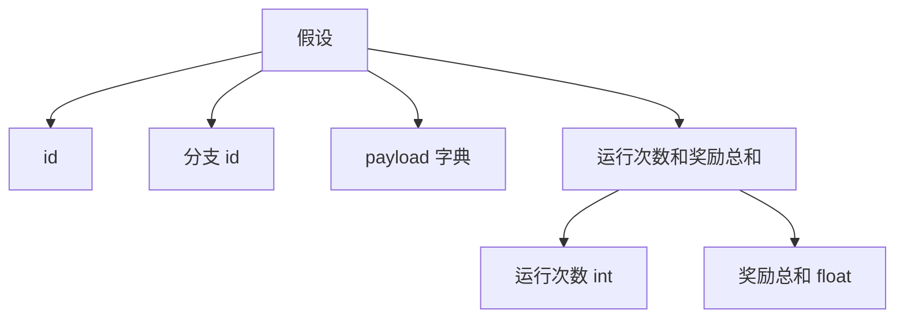
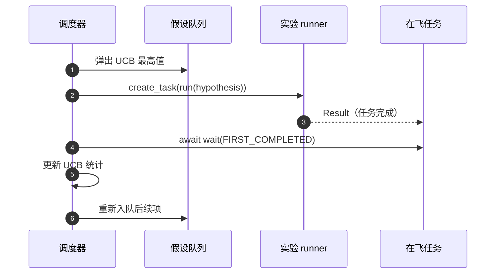

```markdown
# 迭代调度器

> 没有调度器的研究循环，是一个有妄想症的队列。调度器决定了循环何时停止探索，而这个决策就是全部游戏。

**类型：** Build
**语言：** Python
**前置条件：** 第 19 阶段课程 50-53
**时间：** ~90 分钟

## 学习目标

- 将研究工作流建模为假设队列，向并行实验槽位输送数据，结果再扇形回传。
- 使用 asyncio 并发运行多个实验，使调度器能保持所有槽位满载。
- 用 UCB 对每个假设分支进行评分，使调度器能在不放弃探索的前提下剪除低产分支。
- 将完成的结果扇出到论文撰写阶段和重新入队阶段，使高产分支能生成后续假设。
- 展示包含分支得分、槽位占用和剪除决策的逐次迭代跟踪记录。

```figure
ch-ucb-scheduler
```

## 为什么是调度器而非工作列表

扁平工作列表按提交顺序运行作业。当每个作业相互独立时这样做没问题。但研究并不独立：第三个实验的发现会改变第四和第五个实验的优先级。能够读取结果回传并重新排序队列的调度器，能在单位计算量内完成更多有价值的工作。

有趣的设计选择在于评分规则。贪婪评分器总是选择当前领导者，从不探索。均匀评分器从不利用。UCB（上置信界）走中间路线：利用领导者，同时为尝试次数较少的分支保留容量。

## 系统形态



队列中保存假设。当槽位空闲时，调度器选择 UCB 分数最高的假设。每个槽位异步运行一个实验。完成的实验将结果扇形上传到总线。当某个分支的收益超过阈值时，总线更新该分支的 UCB 统计并将结果扇出到论文撰写阶段。

## 假设形态



`branch` 是 UCB 统计的关键字。多个假设可能共享同一个分支（分支是研究方向；假设是其中的单次试验）。`runs` 是该分支已完成实验的次数，`reward_sum` 是累积奖励。UCB 同时读取这两个值。

## UCB 评分

本课程使用的 UCB 公式是经典的 UCB1。

```text
ucb(branch) = mean_reward(branch) + c * sqrt( ln(total_runs) / runs(branch) )
```

`total_runs` 是所有分支已完成实验的总次数。`c` 是探索权重；课程默认为 `sqrt(2)`。零运行次数的分支得到 `+inf`，因此未尝试的分支总是优先调度。平均奖励高的分支保持高分数，直到其他分支追上来；运行多次但收益不高的分支会被运行较少的替代方案压制。

剪除门控与选择器是分离的。当分支的平均奖励低于绝对下限（默认 `0.2`）且至少经过 `prune_after_runs` 次试验（默认 `3` 次）后，剪除操作会将该分支从未来调度中移除。这能保持队列有界。

## asyncio 并行槽位

调度器通过 `asyncio.create_task` 驱动实验。每个任务运行实验 runner（一个 `async def` 可调用对象），返回一个 `Result`。主循环使用 `asyncio.wait(..., return_when=asyncio.FIRST_COMPLETED)` 等待在飞任务集，并在每次完成时触发评分更新。



三个槽位并发运行。主循环从不阻塞在单个实验上。调度器在槽位释放后立即开始新任务，直到队列耗尽且无在飞任务为止。

## 扇出：论文触发

当分支的平均奖励超过 `paper_threshold`（默认 `0.7`）且该分支尚未生成过论文时，调度器会将 `paper.trigger` 事件扇出到输出列表。下游由第五十四课中的论文撰写器会拾取此事件。在本课中，触发事件被捕获为列表，以便测试可以断言它。

## 扇出：后续假设

当高产结果落地时，调度器可以调用用户提供的 `expander` 以在同一分支上生成一个或多个后续假设。expander 是从 `Result` 到 `list[Hypothesis]` 的纯函数。课程附带一个确定性 expander，对于奖励超过论文阈值的任何结果都会生成两个后续项。

## 预算

两个预算保护调度器免受循环失控的影响。

```text
max_experiments    : 所有分支累计运行的实验总次数
max_seconds        : 墙钟时间上限（asyncio 时间）
```

当任一预算触发时，调度器停止调度新任务，等待在飞任务完成，并返回最终跟踪记录。跟踪记录包含 `stop_reason`。

## 跟踪记录与最终报告

每次调度决策（选取、派发、结果、剪除、扇出）都会产生一个事件。最终报告会汇总各分支统计、总运行次数、总墙钟时间和触发的论文事件。下一课端到端演示会读取此报告来驱动论文撰写器。

## 如何阅读代码

`code/main.py` 定义了 `Hypothesis`、`Result`、`BranchStats`、`IterationScheduler`，以及一个 `make_deterministic_runner` 工厂函数，返回具有可预测奖励的 asyncio 实验 runner。runner 以固定 `delay_ms`（默认 `5ms`）休眠，以便观察并发性。

`code/tests/test_scheduler.py` 覆盖了以下场景：UCB 优先选择未尝试分支、并行槽位占用、阈值超过时触发论文、低产试验后剪除分支、扇出后续假设，以及预算退出（包括实验次数和墙钟时间两种情况）。

## 进一步探索

真实实现需要三个扩展。第一，跨会话持久化 UCB 统计：当前统计数据存在于内存中；真实调度器会对其进行检查点保存，使重启后已消耗的探索预算得以保留。第二，多目标评分：结果不再发出标量奖励，而是向量，UCB 变为 Pareto 风格的选择器。第三，上下文 bandit：选择器基于假设特征（长度、复杂度）进行条件判断，使相似假设共享探索。

调度器是研究超越简单工作列表的地方。一旦接入 UCB 且槽位并行运行，其余所有改进都能在此基础上组合。
```
