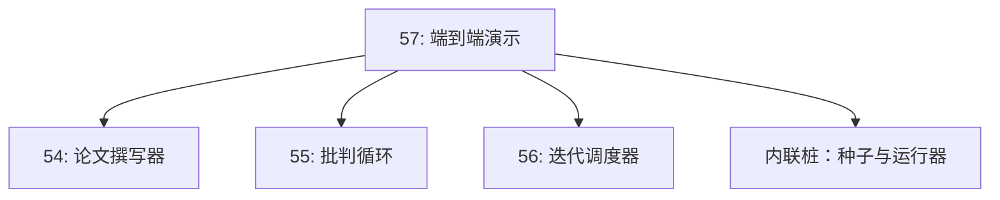
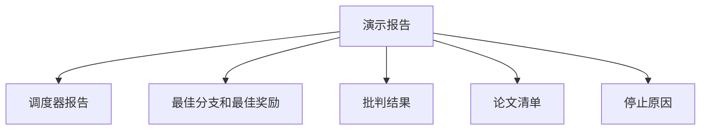

```markdown
# 端到端研究演示

> 演示是每个合约都汇聚的地方。如果其中任何一个合约出现泄漏，演示就是捕获它的课程。

**类型：** 构建
**语言：** Python
**前置条件：** Phase 19 课程 50-53
**时间：** 约90分钟

## 学习目标

- 端到端连接自动研究循环：假设种子、实验运行器、调度器、批判循环、论文撰写器。
- 通过普通的 Python 导入组合前四个 Track D 课程中的原语，而非框架。
- 运行循环直至自我终止，并生成一份演示报告，列出每个阶段的输出。
- 保持演示的确定性，使测试套件能够断言最终结构。
- 当任一阶段合约破裂时暴露出清晰的失败模式，使下一阶段不会在损坏的输入上继续运行。

```figure
ch-research-pipeline
```

## 组合关系


五个阶段。假设种子是一个包含三个假设的列表。调度器以三个并行槽位在它们上运行六个实验。总线报告一个或多个论文触发器。选择器选择唯一的最佳结果。批判循环基于该结果构建的草稿进行迭代。论文撰写器输出了最终的 LaTeX、BibTeX 和清单文件。

## 为何使用导入而非复制

每个前期课程都附带一个 `main.py`，包含公共数据类和函数。演示通过调整 `sys.path` 到每个课程父目录来导入它们。这不是框架接线；它与前期课程中测试文件使用的导入方式相同。



内联桩替代课程五十一到五十三：一个小的假设种子生成器和一个同步奖励函数。用户可以通过调整两处导入，将内联桩替换为来自这些课程的真实原语。

## 确定性保证

演示在构造上保证确定性。实验运行器使用带种子的 numpy。批判循环的修订者按固定维度以固定顺序遍历。论文撰写器的文生器是课程五十四中的模拟版本。调度器的 UCB 选择器按迭代顺序打破平局，而非随机选择。

给定相同的种子，演示会输出相同的报告。测试通过运行两次演示并比较清单来断言这一性质。

## 演示报告结构



每个字段都直接来自上游阶段。演示不转换任何输出；它们被组合在一起。这就是该演示本身要检验的内容。

## 失败模式处理

每个阶段要么成功，要么抛出类型化错误。

```text
调度器 ......... 返回 SchedulerReport，其中 stop_reason
                 取值为 {queue_empty, max_experiments, deadline}
最佳结果选择器 . 若无论文触发器则抛出 NoTriggerError
批判循环 ........ 返回 LoopResult，status 为 converged 或 stopped
论文撰写器 ...... 合约破裂时抛出 PaperValidationError
```

任一阶段的失败会以类型化异常短路演示。测试钉住这一合约：`test_no_triggers_raises_typed_error` 和 `test_best_picker_raises_when_no_triggers` 断言当没有分支触发时，选择器抛出 `NoTriggerError` / `BestResultError`，且撰写器永远不会被调用。

## 最佳结果选择器

调度器为每个分支输出论文触发器。选择器选出跨所有触发器平均奖励最高的分支。平局时按分支 id 字母顺序打破，使演示保持确定性。选择器是一个小型纯函数；测试在固定的调度器报告上钉住它。

## 连接批判循环

课程五十五中的批判循环作用于 `MiniPaper`。演示通过用分支 id 填充摘要、初始化两个章节（Introduction 和 Results），并从分支的平均奖励设置 `originality_tag`（`>= 0.8` 为 high，`>= 0.6` 为 medium，其余为 low）来从所选分支构建 `MiniPaper`。

修订者随后迭代草稿至收敛。输出进入论文撰写器。

## 连接论文撰写器

课程五十四中的论文撰写器作用于包含图表和参考文献的完整 `Paper` 结构。演示通过 `mini_to_full_paper` 升级收敛后的 `MiniPaper`，为所选分支附加一张图表和一个由批判者建议的 cite keys 的并集构建的小型合成参考文献列表。演示添加的每个 cite 也被添加到参考文献列表中，从而通过验证。

## 如何阅读代码

`code/main.py` 定义了 `BestResultError`、`NoTriggerError`、`DemoReport`、`pick_best_branch`、`build_mini_paper`、`mini_to_full_paper` 和 `run_demo`。顶部的导入调整一次 `sys.path`，并从各自的课程中拉取 `PaperWriter`、`CriticLoop` 和 `IterationScheduler`。

`code/tests/test_e2e.py` 覆盖以下内容：演示端到端运行并生成包含所有五个字段的报告、两次运行之间的确定性、无分支达到阈值时抛出 NoTriggerError、撰写器合约破裂时抛出 PaperValidationError、论文清单包含所选分支的图表，以及调度器的停止原因是预期值之一。

## 进一步扩展

有三个值得在演示通过测试后接线的扩展。第一，持久化状态：每个阶段的结果写入小型 JSON 存储，使重启时可以继续而无需重新运行低成本阶段。第二，仪表板：来自调度器和批判循环的追踪事件渲染为一条时间线。第三，真实模型调用：将模拟文生器和确定性批判者替换为模型驱动的；接线方式不变。

演示的目的是证明组合即架构。五个课程、四个导入、一份报告。下一次你添加一个阶段时，接线只需增加一行。
```
