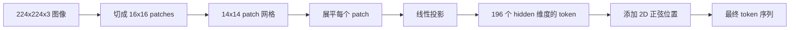

# Vision Encoder Patches

> 需要读取像素的视觉模型需要一个像素 tokenizer。Patch embedding 就是那个 tokenizer。将图像切成方格网格，展平每个方格，通过一个线性层进行投影，然后添加 2D 位置信号，让 transformer 知道每个方格在原始图像中的位置。

**类型：** Build
**语言：** Python
**前置条件：** Phase 19 课程 30-37（Track B 基础）
**时间：** 约 90 分钟

## 学习目标

- 将图像 tokenize 为固定长度的 patch embedding 序列。
- 实现基于 `Conv2d` 的 patch 投影，使其数学上与 unfold-then-linear 等效。
- 构建确定性 2D 正弦位置 embedding，使 token 顺序编码空间位置。
- 在合成 fixture 上验证 patch 数量、embedding 形状以及 `Conv2d`/unfold 的等价性。

## 问题描述

transformer 吃进去的是向量序列。图像是 3 通道网格。把每个像素都当作 token 阅读会引爆序列长度：一张 224x224 的 RGB 图像会产生 150,528 个 token，12 层 transformer 承受不起这样的注意力计算。把图像当作一个巨大的扁平向量来读取则丢弃了局部性，而注意力层无法从这种丢弃中恢复。编码器前端的工作是将像素网格压缩为几百个 token，每个 token 总结一个方形区域的信息。

Patch embedding 通过一次线性投影解决此问题。224x224 图像被切成 16x16 的 patches，产生 14x14 的 196 个 patch 网格。每个 patch 从 `(3, 16, 16) = 768` 个像素值展平为一个向量，然后通过线性层映射到模型的隐藏维度。transformer 看到的是 196 个维度为 `hidden`（通常为 768）的 token，外加一个 CLS token。这是网络其余部分可以处理的序列。

## 概念



### 为什么用 patches 而不是 pixels

注意力计算与序列长度呈二次关系。196 个 token 的序列每层每头需要计算 `196 * 196 = 38,416` 个注意力分数；150,528 个 token 的序列则需要 `150,528 * 150,528 = 226 亿` 个。Patches 将注意力计算量减少了 590,000 倍，而单个 16x16 区域包含的高层视觉任务信号已经足够。代价是丢失 patch 内部的细粒度空间细节，这也是为什么下游多模态栈在需要精细定位时通常会运行第二个高分辨率分支。

### 为什么线性投影就足够了

每个 patch 被视为独立向量。投影学习一个基：边缘检测器、颜色过滤器、简单纹理。单层线性投影规模很小（ViT-Base 为 `768 * 768 = 589,824` 个参数）且训练迅速。更深的卷积 stem 也存在（"hybrid" ViT），但扁平线性投影是标准做法，大多数现代开源权重编码器都采用这种精确形状。

### `Conv2d` 技巧

`Conv2d(in_channels=3, out_channels=hidden, kernel_size=patch_size, stride=patch_size)` 且无 padding，其数值结果与 unfold-then-linear 相同，因为每个输出位置都将 patch 像素与一个过滤器做点积。卷积就是 patch 投影，大多数生产代码库都以这种方式实现，因为它在 GPU 上更快且少一次 reshape。

### 位置 Embedding

Token 从投影出来后不携带任何顺序信息。2D 正弦 embedding 为每个 token 提供固定信号，编码其 `(row, col)` 位置。嵌入维度的一半用 sin/cos 在多个频率上编码行位置；另一半编码列位置。编码是确定性的，因此你可以更换分辨率而无需重新训练，并且它能干净地插值到模型在训练时从未见过的网格。

| 组件 | 形状 | 参数 |
|------|------|------|
| Patch 投影 (`Conv2d`) | `(hidden, 3, patch, patch)` | `3 * P * P * hidden + hidden` |
| 位置 embedding（固定） | `(num_patches, hidden)` | 0（计算得出，非学习） |
| CLS token（可学习） | `(1, hidden)` | `hidden` |

对于 224 分辨率的 ViT-Base/16：投影有 590,592 个参数，CLS token 有 768 个参数，正弦位置为 0 个参数。下一课（59）将在此前端之上堆叠一个 12 层 transformer。

### 等价性作为验证

patch 步骤有两种写法：`Conv2d` 投影和显式的 unfold-then-linear。对于相同的权重，它们必须产生相同的输出。如果不是，则 unfold 的数学计算有误，编码器的其余部分就建立在沙土之上。本课的测试用于验证该等价性。

```figure
ch-patch-tokenizer
```

## 构建它

`code/main.py` 实现：

- `PatchEmbed`，一个封装 `Conv2d` 用于 patch 投影的 `nn.Module`。
- `sinusoidal_2d(grid_h, grid_w, dim)`，一个无状态的函数，构建 2D 位置表。
- `VisionFrontEnd`，将 patch embedding、CLS 前缀和位置添加组合成一个前向传播。
- `synthesize_image(seed)` 辅助函数，从 `numpy.random` 构建确定性 224x224x3 fixture。
- 一个 demo，将单个 fixture 图像通过前端并打印输出形状、CLS token 范数以及位置嵌入的一行。

运行：

```bash
python3 code/main.py
```

输出：224x224 fixture 被 tokenize 为形状 `(1, 197, 768)` 的序列。第一个 token 是 CLS；接下来 196 个是 patch tokens。位置嵌入范数在一行内均匀分布，这是正弦信号的签名。

## 使用它

相同的 patch 前端出现在每个现代视觉语言模型中：CLIP ViT-L/14、SigLIP、DINOv2、Qwen-VL 系列和 InternVL 栈都始于 `Conv2d` patch 投影加上位置信号。各家族间的差异存在于下游（CLS vs 无 CLS 池化、register tokens、不同的 patch 大小 14 vs 16、通过插值位置实现的动态分辨率）。本课中的前端是所有这些模型赖以建立的底层支撑。

## 测试

`code/test_main.py` 覆盖：

- patch 数量匹配 `(image_size / patch_size) ** 2`
- 输出形状匹配 `(batch, num_patches + 1, hidden)`
- `Conv2d` 投影在小 fixture 上等于手动 unfold-then-linear
- 正弦位置表在多次调用间是确定性的
- CLS token 在 batch 维度上广播且不泄漏

运行：

```bash
python3 -m unittest code/test_main.py
```

## 练习

1. 用可学习的 `nn.Parameter` 替换正弦位置，并在微小的合成分类任务上比较第一个 epoch 的损失。学习位置在固定分辨率下表现更好；正弦位置在训练后更改分辨率时占优。

2. 将 `Conv2d` 替换为显式的 `nn.Unfold` 加上 `nn.Linear`，并断言输出在浮点容差范围内匹配。同样的数学，两种写法。

3. 添加对非正方形 patch 大小（例如 32x16 用于宽aspect输入）的支持，并验证位置表能处理非正方形网格。

4. 在 batch 大小 1、8、64 上分析 patch 步骤的性能。patch 投影很少是瓶颈；下游的注意力层占主导。

5. 在 4 类合成形状数据集（圆形、正方形、三角形、星星）上将前端作为冻结特征提取器进行训练。CLS token 输出应能被线性分离。

## 关键术语

| 术语 | 含义 |
|------|------|
| Patch | 图像的方形子区域，通常为 14x14 或 16x16 |
| Patch embedding | 将单个展平 patch 线性投影到隐藏维度 |
| 序列长度 | patch tokenize 后的 token 数量，通常加上 CLS |
| 正弦位置 | 编码 2D 网格坐标的固定 sin/cos 信号 |
| CLS token | 学习到的向量，置于序列开头作为池化头 |

## 延伸阅读

- An Image is Worth 16x16 Words (ViT, 2021) 关于原始 patch-embed 框架。
- Attention Is All You Need (2017) 关于本课适配到 2D 的正弦位置公式。
- DINOv2 论文关于 register tokens，可作为练习 6 添加的扩展。
