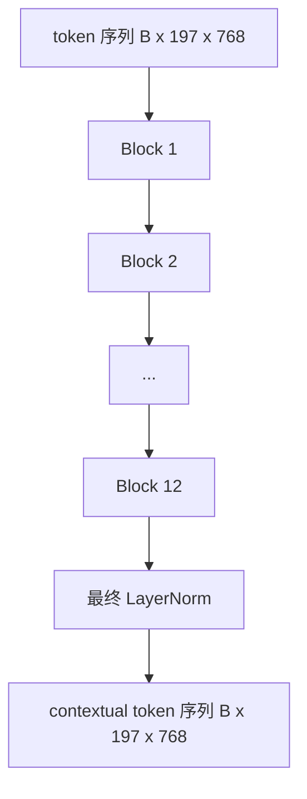
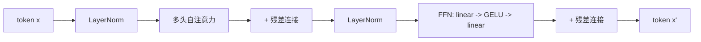

# Vision Transformer Encoder

> Patch alone do not see. A 12-layer pre-LN transformer with 12 attention heads turns the sequence of patch tokens into a sequence of contextual tokens, with the CLS token pooling whole-image features in its final hidden state. This lesson is the engine room of every modern vision-language model.

**类型：** Build
**语言：** Python
**先修课程：** Phase 19 lessons 30-37 (Track B foundations)
**预计时间：** ~90 分钟

## 学习目标

- 实现带有多头自注意力和前馈子层的 pre-LN transformer block。
- 堆叠 12 个 block、每个 12 个注意力头，组成 ViT-Base encoder。
- 将 lesson 58 中的 patch 前端接入 encoder 并执行前向传播。
- 验证 CLS token 从每个 patch 聚合信息。

## 问题描述

patch embedding 产生一个包含 197 个 token 的序列，每个 token 都是一个向量，对其它任何 patch 都没有感知能力。一张猫的照片需要每个 patch 都知道哪些 patch 包含胡须、哪些是背景、哪些包含眼睛。transformer 就是构建这种感知能力的机制，一层注意力层一层地构建。没有它，patch 前端只是一个聪明的分词器，没有任何理解能力。

标准配方是 12 层深度、12 个头宽度、pre-LayerNorm 放置、GELU 激活、前馈扩展倍数 4x。这个配方是 CLIP ViT-L、SigLIP、DINOv2、Qwen-VL 系列、InternVL 以及 2025-2026 年所有开放权重视觉编码器的骨干。这个配方足够稳定，你可以阅读其中任何论文并假设这个 block 形状，除非它们明确说明不同。

## 概念





### Pre-LN vs post-LN

原始 Transformer 将 LayerNorm 放在残差之后。Pre-LN（在每个子层之前应用 LayerNorm）是每个现代视觉-语言模型使用的版本，因为它可以在没有学习率预热技巧的情况下稳定训练。区别在于 forward pass 中只有一行代码的差异，但在 12 层以上深度时梯度流是天壤之别。

### 多头自注意力

每个头将 token 向量投影到独立的 `(query, key, value)` 三元组，维度为 `head_dim = hidden / num_heads`。当 `hidden = 768` 且 `heads = 12` 时，每个头的维度为 `dim = 64`。12 个头并行地执行注意力计算，然后将它们的输出拼接回 768 维并通过输出投影。多头的好处是：一个头可以学习"关注猫的眼睛"，而另一个头可以学习"关注背景渐变"，互不干扰。

### 为什么使用 4x 前馈扩展

FFN 的路径是 `hidden -> 4 * hidden -> hidden`，中间使用 GELU 激活。4 倍因子是经验值，自 2017 年以来在语言和视觉 transformer 中保持一致。较小（2x）会欠拟合；较大（8x）在固定数据预算下会过拟合。MLP 是模型存储大部分学习知识的地方，更宽的中层就是知识所在的位置。

| 组件 | ViT-Base 规模下的参数量 |
|-----------|------------------------------|
| 每个 block 的 qkv 投影 | `3 * 768 * 768 = 1.77M` |
| 每个 block 的输出投影 | `768 * 768 = 590K` |
| 每个 block 的 FFN（4x 扩展） | `2 * 768 * 4 * 768 = 4.72M` |
| 每个 block 的 LayerNorm | `4 * 768 = 3K` |
| 每个 block 总计 | 约 7.1M |
| 12 个 block | 约 85M |
| 加上前端 | 总计约 86M |

ViT-Base 是一个 86M 参数的编码器。以 2026 年的标准来看这是小的（SigLIP-So400M 是 400M，Qwen-VL ViT 是 675M），但架构在宽度和深度上是完全相同的。

### 是否需要因果掩码？

Vision Transformer 是纯编码器、双向的：token `i` 可以关注任意 token `j`，不需要掩码。lesson 61 中的解码器侧交叉注意力会使用因果掩码，但在视觉编码器内部，注意力是完全连接的。

### CLS token 学习什么

CLS token 作为一个可学习的参数开始，本身不包含任何 patch 内容，通过每个 block 的注意力累积信息。到最后一层时，CLS 行是整个图像的向量摘要；下游头部将这个单一向量投影为类别 logits、对比嵌入或文本解码器的交叉注意力 keys。

```figure
ch-cls-funnel
```

## 构建

`code/main.py` 实现了：

- `MultiHeadSelfAttention`，包含 `qkv` 和输出投影、缩放点积注意力数学计算和形状断言。
- `FeedForward`，4x 扩展的 GELU MLP。
- `Block`，一个 pre-LN block，组合注意力和前馈子层并带有残差连接。
- `ViT`，12 个 block 的堆叠加上最终的 LayerNorm。
- `VisionEncoder`，将 lesson 58 的 `VisionFrontEnd` 接入 `ViT` 堆叠，并暴露 `forward()` 返回上下文序列和池化的 CLS 向量。
- 一个演示，将一个合成的 224x224 fixture 图像通过完整 encoder，并打印输入形状、输出形状、参数数量和每隔一层的 CLS norm。

运行它：

```bash
python3 code/main.py
```

输出：fixture 被编码为 `(1, 197, 768)` 张量。随着层数的叠加，CLS norm 逐渐上升，然后在最终 LayerNorm 处稳定。总参数量报告约为 86M。

## 使用

这里定义的 encoder 在宽度和深度上，与 2025-2026 年所有开放权重 VLM 内部的 block 堆栈相同。差异存在于：

- **宽度和深度。** ViT-Large 是 `hidden=1024, depth=24, heads=16`；SigLIP So400M 是 `hidden=1152, depth=27, heads=16`。相同的 block。
- **池化头。** CLS 池化（本课）vs 平均池化（SigLIP）vs 注意力池化（后续 VLMs）。
- **位置处理。** 固定正弦（lesson 58）vs 可学习 1D vs ALiBi vs 2D RoPE。block 数学不变。
- **Register tokens。** DINOv2 在 CLS 之前prepend了 4 个额外的可学习 token。仅需一行代码。

这个 block 堆栈是基础。接下来的课程（60-63）将建立在其上。

## 测试

`code/test_main.py` 覆盖：

- 单个 block 保持形状不变，且对输入 batch size 具有不变性
- 注意力分数沿 key 轴求和为 1（softmax 合理性验证）
- 残差路径已正确接线（零输入仍通过 CLS token 产生非零输出）
- 4 层堆叠的前向传播产生正确形状
- 梯度从 CLS 输出流回到 patch 投影

运行它们：

```bash
python3 -m unittest code/test_main.py
```

## 练习

1. 添加 register tokens（CLS 之后 prepend 4 个可学习向量）并重新运行。通过最后一层 softmax 分布的熵来比较注意力图的平滑度。

2. 将 pre-LN 替换为 post-LN，并在合成形状分类器上训练一个 epoch。观察哪个在无 LR warm-up 的情况下能稳定训练。

3. 实现因果掩码作为 `attn_mask` 参数，以便同一个 block 可以重用作解码器 block。掩码形状为 `(seq, seq)`，下三角矩阵。

4. 使用 `torch.profiler` 分析 batch size 为 1、8、64 时的一次前向传播。MLP 层主导 wall time，而非注意力。

5. 将一个注意力头的 q-k-v 投影替换为低秩 LoRA 适配器，冻结其余部分，并验证梯度只流向你期望的位置。

## 关键术语

| 术语 | 含义 |
|------|---------------|
| Pre-LN | 在每个子层之前应用 LayerNorm，而非之后 |
| Self-attention | 每个 token 关注同一序列中的每个其他 token |
| Multi-head | 隐藏维度被拆分为 `H` 个独立的注意力头 |
| FFN expansion | 前馈层在收缩之前先扩展到 `4 * hidden` |
| CLS pooling | 使用第一个 token 的最终隐藏状态作为图像摘要 |

## 延伸阅读

- An Image is Worth 16x16 Words (ViT, 2021) 用于了解 encoder 配方。
- DINOv2 (2023) 用于了解 register tokens 和自监督预训练目标。
- SigLIP (2023) 用于了解平均池化变体和 lesson 62 中使用的 sigmoid 对比损失。
