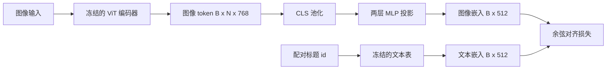

# 模态对齐的投影层

> 视觉编码器生成图像 token，文本解码器处理文本 token。两者存在于不同的向量空间中。一个小型两层 MLP 将图像 token 投影到文本嵌入空间，并通过与配对标题的余弦对齐损失将两个空间拉至一致。这个投影是视觉语言模型中最小的组件，却是对迁移最关键的组件。

**类型：** 构建
**语言：** Python
**前置要求：** 第 19 阶段课程 30-37（B 轨道基础）
**时间：** 约 90 分钟

## 学习目标

- 构建将图像特征映射到文本嵌入空间的两层 MLP 投影。
- 构造模拟的文本嵌入表（无需预训练分词器，无需真实语料库）。
- 计算投影后的图像 token 与配对标题嵌入之间的余弦对齐损失。
- 在冻结视觉编码器和冻结文本表的情况下单独训练投影层。

## 问题描述

你有一个视觉编码器（第 58-59 课），输出维度为 `vision_hidden = 768` 的 token。你想在其上附加一个文本解码器，嵌入维度为 `text_hidden = 512`（其他数值同样合理）。解码器期望接收文本形状的 token，而图像 token 并非文本形状：它们处于编码器在仅视觉预训练阶段学习到的基空间中，与解码器的词向量之间没有关系。

两层 MLP 投影（线性层、GELU、线性层）可以弥合这一差距。它足够小（约 `768 * 1024 + 1024 * 512 = 130 万` 参数），可以在单卡 GPU 上用几分钟训练完，并且是对齐阶段唯一需要学习的组件。视觉编码器保持冻结，文本嵌入表保持冻结，只有投影层在更新。这正是 LLaVA 在 2023 年采用的方案、BLIP-2 将其重构为 Q-Former 的基础，也是此后所有开源 VLM 以某种形式采用的方案。

## 概念



### 投影前的池化

视觉编码器输出 197 个 token，文本端只有一个标题级嵌入。要对齐它们，每个样本需要一个图像级向量。CLS 池化是最简单的方式：取编码器的第一个 token 然后投影。对所有 197 个 token 做均值池化是另一种选择，也是 SigLIP 所用的方式。两种池化都将 197 个向量压缩为一个。

### 为什么用两层而不是单层

单个线性投影可以旋转和缩放，但如果两个空间的曲率存在不匹配，则无法修正基底。两个线性层之间的 GELU 给投影引入了一个非线性弯曲，经验上足以将 CLIP 风格的特征对齐到语言模型嵌入。更深的投影（LLaVA-NeXT 使用了 GLU；Qwen-VL 使用了一层注意力层堆叠）是扩展方案；两层 MLP 是规范性的基线，也是 BLIP-2 的 Q-Former 投影头底层所采用的结构。

| 层 | 形状 | 参数 |
|-------|-------|------------|
| fc1 | `(vision_hidden, projection_hidden)` | `768 * 1024 + 1024` |
| 激活 | GELU | 0 |
| fc2 | `(projection_hidden, text_hidden)` | `1024 * 512 + 512` |

对于 `768 -> 1024 -> 512` 的头，约 130 万参数。

### 余弦对齐损失

对齐不是指 `image_emb == text_emb`，而是指 `image_emb` 与 `text_emb` 在联合空间中指向相同方向。余弦损失为 `1 - cos_sim(image, text)`，取值范围从 0（完美对齐）到 2（方向相反）。训练驱动该值向每对样本的零趋近。第 62 课将其推广为对比批训练（InfoNCE），其中每张图像都必须比批次中任何其他标题更接近其自身的标题；本课使用逐对版本，以便动态过程清晰可见。

### 冻结编码器是关键

视觉编码器有 8600 万参数，文本表还有数百万参数。用模拟语料库训练所有这些参数是不可行的。冻结两者意味着投影的 130 万参数是唯一的变量，合成数据对上几百步就足以使损失下降。这正好是每种基于适配器的 VLM 的运作形态：主体部分保持冻结，轻量桥接器进行训练。

```figure
ch-projection-bridge
```

## 构建代码

`code/main.py` 实现了：

- `MLPProjector(in_dim, hidden_dim, out_dim)`：带 GELU 激活的两层线性 MLP。
- `MockTextEmbedding(vocab_size, dim)`：具有从种子值确定性初始化的冻结嵌入表。
- `make_pair(seed, vocab_size)`：合成一对（图像、标题）样本。标题是短 id 序列；标题嵌入是对 token 嵌入做均值池化的结果。
- `cosine_alignment_loss(image_emb, text_emb)`：逐对的 `1 - cos_sim` 目标函数。
- 一个训练循环，在 32 对合成数据上循环运行投影 200 步（视觉编码器和文本表冻结），每 25 步打印一次损失。

运行：

```bash
python3 code/main.py
```

输出：训练报告从初始约 1.07 的损失降至 200 步内约 0.80，证明仅靠投影层就能将图像 token 拉向文本空间。最终还会打印每对的余弦相似度。

## 实际应用

相同的模式出现在所有开源 VLM 中：

- **LLaVA 1.5。** 从 CLIP-ViT-L 隐藏层到 LLaMA 嵌入维度的两层 GELU MLP 投影。冻结视觉编码器，冻结 LLM，仅训练投影层（然后在第二阶段解冻 LLM）。
- **BLIP-2。** Q-Former 让 32 个可学习的查询 token 对图像 token 做交叉注意力，然后投影到 LLM 嵌入维度。Q-Former 末尾的投影头与本课 MLP 的作用对应。
- **MiniGPT-4。** 从 BLIP-2 Q-Former 输出到 Vicuna 嵌入维度的单层线性投影。
- **Qwen-VL。** 带若干层的交叉注意力适配器，但最终部分仍然是投影到 LM 嵌入维度。

形状各异，但角色完全相同：池化图像 token，投影到文本嵌入维度，单独训练。

## 测试

`code/test_main.py` 覆盖以下内容：

- 投影器输出形状与配置的 `out_dim` 匹配
- 冻结的文本嵌入表的 `requires_grad` 参数为零
- 余弦损失在相同向量上为零，在反向平行向量上为 2
- 一次反向传播后投影器梯度可正常流动
- 训练循环在步骤 0 和步骤 200 之间使损失下降

运行：

```bash
python3 -m unittest code/test_main.py
```

## 练习

1. 将 CLS 池化替换为对 196 个 patch token 的均值池化，比较 200 步后的最终损失。均值池化在合成数据上通常训练更快；CLS 在自然图像上样本效率更高。

2. 为余弦损失添加一个可学习的标量温度参数（`cos / tau`），观察当 `tau` 过小（梯度噪声）或过大（损失高位平台）时会发生什么。

3. 将两层 MLP 替换为单层线性层，量化损失差距。非线性在自然图像特征上影响更大，在合成数据上影响较小。

4. 为投影器权重添加一个小 L2 惩罚项，观察其与余弦对齐的交互作用（余弦对尺度不变，因此惩罚项主要收缩未使用的方向）。

5. 保存投影器权重，然后重新加载并在不经过视觉编码器反向传播的情况下运行推理，验证部署时只需投影器。

## 关键术语

| 术语 | 含义 |
|------|------|
| 模态对齐 | 使图像和文本嵌入可在同一共享空间中比较的过程 |
| 投影头 | 将空间从一个映射到另一个的小型模块，通常是两层 MLP |
| 余弦相似度 | 点积除以两个向量 L2 范数的乘积 |
| 冻结编码器 | 视觉（或文本）模型的所有参数均设置 `requires_grad=False` |
| 模拟语料库 | 合成数据对，使训练无需依赖数据集下载 |

## 延伸阅读

- LLaVA 论文，介绍两阶段训练（先投影，再解冻语言模型）。
- BLIP-2 论文，将 Q-Former 作为可学习的投影替代方案。
- Qwen-VL 技术报告，将交叉注意力适配器作为更深层次的投影头。
