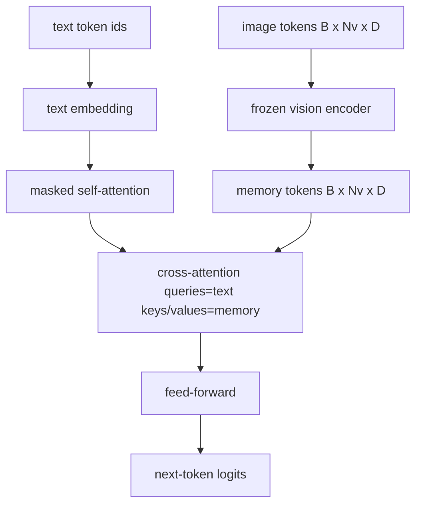
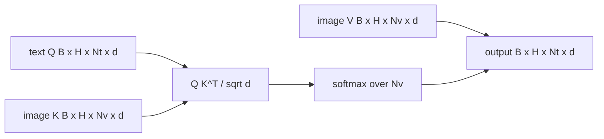

# 交叉注意力融合

> 投影层将一个图像向量和一个字幕向量对齐。一个真正的视觉-语言解码器需要每个文本 token 都能 attend 到每个 patch token，这样模型才能将每个词落位到某个区域。交叉注意力就是实现这种落位的方式。文本提供 query；视觉的 key 和 value 来回答。本课构建交叉注意力模块、因果文本自注意力，以及让两者都合法合规的掩码形状。

**类型：** 构建
**语言：** Python
**前置知识：** Phase 19 课程 30-37（Track B 基础）
**时长：** 约 90 分钟

## 学习目标

- 实现多头交叉注意力，其中 query 流来自文本，key/value 流来自视觉。
- 组合解码器模块：因果自注意力 + 交叉注意力 + 前馈网络。
- 确保掩码形状正确：自注意力用因果掩码，交叉注意力不用掩码。
- 用批量文本 token 和固定池化的图像 token 跑一次前向传播。

## 问题

将图像 token 和文本 token 拼接成单一序列是一种融合方式（早期融合，Chameleon 和 Emu3 走的就是这条路）。交叉注意力是另一种方式（晚期融合，Flamingo 开创，此后所有 Flamingo 架构的解码器都沿用了此路）。在晚期融合中，文本解码器仅在文本 token 上运行，通过每层的交叉注意力延伸到图像流中。

晚期融合有两个优势。第一，文本流保持干净，模型保留了纯文本能力。第二，图像流每张图只计算一次，在每个解码步重复使用，因此即使生成很长的字幕开销也很低。代价是每个模块多一个注意力子层。

## 概念





### 掩码形状

解码器模块内的两种注意力需要不同的掩码：

| 注意力类型 | Query 长度 | Key 长度 | 掩码 | 原因 |
|-----------|--------------|------------|------|-----|
| 自注意力 | `Nt`（文本） | `Nt`（文本） | 因果：下三角 `(Nt, Nt)` | 自回归过程中文本 token 不能提前查看未来 |
| 交叉注意力 | `Nt`（文本） | `Nv`（视觉） | 无掩码 | 所有文本位置都能看到整张图像 |

本课包含一个形状验证函数，使混淆两者时的错误以 `ValueError` 形式暴露出来，而不是在损失曲线上静默出错。

### 为什么交叉注意力不加掩码

在生成任何文本之前，图像已经完整可见。字幕的 token `t` 可以 attend 到图像的任意 patch；图像 patch 之间没有时间顺序。一些 Flamingo 变体在多张图像与多个文本段落交错时加入了逐样本的掩码模式，但对于单张图像加单个字幕的情况，交叉注意力可以看到所有内容。

### Key/Value 缓存

图像 key 和 value 在解码开始时计算一次并缓存在缓存中。每个新文本 token 使用缓存而无需重新计算。这就是字幕生成推理快的原因：代价高昂的 ViT 只运行一次；交叉注意力在每一步重用其 key 和 value。本课暴露缓存接口并测试缓存命中路径。

### 模块组合

解码器模块的运行顺序为：pre-LN → 自注意力 → 残差 → pre-LN → 交叉注意力 → 残差 → pre-LN → 前馈网络 → 残差。三个子层，每层各有自己的 LayerNorm。Flamingo 论文在交叉注意力的残差路径上加了一个可学习的门控，使模型能在训练时选择跳过图像路径（以提高训练稳定性）；标准基线（本课使用）没有门控。

```python
class DecoderBlock:
  def forward(self, text_tokens, image_tokens, text_mask, cross_mask):
      text_tokens = text_tokens + self.self_attn(self.ln1(text_tokens),
                                                 mask=text_mask)
      text_tokens = text_tokens + self.cross_attn(self.ln2(text_tokens),
                                                  image_tokens,
                                                  mask=cross_mask)
      text_tokens = text_tokens + self.ffn(self.ln3(text_tokens))
      return text_tokens
```

```figure
ch-crossattn-fan
```

## 构建

`code/main.py` 实现了：

- `CrossAttention(hidden, heads)`：具有独立 `q` 和 `kv` 投影的多头交叉注意力。
- `CausalSelfAttention(hidden, heads)`：标准解码器的带掩码自注意力。
- `DecoderBlock`：用 pre-LN 残差组合三个子层。
- `VisionLanguageDecoder`：四层解码器，由模拟视觉编码器输出和小规模文本嵌入表驱动。
- `causal_mask(length)`：返回 `(length, length)` 下三角布尔张量。
- 一个演示脚本，传入长度为 10 的两个文本序列批量，图像记忆长度为 197，打印输出形状、自注意力掩码形状，以及每个位置交叉注意力输出的范数。

运行：

```bash
python3 code/main.py
```

输出：解码器产生形状为 `(2, 10, text_vocab)` 的 logits 张量。掩码形状为 `(10, 10)`。KV 缓存复用检查确认缓存路径与无缓存路径的 logits 完全一致。

## 使用场景

交叉注意力出现在两类生产级架构中：

- **Flamingo 与 IDEFICS。** 每隔 K 个语言模型块插入一个交叉注意力子层，语言模型冻结。视觉-语言适配器即交叉注意力模块及其门控。
- **BLIP-2。** Q-Former 从固定的 32 个 query token 集合出发，对图像特征做交叉注意力，然后将 query 投影到语言模型的嵌入空间。

本课中模块的形状直接映射到这两类架构。掩码纪律（自注意力用因果、交叉注意力无掩码）是相同的。

## 测试

`code/test_main.py` 覆盖：

- 因果掩码为下三角，且与预期布尔形状匹配
- 交叉注意力输出形状为 `(B, Nt, hidden)`，不依赖 key 长度
- KV 缓存路径在无缓存路径的浮点容差内匹配
- 文本流与图像流形状不匹配时抛出明确的 `ValueError`
- 完整的解码器前向传播产生正确的批量和序列形状

运行：

```bash
python3 -m unittest code/test_main.py
```

## 练习

1. 在交叉注意力残差上加一个可学习的 tanh 门控（Flamingo 的技巧），验证训练从接近零的初始门控值开始收敛。门控从零开始；模型先在混合图像流之前恢复纯文本行为。

2. 实现交错注意力，使同一个解码器同时消费多张图像和多个文本段落。构建逐样本的交叉注意力掩码，阻止文本段落 2 去 attend 图像 1。

3. 在 `Nt=64, Nv=576`（高分辨率下的 24x24 网格）下对交叉注意力与自注意力层进行性能分析。交叉注意力的计算代价为 `Nt * Nv`，在高图像分辨率下占主导。

4. 在交叉注意力 map 的 query 侧加入 dropout，并在演示上测量字幕多样性（cross map 中 dropout 增大时字幕采样方差随之增加）。

5. 将交叉注意力层替换为 Q-Former 风格的注意力模块：每层只用一次，由固定的 32 token query 池 attend 图像特征。

## 关键术语

| 术语 | 含义 |
|------|------|
| 晚期融合 | 文本与视觉保持独立流；交叉注意力在每层 bridging 两者 |
| 交叉注意力 | Q 来自一个流，K 和 V 来自另一个流 |
| 因果掩码 | 下三角布尔掩码，防止自回归过程中的提前查看 |
| KV 缓存 | 图像 key 和 value 只计算一次，在每个解码步重复使用 |
| 记忆 token | 解码器"伸手"去获取的那个冻结的图像 token |

## 延伸阅读

- Flamingo（2022）：带有门控交叉注意力的标准晚期融合设计。
- BLIP-2（2023）：Q-Former，一种以可学习 query 池形式呈现的交叉注意力模块。
- IDEFICS（2023）：Flamingo 方案的开源权重复现。
