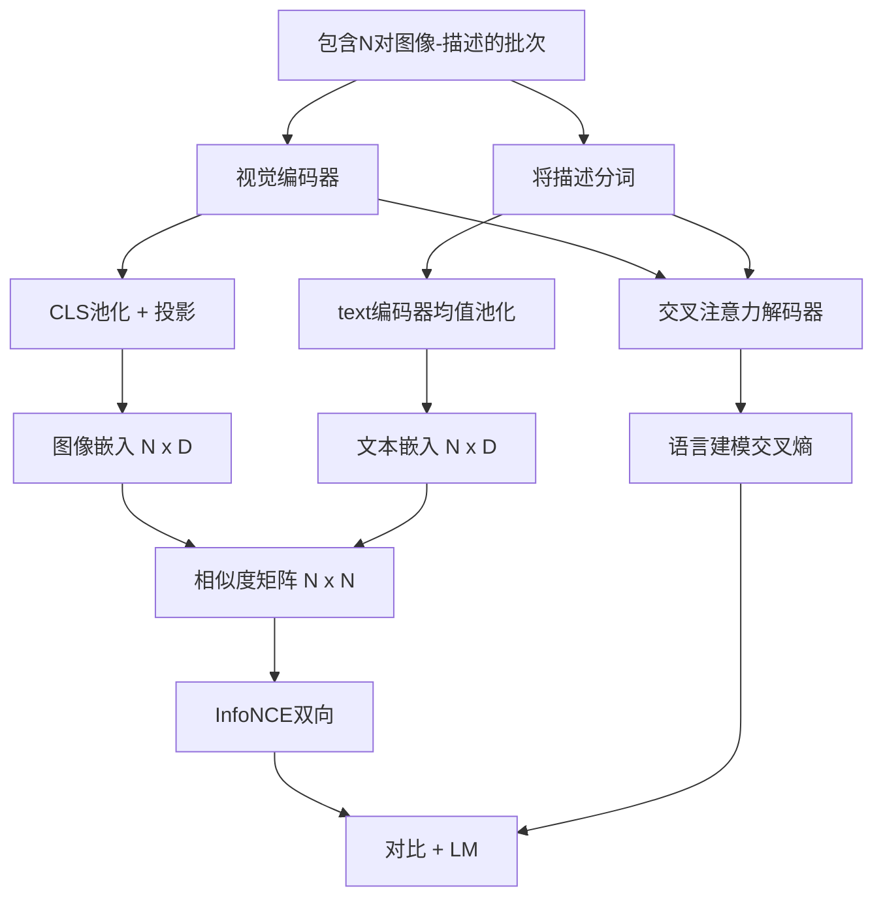

# 视觉-语言预训练

> 编码器、投影层和解码器已经接线完成。现在将它们一起训练。学习目标有两个：一个是对比性的图像-文本损失（InfoNCE），它在联合嵌入空间中拉近匹配对的距离；另一个是语言建模损失，要求解码器为每张图像生成描述。两者结合，教会网络既能为描述找到正确的图像，也能为图像写出合适的描述。

**类型：** 构建
**语言：** Python
**前置知识：** 第19阶段课程30-37（B轨基础）
**时间：** 约90分钟

## 学习目标

- 在一批图像-描述对上实现InfoNCE对比损失。
- 将对比损失与自回归语言建模损失组合。
- 无需下载真实数据集，合成一个包含200对图像的伪图像-描述语料库。
- 运行50步的演示训练循环并观察两个损失值下降。

## 问题

一个视觉-语言模型需要两种能力。它必须能够排序：给定一个描述，从许多图像中找出正确的那张。它必须能够生成：给定一张图像，写出描述。仅在一个技能上预训练模型只能得到半个系统。CLIP擅长排序但不能生成描述。GPT-4V可以生成描述，但使用独立的检索头进行排序。多目标预训练在一次传递中获得两种能力。

InfoNCE处理排序部分。对于一个包含N对的批次，模型将N个匹配对视为正例，将`N^2 - N`个不匹配对视为负例，然后在得到的`(N, N)`相似度矩阵上运行交叉熵损失。LM损失处理生成部分：基于图像的标准化下一个token预测。两个损失都是可微的，可以共享编码器、投影层和解码器的权重。

## 概念



### InfoNCE简述

将N个图像嵌入堆叠为行，将N个文本嵌入也堆叠为行。对两者进行L2归一化。计算`N x N`矩阵 `S = I T^T / tau`，其中`tau`是可学习的温度参数。对角线元素是匹配对；非对角线元素是负例。应用交叉熵，目标`argmax`沿对角线运行：第`i`行应在第`i`列具有最高值。沿列方向以相同方式对称操作。总和是两个方向的平均值。这就是八行代码实现的CLIP损失。

### 温度参数很重要

温度参数`tau`控制softmax的尖锐程度。太小（例如`tau = 0.01`）时，梯度仅来自最难负例，训练不稳定。太大时softmax变平，梯度消失。CLIP将`tau`作为参数学习；本演示也采用相同方法。

### 语言建模损失

解码器通过交叉注意力消耗图像记忆token，并在每个位置预测下一个文本token。损失是标准的交叉熵，目标为下一位置。填充位置的损失被屏蔽。

### 损失组合

`total = contrastive + lm_weight * lm`，其中`lm_weight`是标量（通常为1.0）。两个损失共享进入编码器和投影层的梯度；只有解码器接收LM损失的梯度。这是CoCa、BLIP和SigLIP风格模型使用的多任务方案，具有各种权重配置。

| 组件 | 损失曲面 | 影响 |
|------|----------|------|
| InfoNCE | 联合空间中的成对排序 | 编码器 + 投影层 + 文本头 |
| LM | 基于图像的token预测 | 编码器 + 投影层 + 解码器 |
| 组合 | 多任务 | 整个堆栈 |

### 为什么50步对演示来说足够

伪语料库是一个合成的200对数据集，包含随机图像和随机的描述ID。在使用批量大小16的50个SGD步骤之后，即使绝对值高于真实数据模型能达到的水平，两个损失也会明显下降。演示的目的是确认梯度管道端到端工作，并且添加LM损失不会破坏对比目标的稳定性。

```figure
ch-infonce-diagonal
```

## 构建代码

`code/main.py` 实现了：

- `MultimodalModel`，组合小型ViT编码器、MLP投影层、简单的文本侧编码器（对嵌入ID进行均值池化）和第61课中的交叉注意力解码器。
- `info_nce_loss(image_emb, text_emb, temperature)`，双向CLIP风格对比损失。
- `lm_loss(logits, target_ids, padding_id)`，带掩码的下一个token交叉熵。
- `make_mock_corpus(seed, n_pairs)`，返回200个确定性的（图像、描述ID）对。
- 一个运行50步的训练循环，批量大小16，Adam优化器，以及可学习的对数温度参数。每5步打印两个损失值。

运行它：

```bash
python3 code/main.py
```

输出：对比损失从约`ln(16) = 2.77`下降到约2.4；LM损失从随机均匀基线`ln(512) ≈ 6.24`下降到约4.7。两个下降证明梯度连接正确。真实模型训练百万步；动态过程相同。

## 使用它

这与以下模型使用的损失配方相同：

- **CLIP (2021)**。仅图像-文本对比，带有单独的冻结编码器描述探针。
- **CoCa (2022)**。单个模型中同时包含图像-文本对比和图像-描述LM损失。本课构建的正是这种模式。
- **BLIP (2022) 和 BLIP-2**。对比加上LM加上图像-文本匹配头。组合三个损失。
- **SigLIP (2023)**。用sigmoid成对损失替换InfoNCE；相同的对比作用，不同的函数形式。
- **LLaVA系列**。两阶段训练，第一阶段是对齐（在冻结的LM上进行余弦相似度），第二阶段添加使用非冻结LM的LM损失。第60课对应第一阶段；本课对应第二阶段。

## 测试

`code/test_main.py` 覆盖：

- InfoNCE损失在图像/文本行之间是对称的
- 当相似度矩阵是大型正数的完美对角线时，InfoNCE损失返回0
- LM损失正确屏蔽填充位置
- 模型前向传播无错误地产生两个损失值
- 5步训练循环减少组合损失

运行它们：

```bash
python3 -m unittest code/test_main.py
```

## 练习

1. 将InfoNCE替换为SigLIP风格的sigmoid成对损失，并在伪语料库上比较收敛情况。

2. 添加难负例挖掘步骤：每隔一个批次，从前一个批次中选择最难的非对角线对并追加进去。训练并检查对比损失是否下降更快。

3. 在联合嵌入之上添加一个图像-文本匹配二元头（真/假：这些匹配吗？）作为第三个损失，复制BLIP的三头设置。

4. 将伪语料库替换为由Markov链生成的描述ID序列，其转移矩阵以图像哈希为条件。描述损失应进一步下降，因为存在实际可学习的信号。

5. 分别用`lm_weight = 0`和`lm_weight = 1`训练同一模型。比较对比损失；LM损失不应退化排序目标。

## 关键术语

| 术语 | 含义 |
|------|------|
| InfoNCE | 噪声对比估计：对相似度矩阵的交叉熵 |
| 温度 | 控制对比softmax尖锐程度的标量 |
| 难负例 | 模型认为难以区分的非对角线对，可用于采样 |
| LM损失 | 描述侧的标准下一个token交叉熵 |
| 联合嵌入空间 | 投影后图像和文本向量所在的共享空间 |

## 延伸阅读

- CLIP论文中的原始对比配方。
- CoCa论文中对比加上描述的单模型方案。
- SigLIP论文中的sigmoid成对损失变体及其更好扩展性的原因。
