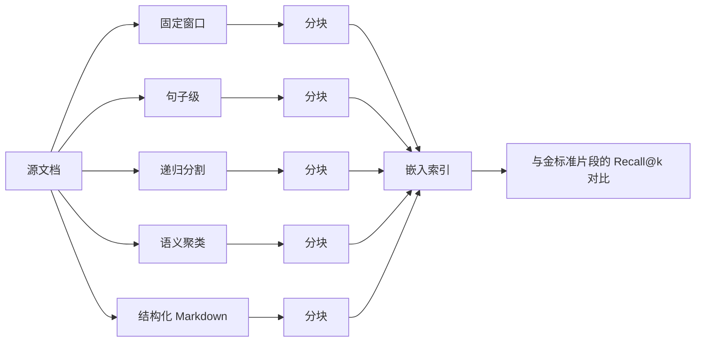

# 分块策略对比

> 分块决定了检索器能找到的内容范围。如果边界切错了，后续的嵌入模型、重排序器和 LLM 都无法弥补。

**类型：** 构建实践
**语言：** Python
**前置知识：** 第 11 阶段课程 04（嵌入）、06（RAG）、07（高级 RAG）；第 19 阶段轨道 B 基础（课程 20-29）
**耗时：** 约 90 分钟

## 学习目标
- 从零实现五种分块策略：固定窗口、句子级、递归分割、语义聚类、结构化 Markdown 标题。
- 在带有金标准答案片段的固定测试集上测量 recall@k，并解释为什么一种策略在散文类文本上表现更好，而另一种策略在技术文档上更优。
- 读取分块长度分布图，识别每种策略引入的失败模式：孤立句子、符号中间截断、仅含标题的分块、语义漂移。
- 在不运行基准测试的情况下，通过检查三个属性为新的语料库选择默认策略：文档类型、平均段落长度、以及格式是否携带显式结构。

## 问题所在

每个 RAG 管线都始于将源文档切分成足够小的片段——小到嵌入模型能装下，又大到每个片段能携带一个完整的概念。切分点在哪里不是一个超参数。它是检索器能返回内容的上限。

当查询问"预算中止阈值是什么样的"时，只有当包含中止阈值的分块可访问时，查询才能成功。如果固定窗口分割器把阈值从周围上下文中切断了，嵌入就会漂移到不同的簇，BM25 得分下降，重排序器看到噪声，LLM 生成的答案就是错误的。2024 年的论文《LongRAG: Enhancing Retrieval-Augmented Generation with Long-context LLMs》测量了，仅因分块选择的差异，检索召回率就会出现 35 个百分点的绝对波动。2025 年关于上下文分块头的后续工作缩小了这一差距，但并未消除它。

本课程并排实现五种策略，在带有金标准答案片段的测试集上运行它们，让你自己读取召回数字。

## 概念



### 固定窗口

暴力基线。每 N 个字符切一次。可选重叠，使得在位置 N 被切断的句子会完整出现在从位置 N - overlap 开始的分块中。快速、确定性强，但在边界处理上很差。用作对照，而非默认。

### 句子级

在句子边界处分割，使用正则或简单的状态机。将一个或多个句子打包进分块，直到达到目标字符预算。不会在单词中间切断。仍然会在段落中间和部分区域中间切断。这是许多早期 RAG 管线的默认选择，对于没有其他结构的散文是合理的选择。

### 递归分割

2023 年流行库普及的层次化策略。首先尝试在最强的分隔符上分割（双换行、段落），失败则回退到下一个（单换行），再到句子，最后到字符。当分块适应预算时递归终止。对于结构不一致的文档效果很好，因为它可以按区域自适应。

### 语义聚类

嵌入每个句子。对共享主题质心的连续句子进行聚类。当运行中的相似度低于质心时切断。边界反映的是意义，而非字符数。构建较慢且依赖嵌入模型，但对于段落内部切换主题的文档具有弹性。

### 结构化 Markdown 标题

对于携带显式结构的文档（markdown、reStructuredText、RFC 风格的编号章节），在标题边界处切断。每个分块成为该标题及其下方所有内容，直到遇到相同或更高级别的下一个标题。每个主题的分块最小，但仅在语料库格式良好时才可用。

### Recall@k 如何衡量边界选择

金标准查询携带答案片段在源文档中的精确字符偏移量。分块后，你问：检索器返回的前 k 个分块中，是否有任意一个与金标准片段重叠？如果有，该查询的 recall@k 为 1。如果没有，则为 0。跨查询集求平均。对每种策略运行相同的评估，差距会告诉你哪种边界策略在你的语料库中表现最好。

```figure
ci-chunk-boundaries
```

## 构建实现

`code/main.py` 实现了：

- `fixed_window(text, size, overlap)` - 基线方案。
- `sentence_chunks(text, target)` - 简单的句子打包器。
- `recursive_split(text, separators, target)` - 层次化递归。
- `semantic_chunks(text, similarity_threshold)` - 基于确定性模拟嵌入的质心聚类。
- `structural_markdown(text)` - 感知标题的分割器。
- `mock_embed(text, dim)` - 基于哈希的嵌入，使循环可离线运行。
- `DenseIndex` - 与第 19 阶段轨道 B 混合检索课程中使用的形状相同。
- `eval_recall(strategy, corpus, queries, k)` - 比较循环。
- 一个 `main()`，在每个固定测试集上运行所有策略并打印 recall@k 表格。

运行：

```bash
python3 code/main.py
```

输出是一个小表格，每种策略一行，每个 k 值一列。句子级在结构化固定测试集上表现不佳。结构化 Markdown 在 markdown 固定测试集上胜出。递归分割在混合固定测试集上表现稳定，因为递归自适应。语义聚类在散文固定测试集上胜出，那里没有有用的结构线索。

## 表格无法隐藏的失败模式

**孤立句子。** 句子打包产生的分块缺少主题句。嵌入随后指向错误的簇。

**符号中间截断。** 固定窗口在代码或 YAML 内部会分裂标识符。两个半部分嵌入为噪声。

**仅含标题的分块。** 结构化 Markdown 会生成仅包含 `## 标题` 的分块。过滤掉这些，或附加下一个分块的首段。

**语义漂移。** 当语料库整体主题一致时，语义聚类会低估。一个 5000 字符的分块将许多具体答案打包进一个弥散的嵌入中。将语义与硬字符上限结合使用。

**过时的嵌入。** 语义聚类使用嵌入模型。如果更换模型，分块也会改变。将分块模型与检索模型分开固定，或一起重建索引。

## 不运行基准测试时如何选择默认值

三个属性决定新语料库的默认分块器。

| 属性 | 值 | 默认 |
|------|-----|------|
| 文档类型 | 无结构的散文 | 递归分割，目标 800 |
| 文档类型 | Markdown / RFC / API 文档 | 结构化 Markdown |
| 文档类型 | 代码 | AST 感知（超出范围；参见第 19 阶段课程 02）|
| 段落长度 | 长段落，单一主题 | 句子级，目标 500 |
| 段落长度 | 短段落，混合主题 | 语义聚类，阈值 0.6 |

不确定时，选择递归分割。它是单一策略中最强的基线。

## 使用方式

生产模式：

- 在新管线上线前运行评估；不要信任库默认的的策略。
- 更换嵌入模型或语料库混合时重新运行评估；胜出者依赖语料库。
- 将策略名称持久化到每个分块的元数据中，以便后续归因回归问题。

## 部署

轨道 F 在第 69 课中的端到端 RAG 系统将此处选择的分块器作为第一阶段。第 68 课的评估工具读取与 `eval_recall` 在此课中返回的形状相同的 recall@k。选择在你的语料库上胜出的策略并向前传递。

## 练习

1. 添加第六种策略：使用 `tiktoken` 代替字符计数的 token 窗口策略。与固定窗口在同一固定测试集上比较。
2. 向散文固定测试集注入 30% 比例代码块。重新运行表格。解释为什么除了结构化 Markdown 之外的所有策略都会损失召回率。
3. 用项目真实提供商的嵌入替换确定性嵌入。测量语义聚类召回率的差值。报告策略间的差距是扩大还是缩小。
4. 为每个分块添加 `summary` 字段：一句话的质心描述。重新运行评估，将摘要附加到分块正文中。测量召回率的提升。

## 关键术语

| 术语 | 人们怎么说 | 实际含义 |
|------|-----------|---------|
| Recall@k | "我们有没有得到正确的分块？" | 任意前 k 个分块与金标准答案片段重叠的查询比例 |
| 分块重叠 | "滑动窗口" | 将前一个分块最后 N 个字符重新包含到下一个分块中 |
| 结构分割器 | "感知标题的分块" | 在 H1/H2/H3 边界处切断；标题文本是分块的一部分 |
| 语义分块器 | "感知主题的分块" | 嵌入句子，按质心相似度聚类，在漂移处切断 |
| 质心漂移 | "主题切换" | 运行均值与下一个句子之间的余弦相似度低于阈值 |

## 延伸阅读

- [LongRAG: Enhancing Retrieval-Augmented Generation with Long-context LLMs (arXiv 2406.15319)](https://arxiv.org/abs/2406.15319)
- [Anthropic, Contextual Retrieval](https://www.anthropic.com/news/contextual-retrieval)
- [LlamaIndex, Chunking strategies for production RAG](https://docs.llamaindex.ai/en/stable/optimizing/production_rag/)
- 第 11 阶段课程 06 - RAG 基础
- 第 11 阶段课程 07 - 高级 RAG
- 第 19 阶段课程 65 - 对这里产生的分块进行排序的混合检索
- 第 19 阶段课程 68 - 在生产中对策略选择进行评分的评估工具
