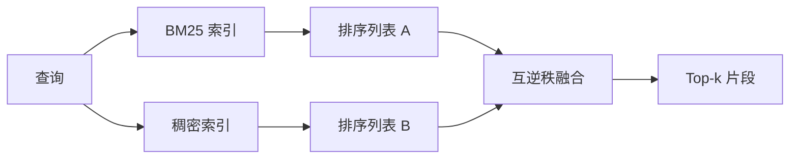

# 使用 BM25 与稠密嵌入的混合检索

> 词汇检索与语义检索在不同的查询分布上各有所长。使用互逆秩融合（Reciprocal Rank Fusion）的混合检索并非插值，而是投票——而在每一类查询上，投票结果都胜出。

**类型：** 实践
**语言：** Python
**前置要求：** Phase 11 第 04 课（embeddings）、第 06 课（RAG）；Phase 19 Track B 基础（第 20-29 课）；Phase 19 第 64 课（chunking 策略）
**时间：** 约 90 分钟

## 学习目标
- 从 Robertson 和 Sparck Jones 的公式出发，从零实现 BM25，包括字段加权、文档长度归一化以及可调的 k1 和 b 参数。
- 基于确定性模拟嵌入构建稠密检索器，使整个流程可在离线环境下运行。
- 严格按照 Cormack、Clarke 和 Buettcher 在 2009 年发表的公式实现互逆秩融合（RRF），并解释为何它优于基于分数的加权插值。
- 调节 RRF 的 k 常数及各模态权重，并在一个小型样本语料上阅读其权衡效果。

## 问题所在

当查询携带语料中原文匹配的标识符时，词汇搜索胜出。针对 `AbortMultipartOnFail` 的查询可在微秒级通过 BM25 返回正确的 Go 函数。而同一查询经嵌入后，会落在三个相似度簇的边界上，稠密检索器会将错误文件排在首位。

当查询是对语料字面词元的改写/转述时，稠密搜索胜出。用户问"如何处理取消的上传"时，从未键入 abort 或 multipart 这样的词。BM25 会返回关于"上传大文件"的文档片段，因为该页面包含 uploads 一词。稠密检索则能找到摘要中提到 cancellation 的 abort 函数。

两者之间的选择并非静态的。查询分布才是变量。一个生产级 RAG 系统需从同一个端点同时处理这两类查询，因此检索必须同时应对两者。这就是混合检索。合并步骤是其中的关键，且必须正确。

## 概念



### 一段话讲清 BM25

BM25 通过对查询词元求和，将逆文档频率因子与包含长度归一化修正的饱和词频因子相乘，从而计算查询-文档对的得分。两个关键旋钮：`k1` 控制词频饱和速度；默认值 1.5 是文献推荐值，没有基准测试不应随意改动。`b` 控制文档长度的影响程度；默认值 0.75 意味着较长文档会受到惩罚，但并非线性惩罚。

IDF 公式采用平滑版的 Robertson-Sparck Jones 定义，即 `log((N - df + 0.5) / (df + 0.5) + 1)`。log 内部的加一操作确保当某词元出现在超过半数文档中时，IDF 仍为正。这在小型语料中尤为重要，因为停用词在技术上可能是罕见的。

字段加权允许你告诉 BM25：符号名称上的匹配比正文中的匹配更重要。其实现方式是在索引期间对词频计数乘以倍率，而非在评分时处理。这保持数学公式的一致性，也避免每个字段产生独立的分数。

### 一段话讲清稠密检索

使用嵌入模型将每个片段映射为固定维度的向量。查询时，对查询进行嵌入，按相似度对所有片段进行余弦排序，返回 top-k。模型是决定质量的关键变量。检索算法本身只需两行：点积和排序。

本课使用基于哈希的确定性嵌入，以便你在无需网络调用的情况下理解融合数学。哈希将 token 键控的偏移量累加到 96 维向量中并归一化。余弦排序在多次运行之间保持确定性，这正是测试套件所要求的。

### 互逆秩融合（RRF）的发表公式

两条排序列表。对于出现在任一列表中的每个候选项，累加其互逆秩贡献。2009 年的论文使用 `1 / (k + rank)`，其中 k 默认取 60。按总分排序。这就是整个算法。

发表常数 k = 60 并非随意设定。当 k = 60 时，rank-1 的贡献为 1 / 61，rank-10 的贡献为 1 / 70。贡献衰减缓慢，因此排名靠后的候选项仍能投票。较小的 k 使顶部结果占主导；较大的 k 使贡献曲线趋于平坦。

我们的实现中有两个可调旋钮：`k` 常数，以及一对模态专用权重，用于在你有先验证据表明某一模态在你的语料上更优时进行提升。将秩贡献乘以权重是最简单的原则性实现方式，它保持了秩衰减的形状且与尺度无关。

### 为何融合优于分数加权插值

BM25 的分数是无界的且依赖语料。余弦相似度的范围在 -1 到 1 之间。线性组合 `alpha * bm25 + (1 - alpha) * cosine` 需要针对每个语料单独调整 alpha，每次重新索引都会失效。基于秩的融合则不然。两个秩在不同模态之间是可比的。自 2010 年以来，RRF 基线在每一个公开 TREC 评测中都优于分数插值。

你在 Vespa 和 Weaviate 文档中会看到 RankFusion 与 RRF 的类似讨论。它们得出了相同的结论：除非有非常强有力的证据支持对分数进行插值，否则请保持在秩空间操作。

```figure
rrf-fusion
```

## 动手实现

`code/main.py` 实现了：

- `tokenize(text)` — 基于正则的快速分词器。
- `BM25Index` — 带字段加权的 BM25，支持 `add` 和 `search`，k1、b 可调。
- `mock_embed`、`DenseIndex` — 与第 64 课相同的确定性嵌入，确保片段可比较。
- `rrf(rankings, k, weights)` — 带多模态权重的标准融合实现。
- `HybridRetriever` — 组合 BM25 与稠密检索。
- 演示用 `main()` — 加载小型样本语料，运行三种分别针对各检索器优势与劣势的查询，打印每种模态生成的排序列表以及融合后的列表。

运行：

```bash
python3 code/main.py
```

对照阅读演示输出。标识符精确匹配的查询：BM25 排名第 1，稠密排名第 4，RRF 排名第 1。改写查询：BM25 排名第 6，稠密排名第 1，RRF 排名第 1。歧义查询：BM25 排名第 3，稠密排名第 3，RRF 排名第 1。融合不是平局决胜机制；它是每一类查询上都能胜出的系统。

## 调节旋钮

| 旋钮 | 默认值 | 调高时机 | 调低时机 |
|------|---------|------------------|------------------|
| BM25 k1 | 1.5 | 词元在文档中重复出现，且你希望词频的影响更大 | 文档较短，词元重复是噪声 |
| BM25 b | 0.75 | 长文档确实每词信息密度更低 | 文档长度与主题无关 |
| RRF k | 60 | 应让排名靠后的候选项继续投票 | 希望 top-1 占据主导 |
| BM25 权重 | 1.0 | 语料包含标识符，查询能与之精确匹配 | 查询多为用户的改写表达 |
| 稠密权重 | 1.0 | 查询为改写形式 | 查询为字面匹配 |

通过在预留查询集上重跑第 68 课的评估框架来调参，而非依赖直觉。

## 演示将隐藏的故障模式

**词汇表外词元。** BM25 的 IDF 基于语料计算，因此仅出现在查询中、不出现在语料中的词元贡献为零。稠密嵌入则对该词元生成一个合理的向量。对于语料外的标识符，稠密模态会返回看似合理但实际错误的邻居。融合能够吸收这一问题，是因为 BM25 不返回任何结果，其秩贡献随之消失——但这仅在按文档去重（而非按片段去重）时成立。

**停用词主导。** BM25 对词"the"的检索会产生在整个语料上均匀分布的排序。在索引器中过滤停用词，或接受高 IDF 词元自然主导排序的结果。

**跨模态内容高度一致。** 如果语料足够小，使得 BM25 的 top-1 同时也是稠密的 top-1，那么 RRF 给出的 top-1 及其邻居将与两者一致。这是正确行为，而非故障，但会让融合显得"不可见"。在评估中增加对抗性查询对，以验证融合确实在工作。

## 使用方式

生产模式：

- 进程内建立 BM25 索引；瓶颈是词频字典，而非向量。
- 将稠密向量索引在独立存储中（本课使用扁平列表；生产中应使用 HNSW）。
- 并行执行两种查询；融合是对并集的常数时间合并。
- 持久化每条检索命中所属的模态，以便下游重排器知道是哪个模态为其投票。

## 交付

第 66 课将本课融合后的 top-k 输入交叉编码器进行重排序。第 68 课使用 precision、recall、MRR 和 nDCG 对整个流水线进行评估。本课中的混合检索器是第 69 课端到端系统的第一阶段。

## 练习

1. 将 `mock_embed` 替换为你提供方提供的真实模型。重跑演示，并报告改写查询上稠密单独排序的变化。
2. 增加第三种模态：单独索引的片段摘要，作为第三条排序列表参与融合。测量增益。
3. 对 RRF 的 k 取值在 10、30、60、100、200 上进行扫描。绘制第 68 课的 recall@k 曲线。报告在语料上曲线峰值处的 k 值。
4. 正确实现 BM25F（逐字段长度归一化，而非倍率技巧），并在符号匹配最为关键的语料上进行对比。

## 关键术语

| 术语 | 人们怎么说 | 实际含义 |
|------|----------------|------------------|
| BM25 | "词汇搜索" | 基于 idf × 饱和 tf × 长度归一化的概率排序 |
| RRF | "秩融合" | 跨排序列表累加 1 / (k + rank)；默认 k = 60 |
| k1 | "TF 饱和" | 控制重复词元停止增加得分的速度 |
| b | "长度惩罚" | 0 表示忽略文档长度，1 表示完全归一化 |
| 字段加权 | "符号提升" | 索引期间重复词元以提升该字段的匹配权重 |
| 基于秩的融合 vs 基于分数的融合 | "为何 RRF 优于线性" | 秩在不同模态间可比，分数则不可比 |

## 延伸阅读

- Cormack, Clarke, Buettcher，《Reciprocal Rank Fusion outperforms Condorcet and individual rank learning methods》，SIGIR 2009
- Robertson, Walker, Beaulieu, Gatford, Payne，《Okapi at TREC-3》（BM25 原始论文）
- [Vespa: Hybrid Retrieval with BM25 and Embeddings](https://docs.vespa.ai/en/tutorials/hybrid-search.html)
- [Weaviate: Hybrid Search](https://weaviate.io/developers/weaviate/search/hybrid)
- Phase 11 第 06 课 — RAG 基础
- Phase 19 第 64 课 — 其输出被索引在此的分块器
- Phase 19 第 66 课 — 消费融合后 top-k 的交叉编码器重排器
- Phase 19 第 68 课 — 端到端评估基准
- Phase 19 第 69 课 — 利用本课混合检索器的端到端系统
