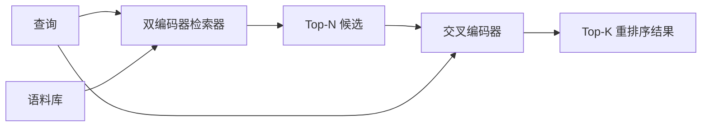

# Cross-Encoder Reranker

> 双编码器（bi-encoder）独立地对查询和文档进行嵌入。交叉编码器（cross-encoder）则将它们拼接在一起，一次性读取全部内容。交叉编码器是最"聪明"的阅读者，也是最慢的。作为双编码器 top-k 输出的第二道处理，它的代价是值得的。

**类型：** Build
**语言：** Python
**前置知识：** Phase 11 课程 06（RAG）、Phase 11 课程 07（高级 RAG）；Phase 19 Track B 基础（课程 20-29）；Phase 19 课程 65（混合检索为此阶段提供输入）
**时间：** 约 90 分钟

## 学习目标
- 通过输入形状、参数量和每个查询的调用成本，区分双编码器检索器与交叉编码器重排序器。
- 从零实现一个小型交叉编码器：一个消耗打包的（查询，文档）序列并输出单个相关性标量的 transformer 块。
- 构建两阶段"检索后重排序"管道：用廉价的检索器取 top-N，用交叉编码器将 N 重排为 top-K，返回 K。
- 在小型样例语料上测量延迟与质量的权衡曲线，并为给定的延迟预算选择合适的 N。

## 问题所在

双编码器将查询和文档映射到同一个向量空间，按余弦相似度排序。两种编码永远不会互相看到对方。模型必须把文档中所有有用的信息压缩成一个向量，完全忽略查询。这很快——索引时每个文档只做一次嵌入，查询时每个查询也只做一次——而且这是能在语料库规模上排序的唯一方式。

代价是精度。两篇主题大体相同的文档可能拥有几乎相同的嵌入，即使其中一篇回答了查询而另一篇没有。双编码器分不出它们。

交叉编码器通过同时读取查询和文档来解决这个问题。模型接收 `[query] [SEP] [document]` 作为单一序列，在拼接后的整体上做完整注意力，输出一个相关性标量。文档的每个 token 都能看到查询的每个 token。模型基于完整上下文决定分数。

代价是吞吐量。双编码器嵌入一次后可以对所有文档查询；交叉编码器则要对每个（查询，文档）配对运行一次。对于 1000 万文档的语料库，每个查询需要 1000 万次前向传播。在请求预算内根本跑不完。

解决方案是分阶段处理。先用双编码器检索 top-N，再用交叉编码器把 N 重排为 top-K。N 很小（50 到 200），交叉编码器的质量提升集中在最关键的区域。总延迟保持在请求预算内。总质量就是交叉编码器的质量，上界由双编码器在 N 处的召回率决定。

## 概念



### 交叉编码器的输入形状

标准打包格式是 `[CLS] query_tokens [SEP] document_tokens [SEP]`。CLS 位置的输出送入一个线性头，输出相关性标量。有些实现用 mean-pooling 代替 CLS；差别不大。关键点在于：模型对每对（查询，文档）输出一个数。

2200 万参数的交叉编码器（典型的 `ms-marco-MiniLM-L-6-v2` 权重层级）是生产环境中的典型选择。更小的模型质量下降的速度远快于它节省的延迟。更大的模型（例如 5.68 亿参数的 `bge-reranker-v2-m3`）则留给离线重排序或 K 很小的首屏重排序场景。

### 为什么本课程训练一个极小模型

真正的交叉编码器是一个微调过的 encoder transformer。在生产环境中，你直接加载 checkpoint 并运行。在本课中，目标是让你看清模型的形状和延迟-质量曲线的形状，而不是训练一个 SOTA 排序模型。所以我们构建一个小型 `nn.Module`：一个 transformer 块、多头注意力（默认 4 个头）和一个回归头。它通过固定种子确定性初始化，因此演示可以在没有磁盘权重的情况下复现。

这个玩具模型能从样例语料中学到正确的形状：相关（查询，文档）对的预测分数高于无关对。端到端管道对双编码器的输出做重排序，重排序后的 top-k 与金标标签呈正相关。

### 延迟 vs 质量

两阶段管道只有一个可调参数：N。在保留查询集上从 5 到 100 扫 N，即可得到曲线。

| N | 阶段二的 Recall@1 | 每查询的交叉编码器前向次数 | 延迟 |
|---|--------------------|---------------------------------------|---------|
| 5 | 0.62 | 5 | 低 |
| 20 | 0.81 | 20 | 中等 |
| 50 | 0.86 | 50 | 高 |
| 100 | 0.86 | 100 | 非常高 |

上表数字仅用于示意曲线形状，并非来自本课样例的实际测量值。但这个形状是真实的。通常在 20 到 50 个候选处会出现一个拐点，越过拐点后重排序的提升开始饱和。过了拐点就是在为无用的延迟买单。

从评估曲线结合延迟预算来选 N。交叉编码器无法把召回率提升到双编码器在 N 处召回率之上，所以低 N 同时限死了质量和延迟。

```figure
rerank-funnel
```

## 构建

`code/main.py` 实现了：

- `CrossEncoder`——一个小型 `torch.nn.Module`：词元嵌入、一个带多头注意力和前馈的 transformer 块、mean-pooled 输出头（产生单个标量）。
- `tokenize_pair(query, document)`——将两个字符串打包为单一 id 序列，用 type ids 标记边界，确定性的，纯 stdlib。
- `train_tiny(pairs)`——对手标（query, document, relevance）三元组列表做一次有监督训练，让模型在样例语料上产生合理的分数。
- `rerank(query, candidates, top_k)`——生产接口。
- `pipeline(query, retriever, top_n, top_k)`——两阶段流程。
- 一个演示用的 `main()`：从课程 65 的模式加载语料库、检索 top-N、重排到 top-K、并排打印两份列表，并报告各阶段的延迟。

运行：

```bash
python3 code/main.py
```

输出会展示双编码器的 top-N、交叉编码器的 top-K，以及计时摘要。交叉编码器单次调用更慢，但不会在整个语料库上运行。两阶段总延迟保持在请求预算内，同时选出双编码器排在第二或第三位的答案。

## 演示会隐藏的故障模式

**交叉编码器不具备对称性。** `rerank(q, d)` 和 `rerank(d, q)` 会得到不同的分数。始终把查询放在前面。如果不小心调换顺序，召回率会崩塌。

**N 设得太低会掩盖 bug。** 如果 N = K，交叉编码器无法重排，只能重新加权。看起来增益为零。N 至少应为 K 的三倍。

**训练数据泄漏到评估中。** 如果手标训练对中包含评估查询，重排序效果看起来会很神奇。即使在样例语料上也应严格区分训练集和评估集。

**生产权重是稠密的。** 2200 万参数的交叉编码器在 float32 下约 88MB。在承诺 p95 延迟低于 100ms 之前，先规划好模型服务器的内存。

**批处理很关键。** 真实的交叉编码器会把 N 个候选放在一个 batch 中运行。本课在 `_batch_encode` 中实现：用 `torch.tensor(...)` 构建批量的 id 和 type-id 张量，然后做一次前向传播。跳过批处理会让延迟乘以 N。

## 使用

生产模式：

- 将双编码器、交叉编码器和 N 固定组合在一起。改变其中任何一个都会让之前的评估失效。
- 按（query, document_id）的哈希缓存重排序结果。相同查询面对稳定语料库时重排顺序一致；缓存命中可以白嫖一段延迟削减。
- 记录 rank-1 的交叉编码器分数。top-1 分数低于语料库特定阈值的查询是域外命中；将其标记为"我不确定"反馈给 LLM。

## 交付

课程 68 对这套两阶段管道做端到端评估。课程 69 将这个重排序器接在课程 65 的混合检索器之后、答案生成器之前。重排序器是整个端到端系统的第二道处理。

## 练习

1. 在 5 到 50 之间扫描 N，绘制重排序后输出的 recall@1 曲线。找出这条样例语料上的拐点。
2. 将交叉编码器训练 10 个 epoch 而非 1 个。在每个 epoch 测量正负对的分数间距。
3. 用 CLS-token 头替换 mean-pooling。比较在样例语料上的收敛情况。
4. 增加第二个交叉编码器头，预测二值标签"答案是否在文档中"。推理时同时使用两个头：一个用于排序，一个用于阈值判定。
5. 用课程 65 的双编码器替换确定性 mock 双编码器，串联两阶段。测量相对于单用双编码器的 top-K 变化。

## 关键术语

| 术语 | 人们常说的 | 实际含义 |
|------|------------------------|----------|
| Bi-encoder | "向量检索器" | 独立编码查询和文档；余弦排序 |
| Cross-encoder | "重排序器" | 联合编码（查询，文档）；输出单个相关性标量 |
| 两阶段管道 | "检索并重排序" | 廉价检索器返回 N，昂贵重排序器保留 K |
| N（候选预算） | "重排序候选池" | 交叉编码器对每个查询评分的候选数 |
| Mean-pooling 头 | "最后层 hidden 的均值" | 将编码器最后一层输出平均为一个向量 |

## 延伸阅读

- Nogueira, Cho, "Passage Re-ranking with BERT", 2019 —— 经典的交叉编码器重排序论文
- Reimers, Gurevych, "Sentence-BERT: Sentence Embeddings using Siamese BERT-Networks", 2019 —— 关于双编码器与交叉编码器的对比
- [SentenceTransformers Cross-Encoders 文档](https://www.sbert.net/examples/applications/cross-encoder/README.html)
- [BGE Reranker v2 模型卡](https://huggingface.co/BAAI/bge-reranker-v2-m3)
- Phase 19 课程 65 —— 为此重排序阶段提供输入的混合检索器
- Phase 19 课程 68 —— 衡量本次重排序带来增益的评估
