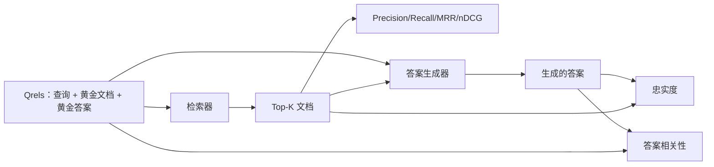

# RAG 评估：精确率、召回率、MRR、nDCG、忠实度、答案相关性

> 如果你无法同时评估检索和答案的质量，就不能发布该系统。这两个指标不同，同一个提示词会在不同维度上失败。

**类型：** 构建
**语言：** Python
**前置知识：** 阶段 11 第 6 课（RAG）、第 10 课（评估）；阶段 19 B 轨道基础（第 20-29 课）；阶段 19 第 64、65、66、67 课
**时间：** 约 90 分钟

## 学习目标
- 从黄金相关文档集（qrels）中计算四个检索指标：精确率@k、召回率@k、MRR（平均倒数排名）和 nDCG@k。
- 计算两个答案评级指标：忠实度（每个声明都在检索到的上下文中有所依据）和答案相关性（答案是否回应了问题）。
- 构建一份用于端到端评估的示例 qrels 文件（包含查询、黄金文档 ID、黄金答案文本）。
- 读取指标值来诊断管道在哪个环节失败：检索、排序、生成或接地。

## 问题所在

一个 RAG 系统至少有四个关键部分：分块器、检索器、重排器、生成器。其中任何一个都可能导致错误答案。没有分阶段的指标，你就是在盲飞。

用户报告了一个错误答案。是因为分块器把答案片段截断了？是因为检索器没有把该片段包含在 top-k 中？是因为重排器把正确的片段排到了第一位之后？是因为生成器忽略了该片段并凭空捏造了内容？仅凭答案本身你无法判断。你需要：

- **检索指标**来评估检索器的输出质量。
- **排序指标**来评估正确片段在排序中的位置。
- **忠实度**来评估生成器是否始终在检索到的上下文范围内。
- **答案相关性**来评估答案是否真正回应了问题。

本教程将在一个示例 qrels 文件之上构建全部六个指标。该评估是离线且确定性的；在生产环境中，你将把模拟的 LLM 裁判替换为真实的模型。

## 概念框架



### Precision@k（精确率@k）

在检索器返回的 top-k 个文档中，有多少比例属于黄金文档集？如果黄金文档有 3 个，而 top-3 返回了其中的 2 个和 1 个错误的，那么 precision@3 就是 2 / 3。当无关检索片段的成本较高时使用精确率（生成器会在上面浪费 token，或者该片段会污染答案）。

### Recall@k（召回率@k）

在黄金文档中，有多少比例出现在了 top-k 里？如果黄金文档有 3 个，而 top-5 包含了全部 3 个，那么 recall@5 就是 1.0。当你担心遗漏答案片段时使用召回率（你宁愿看到一个额外的错误片段，也不愿完全错过答案片段）。

在生产 RAG 系统中，人们通常引用的指标是 recall@k。生成器可以轻松丢弃无关片段；但它无法凭空创造出从未见过片段的答案。

### MRR（Mean Reciprocal Rank，平均倒数排名）

对于每个查询，在排序列表中找出第一个相关文档的位置。倒数排名为 1 / 位置。在所有查询上取平均值。MRR 是一个单一数字，用于总结检索器将最佳答案放在顶部有多好。

MRR 对位置 1 有极大权重。一个黄金文档排在第 1 位的查询贡献 1.0，第 2 位贡献 0.5，第 10 位贡献 0.1。该指标主要由列表顶部主导。

### nDCG@k（归一化折损累计增益）

全称 Normalized Discounted Cumulative Gain。完整公式为每个检索到的文档分配一个增益值（通常为 1 表示相关，0 表示不相关），按位置的对数进行折扣，求和后除以理想 DCG（即完美排序时的 DCG）。取值范围 0 到 1。

nDCG 支持分级相关性：黄金标注可以说"文档 A 相关性为 3，文档 B 为 2，文档 C 为 1"。MRR 和 recall@k 将所有内容扁平化为二元关系。当语料库中每个查询有多个部分相关的文档时，使用 nDCG。

### Faithfulness（忠实度）

对于生成答案中的每个声明，检查该声明是否由检索到的上下文支持。标准实现使用一个 LLM-as-judge 提示，输入 (声明, 上下文)，输出 yes 或 no。指标是通过的声明占比。

忠实度捕捉生成器的失败模式——模型凭空捏造内容。即使检索器返回了正确的片段，一个会产生幻觉的生成器也是有缺陷的。忠实度也称为 groundedness、support、attribution。

本教程使用确定性模拟裁判实现忠实度，检查每个声明的 token 是否与检索到的上下文达到阈值重叠。在生产环境中，你可以替换为真实模型调用。指标的形态是相同的。

### Answer Relevance（答案相关性）

答案是否真正回应了问题？忠实度问的是"答案是否有上下文依据？"，而答案相关性问的是"答案是否有问题依据？"。一个忠实但离题的答案会在忠实度上得分高，在相关性上得分低。一个简短、切题但忽略上下文的答案会在相关性上得分高，在忠实度上得分低。

标准实现同样使用 LLM-as-judge：输入 (问题, 答案)，询问答案是否回应了问题。本教程实现了一个基于 token 重叠加裁判的替代品。

## 示例 qrels 文件

```python
{
  "qid": "q1",
  "query": "what is the abort threshold for multipart uploads",
  "gold_doc_ids": ["d1", "d3"],
  "gold_answer_substring": "three failed parts",
  "graded_relevance": {"d1": 3, "d3": 2},
}
```

每个查询携带：
- 查询字符串，
- 黄金文档 ID 集合（用于精确率/召回率/MRR），
- 分级相关性字典（用于 nDCG），
- 黄金答案子串（作为每个 qrel 的参考元数据保存；本教程中的忠实度是通过裁判提取的声明与检索到的上下文进行比较来计算，而非与该子串比较）。

在生产环境中，你需要对这些数据进行标注。本教程提供一个手工构建的示例，以便评估可以直接运行。

```figure
ci-rag-metric-ladder
```

## 构建

`code/main.py` 实现了：

- `precision_at_k(retrieved, gold, k)` — 字面定义。
- `recall_at_k(retrieved, gold, k)` — 字面定义。
- `mean_reciprocal_rank(retrieved_list_of_lists, gold_list)` — 各查询的均值。
- `ndcg_at_k(retrieved, graded_relevance, k)` — DCG / IDCG，支持二元或分级增益。
- `extract_claims(answer)` — 将答案拆分为句子形式的声明。
- `faithfulness(claims, context_texts, judge)` — 通过裁判的声明占比。
- `answer_relevance(question, answer, judge)` — 裁判答案是否回应了问题。
- `MockJudge` — 确定性 token 重叠裁判，使评估可以离线运行。
- `evaluate_pipeline(pipeline_fn, qrels, ks)` — 运行所有指标的主控函数。
- 一个演示，针对 qrels 运行三种管道变体（分块基线、混合检索、混合检索+重排）并打印指标表。

运行：

```bash
python3 code/main.py
```

输出在同一张指标表中展示每种变体的 precision@k、recall@k、MRR、nDCG@k、忠实度和答案相关性。混合检索行在召回率上优于分块基线；重排行在 MRR 上优于混合检索。

## 通过指标诊断失败

| 症状 | 可能原因 | 修复方法 |
|------|---------|---------|
| 低 recall@k，低 precision@k | 分块器截断了答案，或检索器找不到 | 调整分块边界（第 64 课）或检索器模态（第 65 课） |
| recall@k 尚可，MRR 低 | 正确片段在 top-k 中，但不在第 1 位 | 重排器（第 66 课） |
| MRR 高，忠实度低 | 生成器在拥有正确上下文的情况下仍凭空捏造内容 | 生成提示；强制引用或拒绝回答 |
| 忠实度高，相关性低 | 答案有依据但离题 | 查询改写器（第 67 课）或生成提示 |
| 四个指标都高，但用户仍抱怨 | 评估集不具备代表性 | 用真实用户查询扩充 qrels |

## 演示中可能隐藏的失败模式

**LLM-as-judge 偏见。** 模型倾向于将自己的输出判为更忠实。让裁判使用与生成器不同的模型家族，或对样本进行人工标注。

**Qrels 腐化。** 黄金答案会随着语料库的变更而过时。2024 年 1 月针对 q1 的黄金文档，可能在 2024 年 10 月不再正确，因为团队重命名了该函数。安排每季度 qrels 审查。

**忠实度微观检查会遗漏宏观声明。** 逐句忠实度可能通过，但整体答案的结构可能产生误导。在自动化指标之上增加样本级定性审查。

**Recall@k 掩盖单条查询的失败。** 90% 的平均召回率可能隐藏某一类查询总是失败的情况。按查询类别（字面查询、 paraphrased、多主题）对 qrels 切片，并分别报告各切片指标。

## 生产用法

生产模式：

- 在每次检索器或生成器变更后运行评估。将 recall@k 的退化视为测试失败。
- 持久化每条查询的指标轨迹。当用户投诉时，查找匹配的 qrels 条目，看看是否会被捕获。
- 分层 qrels：20 条查询的冒烟测试集在 CI 中运行；200 条的回归测试集每晚运行；2000 条的深度测试集每周运行。

## 交付

第 69 课将整个管道（分块器、检索器、重排器、生成器）连接起来，并对端到端系统运行此评估。

## 练习

1. 添加第五个检索指标：hit-rate@k。与 recall@k 比较。解释它们何时不同。
2. 实现分级忠实度：0（无依据）、1（部分支持）、2（完全支持）。相应更新指标。
3. 用真实模型调用替换模拟裁判。测量模拟裁判与真实裁判在示例集上的分歧。
4. 添加查询类别切片（"literal"、"paraphrased"、"multi-topic"）。报告各切片的指标。
5. 添加"答案长度"指标，并与其和忠实度的相关性进行关联分析。绘制曲线。

## 关键术语

| 术语 | 人们常说的 | 实际含义 |
|------|-----------|---------|
| Precision@k | "检索命中准率" | top-k 中属于黄金的比例 |
| Recall@k | "黄金命中准率" | top-k 中涵盖的黄金比例 |
| MRR | "首次命中位置" | 第一个相关文档排名的 1/rank 均值 |
| nDCG@k | "分级排序质量" | top-k 的 DCG 除以理想 DCG |
| Faithfulness | "接地性" | 答案声明中由检索上下文支持的比例 |
| Answer relevance | "是否回应了问题？" | 答案是否与问题意图匹配 |
| Qrels | "黄金标签" | 包含查询及其黄金文档和答案的标注集 |

## 延伸阅读

- Buckley, Voorhees, "Evaluating Evaluation Measure Stability", SIGIR 2000 — 排序指标的经典论文
- Jarvelin, Kekalainen, "Cumulated Gain-based Evaluation of IR Techniques" — nDCG 论文
- [Ragas: Automated Evaluation of RAG Pipelines](https://docs.ragas.io)
- [Anthropic, Evaluating RAG](https://www.anthropic.com/news/evaluating-rag)
- 阶段 11 第 10 课 — 评估框架基础
- 阶段 19 第 64-67 课 — 此处评估的各个组件
- 阶段 19 第 69 课 — 本评估所针对的端到端管道
