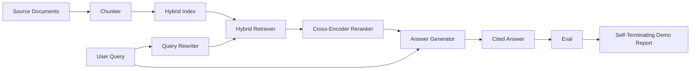

# 端到端 RAG 系统

> 六个组件章节。一个流水线。一个评估循环。一个自终止演示。这就是你要交付的系统。

**类型：** Build
**语言：** Python
**前置要求：** Phase 11 lessons 06 (RAG), 10 (evaluation); Phase 19 Track B foundations (lessons 20-29); Phase 19 lessons 64, 65, 66, 67, 68
**时间：** ~90 分钟

## 学习目标
- 将 chunker、hybrid retriever、query rewriter、cross-encoder reranker 和 answer generator 组合成单一的端到端 pipeline。
- 实现一个按 chunk anchor 引用其主张的 answer generator，并在低置信度时触发 refuse-on-low-confidence 回退。
- 针对组装后的 pipeline 运行 lesson 68 的 eval，并证明该分阶段构建的 pipeline 在每项指标上均优于各组件孤立运行时的表现。
- 构建一个自终止的 CLI demo，用于 ingest fixture corpus，运行固定 query set，并以摘要报告 zero exit code 退出。

## The Problem

孤立的六个组件证明不了任何东西。chunker 可能在 corpus 的 recall@5 上获胜，但在系统的 recall@5 上失败，因为 retriever 无法对 chunker 输出的内容进行有效排序。reranker 可能提升 synthetic candidate pool 上的 MRR，但在真实的 bi-encoder candidates 上失败，因为 bi-encoder 在 rerank budget 内的 recall 太低。query rewriter 可能在一个 query 上提升 gold doc，却在下一个 query 上崩溃，因为 LLM mock 返回了退化的 hypothetical。

集成测试是整个 pipeline 针对相同的 fixture qrels、相同的 metric、由一个 orchestrator 文件统一 wiring 后端到端的运行。这正是本课所构建的内容。如果集成 pipeline 的指标优于每个 stage 孤立 demo 的指标，你就已经证明了该系统。

## The Concept



### Wiring choices

Pipeline 是一个小型图。每个 stage 都是一个具有清晰 signature 的函数。

| Stage | Input | Output |
|-------|-------|--------|
| Chunker | Document text | List of Chunk records |
| Retriever | Query string | Top-N Chunk records |
| Rewriter (optional) | Query string | List of rewrites + hypothetical |
| Reranker | Query, candidates | Top-K Chunk records with cross scores |
| Generator | Query, top-K Chunk records | Answer string with citations |

当每个 signature 稳定时，composition 非常直接。本课的 `Pipeline` 类持有这五个 stage 和一个 `query` 方法，按顺序执行它们。每个 stage 均可替换：传入不同的 chunker、retriever、rewriter、reranker 或 generator，pipeline 仍可正常运行。

### Answer generator with citations

Generator 是最后一个 stage，也最容易 break。本课提供一个 deterministic mock generator，其行为如下：

1. 接收 top-K reranked chunks。
2. 选取最多两个 chunks，使其 text 与 query 的 content-token overlap 最高。
3. 生成由每个 selected chunk 中的一句话拼接而成的 answer，每个句子后跟 `[doc_id:chunk_index]` anchor。
4. 如果没有 chunk 的 overlap 超过 refuse threshold，则输出 "I do not know" 且不带 citation。

在生产环境中，你将用实际的 LLM call 替换 mock，prompt template 如下：

```
You are answering a question using only the snippets below.
Cite every claim with the anchor in parentheses.
If the snippets do not answer the question, say "I do not know".

Question: {query}

Snippets:
{enumerated chunks with anchors}

Answer:
```

refuse-on-low-confidence path 正是记录 cross-encoder rank-1 score 的全部原因。如果该分数低于 corpus threshold，generator 将拒绝回答。这是防止 hallucinated answers 的安全阀。

### The self-terminating demo

该 demo 端到端运行所有内容。它会打印单个 query 的 per-stage breakdown，在四个 fixture qrels 上运行 eval，打印 metrics table，并在所有 lesson 68 metrics 达到 demo 中设定的 thresholds 时以 status zero 退出。如果任何 metric 低于 threshold，demo 将以非 zero status 退出，并输出一条指明失败 metric 的消息。

这就是 CI smoke test 的形态。Pipeline 离线运行，速度快、deterministic。Thresholds 在 fixture 上刻意设置得较严格，以便任意一个先前 lesson 的 regression 都能导致 demo 失败。

```figure
rag-pipeline-flow
```

## Build It

`code/main.py` 实现了：

- `Chunk` - 贯穿所有 stage 的 record（在 lesson 64 的 shape 基础上增加了 chunk_index 和 source doc_id）。
- `Chunker` - 从 lesson 64 中选择一种 strategy（默认 recursive split）。
- `HybridIndex` - 捆绑了 lesson 65 的 BM25 + dense + RRF。
- `Rewriter`（optional）- 根据 query length 和 conjunctions 存在情况，从 lesson 67 中选择 HyDE、multi-query 或 decomposition 之一。
- `Reranker` - lesson 66 的训练 cross-encoder，使用较小的 fixture training set 以便在数秒内收敛。
- `Generator` - 带有 citations 和 refuse-on-low-confidence 的 deterministic mock generator。
- `Pipeline` - 组合五个 stage，并提供一个返回 `Result(answer, top_k, latency_ms_per_stage)` 的 `query(question)` 方法。
- `run_demo()` - ingest corpus，运行三个 fixture queries，运行 eval，打印 results，并根据 threshold 设置 exit code。

运行方式：

```bash
python3 code/main.py
```

输出包括：一个打印的 query trace、完整的 eval table 以及最终的 pass/fail status。在 fixture 上返回 exit code 0。

## Failure modes the demo will hide

**Chunker boundary drift.** 如果你在 eval qrels labeling pass 和 demo 之间切换 chunker strategy，gold doc ids 将无法对齐。锁定 qrels 文件中的 chunker strategy。demo 包含一个命名 chunker 的 header。

**Reranker training set leaks into the eval.** lesson 66 的 14 个 training triples 包含与 eval queries 相似的查询。在生产中，必须严格 hold out eval queries。本 demo 的 eval queries 已与 rerank training set 刻意保持 disjoint。

**Mock generator hides hallucination risk.** mock 不会产生 hallucination，因为它只输出从 retrieved chunks 中提取的文本。本课已注明此点，并指出了切换到真实 model 的生产 swap-in 路径。

**No streaming.** pipeline 在每个 stage 结束后返回完整 answer。生产系统会 stream generator 的输出。Streaming 不在本课题范围；无论哪种方式，answer-grade metrics 都作用于 final string。

**Latency is offline.** mock LLM calls 是 constant time。真实 LLM calls 占主导。应在 request scope 内规划 latency budget；本课的 per-stage timing 仅测量 CPU work。

## Use It

Production patterns:

- 将 pipeline 文件作为单个 orchestrator 交付，stage interfaces 明确。避免将 wiring 逻辑分散在整个 repo 中。
- 在每次触及 stage 的 merge 前运行 eval。如果 eval 下降，该 merge 不得 landing。
- 持久化每次 CI run 的 metric trace，以便将 regressions 归因于 stage swap。
- 添加一组 20 个 queries 的 smoke set（regression set 的子集），可在 30 秒内完成；完整 regression set 每晚运行。

## Ship It

本课的 pipeline 文件是 Phase 19 其余 Track F lessons 所依赖的形态。后续课程将在此基础上添加 ingestion automation、incremental re-index、telemetry 和 serving layer。retrieval、rerank、rewrite 和 eval 部分在此均已完整。

## Exercises

1. 在 rewriter 内部添加 per-query strategy selector：使用 lesson 67 的启发式规则（length、conjunctions、jargon ratio）来选择 HyDE、multi-query 或 decomposition。
2. 通过 env flag 为 generator 添加真实的 LLM call。默认仍使用 mock。测量 latency delta。
3. 扩展 demo 以接受 `--corpus path` flag 加载真实 corpus。重新运行 eval 和 threshold check。
4. 为 chunker 添加 `--strategy` flag。测量每种 strategy 对端到端 recall 的贡献。
5. 添加 streaming generator interface 并接入 eval。确认 faithfulness 是基于 final string 计算而非 streamed prefix。

## Key Terms

| Term | What people say | What it actually means |
|------|-----------------|------------------------|
| Pipeline | "RAG pipeline" | 从 ingestion 到 cited answer 的 composed stages |
| Citation anchor | "Source link" | 附加到每个 claim 的 (doc_id, chunk_index) reference |
| Refuse-on-low-confidence | "I do not know" | 当 reranker top-1 score 低于 threshold 时，generator 不返回 answer |
| Smoke set | "CI eval" | 在每次 PR check 中运行的最小 qrels subset |
| Stage interface | "Function signature" | 每个 pipeline stage 稳定的 input 和 output type |

## Further Reading

- [Anthropic, Building search and retrieval](https://www.anthropic.com/news/contextual-retrieval)
- [Pinterest, MCP internal search](https://medium.com/pinterest-engineering) - reference production architecture
- [Ragas: Automated Evaluation of RAG Pipelines](https://docs.ragas.io)
- Phase 11 lesson 06 - RAG fundamentals
- Phase 19 lessons 64-68 - the components composed here
