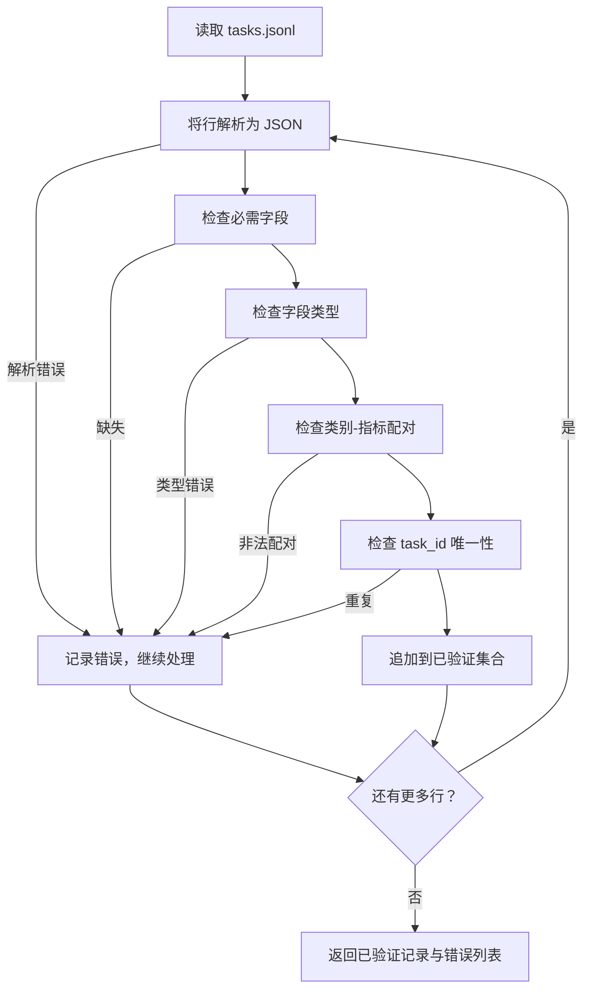

# Task Spec 格式规范

> 评估框架的质量取决于其遵循的契约。在编写任何评分函数之前，先冻结 JSONL 结构和指标词汇表。

**类型：** 构建
**语言：** Python
**前置条件：** Phase 19 Track B 基础
**时间：** ~90 分钟

## 学习目标

- 定义一个 JSONL 任务记录 schema，以统一结构覆盖算术、多项选择、代码执行、分类和自由文本摘要。
- 固定一个封闭的指标名称词汇表，以便下游课程（71-73）通过单个字段进行分发。
- 将 few-shot 示例和后置处理规则作为任务的一部分进行指定，而非运行器的一部分，确保相同的 prompt 在不同模型间产生相同的目标输出。
- 实现一个严格的验证器，在记录进入运行器之前拒绝格式错误的记录。
- 提供一个包含 10 个任务的样本集，覆盖规范的每个分支，让验证器有真实内容可处理。

```figure
ci-task-spec-gate
```

## 为什么需要冻结规范

研究代码库中评估脚本的积累速度往往快于测试用例。六个月后，每个 notebook 都有自己的 JSON 结构，每个指标都被重新实现两遍，且无法跨运行进行比较。解决方案很朴素：选定一个 schema，编写验证器，拒绝其他一切。本 lesson 正是为此而设。

该结构借鉴了 BIG-bench、HELM 和 lm-eval 风格框架的理念，但字段名称由我们自己定义。每个字段都有单一归属。运行器读取任务，指标读取目标，后处理步骤规范化生成结果。管道中没有字段是可变的。

## 记录结构

任务是一个单行 JSON 对象。框架读取 `tasks.jsonl` 并独立验证每一行。错误行只导致该记录失败，不会中断整个运行。

```json
{
  "task_id": "arith_001",
  "category": "arithmetic",
  "prompt": "Compute the result. Question: 17 + 24\nAnswer:",
  "targets": ["41"],
  "metric_name": "exact_match",
  "few_shot_examples": [
    {"prompt": "Question: 2 + 2\nAnswer:", "completion": "4"}
  ],
  "post_process": "strip_whitespace",
  "metadata": {"difficulty": "easy"}
}
```

必需字段为 `task_id`、`category`、`prompt`、`targets`、`metric_name`、`post_process`。`few_shot_examples` 和 `metadata` 是可选的。未知的顶级字段会导致验证失败。

## 字段规则

`task_id` 是无空格的字符串。验证器强制文件内唯一性。

`category` 只能是 `arithmetic`、`mcq`、`code_exec`、`classification`、`summary` 之一。类别约束了合法的指标和后处理组合。`code_exec` 任务必须使用 `metric_name = code_exec`，`mcq` 任务必须使用 `metric_name = exact_match` 且目标为单个字母。

`prompt` 是非空字符串。验证器禁止尾部空格，并拒绝 prompt 正文中已包含 few-shot 块的任务。few-shot 渲染由运行器完成，而非作者。

`targets` 是非空字符串列表。对于 `exact_match`，任一匹配元素即算通过。对于 `f1` 和 `rouge_l`，取得分最高的目标。对于 `mcq`，列表仅含一个元素。

`metric_name` 只能是 `exact_match`、`f1`、`bleu_4`、`rouge_l`、`accuracy`、`code_exec` 之一。词汇表是封闭的。新增指标需要新增 lesson 并在此处添加条目。

`few_shot_examples` 是 `{prompt, completion}` 对的列表。验证器将列表上限设为 8 条，以保持 prompt 长度可控。

`post_process` 只能是 `none`、`strip_whitespace`、`lower`、`extract_letter`、`extract_code_block`、`extract_first_line` 之一。每条规则的行为都是确定性的。验证器禁止组合多条规则。

## 验证器行为



验证器返回两个列表：已验证记录和错误记录（包含出错行、违反的规则和有问题的字段）。如果错误列表非空，运行器拒绝启动，除非设置了显式的 `--allow-bad-tasks` 标志。

## Few-shot 渲染

运行器将 few-shot 示例拼接到 prompt 前方，以空行分隔。所有模型共用同一段代码路径，因此唯一的变化来源是模型本身。作者只需编写一次示例，无需为每个提供商单独编写。

```python
def render(task):
    parts = []
    for ex in task.get("few_shot_examples", []):
        parts.append(ex["prompt"] + " " + ex["completion"])
    parts.append(task["prompt"])
    return "\n\n".join(parts)
```

## 后置处理规则

后置处理步骤在生成之后、指标计算之前运行。它是确定性的、无状态的。

- `none` 原样返回字符串。
- `strip_whitespace` 去除首尾空白。
- `lower` 将字符串转为小写。
- `extract_letter` 返回首个匹配 `[A-E]` 的字符，用于 MCQ。
- `extract_code_block` 返回首个三反引号围栏块的主体内容，用于代码执行任务。
- `extract_first_line` 返回首个非空行，用于摘要分类任务。

需要该列表之外规则的特定任务应归属新 lesson。

## 本 lesson 不包含的内容

本 lesson 不负责评分，不调用模型，不运行代码。这些内容分别出现在 lesson 71、72 和 75。本 lesson 冻结的是所有这些组件共同遵守的契约。

10 个任务的样本集包含：两个算术项、两个 MCQ 项、两个代码执行项、两个分类项、两个摘要项。验证器对全部 10 个任务通过。单独的故障样本集（`tasks_bad.jsonl`）会触发每一条规则，验证器将精确返回相应数量的错误。

## 如何阅读代码

`main.py` 定义了 `TaskSpec`、`validate_task`、`validate_file` 以及 CLI 入口点。样本加载器是 `load_fixtures`。渲染和后置处理辅助函数位于验证模块旁边，以便 lesson 75 的运行器只需导入单一模块。

从顶部到底部阅读 `main.py`，然后阅读 `code/tests/test_spec.py`。测试覆盖了每一条验证规则和每一种后置处理行为。`main.py` 底部的演示代码验证捆绑的样本集并打印摘要。

## 进一步扩展

真实的评估套件会像 schema 增加列一样增长类别。稳重的做法是：在不同时新增指标、新增后置处理规则、新增至少一个样本任务的情况下，拒绝新增类别。将规范视为数据库迁移：每项变更都经过审查、版本控制，并附带测试。本 lesson 中的验证器就是那道门禁。
