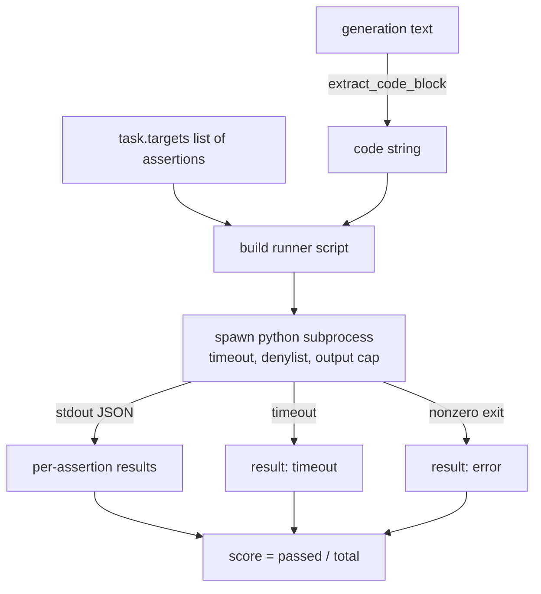
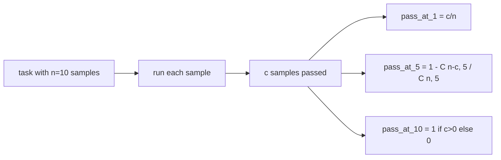

# 代码执行指标

> 生成的代码在通过测试时才算正确。评估框架需要提取代码、在不崩溃宿主的条件下运行，并诚实地统计通过率。本课构建这一接口。

**类型：** 构建
**语言：** Python
**前置要求：** Phase 19 Track B 基础、第 70 和 71 课
**时间：** ~90 分钟

## 学习目标

- 以匹配第 70 课后处理规则的方式，从自由格式生成内容中提取代码块。
- 在隔离的子进程中执行候选代码，设置墙钟超时、输出上限和导入黑名单。
- 将任务得分计算为通过的断言字符串数与总数之比。
- 对从同一模型采样多次生成的任务，计算 pass-at-k。
- 将沙箱崩溃、语法错误和超时视为一等公民的失败模式，使用运行器可记录的独立退出码。

```figure
sandbox-runner
```

## 为什么使用隔离子进程

内联 `exec` 存在安全和稳定性隐患。生成的 `while True: pass` 会让评估永远阻塞。生成的 `import shutil; shutil.rmtree('/')` 的灾难程度正如字面意思所述。解决方案是为每个候选代码派生一个全新的 Python 解释器，通过 stdin 传入代码，将断言结果写入 stdout，并在进程超时时杀死它。宿主评估进程保持运行。

真实的评估如 HumanEval、MBPP、BigCodeBench 和 LiveCodeBench 都使用子进程沙箱。有些在其上叠加了 Docker。我们止步于子进程是有原因的：它可移植、它是标准库，并且它能捕获教育评估中重要的失败模式。生产部署会添加 seccomp、网络隔离和只读文件系统。关于加固的下一课在本追踪范围之外。

## 代码执行任务的形态

`code_exec` 任务在 `targets` 中携带断言字符串。运行器从生成中提取围栏代码块，围绕其构建测试框架，然后运行结果。



得分是 `[0, 1]` 范围内的分数。一个有三条断言且两条通过的任务得分为 0.667。无论发生何种失败，运行器返回相同的形态：子进程崩溃被映射为标准化错误码，而不是 Python 回溯冒泡到框架。

## 黑名单

黑名单基于导入模块。在运行候选代码之前，运行器脚本将危险模块的导入重写为抛出自定义 `ImportError("denied")` 的存根。列表故意保守：`os.system`、`subprocess`、`socket`、`requests`、`urllib`、`urllib.request`、`urllib.error`、`urllib.parse`、`ctypes`、`shutil`、`http.client`、`asyncio.subprocess`。

我们不假装这是无懈可击的。有决心的对抗性代码可以在 Python 中逃脱任何进程内沙箱。黑名单是后备措施。墙钟超时和输出上限是承载控制的机制。

```python
DENIED = {
    "os.system": True,
    "subprocess": True,
    "socket": True,
    "shutil": True,
    "requests": True,
    "urllib": True,
    "ctypes": True,
}
```

我们通过 prepend `import sys` 和一个猴子补丁 `os.system` 的守卫来包裹候选代码。完整模板在 `main.py` 中。

## 墙钟超时

每个子进程都获得默认的三秒墙钟预算。运行器使用 `subprocess.run(..., timeout=t)`。如果超时触发，运行器捕获 `TimeoutExpired`、杀死进程，并记录任务的 `timeout` 退出原因。该任务的得分为零。运行器继续执行下一个。

超时可通过 `task.metadata.timeout_s` 按任务配置。长时间运行的单元测试可以请求更多时间；第 70 课的验证器将值限制为三十秒以保持套件有界。

## 输出上限

子进程可能淹没 stdout，耗尽宿主内存。运行器将 stdout 流式传输到缓冲区，并在运行总量超过 256 KB 时立即杀死子进程。结果记录为 `exit_code = error`，详情字符串为 `"output overflow"`。这在实践中出现于生成意外写入打印无限循环的情况。

## Pass-at-k

Pass-at-k 是 HumanEval 及其同类使用的无偏估计量。给定每个任务的 `n` 个独立样本和其中 `c` 个通过，从 `n` 中抽取大小为 `k` 的样本包含至少一个通过解的概率为：

```
pass_at_k(n, c, k) = 1 - C(n - c, k) / C(n, k)
```

当 `n - c < k` 时分子未定义，值为 `1`。实现直接处理边界情况。我们在第 74 课的排行榜层暴露 `pass_at_k(n, c, k)`。



## 退出码

运行器每任务返回五种结果之一：

- `pass` 当所有断言通过。
- `assertion_fail` 当代码运行但至少一条断言失败。
- `syntax_error` 当代码未导入或有 SyntaxError。
- `timeout` 当墙钟过期。
- `error` 用于任何其他崩溃，包括黑名单命中和输出溢出（溢出带有详情 `"output overflow"`）。

得分仍是分数。退出码是元数据。后续课程可以决定是否将超时计为零或视为缺失数据。

## 本课不做的事

它不给你真正的沙箱。它不在开放网络上运行不受信任的代码。它不处理像文件 I/O 或网络调用这样的有状态任务。那些需要容器或微虚拟机。本课的要点是契约：隔离子进程、黑名单、超时、输出上限、清晰的退出码词汇表和 pass-at-k 数学。

## 如何阅读代码

`main.py` 定义了 `extract_code`、`run_candidate`、`score_code_exec` 和 `pass_at_k`。子进程运行器脚本作为字符串构建并通过 `-c` 传递给全新 Python 解释器。`code/tests/test_exec.py` 中的测试针对从 HumanEval 风格中抽取的工作示例，验证四种退出码和 pass-at-k。

从头到尾阅读 `main.py`。运行器模板是承载关键的部分。盯着断言循环直到你能预测它写回的 JSON 信封结构。

## 进一步探索

一旦子进程形态工作正常，下一个关注点是可移植性。不同 Python 版本在 Windows 上处理 SIGKILL 的方式不同。最干净的解决方案是将运行器放入 Docker 镜像中。下一个是在评估中用真实单元测试文件替换断言字符串，使评估匹配生产 CI 的做法。到那时不要再称断言字符串为测试；它们是玩具测试，具有玩具级的失败模式。
