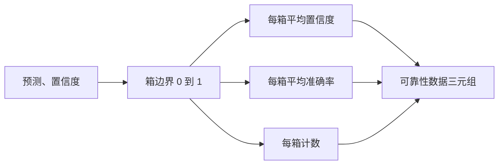

# Perplexity 与 Calibration（校准）

> 如果你的模型对一千个答案都声称有 90% 的置信度，但只答对了六百分，那它并没有很好地校准。Calibration（校准）是可信评估的一半。另一半是 perplexity（困惑度），它告诉你模型是否认为留出的文本总体上是合理的。

**类型：** 构建
**语言：** Python
**前提条件：** Phase 19 Track B 基础，第 70 和 71 课
**时间：** 约 90 分钟

## 学习目标

- 从模型适配器提供的 token 级负对数概率，计算留用语料库上的 token 级 perplexity。
- 从分箱后的预测概率，计算分类器或多选题评估的期望校准误差（ECE）。
- 计算 Brier 分数（对正确性指示器的均方误差），并解释它在 ECE 无法做到的情况下做了什么。
- 构建绘制置信度-准确率曲线所需的可靠性图数据。
- 将三者接入评估框架，使运行器能将 `perplexity`、`ece` 和 `brier` 数值附加到模型报告中。

```figure
cd-reliability-diagram
```

## Perplexity 告诉你什么

Perplexity 是每个 token 的指数化平均负对数似然。越低越好。Perplexity 为一意味着模型为每个实际 token 分配概率一。Perplexity 等于词汇表大小意味着模型是均匀的、什么都没学到。实际数字介于两者之间：2026 年的强基座模型在 WikiText-103 上大约在 8 到 12 之间。一个差的模型在同一文本上会超过 50。

框架本身不计算对数概率。这些来自模型适配器。框架负责聚合：它接受一个每 token 对数概率列表、一个每序列的 token 数量列表，并返回语料库 perplexity。

```python
def perplexity(neg_log_probs, token_counts):
    total_nll = sum(neg_log_probs)
    total_tokens = sum(token_counts)
    return math.exp(total_nll / total_tokens)
```

实现处理了零 token 的边界情况，并断言负对数概率是非负的。一个常见的错误是忘记取反：返回 `log p` 而非 `-log p` 的适配器会产生低于一的 perplexity，这是不可能的。函数会将其作为契约违规捕获。

## ECE 衡量什么

期望校准误差将预测按其置信度分组到固定数量的箱中，然后测量跨箱的置信度和准确率之间的平均差距，按箱大小加权。

```mermaid
flowchart TD
    A[N 个带有置信度 p 和正确性 y 的预测] --> B[按 p 分到 M 个箱中]
    B --> C[对每个箱计算平均置信度和平均准确率]
    C --> D[差距 = abs(平均置信度 - 平均准确率)]
    D --> E[按箱大小 / N 加权]
    E --> F[ECE = 加权差距之和]
```

标准公式在 `[0, 1]` 上使用十个等宽箱。实现支持任意正整数箱数。我们暴露一个 `bins` 参数，以便运行器可以在发布约定（10）和比较约定（15）之间选择。

ECE 受箱数和样本量偏差影响。十个箱加一百个预测时，你无法区分 0.02 ECE 与随机噪声。实现返回填充箱的数量连同 ECE，以便运行器能在样本太少时拒绝报告单个数值。

## Brier 分数做了 ECE 做不到的事

ECE 只关心平均差距。一个在半数箱上过度自信、在半数箱上信心不足的模型可能具有低 ECE，但在局部校准不良。Brier 分数衡量每个预测相对于真实结果的平方误差，因此直接惩罚离散程度。

对于二元结果，Brier 是 `mean((p_i - y_i)^2)`。它分解为可靠性、分辨力和不确定性。我们计算分数和分解。运行器报告标量值，但将分解记录到仪表板。

```python
def brier(p, y):
    return float(np.mean((p - y) ** 2))
```

## 可靠性图数据

可靠性图绘制每个箱中的预测置信度与实际准确率。对角线是完美校准。函数返回三个数组：每箱平均置信度、每箱平均准确率和每箱计数。绘图代码在下游；本课止步于数据结构。



返回的元组是调用层绘制图表或计算自定义 ECE 变体（自适应 ECE、扫描 ECE 等）所需的数据。我们返回 numpy 数组，以便下游代码无需转换。

## 置信度来源

框架不假设置信度来自 softmax。它接受每个预测在 `[0, 1]` 范围内的任意数值。对于多选题任务，自然的置信度是 `选项对数似然的 softmax`。对于自由文本，自然的置信度是模型自报的概率或平均对数似然的指数。评估只消费这个数值。它从哪里来是适配器的职责。

## 边界情况

- 所有预测错误：ECE 是平均置信度，Brier 高，perplexity 是模型认为文本的值。
- 所有预测正确且高置信度：ECE 接近零，Brier 接近零。
- p=0.5 的完美不确定预测器：ECE 是 0.5 减去准确率，Brier 是 0.25 减去修正项。
- 空输入：ECE、Brier 和可靠性返回 `0.0`（或零填充数组）。Perplexity 对零 token 情况返回 `NaN`。这些路径都不发出警告；运行器检查数值并决定是报告还是跳过。

这些情况已内置到测试中。真实模型在真实基准上不会遇到它们，但 buggy 适配器或极小样本会，运行器不应崩溃。

## 调度

Calibration 不是像 F1 那样的逐任务指标。它是逐模型报告。运行器在整个评估中累积 `(置信度, 正确性)` 对，并计算 ECE、Brier 和可靠性数据一次。Perplexity 在留用的文本语料库上计算，独立于逐任务评分。

接口为：

```python
report = CalibrationReport.from_predictions(confidences, correct)
report.ece          # float
report.brier        # float
report.reliability  # 三个 numpy 数组的元组
report.populated_bins  # int
```

`PerplexityResult.from_token_nll(neg_log_probs, token_counts)` 返回 perplexity 和每个 token 的平均负对数概率。

## 本课不做什么

它不调用模型。不实现 softmax。不从输出 token 估计置信度；那是适配器的职责。不做 temperature scaling 或 Platt scaling；这些是事后修正，存在于另一课。本课的要点是让三个数值（perplexity、ECE、Brier）可信且可复现。

## 如何阅读代码

`main.py` 定义 `perplexity`、`expected_calibration_error`、`brier_score`、`reliability_diagram`，以及 `CalibrationReport` / `PerplexityResult` 数据类。demo 在已知真实标签的合成预测上运行：一个良好校准的模型、一个过度自信的模型和一个信心不足的模型。`code/tests/test_calibration.py` 中的测试固定了每个边界情况以及合成预测器的参考值。

从顶部到底部阅读 `main.py`。函数排序从标量到向量到报告。每个函数都有简短的文档字符串，包含数学描述和契约说明。

## 进一步探索

Calibration 是已发表评估中最被忽视的维度。大多数排行榜只报告一个准确率数值便宣告完成。一个在准确率上胜出但在 Brier 上失分的模型，比在准确率上略低但能可靠报告其不确定性的模型更不适合生产部署。一旦你有了 calibration 的基础设施，便在留出的验证切片上添加 temperature scaling，重新计算 ECE，观察差距缩小。那是另一课，但基础在此。
