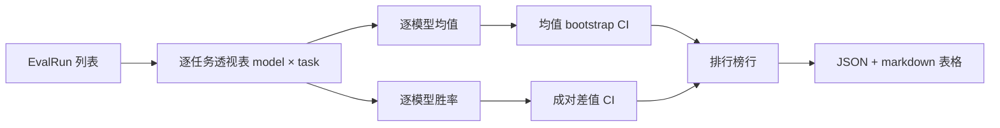
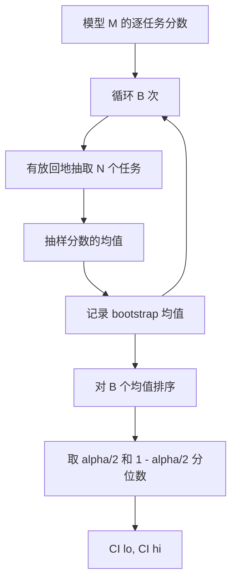

# Leaderboard 聚合

> 单任务分数很容易。跨异构任务的模型排名更难。在千预测榜单上的统计显著性是每个人都会跳过的部分。本课程不会跳过它。

**类型：** 构建
**语言：** Python
**前置条件：** 阶段 19 Track B 基础、第 70、71、73 课
**时间：** 约 90 分钟

## 学习目标

- 将多模型多任务的逐任务分数聚合为整洁的逐模型行。
- 对异构分数进行归一化，使通过率与 BLEU 值不对聚合结果产生过度影响。
- 按均值与胜率对模型排序，并解释每种汇总方式何时适用。
- 计算每个模型的均值得分的 Bootstrap 置信区间及成对差异的置信区间。
- 将排行榜输出为 JSON 报告和 markdown 表格，供第 75 课的运行器粘贴到 CI 评论中。

```figure
ci-leaderboard-ci
```

## 输入的结构

聚合器接收一个 `EvalRun` 记录列表：

```python
@dataclass
class EvalRun:
    model_id: str
    task_id: str
    metric_name: str
    score: float          # in [0, 1]
    category: str
```

第 75 课的运行器会为每个 `(model, task)` 对输出一条记录。聚合器不关心分数是如何产生的。它期望归一化已经完成：每条分数都在 `[0, 1]` 范围内。

## 输出

输出三个表格：



排行榜行包含：`model_id`、`mean_score`、`mean_ci_lo`、`mean_ci_hi`、`win_rate`、`tasks_completed`，以及可选的 `categories` 映射（用于每类别均值）。

## 归一化

如果一个任务以 `[0, 1]` 评分，另一个以 `[0, 100]` 评分，第二个会无声地主导均值。聚合器会验证每条输入分数是否在 `[0, 1]` 内，否则拒绝该运行。修复应在上游完成：指标应已返回分数形式。第 71 至 73 课强制了这个契约。

## 均值与胜率

两种排序方案服务于不同目标。

均值分数是一个模型在各任务上分数的平均值，它是榜单首页所报道的头部数字。它对异常值和任务不平衡敏感。

胜率统计一个模型在同任务上与所有其他模型相比多少次胜出。对于每个任务，得分最高的模型获胜（平局则均分）。胜率等于胜场数除以该模型有分数的任务数。它对异常值和尺度差异的敏感度较低，但会损失信息量。

```python
def win_rate(model_id, runs_by_task, all_models):
    wins, total = 0, 0
    for task_id, runs in runs_by_task.items():
        scores = {r.model_id: r.score for r in runs if r.model_id in all_models}
        if model_id not in scores:
            continue
        total += 1
        best = max(scores.values())
        if scores[model_id] >= best:
            wins += 1
    return wins / total if total else 0.0
```

测试框架会报告两项指标。第 75 课的运行器默认按均值排序；markdown 列中也提供了胜率，以便用户选择。

## Bootstrap 置信区间

每个模型的均值通过 Bootstrap 重采样估计置信区间。我们带放回地对任务 id 进行重采样，计算重采样集的均值，重复 `B` 次，然后取 `alpha` 水平下的百分位数区间。



对于成对比较，我们对逐任务差值 `score_A - score_B` 进行 Bootstrap，取百分位数区间并报告。用户观察区间是否排除零。若排除，则差值在 alpha 水平下显著；否则，排行榜将两个模型视为并列。

底层辅助函数（`bootstrap_mean_ci`、`bootstrap_pairwise_diff`）默认 `B=1000`；公开聚合函数（`aggregate`、`pairwise_diffs`）默认 `b=500`，以保持演示和测试速度较快。默认 alpha 为 0.05。本课程使用纯 numpy 实现 Bootstrap，不使用 scipy。

## 分类

如果设置了 `EvalRun.category`，聚合器还会报告每类别均值。这就是每个榜单上标注 `math`、`reasoning`、`code`、`safety` 的那一列。它让运行器可以发现一个模型整体表现不错但在代码方面较弱——这是头条均值所隐藏的信息。

## Markdown 渲染

排行榜渲染为 markdown 表格：

```text
| Rank | Model | Mean | 95% CI | Win rate | Tasks |
|------|-------|------|--------|----------|-------|
| 1    | gpt   | 0.78 | 0.74-0.82 | 0.62 | 50 |
| 2    | claude| 0.75 | 0.71-0.79 | 0.34 | 50 |
| 3    | random| 0.10 | 0.07-0.13 | 0.04 | 50 |
```

表格按均值分数排序。CI 保留两位小数。过长的模型 id 截断为二十个字符。

## 本课程不做的事情

不运行模型。不调用指标层。不实现自适应 ECE 或其他校准变体；这些在第 73 课中。不实现任务权重。此处每个任务权重相同。生产环境的榜单会对任务加权；我们通过 `weight` 字段保留了该扩展点，但在聚合器中忽略它。如有需要，可在后续课程中添加权重支持。

## 如何阅读代码

`main.py` 定义了 `EvalRun`、`LeaderboardRow`、`aggregate`、`bootstrap_mean_ci`、`bootstrap_pairwise_diff` 和 `render_markdown`。演示构建了一个包含三个模型和十二个任务的合成套件，执行聚合，并打印排行榜与成对差值表。测试文件 `code/tests/test_leaderboard.py` 固定了 Bootstrap 结果、markdown 渲染、胜率边界情况以及空输入行为。

从顶部到底部阅读 `main.py`。数据结构（EvalRun、LeaderboardRow）最先，然后是聚合器，接着是 Bootstrap，最后是渲染。每个函数职责单一。

## 进一步探索

自然的下一步是用配对任务显著性检验替代非配对 Bootstrap。如果模型 A 和 B 都跑过相同的百个任务，合适的检验是对逐任务差值做配对 Bootstrap——我们已实现这一点。更进一步，你可以采用分层 Bootstrap，以尊重任务族（数学问题之间并非相互独立；某种算术错误模式可能同时影响其中十个）。这是后续工作。本课程的目标是把基础打扎实，让评估报告出一个你能辩护的数字。
