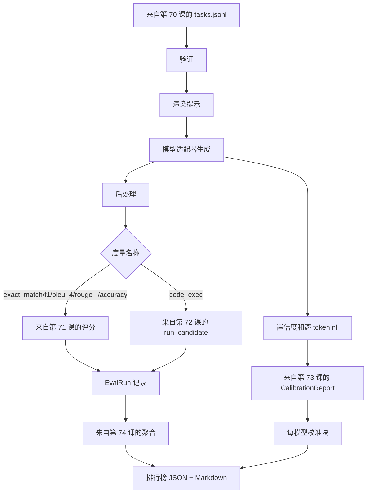

# 端到端评估运行器

> 五节管道课程，一节粘合课程。运行器从第 70 课读取任务规范，通过适配器调用模型，使用第 71 和 72 课进行评分，附加第 73 课校准报告，并发出第 74 课排行榜。演示自动终止。

**类型：** 构建
**语言：** Python
**前置条件：** Phase 19 Track B 基础，第 70 至 74 课
**时间：** 约 90 分钟

## 学习目标

- 定义一个 `ModelAdapter` 接口，任何模型（模拟、本地、API）都能通过少量方法实现。
- 在固定数据集 JSONL 文件上运行评估，跨工作池并行执行任务。
- 在一个循环中将度量层（exact_match、F1、BLEU-4、ROUGE-L、code_exec）与校准层组合起来。
- 发出每个模型的 `EvalRun` 记录，并直接输入排行榜聚合器。
- 输出 JSON 报告和 Markdown 表格；干净运行退出码为 0，验证或运行时失败退出码为非 0。

```figure
eval-grid
```

## 管道流程



运行器是集成点。第 70 至 74 课的每一课都有一个模块，运行器将其组合。运行器不重复这些模块中的任何逻辑：它导入它们。

## 适配器接口

适配器是运行器与任何模型之间的接缝。接口故意设计得很小。

```python
class ModelAdapter:
    model_id: str

    def generate(self, prompt: str, task: TaskSpec) -> Generation: ...
```

`Generation` 是一个数据类，包含：

- `text`：模型的自由格式输出
- `confidence`：范围在 `[0, 1]` 的浮点数，表示模型对答案的自报概率
- `token_nll`：可选，生成 token 上的负对数似然之和
- `token_count`：可选，生成的 token 数量

运行器中的模拟适配器提供三种变体：`RuleBasedAdapter`（确定性，接近完美）、`NoisyAdapter`（过度自信，经常出错）和 `BiasedAdapter`（擅长某一类别，另一类别极差）。演示对所有三个适配器运行第 70 课的固定数据集。

## 并行执行

运行器使用 `concurrent.futures.ThreadPoolExecutor` 按模型并行运行任务。工作线程数默认为 8 和任务数中的较小值。线程足够，因为真实模型调用的瓶颈是网络 I/O。代码执行路径在任务内部生成自己的子进程，执行器仅负责调度等待。

对于确定性测试，运行器暴露了 `run_eval(adapters, tasks, parallel=False)`，以便测试可以锁定执行顺序。

## 单遍评分循环

对于每个任务：

1. 渲染提示（少样本前缀加提示主体）。
2. 调用适配器并计时。
3. 按任务的规则对生成结果进行后处理。
4. 分发到度量层。
5. 构建带有分数和度量元数据的 `EvalRun` 记录。
6. 将 `(confidence, correct)` 对追加到校准缓冲区。

`correct` 信号对于 exact_match 类度量（`exact_match`、`accuracy`、`code_exec`）为 `score >= 1.0`，对于分级度量则为 `score >= 0.5`。阈值定义在 `_correct_from_score` 中，运行器不提供公开的覆盖方式。

## 聚合

每个任务都有结果后，运行器调用第 74 课的 `aggregate` 和 `pairwise_diffs`，以及第 73 课的 `CalibrationReport.from_predictions`。输出是一个 JSON 信封：

```json
{
  "leaderboard": [...],
  "pairwise": [...],
  "calibration": {
    "model_id_a": {"ece": 0.04, "brier": 0.10, "populated_bins": 8, ...},
    ...
  },
  "summary": {
    "tasks": 10,
    "models": 3,
    "wall_seconds": 1.2
  }
}
```

运行器还会将 Markdown 表格写入 stdout，以便用户将结果粘贴到 PR 审查中。

## 自动终止的演示

演示在第 70 课的十个固定任务上运行三个模拟适配器。运行时间应低于十秒。干净运行时的退出码为 0。

干净运行的条件是：

- 所有任务在第 70 课下验证通过。
- 所有任务在第 71 和 72 课下评分通过。
- 校准报告在第 73 课下聚合无错误。
- 排行榜将基于规则的适配器严格排在随机适配器之上。

如果上述任何条件不满足，运行器将以结构化错误退出非 0，并在 JSON 信封中报告错误。

## 本课不涉及的内容

它不调用真实模型。它不实现 API 密钥流程或限流处理。它不实现流式传输或部分生成；适配器每次调用返回一个生成结果。它不处理重试或缓存。这些关注点位于适配器层；运行器对度量和提供商都是无感知（agnostic）的。

## 如何阅读代码

`main.py` 是集成入口。它通过一个简单的 `_load_sibling` 辅助函数从其他五个课程模块导入，该函数通过相对路径解析模块。数据类 `Generation`、`EvalReport` 和 `ModelAdapter` 在本地定义。模拟适配器位于文件底部。

从顶部到底部阅读 `main.py`。快速浏览导入，然后查看 `run_eval`，接着是 `_score_one`，然后是适配器。末尾的演示是入口点。

`code/tests/test_runner.py` 中的测试锁定了适配器接口、单遍循环、并行与顺序等价性、校准缓冲区和 JSON 信封结构。

## 进一步扩展

此运行器只是起点。一个生产级评估系统会增加：以 `(task_id, model_id, model_version)` 为键的结果缓存、跟踪每次运行成本和 token 的账本、在限流时退避的重试层、针对 pass-at-k 任务的采样策略，以及针对长套件的流式输出格式。每个都是一项独立的关注点，在不改变度量或聚合层的情况下包裹运行器。这种分离正是契约设计的核心。

在模拟适配器工作之后，再添加一个真实提供商的适配器。选择一个有免费套餐的，编写三十行胶水代码，观察排行榜亮起来。然后添加第二个提供商，让框架完成工作。
